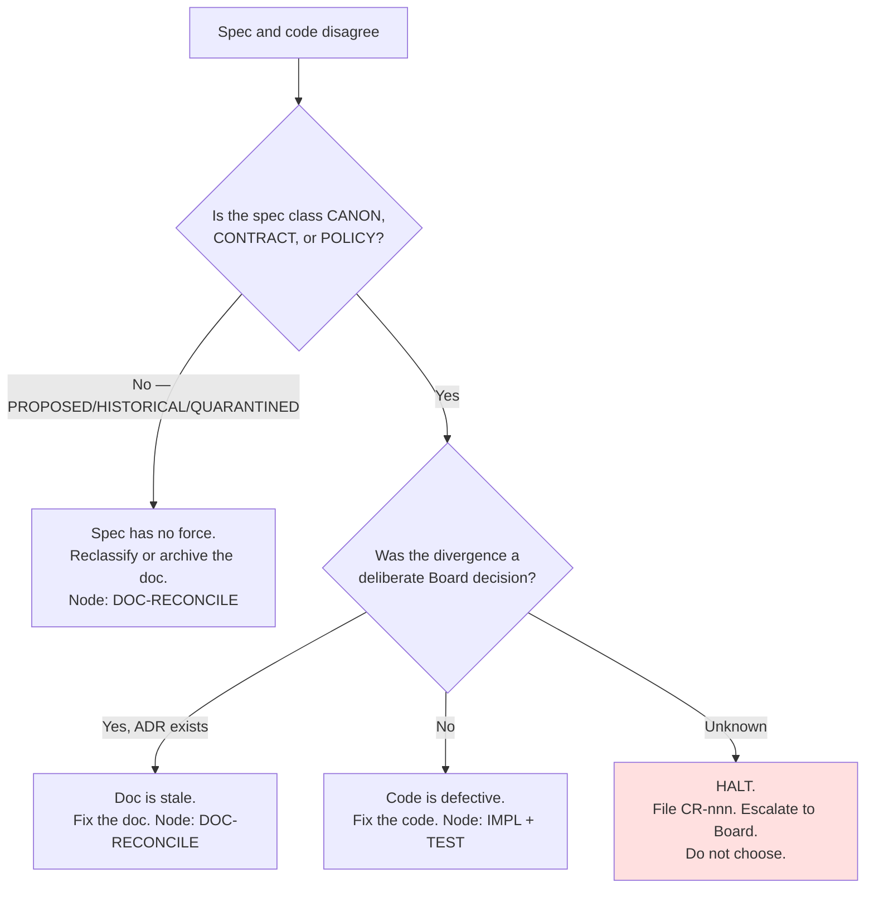
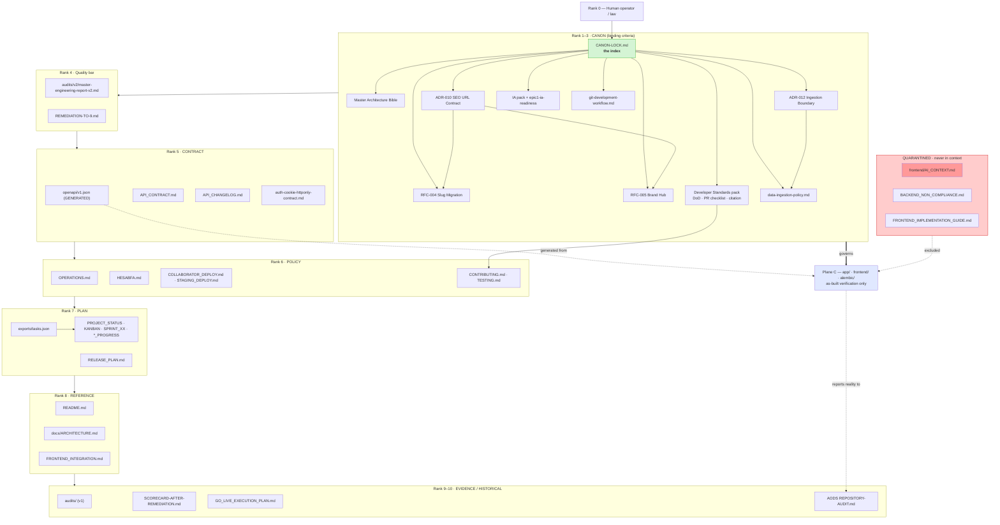
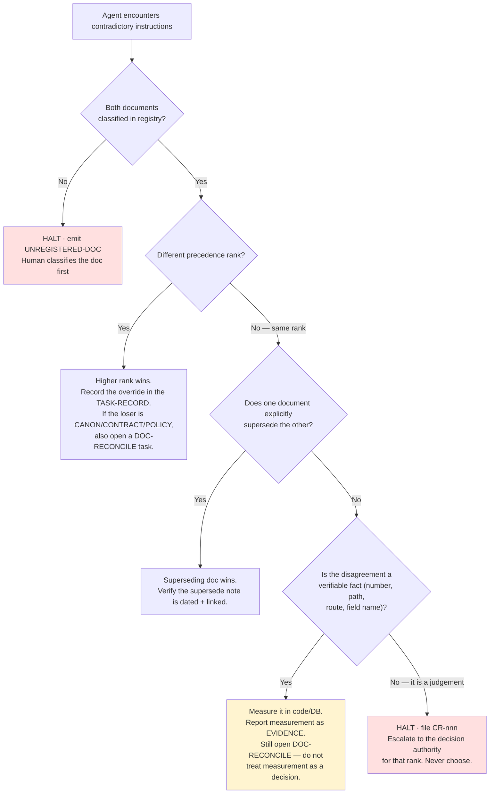

# Repository Intelligence — Document Authority Model

**Document ID:** `AODS-AUTH-001`
**Document type:** Process standard (Plane B)
**Status:** **Proposed**
**Version:** 0.1.0
**Date:** 2026-07-29
**Machine-readable twin:** [`../registry/document-registry.yaml`](../registry/document-registry.yaml)

> **This document does not create authority.** It *reads* authority that the repository's own documents already
> assert, ranks it, and makes the ranking machine-checkable. Every rank below carries a citation to the document
> that granted it. Where two documents grant themselves conflicting authority, the conflict is recorded in
> [`CONFLICT-REGISTER.md`](CONFLICT-REGISTER.md) and **not** silently resolved.

---

## 1. The problem being solved

Karzar has **five documents that each claim to be a source of truth** and three governance systems that never
reference one another. An Auto Mode agent asked to "follow the docs" has no deterministic answer to
*"which doc wins?"* — so it picks whichever it read last, or hallucinates a synthesis. That is the single
largest source of architecture drift in this repository.

AODS solves this with three constructs:

1. **Authority classes** — what *kind* of power a document has (§2).
2. **A precedence ladder** — a total order for resolving disagreement (§3).
3. **A registry** — every document classified, in a machine-readable file with a validator (§6).

---

## 2. Authority classes

Every document in the repository belongs to exactly one class. Classes come from the repository's own vocabulary
(Canon Lock §1–§4, ADR/RFC lifecycles, the PMO rule) — AODS adds no new vocabulary.

| Class | Power | May be cited as merge criteria? | Set by | Examples |
|-------|-------|-------------------------------|--------|----------|
| `CANON` | Binding criteria. Defines what "correct" means. | **Yes — required** | Architecture Board minute + Canon Lock row | `CANON-LOCK.md`, ADR-010, ADR-012, RFC-004, RFC-005, Developer Standards pack, IA pack, `data-ingestion-policy.md`, `git-development-workflow.md` |
| `PROPOSED` | Design context. May inform, may not authorise. | **No** | Author | ADR-001…009/011, RFC-001/002/003/006/007, Knowledge Platform Phases 1–3, **this AODS pack** |
| `CONTRACT` | Describes an interface that other code depends on. Authoritative *for its interface* unless a `CANON` doc supersedes. | Yes, for its own surface | Owner + change log | `docs/API_CONTRACT.md`, `docs/API_CHANGELOG.md`, `openapi/v1.json`, `auth-cookie-httponly-contract.md` |
| `POLICY` | Operational rules for running the system. | Yes, for operations | Owner | `docs/OPERATIONS.md`, `docs/HESABFA.md`, `docs/COLLABORATOR_DEPLOY.md`, `deploy/staging/STAGING_DEPLOY.md`, `docs/CONTRIBUTING.md`, `docs/TESTING.md` |
| `PLAN` | Sequencing and status. Authoritative for *when/who*, never for *what is correct*. | Yes, for scheduling only | PMO | `project-management/**`, `RELEASE_PLAN.md`, `CATALOG_IMAGES_PLAN.md` |
| `EVIDENCE` | Measurement of reality at a point in time. | **No — evidence is not a licence** | Auditor | `docs/audits/**`, `SCORECARD-AFTER-REMEDIATION.md`, `aods/10-repository-intelligence/REPOSITORY-AUDIT.md`, dry-run reports |
| `GENERATED` | Produced by a tool from a source; never hand-edited. | Yes, as a diff target | Generator | `openapi/v1.json`, `project-management/exports/*.csv`, `printable/*.pdf` |
| `REFERENCE` | Descriptive orientation; corrected when it contradicts a higher class. | No | Anyone | `README.md`, `docs/ARCHITECTURE.md`, `docs/FRONTEND_INTEGRATION.md`, app READMEs |
| `HISTORICAL` | Superseded. Readable for context, never for instruction. | **No** | Owner, on supersede | `docs/audits/` (v1), `docs/GO_LIVE_EXECUTION_PLAN.md`, `docs/BACKEND_CHANGES.md`, `frontend/BACKEND_HANDOFF.md`, `frontend/docs/audits/01-api-gaps-*` |
| `QUARANTINED` | Known to contain false statements. **Must never enter AI context.** | **No — forbidden** | Owner | `frontend/AI_CONTEXT.md` §§1–20, `frontend/BACKEND_NON_COMPLIANCE.md`, `docs/FRONTEND_IMPLEMENTATION_GUIDE.md` |

### 2.1 The `QUARANTINED` class — rationale

This class is an AODS addition, and it is the most important one. `frontend/AI_CONTEXT.md` is 37 KB of
AI-targeted context whose own banner lists its false claims (SQLAdmin at `/admin`, "no refresh token", missing
checkout/OTP/blog endpoints, ComingSoon admin pages, wrong Alembic head). A banner protects a *human* who reads
top-to-bottom. It does **not** protect an Auto Mode agent that retrieves a middle chunk by semantic similarity —
which is precisely how such a file gets used.

**Rule.** `QUARANTINED` documents are listed in `registry/document-registry.yaml` with
`forbidden_context: true`, and every AODS prompt template inlines that list into its `## FORBIDDEN CONTEXT`
section. Quarantine is a *mitigation*, not a fix; the fix is truncation or archival, tracked as `CR-015`.

---

## 3. Precedence ladder

When two documents disagree, resolve by the **lowest rank number that speaks to the question**. Every rank cites
the document that granted it that position.

| Rank | Authority | Answers the question… | Granting citation |
|-----:|-----------|----------------------|-------------------|
| **0** | **Law, safety, and the human operator's explicit instruction** | "Is this permitted at all?" | Outside the repository |
| **1** | **`CANON` — Canon Lock Accepted/Binding rows** | *"What is mandatory criteria for work today?"* | `CANON-LOCK.md`: *"If a document is not listed here as Accepted or Binding, it MUST NOT alone be used as merge criteria."* |
| **2** | **`CANON` operational policy** — `data-ingestion-policy.md`, `git-development-workflow.md` | "How may data enter, and how may git be used?" | `CANON-LOCK.md` §2 "Binding operational (pre-Wave-1; still mandatory)" |
| **3** | **`CANON` Developer Standards** — DoD, PR checklist, citation rules | "What must a PR contain?" | `CANON-LOCK.md` §1, marked *"Mandatory for: All PRs"* |
| **4** | **Engineering quality bar** — `docs/audits/v2/master-engineering-report-v2.md` + `REMEDIATION-TO-9.md` | "Is this good enough?" | `docs/CONTRIBUTING.md`: *"When site docs contradict v2, edit the site docs to match v2."* |
| **5** | **`CONTRACT`** — `openapi/v1.json`, `API_CONTRACT.md`, `API_CHANGELOG.md` | "What is the interface?" | `docs/FRONTEND_INTEGRATION.md` defers to OpenAPI on conflict; `API_CONTRACT.md` self-declares SoT when Swagger is off |
| **6** | **`POLICY`** — operations, Hesabfa, deploy, testing | "How do we run and verify it?" | Owner-maintained; v2 documentation audit rated these accurate |
| **7** | **`PLAN`** — `project-management/**` | "When, in what order, by whom, and what is the status?" | `.cursor/rules/pmo-living-system.mdc`: *"SoT for planning and status"* |
| **8** | **`REFERENCE`** — README, `docs/ARCHITECTURE.md`, integration guides | "Where do I find things?" | Descriptive by nature |
| **9** | **`EVIDENCE`** — audits, scorecards, dry-run reports | "What was measured, when?" | `CANON-LOCK.md` §4: *"Evidence only (not policy)"* |
| **10** | **`HISTORICAL`** | "What did we used to believe?" | Superseded by higher ranks |
| — | **`QUARANTINED`** | Nothing. Not consulted. | AODS §2.1 |
| — | **`PROPOSED`** | Design context only; cannot outrank any of 1–8 | ADR/RFC lifecycle: only the Board sets `Accepted` |

### 3.1 Where code sits

Code, migrations, and the running API are **Plane C**. Per Canon C0 they are *"as-built verification"* and
*"must not [be treated] as permanent architecture without ADR."*

Therefore:

- **For "what is true right now?"** → code wins. It is the only honest answer.
- **For "what ought to be true?"** → rank 1–6 wins. Code that disagrees is a **defect in the code**.

This asymmetry is the practical meaning of Principle 10 (specification-driven), and it produces a decision rule:



Worked example (real): `docs/ARCHITECTURE.md` asserts rule **BE-01**, *"endpoints own commit/rollback; services and
CRUD flush only"*, and `docs/CONTRIBUTING.md` repeats it. But 26 `await db.commit()` calls exist across 8 service
modules. No ADR supersedes BE-01, and `REMEDIATION-TO-9.md` lists BE-01 as an open P1 item — so this is branch **E**:
**the code is defective**. AODS records it as `CR-005` with owner and remediation node, and forbids agents from
"fixing" it by editing the doc downward.

---

## 4. Document hierarchy and dependency graph



### 4.1 Critical structural facts encoded in the graph

1. **`CANON-LOCK.md` is the root of all binding authority** — and it is currently **not on `main`** (PR #125).
   Until it merges, rank 1 resolves to *nothing on the default branch*, while merged PR #127 already cites it.
   This is `CR-001` and it is the highest-priority blocker in the register.
2. **`openapi/v1.json` is both `CONTRACT` and `GENERATED`.** It therefore has two rules: it is authoritative for
   consumers, and it must never be hand-edited — it must be regenerated and diffed (`OPENAPI-GATE`).
3. **PMO is rank 7 by design.** It may not decide architecture. This resolves the observed tension where
   `EXECUTIVE_SUMMARY.md` sets the priority (SEO/UX/CWV for the checkpoint) while the Board opened EPIC-1
   (slug URLs, brand hubs) — recorded as `CR-008`. PMO answers *when*; Canon answers *what*.
4. **Evidence sits below policy.** `SCORECARD-AFTER-REMEDIATION.md` claiming 9.0 does not outrank the v2 report's
   5.7 or make remediation items disappear; it is a claim requiring re-verification (`CR-006`).

---

## 5. Conflict resolution strategy

### 5.1 The algorithm



### 5.2 Hard prohibitions

An agent operating under AODS **MUST NOT**:

1. **Silently pick a winner** between same-rank documents. Halting is the correct output.
2. **Edit a higher-rank document downward** to match code. Only the rank's decision authority may weaken it.
3. **Promote any document's status** (`Proposed` → `Accepted`, `Draft` → `Accepted`) inside a feature PR.
   Explicitly forbidden by `CANON-LOCK.md` §6 and `pr-checklist.md` ("Explicit fails").
4. **Cite a `PROPOSED`, `EVIDENCE`, or `HISTORICAL` document as justification** for a change.
   `pr-checklist.md` lists this as an explicit PR fail: *"Using Proposed-only docs as sole merge justification."*
5. **Read a `QUARANTINED` document** for any purpose other than a `DOC-RECONCILE` task explicitly scoped to fix it.
6. **Invent a number.** `karzar-developer-standards.md` S2: *"Measure / cite before claiming… no invented metrics."*
   Baseline figures (5,901 products; Alembic head; 81 OpenAPI paths; 68% coverage) must be cited from their source or re-measured.

### 5.3 Resolution authority by rank

| Rank | Decision authority | Instrument | Human steps |
|------|-------------------|-----------|-------------|
| 1–3 (`CANON`) | Architecture Board | Board minute + Canon Lock row, same commit | `HUMAN-INTERVENTION-MODEL.md` **HC-03** |
| 4 (quality bar) | Auditor role, independent of implementer | New audit report; never a self-certification | **HC-11** |
| 5 (`CONTRACT`) | Backend Architect + API Change Rules | `API_CHANGELOG.md` entry + regenerated `openapi/v1.json` | **HC-06** |
| 6 (`POLICY`) | DevOps / Release Manager | PR with owner review | **HC-09** |
| 7 (`PLAN`) | PMO | `tasks.json` + mirrors in one commit | **HC-04** |
| 8 (`REFERENCE`) | Documentation Architect | Docs PR | **HC-05** |
| 9–10 | Archivist (Documentation Architect) | Status banner + move to `docs/archive/` | **HC-05** |

---

## 6. The registry and its validator

[`registry/document-registry.yaml`](../registry/document-registry.yaml) records, for every governance-relevant file:

| Field | Meaning |
|-------|---------|
| `path` | Repo-relative path |
| `class` | One of the ten classes in §2 |
| `rank` | Precedence rank from §3 |
| `status` | `accepted` / `proposed` / `binding` / `current` / `stale` / `superseded` / `quarantined` |
| `owner_role` | Role ID from `registry/role-registry.yaml` |
| `on_main` | `true` / `false` — whether the path resolves on the default branch |
| `supersedes` / `superseded_by` | Document IDs |
| `forbidden_context` | If `true`, must never be loaded into an AI context window |
| `citation_required_for` | Change types that MUST cite this document |
| `notes` | Free text, including conflict IDs |

Two validators enforce it:

| Gate | Command | Fails when |
|------|---------|-----------|
| `registry` | `python3 aods/tools/aods_validate.py --gate registry` | A markdown file exists that is neither registered nor covered by an `unclassified_allow` glob; or a registered path does not exist; or a `forbidden_context` doc is referenced by a prompt's context list |
| `links` | `python3 aods/tools/aods_validate.py --gate links` | A relative markdown link in a registered document does not resolve (catches Canon Lock's dangling references, `CR-010`) |

**Rationale for a machine-readable registry rather than prose:** prose classification decays silently. A YAML
registry with a validator makes decay a **build failure** the moment a new unclassified document appears — which is
exactly how this repository accumulated eight unlabelled stale documents.

---

## 7. Quick-reference card (for prompt headers)

This table is designed to be inlined verbatim into prompts. It is the minimum an Auto Mode agent needs.

```text
AUTHORITY ORDER (highest first):
  1. Canon Lock Accepted/Binding rows      → docs/architecture/CANON-LOCK.md
  2. Ingestion policy · Git workflow       → ADR-012, data-ingestion-policy.md, git-development-workflow.md
  3. Developer Standards (DoD, PR gate)    → docs/development/standards/
  4. Quality bar                           → docs/audits/v2/master-engineering-report-v2.md, REMEDIATION-TO-9.md
  5. Interface contracts                   → openapi/v1.json, docs/API_CONTRACT.md, docs/API_CHANGELOG.md
  6. Operational policy                    → docs/OPERATIONS.md, docs/HESABFA.md, docs/TESTING.md, docs/CONTRIBUTING.md
  7. Plan and status                       → project-management/exports/tasks.json (+ mirrors)
  8. Reference                             → README.md, docs/ARCHITECTURE.md
  9. Evidence                              → docs/audits/**, dry-run reports
 10. Historical                            → GO_LIVE_EXECUTION_PLAN.md, docs/audits/ (v1), BACKEND_CHANGES.md

NEVER READ (quarantined — contains confirmed false statements):
  frontend/AI_CONTEXT.md
  frontend/BACKEND_NON_COMPLIANCE.md
  frontend/BACKEND_HANDOFF.md
  docs/FRONTEND_IMPLEMENTATION_GUIDE.md

FOR "what is true now"  → read the code (Plane C).
FOR "what should be"    → read ranks 1–6.
IF THEY DISAGREE        → do not choose. HALT and emit a CR-nnn conflict record.
```
