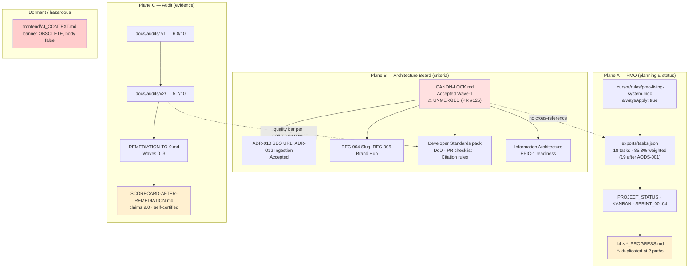

# Repository Audit — Karzar (AODS Phase 0)

**Document ID:** `AODS-AUDIT-001`
**Document type:** Evidence / measurement (Plane C — as-built verification)
**Status:** Evidence. **Not policy.** Per Canon Lock §4, audits *"measure reality; do not edit upward to look healthier."*
**Version:** 1.0.0
**Audit date:** 2026-07-29
**Base commit audited:** `c022a44` (`origin/main`)
**Method:** Full file enumeration, `git`/`gh` history analysis, `diff` on duplicate pairs, cross-reference of documents against code.

> **Reading rule.** This document states what *is*, with paths and numbers. It does not prescribe.
> Prescription lives in [`AUTHORITY-MODEL.md`](AUTHORITY-MODEL.md); unresolved contradictions live in
> [`CONFLICT-REGISTER.md`](CONFLICT-REGISTER.md).

---

## 1. Project identity

| Item | Value |
|------|-------|
| Product | **Karzar / کارزار** — B2B/B2C industrial tools commerce platform (Iranian market, fa-IR, RTL) |
| Repo | `github.com/Shebahati/Karzar`, default branch `main` |
| Shape | **Monorepo** — FastAPI backend + 2 Next.js apps + data pipelines |
| Live domains | `karzartools.com` / `www` (Storefront), `api.karzartools.com`, `admin.karzartools.com` |
| Repo role in a larger tree | This repo is checked out as **`Website/backend`**; a sibling **`Website/docs`** is declared the "authoring SoR" and is **not** in this repository |
| Team | 1 owner-operator (`Shebahati` / `Mohammad` / `root` = same person, 3 git identities), 1 designer (`mhrbzandi-Designer`, 1 PR), heavy Cursor agent usage |
| Commit range | 2026-06-15 → 2026-07-30, 232 commits |
| Development style | AI-orchestrated solo sprints; burst velocity (peak **61 commits on 2026-07-25**) |

---

## 2. Technology stack (as built)

### 2.1 Backend

| Item | Value |
|------|-------|
| Framework | FastAPI `0.137.1`, Python `>=3.12` |
| ORM / DB | SQLAlchemy `2.0.27` async, PostgreSQL 15, `asyncpg 0.29.0` |
| Cache / limits | Redis `5.0.1` (rate limiting, distributed lock) |
| Auth | JWT (`python-jose`), bcrypt, refresh-token rotation, OTP (6-digit, SHA-256 hashed), step-up PIN + `X-Step-Up-Token` |
| Size | 127 Python files, **16,424 lines** in `app/` |
| Layers | `api/endpoints` → `services` → `crud` → `db/models`, with `schemas`, `core`, `utils` |
| God files | `app/services/category_service.py` (606), `app/crud/product.py` (573) |
| Models | 26 tables incl. `products`, `categories`, `orders`, `carts`, `articles`, `hesabfa_*`, `idempotency_keys` |
| Migrations | 27 Alembic revisions, **single head** `z1a2b3c4d5e6` |
| Tests | 37 files, **276 tests** collected; SQLite default, Postgres+Redis in CI |
| Contract snapshot | `openapi/v1.json` — **81 paths, 115 schemas** |
| Integrations | Zarinpal (payments), Kavenegar/Faraz (SMS), **Hesabfa** (accounting; owns warehouse counts) |
| Notable domain rule | **Site inventory is binary** (`is_available`); quantities live only in Hesabfa |

### 2.2 Frontends

| Item | Storefront | admin-panel |
|------|-----------|-------------|
| Framework | Next.js `16.2.9`, React `19.2.4` | same |
| Router | App Router, ~24 pages | App Router, ~21 pages |
| Styling | Tailwind `3.4.17` + `tailwindcss-logical` + design tokens | Tailwind `3.4.17` |
| State/data | Zustand, TanStack Query `5`, axios, zod `4` | TanStack Query, react-hook-form, Radix, zod `4` |
| TS | `strict: true`, alias `@/*` | same |
| Unit tests | 22 vitest files | 3 vitest files |
| E2E | 1 Playwright spec (**in CI**) | 1 Playwright spec (**not in CI**) |
| Locale | `<html lang="fa" dir="rtl">`, IranYekan font, Persian digit helpers; single-locale by convention (no i18n library) | same |

### 2.3 Content & data

| Item | Value |
|------|-------|
| Content store | `frontend/Storefront/content/` — `blog/articles.json` (24 SEO-003 articles), `hubs/intros.json` (15 hub intros). **JSON, not MDX.** |
| Publish path | `scripts/publish_seo003_articles.py` → CMS API (runs post-deploy on staging) |
| Catalog scale | ~5,901 active products (frozen baseline figure cited across governance docs) |
| Enrichment | 41 Python scripts (63 tracked files under `scripts/`, including shell helpers, brand-logo assets and dry-run reports): vendor crawlers (Mitutoyo, INSIZE/Shopmill, Dasqua, Azarsanat, Chumpower, Dohre, SAN OU), image mirrors, taxonomy remediation, SEO generation |

### 2.4 CI/CD and ops

| Workflow | Trigger | Gates |
|----------|---------|-------|
| `backend-ci.yml` | push `main` + all PRs | `ruff check app tests`, `mypy app`, `pytest --cov-fail-under=68` (Postgres 15 + Redis 7). Runs on all PRs so branch-protection job names `lint`/`test` always report. |
| `frontend-ci.yml` | `frontend/**` | `tsc --noEmit`, `eslint`, `vitest` for both apps; Playwright e2e for Storefront only. **No coverage threshold.** |
| `deploy-staging.yml` | push `main` (path-filtered) + dispatch | package on `ubuntu-latest` → deploy on self-hosted `karzar-vps`; hard gate `smoke-staging.sh`; then `publish_seo003_articles.py` |
| `deploy-production.yml` | **`workflow_dispatch` only**, `confirm == deploy-production`, GitHub Environment `production` reviewer | same scripts as staging |
| `promote-measurement.yml` | dispatch (dry-run/apply) | taxonomy job on VPS |
| `remove-omumi-padding.yml` | dispatch (dry-run/apply) | taxonomy job on VPS |

**Deployment topology (critical).** Staging and production are **the same VPS and the same live domains**.
`deploy-production.yml` header states: *"Production host is NOT split yet — same VPS as staging (karzartools.com)."*
Merging to `main` therefore deploys to the live public site with **no human gate**.

**CI reliability.** Last 100 runs: Backend CI 57/57 green, Frontend CI 18/18 green, Deploy Staging 12/14 —
both failures were the **post-deploy SEO-003 publish step**, not lint/test (missing admin creds; then a `limit>200` 422).

**Other GitHub config:** `CODEOWNERS` (`* @Shebahati`, `/frontend/` adds designer), `dependabot.yml` (weekly, 4 ecosystems, cap 5).
**No issue templates. No PR template file.**

---

## 3. Governance systems currently present

The repository contains **three independent governance systems** plus one dormant AI-context system.
They do not reference each other.



### 3.1 Plane B — Architecture Board / Canon Lock (the newest and strongest layer)

**Location:** branch `docs/wave1-canon-lock-promote`, open **PR #125**, 29 files, +3,351 lines. **Not on `main`.**

Accepted on ۱۴۰۵/۰۵/۰۷ (2026-07-29), signed Mohammad Shebahati, minute *"موج ۱ قفل EPIC 1 — تصمیم الف"*:

| Document | Binding for |
|----------|-------------|
| `docs/architecture/CANON-LOCK.md` | The index of what binds today |
| `karzar-knowledge-platform-master-architecture.md` (Bible) | Orientation; Plane B |
| **ADR-010** SEO URL Contract | Any URL / PDP / brand hub / canonical / JSON-LD change |
| **ADR-012** Ingestion Boundary | Any enrichment / importer / catalog write |
| **RFC-004** Slug Migration & Redirects | EPIC-1 PDP slug + 301 |
| **RFC-005** Brand Hub Launch | EPIC-1 brand hubs |
| Developer Standards pack | **All PRs** (DoD, PR checklist, citation rules, Alembic, enrichment) |
| IA pack + `epic1-ia-readiness.md` | EPIC-1 routes, hubs, indexation honesty |
| `data-ingestion-policy.md` | Binding (pre-Wave-1) for all catalog writes |
| `git-development-workflow.md` | Binding branch/PR workflow |

Key mechanics this layer establishes, which AODS adopts rather than reinvents:

- **Plane discipline (Canon C0):** Plane A = catalog pipeline + Git; Plane B = architecture docs (decision intent); Plane C = DB/API (as-built verification only).
- **Status lifecycle:** ADR `Proposed → Accepted → Deprecated → Superseded`; RFC `Draft → Review → Accepted → Implementing → Completed → Rejected → Deferred`. Only the Board may set `Accepted`. *"Silent status upgrades in PRs without Board minute are non-compliant."*
- **Citation as a merge gate:** *"Missing Canon citation on URL/SEO/enrich PRs is an explicit PR fail."*
- **Ingestion categories:** A = local API writes (allowed, versioned job); B = production (ticket + backup + declaration); C = prod→dev dump (baseline migration only). `KARZAR_API_BASE` for Category A **must be local**.
- **Agent constraint:** *"No automatic push from agents; human approves push."* Destructive git actions need a written plan + confirmation.
- **EPIC-1 definition of done (IA):** 8 deliverables — slug PDP, 301 from id, cards/breadcrumbs/sitemap, JSON-LD `@id`, brand hubs `/brands/{slug}`, brand meta, PDF/accessories slots, preserve category hubs.

**Observed EPIC-1 state on `main`:** deliverables 1–2 shipped (`frontend/Storefront/src/app/product/[slug]/`, 301 from id, PRs #126/#127).
Deliverable 5 **not shipped** — there is no `frontend/Storefront/src/app/brands/` route.

### 3.2 Plane A — PMO (`project-management/`, 79 files)

| Element | Detail |
|---------|--------|
| Machine SoT | `exports/tasks.json` — `as_of 2026-07-28`, `deadline 2026-09-22`, **18 tasks**, 20 fields per task. (This pack's own PMO entry, `AODS-001`, makes it 19 and moves `as_of` to 2026-07-29; the figures above are the pre-existing state this audit measured.) |
| Enums | `status` ∈ {`done`,`todo`} (never `in_progress`, though the template offers it); `priority` P0–P2; `owner` ∈ {`agent`,`pmo`,`unassigned`} |
| Weighted progress | **85.3%** of 300h (matches `PROJECT_STATUS.md` 85%) |
| Open tasks | `CAT-002` (INSIZE fill, 15%), `KB-001` (knowledge graph, 10%) — both **deliberately deferred** to after 2026-09-22 |
| Mirrors | `PROJECT_STATUS.md`, `KANBAN_BOARD.md`, `SPRINT_00..04`, 14 `*_PROGRESS.md`, `DONE.md`, `CHANGELOG.md`, `DECISIONS.md` (D1–D8), `RISKS.md` (R1–R8), `TECH_DEBT.md`, `BLOCKERS.md`, `MASTER_ROADMAP.md`, `RELEASE_PLAN.md`, `CONTENT_CALENDAR.md` (24 articles A01–D06) |
| Other exports | `milestones.json` (M0–M4), `roadmap.json`, 3 CSVs (ClickUp / GitHub Projects / Taskulu) |
| Task ID prefixes | `PMO, SEO, CAT, UX, PERF, SEC, BE, FE, KB, REL, TD, OPS` (+ orphan `CONTENT-URL`) |
| Enforcement | **`.cursor/rules/pmo-living-system.mdc`, `alwaysApply: true`** — the only automated-ish control in the repo |
| Validation automation | **None.** No script or workflow reads `tasks.json`. |
| Checkpoint | 2026-09-22 ("31 Shahrivar ۱۴۰۵"); `EXECUTIVE_SUMMARY.md` declares PMO *"operationally complete for the checkpoint"*, KPI = *"quality + indexable mid-tail + CWV, not #1 head-term rank"* |

**Structural defect:** 14 progress files and 5 sprint files exist at **two paths each** (`project-management/X.md` and
`project-management/progress/X.md` / `sprints/X.md`). All 5 sprint pairs are byte-identical. **6 of 14 progress pairs
diverge** — `BACKEND`, `DATABASE`, `KNOWLEDGE_BASE`, `STRUCTURED_DATA`, `UI`, `UX`. The Cursor rule says to update
*"the relevant `*_PROGRESS.md`"* without stating which path is canonical.

### 3.3 Plane C — Audits (two generations + a self-certification)

| Generation | Verdict | Notes |
|---|---|---|
| `docs/audits/` (v1, 9 reports) | **6.8 / 10** | Documentation scored 7.0 |
| `docs/audits/v2/` (9 reports + new documentation phase) | **5.7 / 10** | Stricter re-audit that also audits v1's errors; Documentation dropped to **4.5** |
| `REMEDIATION-TO-9.md` | Waves 0–3 programme | Authority rule: v2 is SoT; *"when site docs contradict v2, edit the site docs"* (`docs/CONTRIBUTING.md`) |
| `SCORECARD-AFTER-REMEDIATION.md` | claims **all categories 9.0** | Self-certification, same date as the 5.7 audit; contains its own re-score rule: *"if any evidence above regresses on `main`, drop the affected category immediately"* |

Verified-remediated since the audit: OTP is 6-digit + hashed; `smoke-staging.sh` is a hard deploy gate; Frontend CI exists;
`openapi/v1.json` regenerated to 81 paths; PDP JSON-LD shipped; refund-after-shipped regression test exists
(`tests/test_f_payment_audit.py`).
Still open against 9.0 claims: `AI_CONTEXT.md` body not rewritten; services still commit; admin bulk availability still
routes through `quantity_delta` stock-adjust; offsite backup is script-only; no second host.

### 3.4 AI instrumentation that exists today

| Path | Content | Assessment |
|------|---------|------------|
| `.cursor/rules/pmo-living-system.mdc` | `alwaysApply: true`; 5 numbered PMO sync duties + "read EXECUTIVE_SUMMARY before large work" | The one real always-on control. No `globs`, so it applies to every request including trivial ones. |
| `frontend/admin-panel/AGENTS.md` | *"This is NOT the Next.js you know… Read the relevant guide in `node_modules/next/dist/docs/` before writing any code."* | Correct and valuable (Next.js 16 is newer than most model training data) |
| `frontend/admin-panel/CLAUDE.md` | `@AGENTS.md` | Pointer only |
| `frontend/AI_CONTEXT.md` | 37 KB / ~1,053 lines. Banner marks §§1–20 **OBSOLETE**; body still asserts SQLAdmin at `/admin`, "no refresh token", missing checkout/OTP/blog/hero endpoints, ComingSoon admin pages, wrong Alembic head — all confirmed false | **Actively hazardous.** Highest-value single file to place on a forbidden-context list. |

**Absent:** `.cursorrules`, root `AGENTS.md`, `mcp.json`, any prompt directory, any Copilot config, any PR template.

---

## 4. Process reality (measured)

| Dimension | Measurement |
|-----------|-------------|
| PRs | 126 total: **96 merged**, 22 open, **8 closed unmerged** |
| Open PR composition | **20 dependabot (91%)**, 2 human (#125 Canon Lock, #90 INSIZE enrichment) |
| Merged PR size | mean **+575 / −77 across 11.7 files**; outliers #102 (+5,194), #25 (+3,477), #86 (+3,105) |
| Merge strategy | Mixed — squash dominant recently (48/50 recent non-merge commits end `(#NNN)`), but #126 and #127 landed as merge commits |
| Commit convention | `type(scope): subject (#PR)`; 150/232 (64.7%) conventional; 90/232 (38.8%) carry a PR number; **25/232 (10.8%) carry a task ID** despite `DAILY_CHECKLIST.md` requiring one |
| Branch convention (observed) | `feat/*` ×18, `fix/*` ×9, `docs/*` ×8, `chore/*` ×5, `feature/*` ×2, `dependabot/*` ×20 |
| Branch convention (required) | `git-development-workflow.md` + Developer Standards say **`feature/*`**; `docs/CONTRIBUTING.md` says **`feat/`** |
| Unmerged remote branches | **62** as measured by `git branch -r --no-merged origin/main` on 2026-07-29 — 20 dependabot, the rest undeleted post-squash and stale branches. This number drifts daily; the command, not the number, is the citable fact |
| Worktrees | `git-development-workflow.md` reports **45** local worktrees, local `main` held hostage by worktree `backend-stat-fix`, primary checkout parked on `chore/phase9-align-origin-main` |
| PR body convention | Emergent, no template file: `## Summary`, optional `## Canon Lock`, `## Test plan`, and `Made with [Cursor](https://cursor.com)` on 20/20 recent merged PRs |
| Code debt markers | **Zero** literal `TODO`, `FIXME` or `HACK` in `app/` or either `src/`. (A naive scan that also greps `XXX` returns 13 hits, all of them `09XXXXXXXXX` phone-number placeholders — a reminder to verify a grep before quoting it.) |
| Abandoned work | 8 unmerged-closed PRs; mostly duplicate/superseded (e.g. #116 vs #115, #123 vs #124), one large abandonment: **#74 (+64,062)** INSIZE tooling |

---

## 5. Documentation corpus map (~140 markdown files)

### 5.1 By class

| Class | Count (approx.) | Examples |
|-------|-----|----------|
| Binding criteria (Plane B, unmerged) | 29 | Canon Lock pack on PR #125 |
| Contract / integration | 8 | `docs/API_CONTRACT.md`, `API_CHANGELOG.md`, `ARCHITECTURE.md`, `FRONTEND_INTEGRATION.md`, `auth-cookie-httponly-contract.md` |
| Operational policy | 7 | `docs/OPERATIONS.md`, `HESABFA.md`, `COLLABORATOR_DEPLOY.md`, `deploy/staging/STAGING_DEPLOY.md`, `SCRIPTS.md`, `SEED_IMPORT.md`, `TESTING.md` |
| Audit evidence | 22 | `docs/audits/**` (v1 + v2) |
| Planning / PMO | 79 | `project-management/**` |
| Design programme (not implemented) | 3 | `docs/KNOWLEDGE_PLATFORM_PHASE1/2/3*.md` |
| Active operational plans | 3 | `CATALOG_IMAGES_PLAN.md`, `CATALOG_IMAGES_PROGRESS_2026-07-25.md`, `architecture/product-seo-descriptions-plan.md` |
| Bilingual pairs (en/fa) | 12 (6 pairs) | `frontend/docs/audits/*`, `frontend/docs/gaps/*`, `frontend/docs/deploy/*` |
| **Stale / superseded, still unlabelled** | ≥8 | `frontend/AI_CONTEXT.md`, `BACKEND_NON_COMPLIANCE.md`, `BACKEND_HANDOFF.md`, `docs/BACKEND_CHANGES.md`, `GO_LIVE_EXECUTION_PLAN.md`, `FRONTEND_IMPLEMENTATION_GUIDE.md`, `frontend/docs/audits/01-api-gaps-*`, v1 master report |

### 5.2 Documents that claim to be "source of truth"

Five separate documents claim SoT or "living" status. This is the root cause of most drift:

| Document | Claim | Reality |
|----------|-------|---------|
| `project-management/README.md` | PMO is SoT for planning/status | True for status; own metric stale (says ~25%, actual 85.3%) |
| `docs/API_CONTRACT.md` | SoT for integration when Swagger is off | Index only; missing Hesabfa, nav-groups, availability, image upload routes |
| `docs/FRONTEND_IMPLEMENTATION_GUIDE.md` | *"منبع اصلی کار فرانت"* (primary FE source) | Frozen at 2026-07-13; readiness matrix badly stale |
| `docs/audits/v2/REMEDIATION-TO-9.md` | v2 master is SoT for quality | Accurate, and reinforced by `CONTRIBUTING.md` |
| `docs/architecture/CANON-LOCK.md` | Sole answer to "what is mandatory today" | Strongest claim, **but not on `main`** |
| `docs/GO_LIVE_EXECUTION_PLAN.md` | *"برنامه اجرایی زنده"* (living) | Frozen 2026-07-14; says catalog 25% while ~5,901 products are live |

### 5.3 Bilingual divergence

| Pair | Divergence |
|------|-----------|
| `frontend/docs/gaps/01-fe-ahead-be-needed-{en,fa}` | EN proposes `/api/v1/settings/site`; FA proposes `/cms/site-settings` or `/settings` — **endpoint paths disagree** |
| `frontend/docs/gaps/02-be-exists-fe-should-use-{en,fa}` | EN dated 2026-07-18; **FA dated 2026-07-24 with extra completed items** — FA is ahead |
| `frontend/docs/deploy/DEPLOYMENT_{en,fa}` | EN describes split-host topology; actual deploy is single VPS |

---

## 6. Missing specifications (gaps, not conflicts)

Things nothing in the repository specifies. These are inputs the AODS lifecycle must be able to request.

| ID | Missing specification | Consequence today |
|----|----------------------|-------------------|
| G-01 | Brand Hub page specification (`/brands/{slug}` content model, PLP behaviour, meta) | EPIC-1 deliverable 5 unstartable without inference; RFC-005 gives launch sequencing, not page contract |
| G-02 | Numeric thresholds for ADR-009 Gates B/C (mapping coverage, evidence coverage) | Named as an open question in `adr/README.md` §7 |
| G-03 | Release/rollback **named owners** | `BLOCKERS.md` + `EXECUTIVE_SUMMARY.md` note REL-001 "GO still needs named release/rollback owners"; `DECISIONS.md` D6 open |
| G-04 | Site-settings, aggregate reports, invoice-PDF APIs | Frontend expects them (`gaps/01-fe-ahead`); backend has none |
| G-05 | Definition of "production" once host split happens | Deploy workflows and docs both defer it |
| G-06 | Accessibility acceptance thresholds | v2 audit scored a11y but no binding target exists |
| G-07 | Content authority for `content/*.json` vs CMS DB after publish | Two writable stores, no stated precedence |
| G-08 | Canonical path decision for duplicated PMO progress/sprint files | Cursor rule is silent (see `CR-007`) |
| G-09 | Cursor Auto Mode operating rules (context, allow-lists, stop conditions) | **This is what AODS supplies** |

---

## 7. Risk areas (observed, ranked)

| Rank | Area | Evidence |
|------|------|----------|
| 1 | **Merge to `main` deploys to the live public site with no human gate** | `deploy-staging.yml` triggers on push to `main`; staging == production VPS |
| 2 | **Binding criteria not on `main`** | Canon Lock is PR #125 (open); merged PR #127 cites it |
| 3 | **Hallucination source in-repo** | `frontend/AI_CONTEXT.md` — 1,000+ lines of confirmed-false claims, banner-only mitigation |
| 4 | **Production-default enrichment scripts** | 18 scripts default `KARZAR_API_BASE` to production, contradicting Accepted ADR-012 |
| 5 | **Contract drift undetectable** | `openapi/v1.json` committed but never verified in CI |
| 6 | **Governance drift in PMO** | 6 divergent duplicate files, orphan `CONTENT-URL-001`, stale roadmap outcomes/milestones/wallboard, no validator |
| 7 | **Quality-bar ambiguity** | 5.7 audit vs 9.0 self-certification; four different coverage numbers |
| 8 | **Repository hygiene** | 58 unmerged branches, 45 worktrees, local `main` held by a worktree |
| 9 | **Single-person bus factor** | 1 operator, `CODEOWNERS` `* @Shebahati`, self-approval of own architecture board |
| 10 | **Deferred-but-referenced programme** | Knowledge Platform Phases 1–3 fully designed, `I0` never started; Phase 3 says pause image import while `CATALOG_IMAGES_PLAN.md` actively imports |

---

## 8. Unknowns (cannot be determined from this repository)

These require the human operator. They are **not** assumptions AODS is permitted to make.

| ID | Unknown | Why it matters |
|----|---------|----------------|
| U-01 | Contents of `Website/docs/` (authoring SoR, outside git) | It holds Proposed packs, prompts, and audits that Canon Lock references. AODS cannot verify or lint them. |
| U-02 | Whether the Architecture Board intends PR #125 to merge as-is | Determines whether Canon Lock paths are real for future PRs |
| U-03 | Actual GitHub branch-protection settings on `main` | Workflow comments imply required checks `lint`/`test`; not verifiable from the repo |
| U-04 | Whether `BACKUP_OFFSITE_URI` and `SENTRY_DSN` are configured on the VPS | Determines whether OPS-02/OPS-07 remediation is real or script-only |
| U-05 | Whether the 24 SEO-003 articles are indexed / their GSC performance | `MASTER_ROADMAP` outcomes are unchecked; no measurement in repo |
| U-06 | Which of the 45 worktrees hold unreviewed work | Risk of losing or double-shipping work |
| U-07 | Whether the checkpoint (2026-09-22) is still the governing deadline now that EPIC-1 has begun | Determines priority arbitration between PMO and Board |

---

## 9. Audit reproduction

To re-run this audit's mechanical parts:

```bash
# Corpus
find . -name '*.md' -not -path './.git/*' -not -path '*/node_modules/*' | wc -l
# Backend size and god files
find app -name '*.py' | xargs wc -l | sort -rn | head -20
# Transaction-ownership drift
rg -n 'await db\.commit\(\)' app/services | wc -l
# Ingestion-policy drift
rg -l 'api\.karzartools\.com' scripts/ | wc -l
# PMO duplicate divergence
for f in project-management/progress/*.md; do b=$(basename "$f"); \
  diff -q "project-management/$b" "$f" >/dev/null 2>&1 || echo "DIVERGENT: $b"; done
# Contract snapshot size
python3 -c "import json;print(len(json.load(open('openapi/v1.json'))['paths']))"
# Process history
git log --pretty='%h|%an|%ad|%s' --date=short -200
gh pr list --state all --limit 130 --json number,state,additions,changedFiles
```

Or simply: `python3 aods/tools/aods_validate.py --all --json > aods/reports/validation/audit.json`

---

## 10. Self-audit of this document

This pack asserts that it never invents repository facts. That assertion is only worth anything if it was
checked, so every numeric and line-number claim in the pack was re-verified against the repository by an
independent pass before the pack was proposed. It found errors, listed here because a correction log is
evidence and a silent fix is not.

| Claim as first written | Verified truth | Command used |
|---|---|---|
| "55 scripts" in `scripts/` | 41 Python files; 63 tracked files in total | `ls scripts/*.py \| wc -l`; `git ls-files scripts/ \| wc -l` |
| 58 unmerged remote branches | 62 on 2026-07-29 | `git branch -r --no-merged origin/main \| wc -l` |
| `project-management/` has 78 files | 79 | `git ls-files project-management/ \| wc -l` |
| Zero `TODO`/`FIXME`/`HACK`/`XXX` in `app/` or `src/` | Zero `TODO`/`FIXME`/`HACK`; 13 `XXX` hits, all `09XXXXXXXXX` phone masks | `rg -c 'TODO\|FIXME\|HACK' …` |
| `~150 markdown documents` (in the validation framework) | 140 excluding `aods/` — the charter's `~140` was right | `git ls-files '*.md' \| rg -v '^aods/' \| wc -l` |
| `ADR-010:41` states the `/brands/{slug}` rule | Line 41 is a "Cons:" bullet; the rules are at lines 64 and 67 | `git show origin/docs/wave1-canon-lock-promote:… \| rg -n 'brands/'` |
| `RFC-005:88` states "product count and top-5 categories" | Line 88 is blank; the scope statement is at line 30 and says something different | same, `rg -n 'count\|categor'` |
| `--gate ingestion` | The gate is named `ingestion-boundary` | `aods_validate.py --list-gates` |
| Task records live at `aods/tasks/` | The rest of the pack uses `aods/reports/tasks/` | `rg 'reports/tasks'` |
| 15 prompt lint rules | The table listed 14; the validator enforces 15. `P-15` was missing from the table | `rg '^\| .P-' PROMPT-LIBRARY-ARCHITECTURE.md` |

Four checkpoint IDs and three counts were also inconsistent between documents and were reconciled against the
authoritative definitions (`HUMAN-INTERVENTION-MODEL.md` §2 for checkpoints, `CONFLICT-REGISTER.md` for
conflicts, `role-registry.yaml` for roles).

**What this says about the design.** Two of these errors are worth more than the rest. The wrong line numbers
in `CURSOR-AUTO-MODE-STRATEGY.md` §3.1 sat inside the `RESTATE` example — the very block whose purpose is to
catch fabricated citations — and would have taught every future agent that approximate citations pass. And
`--gate ingestion` was a gate name that did not exist, which is charter failure criterion `F-04` written into
the pack that defines it. Plausible-looking precision is the characteristic AI failure mode, and it does not
stop being one when the author is writing the governance document. This is also why `CR-017` and the branch
count now state the *command* as the citable fact, with the number as a dated measurement: counts that drift
daily should never have been written as though they were constants.

**Residual.** Three classes of claim remain unverifiable from inside the repository and are marked as such:
GitHub branch-protection settings, VPS/secret configuration, and the contents of the external
`Website/docs/` authoring tree (`CR-009`). The 45-worktree and CI-run-history figures are relayed from
`git-development-workflow.md` and the Actions history respectively, not re-measured here.
