# Project Lifecycle

**Document ID:** `AODS-LIFE-001`
**Document type:** Process standard (Plane B)
**Status:** **Proposed**
**Version:** 0.1.0
**Date:** 2026-07-29

> **Design note.** Karzar is **not** a greenfield project. It is a live production system with ~5,901 products,
> 96 merged PRs, and three governance layers. A lifecycle that begins at "Discovery" and ends at "Deployment" would
> be fiction here. This lifecycle is therefore **cyclical and re-entrant**: every stage exists in two modes —
> *bootstrap* (once, to reach a governed baseline) and *steady-state* (every change, forever).

---

## 1. The two-loop model

```mermaid
graph LR
    subgraph BOOT["BOOTSTRAP LOOP — runs once per repository"]
        B0["L0 · Repository Intelligence"] --> B1["L1 · Authority Reconciliation"]
        B1 --> B2["L2 · Conflict Adjudication"]
        B2 --> B3["L3 · Baseline Freeze"]
    end
    subgraph STEADY["STEADY-STATE LOOP — runs once per change"]
        S1["L4 · Intake"] --> S2["L5 · Research"]
        S2 --> S3["L6 · Specification"]
        S3 --> S4["L7 · Architecture Decision"]
        S4 --> S5["L8 · Planning"]
        S5 --> S6["L9 · Knowledge Acquisition"]
        S6 --> S7["L10 · Design"]
        S7 --> S8["L11 · Implementation"]
        S8 --> S9["L12 · Validation"]
        S9 --> S10["L13 · Testing"]
        S10 --> S11["L14 · Integration"]
        S11 --> S12["L15 · Release"]
        S12 --> S13["L16 · Post-Deploy Verification"]
        S13 --> S14["L17 · Knowledge Capture"]
        S14 --> S15["L18 · Maintenance & Evolution"]
    end
    B3 ==>|"governed baseline exists"| S1
    S14 -.->|"new authority documents"| B1
    S15 -.->|"drift detected"| B0
    style BOOT fill:#e8f0ff
    style STEADY fill:#eaffea
```

**Why the dotted feedback edges matter.** `L17` can produce new `CANON` documents, which re-enters
`L1` (authority reconciliation) — that is exactly how Wave-1 Canon Lock came into existence.
`L18` drift detection re-enters `L0`. Without those edges the system decays; with them it self-heals.

---

## 2. Stage catalogue

Every stage below specifies: **purpose · trigger · inputs · activities · outputs · exit criteria · responsible role ·
AI/human split · failure mode**. Node-level detail (dependencies, recovery, acceptance) is in
[`WORKFLOW-GRAPH.md`](WORKFLOW-GRAPH.md); this document explains *what each stage is for*.

Legend for the **Mode** column: `AI` = AI executes, human approves at a checkpoint · `HUMAN` = human must act
personally · `AI+HUMAN` = AI drafts, human decides.

---

### BOOTSTRAP LOOP

#### L0 · Repository Intelligence

| Field | Value |
|-------|-------|
| **Purpose** | Establish ground truth about what the repository contains before any design or code decision. |
| **Trigger** | First adoption of AODS; or any drift alarm from `L18`; or quarterly. |
| **Inputs** | The repository at a pinned commit. Nothing else. |
| **Activities** | Enumerate every document, classify code layers, measure history, `diff` duplicate files, verify docs against code, list unknowns. |
| **Outputs** | `REPOSITORY-AUDIT.md` (EVIDENCE), the initial `document-registry.yaml`. |
| **Exit criteria** | Every markdown file is either registered or in `unclassified_allow`; `--gate registry` passes; every "unknown" is written down rather than assumed. |
| **Role** | Knowledge Engineer (lead), AI Reviewer (verify) |
| **Mode** | `AI` |
| **Failure mode** | Auditing from documents instead of from code — produces a flattering, useless audit. Mitigation: every claim carries a path and a number. |

**Rationale.** This stage exists because the repository already contained two audits that disagreed with each other
and a scorecard that disagreed with both. Ground truth must be *measured*, and measurement must be reproducible
(see `REPOSITORY-AUDIT.md` §9).

#### L1 · Authority Reconciliation

| Field | Value |
|-------|-------|
| **Purpose** | Decide, once, which documents may command work — and record the ranking. |
| **Trigger** | Completion of `L0`, or a new Board wave. |
| **Inputs** | `REPOSITORY-AUDIT.md`; the self-declared authority of each document. |
| **Activities** | Assign class + rank + owner to every document; identify quarantine candidates; build the dependency graph. |
| **Outputs** | `AUTHORITY-MODEL.md`, populated `document-registry.yaml`. |
| **Exit criteria** | No document has two classes; every `CANON` row resolves on `main`; `--gate registry` and `--gate links` pass or their failures are registered as conflicts. |
| **Role** | Documentation Architect (lead), Project Architect (ratify) |
| **Mode** | `AI+HUMAN` — AI proposes the ranking with citations; the Board ratifies (**HC-02**). |
| **Failure mode** | Inventing a hierarchy instead of deriving one. Mitigation: every rank in `AUTHORITY-MODEL.md` §3 carries the citation that granted it. |

#### L2 · Conflict Adjudication

| Field | Value |
|-------|-------|
| **Purpose** | Convert every contradiction into either a decision or an explicitly owned open issue. |
| **Trigger** | Any conflict found in `L0`/`L1`, or raised by a halted task at any later stage. |
| **Inputs** | Conflict evidence (both sides, with paths and quotes). |
| **Activities** | Write the `CR-nnn` row: severity, both sides, options with consequences, advisory recommendation, decision authority. **AI stops here.** |
| **Outputs** | `CONFLICT-REGISTER.md` rows; `DECISIONS.md` entries once resolved. |
| **Exit criteria** | Zero rows with `Owner: UNASSIGNED`; every BLOCKER either resolved or with a written accepted-risk note. |
| **Role** | AI Reviewer (draft), decision authority per rank (decide) |
| **Mode** | `AI+HUMAN` — **the AI is forbidden to choose** (`AUTHORITY-MODEL.md` §5.2). |
| **Failure mode** | Resolving a conflict by picking the more convenient document. This is the single behaviour AODS most exists to prevent. |

#### L3 · Baseline Freeze

| Field | Value |
|-------|-------|
| **Purpose** | Create an immutable, citable reference point so later work can prove what changed. |
| **Trigger** | `L2` exit, or a release. |
| **Inputs** | Green CI on `main`; resolved BLOCKERs or accepted-risk notes. |
| **Activities** | Annotated git tag; record Alembic head, product count, OpenAPI path count, coverage %, test count; snapshot `openapi/v1.json`. |
| **Outputs** | `BASELINE-RECORD` artifact; annotated tag (the repo's existing convention: `KARZAR-BASELINE-YYYYMMDD`). |
| **Exit criteria** | Tag exists on `main`; every baseline number is reproducible by a command. |
| **Role** | Release Manager |
| **Mode** | `HUMAN` — tagging and pushing are human actions (**HC-13**); `git-development-workflow.md` §6 forbids agent pushes. |
| **Failure mode** | Baseline numbers cited from prose instead of measured, then propagated forever. `karzar-developer-standards.md` S2 forbids invented metrics. |

---

### STEADY-STATE LOOP

#### L4 · Intake

| Field | Value |
|-------|-------|
| **Purpose** | Turn a request ("add brand hubs", "fix the redirect") into a uniquely identified, classified work item. |
| **Trigger** | Owner request, audit finding, dependabot alert, incident, or a `CR-nnn` resolution. |
| **Inputs** | The raw request in any form. |
| **Activities** | Assign a task ID; classify change type (see table below); identify the governing authority rows; set the initial allow-list; declare the PR budget. |
| **Outputs** | `TASK-RECORD` (draft); a `tasks.json` entry (PMO, rank 7). |
| **Exit criteria** | Task has an ID, a change type, at least one governing authority citation (or an explicit "no governing doc — go to L6"), and an allow-list. |
| **Role** | Project Architect + PMO |
| **Mode** | `AI+HUMAN` — AI classifies and drafts; human confirms priority (**HC-04**). |
| **Failure mode** | Starting work with no ID. This is the observed default (only ~11% of commits carry a task ID) and is the root of `CR-008` and `CR-013`. |

**Change-type taxonomy** — this drives everything downstream (context set, gates, required citations, reviewers):

| Change type | Touches | Mandatory citations | Mandatory gates |
|-------------|---------|--------------------|-----------------|
| `CT-API` | `app/api/**`, `app/schemas/**` | `API_CHANGELOG` policy, `api-change-rules.md` | `lint`, `test`, `openapi`, `citation` |
| `CT-DOMAIN` | `app/services/**`, `app/crud/**` | ADR for the domain rule; `ARCHITECTURE.md` BE-01 | `lint`, `test`, `citation` |
| `CT-SCHEMA` | `alembic/**`, `app/db/models/**` | `alembic-and-schema-change-rules.md`; ADR if SoT/identity/URL fields | `lint`, `test`, `migration-updown`, `citation` |
| `CT-URL-SEO` | routes, canonical, sitemap, JSON-LD | **ADR-010 + RFC-004/005 + IA** (explicit PR fail if absent) | `typecheck`, `lint`, `test`, `e2e`, `redirect-matrix`, `citation` |
| `CT-FE-UI` | `frontend/**/src/components/**` | `frontend-change-rules.md`; design tokens | `typecheck`, `lint`, `test`, `a11y` |
| `CT-DATA` | `scripts/**`, catalog writes | **ADR-012 + `data-ingestion-policy.md`**, Category A/B/C declared | `ingestion-boundary`, `dry-run-evidence`, `citation` |
| `CT-CONTENT` | `content/*.json`, CMS | `CONTENT_CALENDAR`, publish path | `content-schema`, `links` |
| `CT-OPS` | `.github/workflows/**`, `deploy/**`, Docker | `OPERATIONS.md`, `COLLABORATOR_DEPLOY.md` | `workflow-lint`, `smoke` |
| `CT-DOC` | any `*.md` | `documentation-citation-rules.md` | `registry`, `links` |
| `CT-GOV` | `project-management/**`, `aods/**`, `.cursor/rules/**` | PMO rule; this pack | `pmo`, `registry`, `prompts` |
| `CT-SEC` | auth, secrets, headers | `security-and-secrets.md`, v2 security audit | `lint`, `test`, `secret-scan` |
| `CT-DEP` | `requirements*.txt`, `package.json` | dependabot policy | full CI matrix |

#### L5 · Research

| Field | Value |
|-------|-------|
| **Purpose** | Discover what already exists, so the change does not duplicate, contradict, or re-litigate settled decisions. |
| **Trigger** | `L4` exit. |
| **Inputs** | Task record; the repository; the authority registry. |
| **Activities** | Read the governing `CANON`/`CONTRACT` rows; grep for existing implementations; check the conflict register; check for prior PRs (including the 8 closed-unmerged ones and 58 stale branches); measure current behaviour. |
| **Outputs** | `RESEARCH-NOTE` artifact: what exists, what the authority says, what is missing, what conflicts. |
| **Exit criteria** | The note answers: does this already exist? which rows govern it? is it blocked by a `CR-nnn`? |
| **Role** | Knowledge Engineer / domain architect |
| **Mode** | `AI` |
| **Failure mode** | Re-implementing abandoned work. Real precedent: PR #74 (+64,062 lines) was abandoned; PRs #116/#123/#53/#82 were duplicates of PRs that superseded them. A mandatory research stage is the specific control for that pattern. |

#### L6 · Specification

| Field | Value |
|-------|-------|
| **Purpose** | Write down what "correct" means, **before** any code exists, in reviewable form. |
| **Trigger** | `L5` reveals no adequate existing spec — e.g. missing spec `G-01` (Brand Hub page contract). |
| **Inputs** | `RESEARCH-NOTE`; governing authority rows. |
| **Activities** | State scope and non-scope, behavioural requirements, interface shape, acceptance criteria, empty/error states, rollback, and open questions. |
| **Outputs** | `SPEC` artifact (status `Proposed`). |
| **Exit criteria** | Every acceptance criterion is objectively testable; every open question is either answered or escalated as a `CR-nnn`. **A spec with unresolved open questions may not proceed to `L11`.** |
| **Role** | Domain architect for the surface |
| **Mode** | `AI+HUMAN` — AI drafts; human answers open questions (**HC-05**). |
| **Failure mode** | The agent infers the missing decision. `CR-014` is the live example: nothing defines the minimum product count for a publishable brand hub, and no agent may invent it. |

#### L7 · Architecture Decision

| Field | Value |
|-------|-------|
| **Purpose** | Record durable choices as ADRs / rollout plans as RFCs, and get them **Accepted** before implementation. |
| **Trigger** | The spec implies a durable decision (storage, identity, URL pattern, governance rule) or a cross-cutting rollout. |
| **Inputs** | `SPEC`; existing ADR/RFC index; Canon Lock. |
| **Activities** | Author ADR (≥2 considered options, MUST/SHOULD/MAY decision, consequences) or RFC (rollout, observability, rollback, ingestion boundary, KPIs) per the existing templates. |
| **Outputs** | `ADR-NNN` / `RFC-NNN` at status `Proposed`/`Draft`; on acceptance, a Canon Lock row **in the same commit**. |
| **Exit criteria** | **ARCH-GATE:** the governing ADR/RFC is `Accepted` in Canon Lock, or the change is explicitly inside an already-Accepted envelope. |
| **Role** | System Architect (author) → **Architecture Board** (accept) |
| **Mode** | `AI+HUMAN` — AI authors; **only the Board accepts** (**HC-03**). |
| **Failure mode** | Self-acceptance. Forbidden by `CANON-LOCK.md` §6 (*"Self-Accept of new packs in a feature PR: Forbidden"*) and by `pr-checklist.md` explicit fails. |

**This is Principle 8 (architecture-first) made mechanical:** no `L11` node may start while its ADR is `Proposed`.

#### L8 · Planning

| Field | Value |
|-------|-------|
| **Purpose** | Decompose an accepted spec into atomic nodes small enough for a stateless agent to finish in one pass. |
| **Trigger** | `L7` acceptance (or `L6` exit when no ADR is needed). |
| **Inputs** | `SPEC`; `ADR`/`RFC`; PR budget. |
| **Activities** | Split by responsibility (`IMPL` ≠ `TEST` ≠ `DOC` ≠ `PMO`); order by dependency; assign roles, allow-lists, context sets, gates; register in `tasks.json` and `task-graph.yaml`. |
| **Outputs** | `TASK-GRAPH` fragment; `tasks.json` entries; per-node `TASK-RECORD` stubs. |
| **Exit criteria** | Every node has one responsibility, ≤ the PR budget (≤400 changed lines, ≤15 files), an allow-list, gates, and a named role. |
| **Role** | Project Architect + PMO |
| **Mode** | `AI+HUMAN` (**HC-04**) |
| **Failure mode** | One giant node. Observed precedent: PR #102 (+5,194), #86 (+3,105), #25 (+3,477) — each unreviewable in practice. Principles 4 and 5 exist because of these. |

#### L9 · Knowledge Acquisition

| Field | Value |
|-------|-------|
| **Purpose** | Convert external sources (vendor PDFs, price lists, standards, competitor catalogues) into structured, validated, versioned data. |
| **Trigger** | A node needs facts the repository does not contain — the dominant pattern for catalog/enrichment work. |
| **Inputs** | Human-supplied files (PDF/XLSX/HTML), vendor URLs. |
| **Activities** | See [`../90-governance/KNOWLEDGE-FLOW.md`](../90-governance/KNOWLEDGE-FLOW.md): ingest → extract → normalise → map to the property dictionary → validate → dry-run → apply (Category A, local) → audit. |
| **Outputs** | `KNOWLEDGE-EXTRACT` (structured JSON), `MAPPING-TABLE`, `DRY-RUN-REPORT`. |
| **Exit criteria** | Dry-run report attached; **no production write**; `KARZAR_API_BASE` is local; Category declared; fail-closed on unexpected delta. |
| **Role** | Knowledge Engineer + Data/Catalog Engineer |
| **Mode** | `AI+HUMAN` — the human must **download, place, and checksum the source file** (**HC-07**); an agent cannot be trusted to have fetched the right PDF. |
| **Failure mode** | Enriching production directly. This is what ADR-012 and `data-ingestion-policy.md` exist to stop, and `CR-004` shows 18 scripts still default that way. |

#### L10 · Design

| Field | Value |
|-------|-------|
| **Purpose** | Choose the concrete shape — file layout, function signatures, component tree, schema delta, query plan — before editing. |
| **Trigger** | `L8` node activation. |
| **Inputs** | `SPEC`, `ADR`, existing code in the node's allow-list. |
| **Activities** | Produce a `CHANGE-PLAN`: exact files to touch, exact signatures, migration up/down sketch, test list, rollback note. |
| **Outputs** | `CHANGE-PLAN` artifact (part of the `TASK-RECORD`). |
| **Exit criteria** | Every planned file is inside the allow-list; the plan names the tests it will add; a rollback note exists. |
| **Role** | Implementing architect for the surface |
| **Mode** | `AI` — reviewed by the AI Reviewer role; escalates only if the plan needs files outside the allow-list. |
| **Failure mode** | Designing while editing. That is how unrelated files get touched and how refactors metastasise — the "uncontrolled code generation" failure the brief calls out. |

#### L11 · Implementation

| Field | Value |
|-------|-------|
| **Purpose** | Make the smallest correct change that satisfies the spec. |
| **Trigger** | `CHANGE-PLAN` approved by gates; `ARCH-GATE` green. |
| **Inputs** | `CHANGE-PLAN`, allow-list, the tiered context set. |
| **Activities** | Edit only allow-listed files; no opportunistic refactor; no dependency additions unless the plan declares them; no schema edits outside Alembic. |
| **Outputs** | Code diff; updated `TASK-RECORD`. |
| **Exit criteria** | `git diff --name-only` ⊆ allow-list; diff ≤ PR budget; no new dependency undeclared; no `CANON` doc edited. |
| **Role** | Backend / Frontend / Database / Data Engineer per surface |
| **Mode** | `AI` |
| **Failure mode** | Scope creep. Principle 5 and the allow-list gate are the controls; Φ5 states the reasoning. |

#### L12 · Validation

| Field | Value |
|-------|-------|
| **Purpose** | Prove mechanically that the change is well-formed and in-scope, **before** asking whether it works. |
| **Trigger** | `L11` exit. |
| **Inputs** | The diff; the task record; the gate set for the change type. |
| **Activities** | `ruff`, `mypy`, `tsc --noEmit`, `eslint`, allow-list diff check, `--gate registry|links|pmo|citation|openapi`, secret scan. |
| **Outputs** | `VALIDATION-REPORT` (JSON, under `aods/reports/`). |
| **Exit criteria** | Every gate for the change type is `pass` or has a dated baseline entry with an owner. |
| **Role** | AI Reviewer |
| **Mode** | `AI` |
| **Failure mode** | Declaring success without running the commands. This is failure criterion F-07; the JSON report is the antidote. |

**Validation is separated from Testing deliberately.** Validation asks *"is this change legal?"*; testing asks
*"is this change correct?"* Merging them lets a legal-but-wrong (or correct-but-out-of-scope) change through.

#### L13 · Testing

| Field | Value |
|-------|-------|
| **Purpose** | Demonstrate correctness and non-regression with executable evidence. |
| **Trigger** | `L12` all-pass. |
| **Inputs** | Test list from the `CHANGE-PLAN`; existing 276 backend tests + 25 frontend specs. |
| **Activities** | Add/extend tests; run `pytest --cov-fail-under=68`; `vitest`; Playwright for `CT-URL-SEO`/`CT-FE-UI`; migration up **and** down for `CT-SCHEMA`; dry-run for `CT-DATA`. |
| **Outputs** | `TEST-REPORT`; new test files. |
| **Exit criteria** | Coverage gate holds; every acceptance criterion in the spec maps to at least one test; regression test exists for any bug fix. |
| **Role** | QA Engineer |
| **Mode** | `AI` |
| **Failure mode** | Tests written to match the implementation rather than the spec. Control: tests must cite spec acceptance-criterion IDs. |

#### L14 · Integration

| Field | Value |
|-------|-------|
| **Purpose** | Assemble the change into a reviewable, citable PR and confirm it composes with `main`. |
| **Trigger** | `L13` pass. |
| **Inputs** | Branch; `TASK-RECORD`; citation block. |
| **Activities** | Rebase on `origin/main`; write the PR body (Summary, Canon Lock citations, Test plan, Rollback); push; open PR; confirm CI. |
| **Outputs** | Pull request; `PR-RECORD`. |
| **Exit criteria** | CI green; `--gate citation` passes against the PR body; PMO touched in the same PR when a tracked task maps. |
| **Role** | Implementer + Release Manager |
| **Mode** | `HUMAN` for push/PR-open (`git-development-workflow.md` §6: *"No automatic push from agents; human approves push"*) — **HC-08**. |
| **Failure mode** | Citing documents that do not resolve on the merge base. Exactly what happened in PR #127 (`CR-001`); the citation gate now checks resolution, not just presence. |

#### L15 · Release

| Field | Value |
|-------|-------|
| **Purpose** | Move validated change into the live environment with a human gate and a rollback path. |
| **Trigger** | PR approved. |
| **Inputs** | Approved PR; release checklist; rollback note. |
| **Activities** | Merge (squash); observe `deploy-staging.yml`; verify `smoke-staging.sh`; verify the post-deploy publish step. |
| **Outputs** | `RELEASE-RECORD`; deployment run URL. |
| **Exit criteria** | Smoke gate green; `/health` and `/ready` OK; storefront/admin reachable. |
| **Role** | Release Manager |
| **Mode** | `HUMAN` — **HC-12**. |
| **Failure mode** | **Live by default.** Because staging and production are one VPS (`CR-011`), merging *is* releasing. AODS therefore treats `L15` as production for every merge until `CR-011` is resolved, and does not pretend a staging buffer exists. |

#### L16 · Post-Deploy Verification

| Field | Value |
|-------|-------|
| **Purpose** | Confirm on the real system what tests asserted in isolation. |
| **Trigger** | `L15` completion. |
| **Inputs** | Live URLs; the spec's acceptance criteria. |
| **Activities** | For `CT-URL-SEO`: check 301s, canonical tags, JSON-LD, sitemap. For `CT-API`: probe endpoints, compare with `openapi/v1.json`. For `CT-DATA`: recount rows. Check error rates/logs. |
| **Outputs** | `POST-DEPLOY-CHECK` artifact. |
| **Exit criteria** | Every acceptance criterion verified against production, or a rollback initiated. |
| **Role** | QA Engineer + DevOps |
| **Mode** | `AI+HUMAN` — the human runs commands against production (**HC-12** step 6+). |
| **Failure mode** | Assuming green CI means a working site. Both real Deploy Staging failures occurred *after* the smoke gate, in the post-deploy publish step. |

#### L17 · Knowledge Capture

| Field | Value |
|-------|-------|
| **Purpose** | Ensure the repository — not a person's memory — retains what was learned. |
| **Trigger** | `L16` completion. |
| **Inputs** | `TASK-RECORD`, incident notes, surprises. |
| **Activities** | Update the affected `CONTRACT`/`POLICY`/`REFERENCE` docs; append `CHANGELOG.md` + `DONE.md` with task ID and PR link; add to `LESSONS_LEARNED.md`; close or add `CR-nnn` rows; regenerate `GENERATED` artifacts. |
| **Outputs** | Documentation deltas; PMO updates. |
| **Exit criteria** | `--gate pmo` and `--gate links` pass; no stale number left behind. |
| **Role** | Documentation Architect + PMO |
| **Mode** | `AI` |
| **Failure mode** | Shipping code without the doc update — how eight documents in this repository became stale. The `alwaysApply` PMO rule targets this; the `pmo` gate makes it checkable. |

#### L18 · Maintenance & Evolution

| Field | Value |
|-------|-------|
| **Purpose** | Detect decay and feed it back into the loops. |
| **Trigger** | Scheduled (weekly light / monthly full / quarterly re-audit), plus dependabot and incidents. |
| **Inputs** | The repository; `aods/reports/` history. |
| **Activities** | Run all gates; triage dependabot (20 open PRs, some 64 commits behind); prune merged branches; verify `SCORECARD` evidence has not regressed; re-run `L0` when drift exceeds threshold. |
| **Outputs** | `DRIFT-REPORT`; new `L4` intake items. |
| **Exit criteria** | Zero unexplained gate failures; drift items have owners. |
| **Role** | DevOps + AI Reviewer |
| **Mode** | `AI` proposes, `HUMAN` approves destructive actions (**HC-14**). |
| **Failure mode** | Letting the gate baseline grow silently until the system is all-baseline and no-gate (failure criterion F-05). Every baseline entry needs a date and an owner. |

---

## 3. Stage → gate → artifact matrix

| Stage | Mandatory gates | Primary artifact | Approving role | Human checkpoint |
|-------|-----------------|------------------|----------------|------------------|
| L0 | `registry` | `REPOSITORY-AUDIT` | Project Architect | — |
| L1 | `registry`, `links` | `AUTHORITY-MODEL` + registry | Architecture Board | HC-02 |
| L2 | — | `CONFLICT-REGISTER` rows | per-rank authority | HC-01 |
| L3 | full CI + all gates | `BASELINE-RECORD` + tag | Release Manager | HC-13 |
| L4 | `pmo` | `TASK-RECORD` (draft) | PMO | HC-04 |
| L5 | — | `RESEARCH-NOTE` | domain architect | — |
| L6 | `links` | `SPEC` | domain architect | HC-05 |
| L7 | `citation` | `ADR` / `RFC` | **Architecture Board** | HC-03 |
| L8 | `pmo` | `TASK-GRAPH` fragment | Project Architect | HC-04 |
| L9 | `ingestion-boundary`, `dry-run-evidence` | `KNOWLEDGE-EXTRACT`, `DRY-RUN-REPORT` | Knowledge Engineer | HC-07 |
| L10 | `allowlist` | `CHANGE-PLAN` | AI Reviewer | — |
| L11 | `allowlist`, `lint`, `typecheck` | code diff | AI Reviewer | — |
| L12 | all for change type | `VALIDATION-REPORT` | AI Reviewer | — |
| L13 | `test`, `coverage`, `e2e` as applicable | `TEST-REPORT` | QA Engineer | — |
| L14 | `citation`, CI | PR | Release Manager | HC-08 |
| L15 | `smoke` | `RELEASE-RECORD` | Release Manager | HC-12 |
| L16 | `post-deploy` | `POST-DEPLOY-CHECK` | QA Engineer | HC-12 |
| L17 | `pmo`, `links` | doc deltas | Documentation Architect | — |
| L18 | all | `DRIFT-REPORT` | DevOps | HC-14 |

---

## 4. Entry conditions for the steady-state loop (honest current status)

AODS cannot fully run `L4→L18` until the bootstrap loop closes. Current state:

| Bootstrap stage | Status | Blocking item |
|-----------------|--------|---------------|
| L0 Repository Intelligence | **Done** (this pack) | — |
| L1 Authority Reconciliation | **Drafted, awaiting ratification** | HC-02 not yet performed |
| L2 Conflict Adjudication | **22 conflicts registered, 0 resolved** | 5 BLOCKERs: `CR-001`, `CR-004`, `CR-009`, `CR-011`, `CR-015` |
| L3 Baseline Freeze | **Not started** | Depends on L2 |

**Consequence.** Until L2 closes, AODS runs in **degraded mode**: the steady-state loop is usable, but every task
record must name the BLOCKERs it is operating around, and no task may claim compliance with rank-1 authority that
does not resolve on `main`. See [`../90-governance/GOVERNANCE.md`](../90-governance/GOVERNANCE.md) §7.
