# Timeline Graph — Sequencing, Gates, and Critical Path

**Document ID:** `AODS-TIME-001`
**Document type:** Process standard (Plane B)
**Status:** **Proposed**
**Version:** 0.1.0
**Date:** 2026-07-29

> **No calendar estimates.** This document describes **ordering, blocking, and parallelism** — not days or weeks.
> Wall-clock estimation for AI-executed work is unreliable and the existing PMO already carries hour estimates
> (`tasks.json.hours`, 300h total) as its own rank-7 artifact. Duplicating them here would create a second,
> competing plan — forbidden by Charter invariant 3.
>
> Sequencing here is expressed in **waves** (a set of nodes that may run concurrently) and **gates**
> (a point where a wave cannot advance without a decision or an artifact).

---

## 1. Programme structure

Two programmes run concurrently and must not be conflated:

| Programme | Owner | Purpose | Current state |
|-----------|-------|---------|---------------|
| **A · AODS Adoption** | Project Architect | Make the development system real and enforced | Wave A0 delivered (this pack); A1 blocked on ratification |
| **B · Product Delivery (EPIC-1)** | Architecture Board | Ship the Wave-1 EPIC-1 deliverables | Deliverables 1–2 shipped; 3–8 open; blocked by `CR-001`, `CR-014` |

Programme A is **not** a prerequisite for all of Programme B — that would stall delivery. It gates only the parts of
B that would otherwise be ungoverned. The dependency is surgical, and §3 makes it explicit.

---

## 2. Master timeline graph

```mermaid
graph LR
    subgraph WA0["Wave A0 · AODS design (DONE)"]
        A01["L0 Repository audit"]
        A02["L1 Authority model + registry"]
        A03["L2 Conflict register CR-001..022"]
        A04["Prompt library + validators"]
    end

    G1{{"GATE 1 · HC-02<br/>Board ratifies authority model"}}

    subgraph WA1["Wave A1 · Unblock (BLOCKERS)"]
        A11["CR-001 merge Canon Lock (PR #125)"]
        A12["CR-015 truncate/archive AI_CONTEXT"]
        A13["CR-011 remove push-trigger auto-deploy"]
        A14["CR-009 make canon self-contained"]
        A15["CR-004 flip ingestion defaults to local"]
    end

    G2{{"GATE 2 · SPEC FREEZE<br/>zero open BLOCKERs"}}

    subgraph WA2["Wave A2 · Enforcement"]
        A21["PR template from pr-checklist (CR-018)"]
        A22["openapi gate in CI (CR-012)"]
        A23["pmo gate + canonicalise duplicates (CR-007)"]
        A24["links + registry gates in CI"]
        A25["AODS cursor rules active"]
    end

    G3{{"GATE 3 · ARCHITECTURE FREEZE<br/>Canon Lock + AODS accepted"}}

    subgraph WA3["Wave A3 · Steady state"]
        A31["Weekly drift report"]
        A32["Monthly full gate sweep"]
        A33["Quarterly re-audit (v3, independent)"]
    end

    subgraph WB0["Wave B0 · EPIC-1 shipped"]
        B01["D1 slug PDP (#127)"]
        B02["D2 301 from id (#127)"]
        B03["Brand meta API (#126)"]
    end

    subgraph WB1["Wave B1 · EPIC-1 specification"]
        B11["SPEC brand hub page contract (G-01)"]
        B12["Decide thin-content threshold (CR-014)"]
        B13["Board accepts RFC-005"]
    end

    G4{{"GATE 4 · ARCH-GATE<br/>RFC-005 Accepted"}}

    subgraph WB2["Wave B2 · EPIC-1 implementation (parallel)"]
        B21["IMPL brand hub route"]
        B22["IMPL brand JSON-LD @id"]
        B23["IMPL sitemap + internal links (D3)"]
        B24["IMPL PDF/accessories slots (D7)"]
    end

    G5{{"GATE 5 · RELEASE GATE<br/>HC-12 human merge + smoke"}}

    subgraph WB3["Wave B3 · Verify"]
        B31["Post-deploy: 301 matrix, canonical, GSC"]
        B32["IA readiness checklist closed"]
    end

    subgraph WC["Wave C · Debt (parallel, unblocked)"]
        C1["CR-005 BE-01 tx ownership (money path first)"]
        C2["CR-003 coverage number reconciliation"]
        C3["CR-022 availability doc correction"]
        C4["CR-013 PMO orphan registration"]
        C5["CR-017 branch/worktree cleanup"]
        C6["CR-020 bilingual pair reconciliation"]
    end

    WA0 --> G1 --> WA1 --> G2 --> WA2 --> G3 --> WA3
    WB0 --> WB1 --> G4 --> WB2 --> G5 --> WB3
    A11 ==>|"unblocks citations"| G4
    A13 ==>|"real release gate"| G5
    A15 ==>|"required for any catalog write"| WC
    G2 -.->|"enables"| WC
    G3 -.->|"governs"| WB2

    style WA0 fill:#d4f4d4
    style WB0 fill:#d4f4d4
    style WA1 fill:#ffcccc
    style G1 fill:#ffe4b5,stroke:#d80,stroke-width:2px
    style G2 fill:#ffe4b5,stroke:#d80,stroke-width:2px
    style G3 fill:#ffe4b5,stroke:#d80,stroke-width:2px
    style G4 fill:#ffe4b5,stroke:#d80,stroke-width:2px
    style G5 fill:#ffe4b5,stroke:#d80,stroke-width:2px
```



---

## 3. Critical path

The critical path is the longest chain of **strictly ordered** work. Everything else is slack.

```
Wave A0 (done)
  → HC-02  Board ratifies the authority model
    → CR-001  merge Canon Lock PR #125            ← single highest-leverage action in the repository
      → CITATION-GATE becomes enforceable
        → RFC-005 Accepted (HC-03)
          → CR-014 thin-content threshold decided (HC-05)
            → SPEC brand hub page contract
              → IMPL brand hub route
                → TEST e2e + JSON-LD
                  → HC-12 human merge + deploy
                    → post-deploy verification
                      → IA readiness checklist closed
```

**Why `CR-001` is the fulcrum.** Every EPIC-1 change type is `CT-URL-SEO`, whose mandatory citations
(ADR-010, RFC-004/005, IA) are all Canon Lock rows. While those paths do not resolve on `main`:

- the citation gate cannot pass honestly,
- `ARCH-GATE` cannot verify acceptance,
- and each merged PR reproduces failure criterion **F-01**.

Merging PR #125 is a docs-only change with no runtime risk. It converts three gates from fiction to function.

### 3.1 Work that is NOT on the critical path (start immediately, in parallel)

| Work | Why unblocked |
|------|---------------|
`CR-015` quarantine/truncate `AI_CONTEXT.md` | Docs-only; reduces hallucination risk for every subsequent task
`CR-018` add PR template | Docs-only; no dependency
`CR-012` OpenAPI CI gate | CI-only; independent of governance decisions
`CR-003` coverage number reconciliation | Docs-only
`CR-022` availability semantics doc fix | Docs-only
`CR-013` PMO orphan registration | Governance-only
`CR-005` BE-01 transaction ownership | Code refactor, behaviour-preserving, already an open P1
EPIC-1 **D3** (cards/breadcrumbs/sitemap to slug) | ADR-010 already **Accepted**; no new decision needed
EPIC-1 **D7** (PDF/accessories slots) | IA already specifies honest-empty behaviour

**Design consequence.** Programme A's blockers do not freeze delivery. Only `/brands/{slug}` — the one deliverable
with a genuine missing specification — waits.

---

## 4. Gate register

| Gate | Type | Blocks | Passing condition | Authority | Human step |
|------|------|--------|-------------------|-----------|-----------|
**GATE 1** | Approval | Wave A1 | Board ratifies `AUTHORITY-MODEL.md`; every conflict has a named owner | Architecture Board | HC-02 |
**GATE 2** | **Specification freeze** | Wave A2, Wave C | Zero open BLOCKER conflicts, or each has a written accepted-risk note | Project Architect | HC-01 |
**GATE 3** | **Architecture freeze** | Wave A3 | Canon Lock on `main`; AODS accepted with a Canon Lock row; all gates wired into CI | Architecture Board | HC-03 |
**GATE 4** | **ARCH-GATE** | Wave B2 | Governing ADR/RFC status `Accepted` in Canon Lock | Architecture Board | HC-03 |
**GATE 5** | **Release gate** | Wave B3 | CI green · citation gate pass · human merge · smoke pass | Release Manager | HC-12 |
**ARCH-GATE** | Recurring | Every `IMPL` node | See GATE 4 | Board | HC-03 |
**CITATION-GATE** | Recurring | Every PR | Cited paths resolve on the merge base | AI Reviewer | HC-08 |
**INGESTION-GATE** | Recurring | Every `CT-DATA` node | Category declared; local API base; dry-run attached | Backend Architect | HC-07 |
**BASELINE-GATE** | Per release | `L3` | Tag + measured baseline numbers | Release Manager | HC-13 |

### 4.1 Freeze semantics

| Freeze | What it means | What it does **not** mean |
|--------|--------------|--------------------------|
**Specification freeze** (GATE 2) | The set of BLOCKER conflicts is closed; no new BLOCKER may be introduced without reopening the gate | Specs can never change — they change via `CR-nnn` + owner decision |
**Architecture freeze** (GATE 3) | No new ADR may be `Accepted` outside a Board minute; the Canon Lock index is stable for the wave | Architecture is final — the next wave reopens it |
**Release freeze** (per `RELEASE_PLAN.md`) | Scope is fixed; only fixes for release blockers merge | Deployment stops |

These map onto the repository's existing vocabulary: `RELEASE_PLAN.md` already has "Scope freeze" and "Release gates";
Canon Lock already has waves. AODS adds no new freeze concept — it defines who opens and closes each.

---

## 5. Milestones and review points

Milestones are **states of the repository**, verified by command, not dates.

| ID | Milestone | Verification | Depends on |
|----|-----------|--------------|-----------|
**M-A1** | Authority is ratified and machine-checked | `--gate registry` and `--gate links` pass; zero `Owner: UNASSIGNED` rows | GATE 1 |
**M-A2** | Binding criteria resolve on `main` | `git cat-file -e origin/main:docs/architecture/CANON-LOCK.md` succeeds | `CR-001` |
**M-A3** | No hallucination sources in the tree | Every `forbidden_context` document is truncated or archived | `CR-015` |
**M-A4** | Every gate is wired into CI | Each gate ID in `VALIDATION-FRAMEWORK.md` appears in a workflow | Wave A2 |
**M-A5** | Release has a human gate | No workflow deploys to a live host on `push` | `CR-011` |
**M-A6** | Ingestion boundary is enforced by code | Zero scripts default to a production API base | `CR-004` |
**M-B1** | EPIC-1 IA readiness closed | All 6 engineering-acceptance boxes in `epic1-ia-readiness.md` checked with evidence | Wave B3 |
**M-B2** | Slug URLs are canonical everywhere | Sitemap, cards, breadcrumbs, JSON-LD `@id` all slug-based; 301 matrix green | D3 + D4 |
**M-C1** | Quality bar is honest | An independent audit (not a self-certification) restates the score | `CR-006` |

**Review points** (recurring, from `WEEKLY_CHECKLIST.md` / `DAILY_CHECKLIST.md`, which already exist):

| Cadence | Review | Output |
|---------|--------|--------|
Per task | AI Reviewer checks the `VALIDATION-REPORT` | pass / halt |
Per PR | Human reviews diff + citations (**HC-08**) | approve / reject |
Weekly | Drift report: all gates, dependabot backlog, stale branches | `DRIFT-REPORT` |
Monthly | Conflict register sweep; close or re-own rows | updated register |
Per wave | Board reviews Canon Lock; accepts next-wave ADRs/RFCs | Board minute |
Quarterly | Independent re-audit; re-run `L0` | new audit generation |

---

## 6. Parallelism map

Who can work simultaneously without collision. Disjointness is by `allowed_paths`.

```mermaid
gantt
    title Wave sequencing (ordering only — no calendar units)
    dateFormat X
    axisFormat %s
    section Governance (A)
    A0 AODS design (done)          :done, a0, 0, 1
    HC-02 ratify                   :milestone, g1, 1, 0
    A1 unblock BLOCKERs            :a1, 1, 2
    GATE 2 spec freeze             :milestone, g2, 3, 0
    A2 wire enforcement            :a2, 3, 2
    GATE 3 arch freeze             :milestone, g3, 5, 0
    A3 steady state                :a3, 5, 3
    section Product (B)
    B0 EPIC1 D1-D2 (done)          :done, b0, 0, 1
    B1 spec brand hub              :b1, 1, 2
    GATE 4 RFC-005 accepted        :milestone, g4, 3, 0
    B2 implement (4 parallel nodes):b2, 3, 2
    GATE 5 release                 :milestone, g5, 5, 0
    B3 verify live                 :b3, 5, 1
    section Debt (C) — no blockers
    C docs-only reconciliation     :c1, 1, 3
    C BE-01 tx ownership           :c2, 2, 3
    C branch/worktree cleanup      :c3, 3, 2
    section Delivery not blocked
    D3 slug links + sitemap        :d3, 1, 2
    D7 PDF/accessories slots       :d7, 1, 2
```



**Concurrency limit.** With a single human operator, the binding constraint is not agent capacity — it is
**human checkpoint throughput**. Every parallel branch eventually converges on HC-08 (push/review) and HC-12
(merge/deploy), both of which only the owner can perform. Therefore:

> **Sequencing rule.** Keep at most **3 concurrent branches awaiting a human checkpoint**. Beyond that, review
> quality degrades and the human gate becomes a rubber stamp — which is failure criterion **F-08**
> (governance theatre).

This is the honest capacity model for this repository, and it is why AODS pushes work toward *fewer, smaller,
fully-validated* PRs rather than many concurrent large ones.
