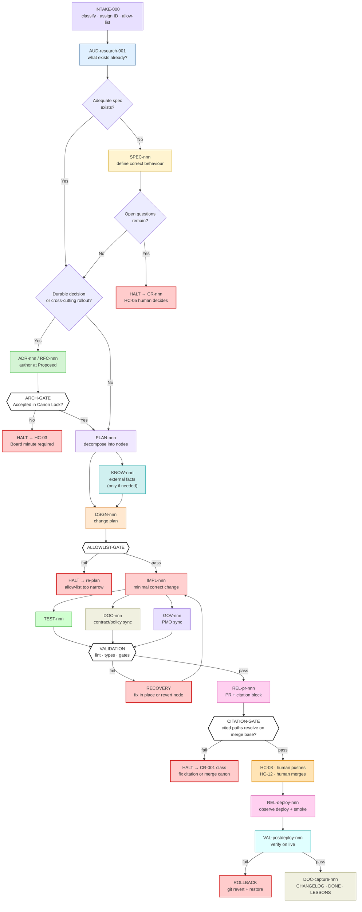
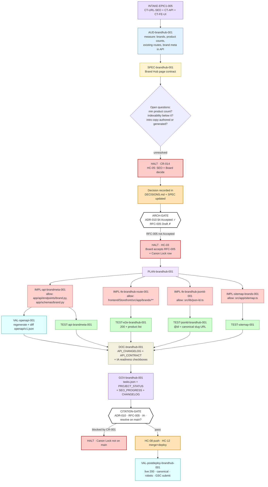

# Workflow Graph — Dependency-Aware Execution DAG

**Document ID:** `AODS-WF-001`
**Document type:** Process standard (Plane B)
**Status:** **Accepted**
**Version:** 1.0.0
**Date:** 2026-07-29
**Machine-readable twin:** [`../registry/task-graph.yaml`](../registry/task-graph.yaml)

> This is **not** a checklist. It is a directed acyclic graph of typed nodes. Nodes with no dependency edge between
> them may execute in parallel, in any order, by different agents, on different branches. Every node is
> independently resumable from the repository alone — which is the property that makes stateless Auto Mode agents
> viable.

---

## 1. Node contract

Every node in this system declares all thirteen fields. A node missing any field is invalid and must not be executed.

| Field | Meaning |
|-------|---------|
`id` | Stable identifier, `<TYPE>-<domain>-<nnn>` (see `NAMING-CONVENTIONS.md`)
`purpose` | One sentence. If it needs two, split the node.
`role` | Exactly one responsible role from `role-registry.yaml`
`inputs` | Enumerated paths / artifact IDs that must exist before start
`consumes` | Artifacts read but not modified
`produces` | Artifacts created or updated
`allowed_paths` | Glob allow-list. Editing outside it is a hard failure.
`forbidden_paths` | Explicit denials that override the allow-list
`context_tier` | `T0`–`T3` budget class (see `CONTEXT-MANAGEMENT.md`)
`gates` | Validation gate IDs that must pass
`acceptance` | Objectively checkable exit conditions
`failure_conditions` | Signals that mean "stop, do not continue"
`recovery` | What to do on each failure condition
`blocked_by` | `CR-nnn` conflict IDs or upstream node IDs

---

## 2. Node types

| Type | Prefix | Responsibility | May edit code? | Typical size |
|------|--------|---------------|----------------|--------------|
| Audit | `AUD` | Measure reality, produce evidence | No | reports only |
| Specification | `SPEC` | Define correct behaviour | No | 1 doc |
| Decision | `ADR` / `RFC` | Record durable choice / rollout plan | No | 1 doc |
| Plan | `PLAN` | Decompose into nodes | No | graph + `tasks.json` |
| Knowledge | `KNOW` | External source → structured data | Data files only | extract + mapping |
| Design | `DSGN` | Concrete change plan | No | 1 plan |
| Implementation | `IMPL` | Change behaviour | **Yes** | ≤400 lines / ≤15 files |
| Test | `TEST` | Prove correctness | Tests only | ≤300 lines |
| Validation | `VAL` | Run gates, report | No | report only |
| Documentation | `DOC` | Update docs to match reality | Docs only | ≤1 doc cluster |
| Governance | `GOV` | PMO / registry / rules sync | Governance files only | small |
| Release | `REL` | Merge, deploy, verify | No | records only |

**The separation of `IMPL` from `TEST`, `DOC`, and `GOV` is deliberate and non-negotiable** (Principle 5).
A single node that implements, tests, documents, and updates the PMO is four responsibilities; it will be
partially completed, and the partial completion will be invisible.

---

## 3. The canonical change DAG

This is the graph any single change traverses. Parallelism is real, not decorative.

### 3.1 What runs in parallel

| Parallel set | Nodes | Condition |
|--------------|-------|-----------|
| P1 | `TEST-nnn` ∥ `DOC-nnn` ∥ `GOV-nnn` | All depend only on `IMPL-nnn` and touch disjoint path sets |
| P2 | `KNOW-nnn` ∥ `DSGN-nnn` | Only when the design does not depend on extracted facts |
| P3 | Multiple `IMPL` nodes across surfaces | Only when allow-lists are disjoint **and** no shared contract changes (e.g. backend brand-meta and frontend brand-hub UI must be sequenced through the contract) |
| P4 | `AUD-*` nodes | Always parallelisable; read-only |

**Disjointness rule.** Two nodes may run in parallel iff `allowed_paths` intersect is empty **and** neither
produces an artifact the other consumes. `--gate allowlist` makes this checkable rather than aspirational.

---

## 4. Worked example: the live EPIC-1 Brand Hub work

This is a real, currently-unstarted piece of work (`CR-014`, missing spec `G-01`) decomposed into the DAG.
It demonstrates every construct, including a legitimate halt.

**What this example demonstrates**

1. **Two legitimate halts before any code is written** — a missing specification decision (`CR-014`) and a
   non-Accepted RFC. Under the old process, an agent would have invented a thin-content threshold and shipped it.
2. **Four independent `IMPL` nodes** with disjoint allow-lists, parallelisable after the plan.
3. **`DOC` and `GOV` as first-class nodes**, not afterthoughts — which is how the PMO rule stops being violated.
4. **A third halt at the citation gate**, blocked by `CR-001`, proving the register is load-bearing rather than decorative.

---

## 5. Node specifications (reference set)

Full field sets for the recurring node archetypes. Project-specific nodes inherit from these.
`registry/task-graph.yaml` holds the machine-readable form.

### 5.1 `AUD-research-nnn` — Pre-work research

| Field | Value |
|-------|-------|
**purpose** | Determine whether the requested change already exists, is governed, or is blocked
**role** | `R-KNOW` Knowledge Engineer
**inputs** | `TASK-RECORD` draft; `document-registry.yaml`
**consumes** | Governing `CANON`/`CONTRACT` rows; code in the target area; `CONFLICT-REGISTER.md`; `git log`; closed PRs
**produces** | `RESEARCH-NOTE`
**allowed_paths** | `aods/reports/**` (read-only elsewhere)
**forbidden_paths** | everything else — this node **must not** edit source
**context_tier** | `T2`
**gates** | `links`
**acceptance** | Answers: (1) does it exist? (2) which authority rows govern? (3) blocked by a `CR-nnn`? (4) prior attempts? Each answer cites a path or a commit.
**failure_conditions** | Cannot locate any governing authority row → the change type may be unclassified · Target area is `QUARANTINED`
**recovery** | No governing row → escalate to `SPEC` node · Quarantined → escalate `HC-05`
**blocked_by** | —

### 5.2 `SPEC-nnn` — Specification

| Field | Value |
|-------|-------|
**purpose** | Define what correct behaviour means, testably, before implementation
**role** | Domain architect for the surface (`R-BE-ARCH` / `R-FE-ARCH` / `R-DB-ARCH` / `R-SEC-ARCH`)
**inputs** | `RESEARCH-NOTE`; governing `CANON` rows
**consumes** | ADR/RFC/IA packs; existing contracts
**produces** | `SPEC` document at status `Proposed`
**allowed_paths** | `docs/**` (spec location only) or `aods/reports/**`
**forbidden_paths** | `app/**`, `frontend/**`, `alembic/**`, `scripts/**`, any `CANON` document
**context_tier** | `T2`
**gates** | `links`, `registry`
**acceptance** | Every requirement has an ID and an objectively testable acceptance criterion; empty/error states defined; rollback stated; open questions enumerated
**failure_conditions** | An open question would require inventing a product decision · The spec contradicts an Accepted ADR
**recovery** | Emit `HALT` with the numbered open questions → `HC-05` · Contradiction → `CR-nnn` + `HC-03`
**blocked_by** | —

### 5.3 `IMPL-nnn` — Implementation

| Field | Value |
|-------|-------|
**purpose** | Make the smallest change satisfying one spec requirement group
**role** | `R-BE-ENG` / `R-FE-ENG` / `R-DB-ENG` / `R-DATA-ENG`
**inputs** | `CHANGE-PLAN`; `SPEC`; allow-list
**consumes** | Code inside the allow-list; the relevant contract
**produces** | Code diff; updated `TASK-RECORD`
**allowed_paths** | Node-specific, always explicit, always minimal
**forbidden_paths** | `docs/architecture/**` (CANON) · `project-management/**` (use a `GOV` node) · `.github/workflows/**` unless `CT-OPS` · `alembic/versions/**` unless `CT-SCHEMA` · every `QUARANTINED` path · `.env*`
**context_tier** | `T1` (narrowest — only the files being changed plus their direct contract)
**gates** | `allowlist`, `lint`, `typecheck`, `secret-scan`
**acceptance** | `git diff --name-only` ⊆ `allowed_paths`; diff ≤ 400 lines / ≤ 15 files; no new dependency unless the plan declares it; no unrelated formatting churn; no `TODO` left behind
**failure_conditions** | The change requires a file outside the allow-list · The spec is ambiguous at the point of implementation · A test that previously passed now fails for an unrelated reason · Implementation would need a schema change not in the plan
**recovery** | Out-of-scope file → `HALT`, return to `DSGN` with the required path and a reason (never widen silently) · Ambiguity → `HALT` to `SPEC` · Unrelated failure → `HALT`, report as a discovered defect, do not fix it in this node
**blocked_by** | `ARCH-GATE` must be green

### 5.4 `TEST-nnn` — Testing

| Field | Value |
|-------|-------|
**purpose** | Prove the spec's acceptance criteria and prevent regression
**role** | `R-QA`
**inputs** | `SPEC` acceptance-criterion IDs; the diff
**consumes** | Existing test suite and fixtures (`tests/conftest.py`, vitest setup)
**produces** | Test files; `TEST-REPORT`
**allowed_paths** | `tests/**`, `frontend/*/src/**/__tests__/**`, `frontend/*/e2e/**`
**forbidden_paths** | `app/**`, `frontend/*/src/**` non-test files — **a test node may never change production code to make a test pass**
**context_tier** | `T1`
**gates** | `test`, `coverage`
**acceptance** | Each new test names the spec criterion it covers; coverage ≥ 68%; the suite passes on both SQLite and (in CI) Postgres; a bug fix has a test that fails before the fix
**failure_conditions** | The only way to pass is to change production code · Coverage would drop below the gate
**recovery** | `HALT` and report the defect to the `IMPL` node owner; do not weaken the assertion or the gate
**blocked_by** | `IMPL-nnn` complete

### 5.5 `KNOW-nnn` — Knowledge acquisition

| Field | Value |
|-------|-------|
**purpose** | Turn an external source into validated structured data without touching production
**role** | `R-KNOW` + `R-DATA-ENG`
**inputs** | Human-placed source file at a declared path with a recorded checksum (**HC-07**)
**consumes** | Property/spec conventions; `data-ingestion-policy.md`; existing enrichment scripts
**produces** | `KNOWLEDGE-EXTRACT` (JSON), `MAPPING-TABLE`, `DRY-RUN-REPORT`
**allowed_paths** | `data/imports/**`, `scripts/**` (the job), `aods/reports/**`
**forbidden_paths** | Any path that writes to a live system; `app/**`
**context_tier** | `T2`
**gates** | `ingestion-boundary`, `dry-run-evidence`, `citation` (ADR-012 + `data-ingestion-policy.md`)
**acceptance** | Category (A/B/C) declared; `KARZAR_API_BASE` resolves local; Source/Destination/Owner/Validation/Audit/Rollback all declared; dry-run report attached with counts; fail-closed on unexpected delta; `top:*` keys not surfaced as customer properties
**failure_conditions** | Source file missing or checksum mismatch · Script would default to production · Delta exceeds the declared tolerance
**recovery** | Missing/mismatched source → `HALT` to **HC-07** · Production default → hard fail (`pr-checklist.md` explicit fail) · Delta exceeded → `HALT`, report, require Category B authorisation
**blocked_by** | `CR-004` — the 18 production-defaulting scripts

### 5.6 `DOC-nnn` — Documentation synchronisation

| Field | Value |
|-------|-------|
**purpose** | Make documents match reality after a change, in the correct direction
**role** | `R-DOC-ARCH`
**inputs** | The diff; the authority registry
**consumes** | Affected `CONTRACT`/`POLICY`/`REFERENCE` docs
**produces** | Doc deltas; registry updates
**allowed_paths** | `docs/**` excluding `docs/architecture/**`; `README.md`; `frontend/**/*.md`; `aods/**`
**forbidden_paths** | `docs/architecture/**` (CANON — Board only); `docs/audits/**` (evidence is immutable)
**context_tier** | `T1`
**gates** | `links`, `registry`
**acceptance** | No number contradicts its authoritative source; new/changed endpoints appear in `API_CHANGELOG.md`; every link resolves; stale docs get a dated banner rather than a silent edit
**failure_conditions** | The correct fix is to weaken a `CANON` document
**recovery** | `HALT` → `CR-nnn` → **HC-03**. Editing a doc *downward* to match defective code is explicitly forbidden (`AUTHORITY-MODEL.md` §5.2).
**blocked_by** | —

### 5.7 `GOV-nnn` — PMO / governance synchronisation

| Field | Value |
|-------|-------|
**purpose** | Keep planning state consistent with delivered work
**role** | `R-PMO`
**inputs** | Task ID; PR link; outcome
**consumes** | `tasks.json` and all mirrors
**produces** | Updated `tasks.json`, `PROJECT_STATUS.md`, active `SPRINT_XX.md`, relevant `*_PROGRESS.md`, `CHANGELOG.md`, `DONE.md`
**allowed_paths** | `project-management/**`
**forbidden_paths** | `project-management/exports/*.csv` and `printable/**` — those are `GENERATED`; regenerate, never hand-edit
**context_tier** | `T0`
**gates** | `pmo`
**acceptance** | `--gate pmo` passes: status/progress identical across `tasks.json` and every mirror; both copies of any duplicated file updated until `CR-007` is resolved; task ID present in `CHANGELOG.md`
**failure_conditions** | No task ID maps to the work (orphan, as in `CR-013`) · Duplicate files diverge
**recovery** | Orphan → create the task in `tasks.json` first, then mirror · Divergence → `HALT` to `CR-007`; do not pick a winner
**blocked_by** | `CR-007`

### 5.8 `REL-nnn` — Release

| Field | Value |
|-------|-------|
**purpose** | Merge and deploy with a human gate and a working rollback
**role** | `R-REL`
**inputs** | Approved PR; green CI; rollback note
**consumes** | Release checklist; `OPERATIONS.md`
**produces** | `RELEASE-RECORD`; `POST-DEPLOY-CHECK`
**allowed_paths** | none — release changes no files
**forbidden_paths** | all
**context_tier** | `T0`
**gates** | `citation`, `smoke`, `post-deploy`
**acceptance** | Smoke gate green; `/health` + `/ready` OK; storefront and admin reachable; post-deploy checks match the spec's criteria
**failure_conditions** | Smoke fails · Post-deploy check fails · Post-deploy automation fails (the observed real-world case)
**recovery** | `git revert` the merge commit → redeploy → restore data from backup if a data job ran. **Never** hand-patch the live host.
**blocked_by** | `CR-011` — merging to `main` deploys live with no gate

---

## 6. Failure taxonomy and recovery matrix

| Failure | Detected by | Immediate action | Recovery | Escalation |
|---------|-------------|------------------|----------|------------|
| Out-of-allow-list edit | `allowlist` gate | Revert the file | Return to `DSGN`, widen the list with a written reason | AI Reviewer |
| Ambiguous specification | Agent self-report at `IMPL` | `HALT` | `SPEC` node answers it | HC-05 |
| Non-Accepted ADR/RFC | `ARCH-GATE` | `HALT` | Board minute + Canon Lock row | HC-03 |
| Cited doc missing on merge base | `citation` gate | `HALT` | Merge the canon or correct the citation | HC-03 (`CR-001`) |
| Same-rank doc conflict | Agent self-report | `HALT` | New `CR-nnn` row | HC-01 |
| Coverage regression | `coverage` gate | `HALT` | Add tests; never lower the gate | QA |
| OpenAPI drift | `openapi` gate | `HALT` | Regenerate snapshot + `API_CHANGELOG` entry | Backend Architect |
| PMO divergence | `pmo` gate | `HALT` | `GOV` node | PMO |
| Broken doc link | `links` gate | `HALT` | Fix link or register the doc as external | Doc Architect |
| Unregistered document | `registry` gate | `HALT` | Classify in the registry | Doc Architect |
| Production write attempted | `ingestion-boundary` gate | **Hard fail, no override** | Re-run Category A locally | Board (Category B only) |
| Secret in diff | `secret-scan` | **Hard fail** | Purge, rotate the credential | Security |
| Smoke failure post-deploy | Deploy workflow | Rollback | `git revert` + redeploy | HC-12 |
| Context exhaustion | Agent self-report | `HALT` with progress recorded | Re-plan into smaller nodes | Project Architect |
| Repeated failure (≥2 attempts) | Task record attempt counter | Stop retrying | Escalate to human; do not try a third variant | Project Architect |

### 6.1 The two-attempt rule

An Auto Mode agent that fails a node **twice** must not attempt a third strategy. Empirically, third attempts
produce large speculative rewrites — the "uncontrolled code generation" and "unnecessary refactoring" failures the
brief names. The `TASK-RECORD` carries an `attempts` counter; at `attempts == 2` the only legal output is `HALT`.

---

## 7. Graph invariants (checked by `--gate graph`)

| ID | Invariant | Why |
|----|-----------|-----|
| GI-1 | The graph is acyclic | Cycles make resumption undecidable |
| GI-2 | Every node has exactly one `role` | Shared ownership means no ownership |
| GI-3 | Every `IMPL` node has ≥1 `TEST` successor | Untested behaviour change is not permitted |
| GI-4 | Every node that changes a contract has a `DOC` successor | Prevents the eight-stale-documents outcome |
| GI-5 | Every node mapped to a tracked task has a `GOV` successor | Enforces the `alwaysApply` PMO rule mechanically |
| GI-6 | No `IMPL` node's `allowed_paths` includes a `CANON` or `QUARANTINED` path | Protects binding criteria |
| GI-7 | Parallel nodes have disjoint `allowed_paths` | Prevents merge collisions between concurrent agents |
| GI-8 | Every `blocked_by` refers to an existing `CR-nnn` or node ID | Prevents phantom blockers |
| GI-9 | Every node's `gates` are defined in `VALIDATION-FRAMEWORK.md` | No fictional gates (failure criterion F-04) |
| GI-10 | No node lacks `recovery` | Every failure has a defined next step |
