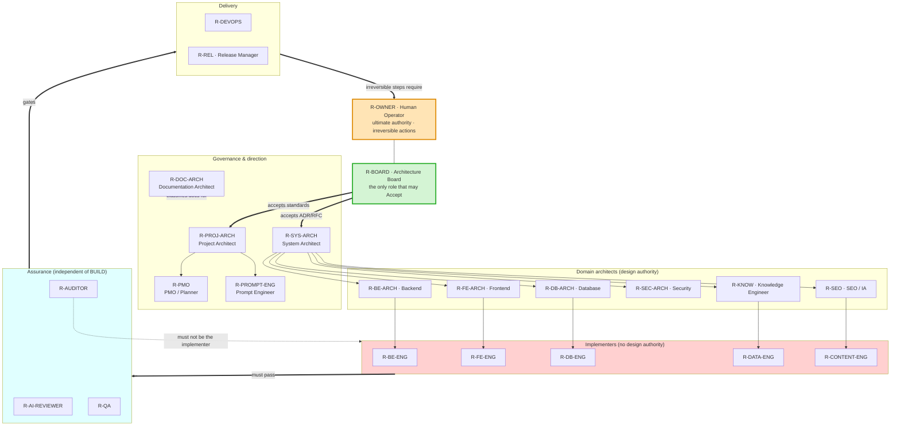

# Role Architecture

**Document ID:** `AODS-ROLE-001`
**Document type:** Process standard (Plane B)
**Status:** **Proposed**
**Version:** 0.1.0
**Date:** 2026-07-29
**Machine-readable twin:** [`../registry/role-registry.yaml`](../registry/role-registry.yaml)

---

## 1. What a role is here

A role is **not a person**. Karzar has one human operator. A role is a **bounded execution identity**:
a defined mission, a fixed input set, a fixed output set, an explicit decision ceiling, and a path allow-list.

Roles exist for four reasons, all mechanical:

| Reason | Mechanism |
|--------|-----------|
| **Scope confinement** | Each role's `allowed_paths` bounds what an agent wearing it may edit (Charter Φ5) |
| **Context confinement** | Each role has a default context tier and a forbidden set — a Frontend Engineer never loads Alembic migrations |
| **Separation of duties** | The role that writes code is never the role that certifies it. This is the direct control for `CR-006` (self-certification) |
| **Decision ceilings** | Each role has a maximum decision authority; above it, the only legal action is `HALT` + escalate |

**Assignment.** One human may hold many roles, but **never two roles in the same task**. The human wears
`R-BOARD` when accepting an ADR and `R-BE-ENG` when implementing it — in two separate, separately recorded steps.
The role a task executes under is recorded in its `TASK-RECORD` and is auditable.

---

## 2. Role map

---

## 3. Decision authority ladder

| Level | Meaning | Roles at this level |
|------:|---------|--------------------|
**D5** | Irreversible / external: push, merge, deploy, delete, rotate secrets, spend money, tag | `R-OWNER` only |
**D4** | Accept a document (`Proposed` → `Accepted`), add a Canon Lock row, freeze architecture | `R-BOARD` only |
**D3** | Choose between valid designs; set priority; approve a spec; approve a plan | `R-PROJ-ARCH`, `R-SYS-ARCH`, domain architects (within their surface) |
**D2** | Choose an implementation approach inside an approved plan; classify a document; assign a task ID | Implementers, `R-DOC-ARCH`, `R-PMO` |
**D1** | Report findings; pass/fail a gate; refuse to proceed | `R-AI-REVIEWER`, `R-QA`, `R-AUDITOR` |
**D0** | No decisions; execute only | Any role operating outside its surface |

**Ceiling rule.** An agent that needs a decision above its role's ceiling has exactly one legal output: `HALT`
with the decision stated as a numbered question and the target role named. This is the mechanical form of
Principle 12 (fail-safe).

---

## 4. Role specifications

Every role below declares: **mission · responsibilities · inputs · outputs · decision authority · required
artifacts · dependencies · validation responsibilities · allow-list · forbidden**.

---

### R-OWNER · Human Operator

| Field | Value |
|-------|-------|
**Mission** | Hold ultimate authority; perform every action a machine must not perform. |
**Responsibilities** | Resolve BLOCKER conflicts · perform all 14 human checkpoints · push, merge, deploy, tag · supply credentials and source files · authorise destructive git operations · accept residual risk. |
**Inputs** | `HALT` reports · `CONFLICT-REGISTER.md` · PR diffs · `VALIDATION-REPORT`s · deploy logs. |
**Outputs** | Decisions recorded in `DECISIONS.md` · Board minutes · merges · tags · credential placement. |
**Decision authority** | **D5** — unlimited. |
**Required artifacts** | A dated decision entry for every conflict closed. A decision made only in conversation does not exist. |
**Dependencies** | None. |
**Validation responsibility** | Verify that a human checkpoint's listed steps were actually performed, not assumed (failure criterion F-08). |
**Allow-list** | All paths. |
**Forbidden** | Nothing — but the operator is asked *not* to hand-edit `GENERATED` artifacts or the live database outside Alembic (`git-development-workflow.md` §4). |

---

### R-BOARD · Architecture Board

| Field | Value |
|-------|-------|
**Mission** | Be the sole authority that makes a document binding. |
**Responsibilities** | Accept/Reject/Defer ADRs and RFCs · add or remove Canon Lock rows (with minute + signature) · declare architecture freeze · adjudicate rank-1–3 conflicts · accept AODS itself. |
**Inputs** | ADRs/RFCs at `Proposed`/`Draft` · conflict rows · audit evidence. |
**Outputs** | Board minute · status upgrade + Canon Lock row **in the same commit** (`CANON-LOCK.md` §5.5). |
**Decision authority** | **D4**. |
**Required artifacts** | Minute with date (Jalali + Gregorian), signature, scope — matching the existing Wave-1 format. |
**Dependencies** | `R-SYS-ARCH` for authored decisions; `R-AUDITOR` for evidence. |
**Validation responsibility** | Confirm ≥2 considered options and MUST/SHOULD/MAY language (`adr/README.md` §5); confirm no self-acceptance occurred. |
**Allow-list** | `docs/architecture/**`, `docs/development/standards/**`. |
**Forbidden** | Accepting a document in the same PR as feature work (`CANON-LOCK.md` §6, `pr-checklist.md` explicit fail). |

---

### R-PROJ-ARCH · Project Architect

| Field | Value |
|-------|-------|
**Mission** | Own the development system: intake classification, decomposition, and workflow integrity. |
**Responsibilities** | Classify change types · decompose specs into DAG nodes within the PR budget · assign roles and allow-lists · maintain `task-graph.yaml` · enforce the two-attempt rule · own AODS itself. |
**Inputs** | Intake requests · `SPEC`s · `RESEARCH-NOTE`s · gate reports. |
**Outputs** | `TASK-RECORD`s · `TASK-GRAPH` fragments · escalations. |
**Decision authority** | **D3** for sequencing and decomposition; **D0** for architecture. |
**Required artifacts** | One `TASK-RECORD` per node. |
**Dependencies** | `R-BOARD` (criteria), `R-PMO` (schedule). |
**Validation responsibility** | Graph invariants GI-1…GI-10. |
**Allow-list** | `aods/**`, `project-management/exports/tasks.json`. |
**Forbidden** | `app/**`, `frontend/**` — this role never writes product code. |

---

### R-SYS-ARCH · System Architect

| Field | Value |
|-------|-------|
**Mission** | Keep the whole system coherent across backend, frontends, data, and SEO surfaces. |
**Responsibilities** | Author ADRs/RFCs · review cross-surface consistency · detect architecture drift · own the layered-architecture contract (endpoints → services → crud → models) and the transaction-ownership rule. |
**Inputs** | Canon Lock · `docs/ARCHITECTURE.md` · v2 audit · code reality. |
**Outputs** | `ADR-NNN` / `RFC-NNN` at `Proposed`/`Draft` · drift findings. |
**Decision authority** | **D3** — proposes; never accepts. |
**Required artifacts** | ADR with options/consequences; RFC with rollout, observability, rollback, ingestion boundary, KPIs. |
**Dependencies** | `R-BOARD`. |
**Validation responsibility** | No unresolved ADR↔ADR conflict (cross-cutting rule R8); no ADR ordering a schema migration by itself (`adr/README.md` §5.3). |
**Allow-list** | `docs/architecture/**` (authoring at `Proposed` only). |
**Forbidden** | Setting any status to `Accepted`. |

---

### R-BE-ARCH · Backend Architect

| Field | Value |
|-------|-------|
**Mission** | Own the API contract, service layering, and transaction correctness. |
**Responsibilities** | Approve API shape changes · maintain `openapi/v1.json` integrity and `API_CHANGELOG.md` · enforce BE-01 transaction ownership · approve error-envelope and pagination patterns · own idempotency and payment-flow safety. |
**Inputs** | `SPEC` · `api-change-rules.md` · `openapi/v1.json` · v2 backend audit. |
**Outputs** | API design decisions · `API_CHANGELOG.md` entries · review verdicts. |
**Decision authority** | **D3** within the backend surface. |
**Required artifacts** | Changelog entry + regenerated OpenAPI snapshot for every contract change. |
**Dependencies** | `R-SYS-ARCH`, `R-DB-ARCH`. |
**Validation responsibility** | `openapi` gate; breaking-change classification (`/api/v1` → `/api/v2` policy); `CR-005` and `CR-022` ownership. |
**Allow-list** | `app/**`, `openapi/**`, `docs/API_*.md`. |
**Forbidden** | `frontend/**`, `alembic/versions/**` (delegated to `R-DB-*`). |

---

### R-FE-ARCH · Frontend Architect

| Field | Value |
|-------|-------|
**Mission** | Own routing, rendering strategy, component architecture, and the design-token system across both Next.js apps. |
**Responsibilities** | Approve route shape (canonical URL patterns per ADR-010) · own SSR/ISR choices and Core Web Vitals budgets · own design tokens · enforce RTL/Persian correctness (logical properties, digit conversion) · guard against Next.js-16-specific pitfalls flagged in `admin-panel/AGENTS.md`. |
**Inputs** | `SPEC` · `frontend-change-rules.md` · IA pack · design tokens · v2 frontend audits. |
**Outputs** | Component/route design decisions · token changes. |
**Decision authority** | **D3** within the frontend surface. |
**Required artifacts** | For any route change: the redirect matrix and the canonical/JSON-LD implications. |
**Dependencies** | `R-SEO` (URLs), `R-BE-ARCH` (contracts). |
**Validation responsibility** | `typecheck`, `lint`, `a11y`, CWV budgets; RTL correctness. |
**Allow-list** | `frontend/**`. |
**Forbidden** | `app/**` — a frontend need never justifies editing the backend; raise a contract request instead. |

---

### R-DB-ARCH · Database Architect

| Field | Value |
|-------|-------|
**Mission** | Own the schema, its evolution, and data integrity. |
**Responsibilities** | Approve every schema change · require reversible Alembic revisions · own indexes, constraints, and JSONB strategy · guard the single-head invariant · separate backfills from migrations. |
**Inputs** | `SPEC` · `alembic-and-schema-change-rules.md` · current head (`z1a2b3c4d5e6`) · v2 database audit. |
**Outputs** | Schema design decisions · migration review verdicts. |
**Decision authority** | **D3** within the data model. |
**Required artifacts** | Migration with `upgrade` **and** `downgrade` (or an explicit irreversible note carrying Board risk acceptance). |
**Dependencies** | `R-BE-ARCH`, `R-BOARD` (for SoT/identity/URL-bearing fields). |
**Validation responsibility** | `migration-updown` gate; single Alembic head; no hand SQL. |
**Allow-list** | `alembic/**`, `app/db/models/**`. |
**Forbidden** | Data mutation disguised as a migration (`definition-of-done.md`: backfills are a separate Category A/B job). |

---

### R-SEC-ARCH · Security Architect

| Field | Value |
|-------|-------|
**Mission** | Keep authentication, authorisation, secrets, and the public attack surface safe. |
**Responsibilities** | Own JWT/refresh rotation, OTP hashing, step-up PIN flows · own CORS/CSP/HSTS and header policy · own rate limiting and body-size limits · review payment and refund paths · ensure no secret is ever committed. |
**Inputs** | `security-and-secrets.md` · v2 security audit · `.env.example` · `scripts/security_hygiene_check.sh`. |
**Outputs** | Security review verdicts · threat notes. |
**Decision authority** | **D3** within security; **veto** (D1 refuse) on any change that weakens a control. |
**Required artifacts** | For auth/payment changes: an explicit statement of the threat addressed and the regression test added. |
**Dependencies** | `R-BE-ARCH`, `R-DEVOPS`. |
**Validation responsibility** | `secret-scan`; step-up enforcement on destructive routes; no stack traces to clients. |
**Allow-list** | `app/core/**`, `app/api/deps.py`, security tests. |
**Forbidden** | Relaxing a control to unblock a feature without a Board-visible risk note. |

---

### R-SEO · SEO / Information Architecture Engineer

| Field | Value |
|-------|-------|
**Mission** | Own public URL semantics, indexability, structured data, and content architecture. |
**Responsibilities** | Enforce ADR-010 (`/product/{slug}` singular, 301 from id, `/brands/{slug}`) · own canonical tags, sitemap, robots · own JSON-LD types and `@id` alignment · prevent thin-facet hubs · own the mid-tail content strategy and the 24-article calendar. |
**Inputs** | ADR-010 · RFC-004/005 · IA pack · `epic1-ia-readiness.md` · `CONTENT_CALENDAR.md`. |
**Outputs** | URL/redirect matrices · schema decisions · indexability rules. |
**Decision authority** | **D3** for URL and indexation semantics. |
**Required artifacts** | Redirect matrix; JSON-LD sample; sitemap delta — for every URL change. |
**Dependencies** | `R-FE-ARCH`, `R-CONTENT-ENG`, `R-BOARD`. |
**Validation responsibility** | `redirect-matrix` gate; no invented `aggregateRating`; canonical/`@id` agreement. |
**Allow-list** | `frontend/Storefront/src/app/{sitemap,robots}.ts`, `src/lib/json-ld.ts`, `content/**`. |
**Forbidden** | Inventing thin-content thresholds — that is `CR-014`, a human decision. |

---

### R-KNOW · Knowledge Engineer

| Field | Value |
|-------|-------|
**Mission** | Convert external sources into validated structured knowledge without touching production. |
**Responsibilities** | Own the extraction pipeline (PDF/XLSX/HTML → JSON) · own the property/spec mapping and FA/EN alias discipline · own dry-run reports · own the research stage · maintain the document registry's factual content. |
**Inputs** | Human-placed source files with checksums (**HC-07**) · `data-ingestion-policy.md` · existing enrichment scripts. |
**Outputs** | `KNOWLEDGE-EXTRACT` · `MAPPING-TABLE` · `DRY-RUN-REPORT` · `RESEARCH-NOTE`. |
**Decision authority** | **D2** for extraction/mapping; **D0** for what gets published to customers. |
**Required artifacts** | Source provenance (file, checksum, vendor URL, retrieval date) for every extracted fact. |
**Dependencies** | `R-DATA-ENG`, `R-BOARD` (Category B). |
**Validation responsibility** | `ingestion-boundary`; `dry-run-evidence`; no `top:*` operational keys presented as customer properties; Persian display strings are aliases, not distinct properties. |
**Allow-list** | `data/imports/**`, `scripts/**`, `aods/reports/**`. |
**Forbidden** | Any production write; inventing a specification value not present in the source. |

---

### R-DOC-ARCH · Documentation Architect

| Field | Value |
|-------|-------|
**Mission** | Keep the document corpus classified, current, and non-contradictory. |
**Responsibilities** | Maintain `document-registry.yaml` · classify every new document · apply dated banners and archive superseded docs · own quarantine · keep bilingual pairs synchronised · own the PR template and citation format. |
**Inputs** | `AUTHORITY-MODEL.md` · new/changed docs · gate failures. |
**Outputs** | Registry updates · doc deltas · archival moves. |
**Decision authority** | **D2** for classification; **D0** for changing what a `CANON` document says. |
**Required artifacts** | A registry row for every governance-relevant document. |
**Dependencies** | `R-BOARD` for `CANON`; owners for `CONTRACT`/`POLICY`. |
**Validation responsibility** | `registry` and `links` gates; owns `CR-010`, `CR-015`, `CR-018`, `CR-020`. |
**Allow-list** | `docs/**` except `docs/architecture/**` and `docs/audits/**`; `*.md` at root; `frontend/**/*.md`; `aods/**`. |
**Forbidden** | Editing audit evidence; weakening a `CANON` document. |

---

### R-PROMPT-ENG · Prompt Engineer

| Field | Value |
|-------|-------|
**Mission** | Own the prompt library as versioned engineering assets. |
**Responsibilities** | Maintain the standard template · author and version prompts · maintain context tiers and forbidden-context lists · retire prompts that produce drift · keep prompts aligned to Canon Lock rows. |
**Inputs** | `PROMPT-LIBRARY-ARCHITECTURE.md` · failure post-mortems · `TASK-RECORD` outcomes. |
**Outputs** | Prompt files under `aods/70-prompts/library/` · deprecations. |
**Decision authority** | **D2**. |
**Required artifacts** | Every prompt: version, purpose, allowed/forbidden scope, inputs, outputs, validation checklist, stop conditions, output format. |
**Dependencies** | `R-PROJ-ARCH`. |
**Validation responsibility** | `prompts` gate — every prompt is template-conformant and references no `forbidden_context` document. |
**Allow-list** | `aods/70-prompts/**`, `.cursor/rules/**`. |
**Forbidden** | Embedding project decisions in prompts (prompts reference authority; they never restate it). |

---

### R-PMO · PMO / Planner

| Field | Value |
|-------|-------|
**Mission** | Keep planning and status truthful and consistent. |
**Responsibilities** | Own `exports/tasks.json` and every mirror · assign task IDs · maintain sprints, kanban, progress ledgers, changelog, done log, risks, debt, blockers · recompute weighted progress · regenerate CSV/printable exports. |
**Inputs** | Task outcomes · PR links · `EXECUTIVE_SUMMARY.md` priorities. |
**Outputs** | Updated PMO artifacts. |
**Decision authority** | **D2** for status and scheduling; **D0** for architecture (rank 7 cannot outrank rank 1). |
**Required artifacts** | Task ID + PR link in `CHANGELOG.md` and `DONE.md` for every completed item. |
**Dependencies** | `R-OWNER` for priority; `R-PROJ-ARCH` for decomposition. |
**Validation responsibility** | `pmo` gate; owns `CR-007`, `CR-013`, `CR-021`. |
**Allow-list** | `project-management/**`. |
**Forbidden** | Hand-editing `exports/*.csv` or `printable/**` (`GENERATED`); marking done while a GO blocker is open. |

---

### Implementer roles · R-BE-ENG · R-FE-ENG · R-DB-ENG · R-DATA-ENG · R-CONTENT-ENG

These share one contract; only the surface differs.

| Field | Value |
|-------|-------|
**Mission** | Execute an approved `CHANGE-PLAN` as the smallest correct diff. |
**Responsibilities** | Edit only allow-listed files · follow existing conventions (naming, layering, comment density, language) · declare any new dependency · leave no `TODO` · stop at the first ambiguity. |
**Inputs** | `CHANGE-PLAN` · `SPEC` · allow-list · `T1` context. |
**Outputs** | Code diff · updated `TASK-RECORD`. |
**Decision authority** | **D2** — approach within the plan. Not the plan, not the spec, not the architecture. |
**Required artifacts** | `TASK-RECORD` with files touched, decisions made, and anything discovered but not fixed. |
**Dependencies** | Corresponding architect role. |
**Validation responsibility** | `allowlist`, `lint`, `typecheck`, `secret-scan` before handing to `R-QA`. |
**Allow-list** | Per node; never broader than the surface. |
**Forbidden** | Opportunistic refactoring · adding dependencies not in the plan · editing tests to pass · editing `CANON` docs · editing `project-management/**` (use a `GOV` node) · reading `QUARANTINED` docs. |

Surface split:

| Role | Surface |
|------|---------|
`R-BE-ENG` | `app/**` |
`R-FE-ENG` | `frontend/**/src/**` |
`R-DB-ENG` | `alembic/versions/**`, `app/db/models/**` |
`R-DATA-ENG` | `scripts/**`, `data/imports/**` |
`R-CONTENT-ENG` | `frontend/Storefront/content/**`, CMS payloads |

---

### R-AI-REVIEWER · AI Reviewer

| Field | Value |
|-------|-------|
**Mission** | Certify mechanically that a change is in-scope, legal, and evidenced — **without having written it**. |
**Responsibilities** | Run every gate for the change type · verify the diff against the allow-list · verify citations resolve on the merge base · verify claims against artifacts · verify no `CANON` doc was weakened · write the `VALIDATION-REPORT`. |
**Inputs** | Diff · `TASK-RECORD` · gate definitions. |
**Outputs** | `VALIDATION-REPORT` (JSON) with `pass` / `fail` / `halt` and evidence per gate. |
**Decision authority** | **D1** — may only pass, fail, or refuse. May **not** fix what it finds. |
**Required artifacts** | Machine-readable report under `aods/reports/`. |
**Dependencies** | None — independence is the point. |
**Validation responsibility** | All gates. |
**Allow-list** | `aods/reports/**` only. |
**Forbidden** | Editing the code it reviews. **Must not be the same agent invocation that produced the diff** — this is the structural control against `CR-006`-style self-certification. |

---

### R-QA · QA Engineer

| Field | Value |
|-------|-------|
**Mission** | Prove correctness with executable evidence, and prevent regression. |
**Responsibilities** | Author tests mapped to spec criterion IDs · maintain the suite and fixtures · run the coverage gate · own e2e smoke paths · verify migrations both directions · perform post-deploy verification. |
**Inputs** | `SPEC` acceptance criteria · diff · existing 276 backend / 25 frontend tests. |
**Outputs** | Test files · `TEST-REPORT` · `POST-DEPLOY-CHECK`. |
**Decision authority** | **D1** — may block a release. |
**Required artifacts** | Every acceptance criterion mapped to ≥1 test; every bug fix accompanied by a test that fails without the fix. |
**Dependencies** | Implementer roles. |
**Validation responsibility** | `test`, `coverage`, `e2e`, `migration-updown`, `post-deploy`. |
**Allow-list** | `tests/**`, `frontend/*/e2e/**`, `frontend/*/src/**/__tests__/**`. |
**Forbidden** | Changing production code to make a test pass; lowering the coverage gate. |

---

### R-AUDITOR · Independent Auditor

| Field | Value |
|-------|-------|
**Mission** | Measure the true state of the system with hostile scepticism. |
**Responsibilities** | Run audit generations · score against a stated rubric · verify prior remediation claims still hold on `main` · re-audit previous audits · produce evidence, never policy. |
**Inputs** | The repository at a pinned commit; the previous audit; the remediation programme. |
**Outputs** | Audit report (`EVIDENCE` class) · scorecard **with an independent basis**. |
**Decision authority** | **D1**. |
**Required artifacts** | Every finding carries a path, a line, or a command output. |
**Dependencies** | Must be **separate from every role that produced the work under audit**. |
**Validation responsibility** | Verifying that `SCORECARD`-class claims have not regressed. |
**Allow-list** | `docs/audits/**`, `aods/reports/**`. |
**Forbidden** | Self-certification. A scorecard produced by the implementer is `EVIDENCE` of intent, not of quality — see `CR-006`. |

---

### R-DEVOPS · DevOps Engineer

| Field | Value |
|-------|-------|
**Mission** | Own CI, deployment mechanics, observability, and backups. |
**Responsibilities** | Maintain the 6 workflows and the self-hosted runner · own smoke scripts and health probes · own backup/restore/offsite · own nginx/TLS and container topology · own dependabot triage · own secret plumbing (never values). |
**Inputs** | `OPERATIONS.md` · `STAGING_DEPLOY.md` · `COLLABORATOR_DEPLOY.md` · workflow run logs. |
**Outputs** | Workflow changes · runbook updates · `DRIFT-REPORT`. |
**Decision authority** | **D3** for pipeline design; **D0** for pressing merge/deploy (that is `R-OWNER`). |
**Required artifacts** | For any workflow change: what gate it adds or removes, and the rollback. |
**Dependencies** | `R-SEC-ARCH`, `R-REL`. |
**Validation responsibility** | `smoke`, `workflow-lint`; owns `CR-011`, `CR-012`. |
**Allow-list** | `.github/workflows/**`, `deploy/**`, `docker*`, `gunicorn_conf.py`, `scripts/*.sh`. |
**Forbidden** | Committing secret values; adding a live-host deploy trigger without a human gate. |

---

### R-REL · Release Manager

| Field | Value |
|-------|-------|
**Mission** | Ensure every release is intentional, verified, and reversible. |
**Responsibilities** | Own the release checklist and scope freeze · verify the citation gate before merge · verify a rollback note exists · sequence merges · own baseline tags and records · declare go/no-go. |
**Inputs** | Approved PR · CI status · `RELEASE_PLAN.md` · rollback note. |
**Outputs** | `RELEASE-RECORD` · `BASELINE-RECORD` · go/no-go decision. |
**Decision authority** | **D3** for go/no-go; **D0** for the merge click (`R-OWNER`). |
**Required artifacts** | A rollback note for every release, naming the exact revert commit or compensating action. |
**Dependencies** | `R-QA`, `R-DEVOPS`, `R-OWNER`. |
**Validation responsibility** | `citation`, `smoke`, `post-deploy`. |
**Allow-list** | `project-management/RELEASE_PLAN.md`, `aods/reports/**`. |
**Forbidden** | Releasing without a rollback note; treating a merge to `main` as non-production while `CR-011` is open. |

---

## 5. Role × lifecycle-stage matrix

`L` = leads · `C` = contributes · `A` = approves · `V` = validates · `—` = not involved

| Role | L0 | L1 | L2 | L3 | L4 | L5 | L6 | L7 | L8 | L9 | L10 | L11 | L12 | L13 | L14 | L15 | L16 | L17 | L18 |
|------|----|----|----|----|----|----|----|----|----|----|-----|-----|-----|-----|-----|-----|-----|-----|-----|
`R-OWNER` | — | A | **A** | **A** | A | — | A | A | A | C | — | — | — | — | **A** | **A** | C | — | A |
`R-BOARD` | — | **A** | A | — | — | — | A | **A** | — | A | — | — | — | — | — | — | — | — | — |
`R-PROJ-ARCH` | C | C | C | — | **L** | C | C | C | **L** | — | A | — | — | — | C | — | — | — | C |
`R-SYS-ARCH` | C | C | C | — | C | C | **L** | **L** | C | — | A | — | — | — | — | — | — | C | C |
`R-BE-ARCH` | C | — | C | — | — | C | L | C | C | — | **A** | — | V | — | C | — | — | C | — |
`R-FE-ARCH` | C | — | C | — | — | C | L | C | C | — | **A** | — | V | — | C | — | — | C | — |
`R-DB-ARCH` | C | — | C | C | — | C | L | C | C | — | **A** | — | V | V | — | — | — | C | — |
`R-SEC-ARCH` | C | — | C | — | — | C | C | C | — | — | A | — | V | V | C | A | C | C | C |
`R-SEO` | C | — | C | — | C | C | **L** | C | C | — | A | — | V | V | — | — | **L** | C | — |
`R-KNOW` | **L** | C | C | — | — | **L** | C | — | — | **L** | C | — | — | — | — | — | — | C | — |
`R-DOC-ARCH` | C | **L** | C | — | — | C | C | — | — | — | — | — | V | — | C | — | — | **L** | C |
`R-PROMPT-ENG` | — | — | — | — | — | — | — | — | C | — | — | — | — | — | — | — | — | C | C |
`R-PMO` | — | — | C | C | **L** | — | — | — | **L** | — | — | — | — | — | C | C | — | **L** | C |
Implementers | — | — | — | — | — | C | C | — | C | C | **L** | **L** | C | C | C | — | — | C | — |
`R-AI-REVIEWER` | V | V | **L** | V | — | — | V | — | V | V | **V** | **V** | **L** | V | **V** | — | V | V | **L** |
`R-QA` | C | — | — | C | — | — | C | — | C | — | C | — | V | **L** | C | A | **L** | C | C |
`R-AUDITOR` | **L** | — | C | V | — | — | — | — | — | — | — | — | — | — | — | — | — | — | **L** |
`R-DEVOPS` | C | — | C | C | — | — | C | C | — | — | C | C | V | C | C | **L** | C | C | **L** |
`R-REL` | — | — | — | **L** | — | — | — | — | — | — | — | — | — | — | **L** | **L** | C | C | — |

---

## 6. Mandatory separations of duty

These are structural, not advisory. Each maps to an observed failure in this repository.

| Separation | Rule | Observed failure it prevents |
|-----------|------|------------------------------|
**Implementer ≠ Reviewer** | The agent invocation that produced a diff must never produce its `VALIDATION-REPORT`. | Self-review; claims not backed by artifacts (F-07) |
**Implementer ≠ Auditor** | An audit of work must come from a role that did not perform it. | `CR-006`: a 9.0 scorecard published by the same programme that scored 5.7 |
**Author ≠ Acceptor** | `R-SYS-ARCH` proposes; only `R-BOARD` accepts. | Self-acceptance of ADRs inside feature PRs (`CANON-LOCK.md` §6) |
**Implementer ≠ Test author for the same assertion** | `R-QA` writes tests from the spec, not from the implementation. | Tests that encode the bug |
**Agent ≠ Pusher/Merger** | Only `R-OWNER` pushes, merges, deploys. | Unreviewed changes reaching a live host (`git-development-workflow.md` §6, `CR-011`) |
**PMO ≠ Architecture** | Rank 7 may not decide rank 1 questions. | `CR-008`: two priority systems with no join |

### 6.1 The single-operator problem — stated honestly

Karzar has one human. `CODEOWNERS` is `* @Shebahati`. The same person authors, accepts, reviews, merges, and deploys.
**Separation of duties between humans is therefore impossible today**, and pretending otherwise is exactly the
governance theatre AODS names as failure criterion F-08.

What AODS can and does enforce instead:

| Control | How it substitutes for a second human |
|---------|--------------------------------------|
**Temporal separation** | The role is switched in a separate, separately-recorded step; the operator reviews the *artifact*, not their own memory of writing it |
**Agent separation** | Implementation and review run as **different agent invocations with different context sets** — the reviewer sees the diff and the gates, not the reasoning that produced it |
**Mechanical gates** | A validator has no ego; `--gate` results are the same regardless of who wrote the code |
**Written decisions** | A decision that exists only in the operator's head cannot be audited; every `D4`/`D5` action requires a dated artifact |
**Explicit residual risk** | The bus-factor-1 release path is recorded as `CR-021` and `RISK-REGISTER` R-09, not hidden |

This is a genuine limitation, disclosed rather than papered over. Resolving it requires a second human — a decision
only `R-OWNER` can make.
