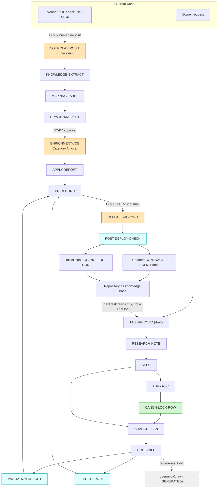

# Artifact Architecture

**Document ID:** `AODS-ART-001`
**Document type:** Process standard (Plane B)
**Status:** **Proposed**
**Version:** 0.1.0
**Date:** 2026-07-29

> **Rule of evidence.** A stage is complete when its artifact exists, not when an agent says the work is done.
> This is the mechanical form of Charter Φ4 and the control for failure criterion **F-07** ("a 'done' claim not
> backed by an artifact"). Every artifact below therefore declares **where it lives**, **who may write it**,
> **what makes it valid**, and **what consumes it**.

---

## 1. Artifact classes

| Class | Lifetime | Version-controlled? | Hand-editable? | Example |
|-------|----------|--------------------|----------------|---------|
**Governing** | Permanent until superseded | Yes | By its owner role only | ADR, RFC, Canon Lock row, `SPEC` |
**Contractual** | Until the interface changes | Yes | Depends — generated ones never | `openapi/v1.json`, `API_CHANGELOG.md` |
**Planning** | Rolling | Yes | By PMO | `tasks.json`, sprint files, progress ledgers |
**Execution** | Per task | Yes | By the executing agent | `TASK-RECORD`, `CHANGE-PLAN`, `RESEARCH-NOTE` |
**Evidence** | Immutable once written | Yes | **Never edited after publication** | audit reports, `DRY-RUN-REPORT`, `VALIDATION-REPORT` |
**Generated** | Regenerated on demand | Yes (for diffability) | **Never** | `openapi/v1.json`, PMO CSVs, printable wallboards |
**Ephemeral** | Single run | No (gitignored) | n/a | gate JSON output before promotion, local logs |

**Why `Evidence` is immutable.** Canon Lock §4 already states it: *"Measure reality; do not edit upward to look
healthier."* An audit that can be edited after publication is not evidence. Corrections are issued as a **new**
dated report that supersedes the old one — the pattern `docs/audits/` → `docs/audits/v2/` already follows.

---

## 2. Complete artifact catalogue

Grouped by producing stage. Every artifact declares: **ID · produced by · location · format · validity criteria ·
consumed by**.

### 2.1 Repository intelligence artifacts

| ID | Produced by | Location | Format | Validity criteria | Consumed by |
|----|------------|----------|--------|-------------------|-------------|
`REPOSITORY-AUDIT` | `R-AUDITOR`/`R-KNOW` at L0 | `aods/10-repository-intelligence/REPOSITORY-AUDIT.md` | Markdown | Every claim has a path/line/command; unknowns enumerated | L1, L2, all prompts |
`DOCUMENT-REGISTRY` | `R-DOC-ARCH` at L1 | `aods/registry/document-registry.yaml` | YAML | Passes `--gate registry`; every doc has class+rank+owner | Every prompt (context + forbidden lists) |
`AUTHORITY-MODEL` | `R-DOC-ARCH` at L1 | `aods/10-repository-intelligence/AUTHORITY-MODEL.md` | Markdown | Every rank carries the citation that granted it | Conflict resolution, prompts |
`CONFLICT-REGISTER` | `R-AI-REVIEWER` at L2 | `aods/10-repository-intelligence/CONFLICT-REGISTER.md` | Markdown, append-only | No row with `Owner: UNASSIGNED`; both sides cited; AI has not chosen | Board, all halted tasks |
`DRIFT-REPORT` | `R-AI-REVIEWER` at L18 | `aods/reports/DRIFT-YYYY-MM-DD.md` | Markdown + JSON | All gates run; every failure has an owner | L4 intake |

### 2.2 Decision artifacts

| ID | Produced by | Location | Format | Validity criteria | Consumed by |
|----|------------|----------|--------|-------------------|-------------|
`ADR-NNN` | `R-SYS-ARCH`, accepted by `R-BOARD` | `docs/architecture/adr/ADR-NNN-kebab-title.md` | Markdown | ≥2 considered options; MUST/SHOULD/MAY decision; consequences; status set only by Board | Implementation, citations |
`RFC-NNN` | `R-SYS-ARCH`, accepted by `R-BOARD` | `docs/architecture/rfc/RFC-NNN-kebab-title.md` | Markdown per `RFC-TEMPLATE.md` | Includes rollback, ingestion boundary, KPIs; cites ADRs rather than restating them (Canon C6) | Implementation |
`CANON-LOCK-ROW` | `R-BOARD` | row in `docs/architecture/CANON-LOCK.md` | Table row | Added in the **same commit** as the status upgrade; carries minute + signature | Every citation gate check |
`BOARD-MINUTE` | `R-BOARD` | Canon Lock acceptance block, or a minute file | Table | Jalali + Gregorian date, board name, signature, scope | Audit trail |
`DECISION-ENTRY` | `R-OWNER`/`R-PMO` | `project-management/DECISIONS.md` | `- [x] **Dn** …` | Dated; states what was decided and why | Conflict closure |
`SPEC` | domain architect | `docs/**/<feature>-spec.md` or contract doc | Markdown | Every requirement has an ID and a testable criterion; zero unresolved open questions before L11 | `CHANGE-PLAN`, `TEST` |

### 2.3 Execution artifacts

| ID | Produced by | Location | Format | Validity criteria | Consumed by |
|----|------------|----------|--------|-------------------|-------------|
`TASK-RECORD` | executing agent | `aods/reports/tasks/<TASK-ID>.md` | Markdown, fixed sections | Contains base commit, role, allow-list, decisions, discovered-but-not-fixed, attempts counter, outcome | Reviewer, PR body, audit |
`RESEARCH-NOTE` | `R-KNOW` at L5 | `aods/reports/research/<TASK-ID>.md` | Markdown | Answers: exists? governed by? blocked by? prior attempts? | `SPEC`, `CHANGE-PLAN` |
`CHANGE-PLAN` | implementing architect at L10 | section of `TASK-RECORD` | Markdown | Exact files, exact signatures, test list, rollback note; all files inside the allow-list | `IMPL`, `TEST`, reviewer |
`CODE-DIFF` | implementer at L11 | git branch | git | ⊆ allow-list; ≤400 lines / ≤15 files; no undeclared dependency | Reviewer, QA |
`PR-RECORD` | `R-REL` at L14 | the pull request | GitHub PR body | Summary + citations + test plan + rollback; citations resolve on the merge base | Reviewer, audit |

### 2.4 Knowledge artifacts

| ID | Produced by | Location | Format | Validity criteria | Consumed by |
|----|------------|----------|--------|-------------------|-------------|
`SOURCE-DEPOSIT` | **human** at HC-07 | `data/imports/<vendor>/<collection>/` | PDF/XLSX/HTML + `README.md` | File present; checksum recorded; vendor URL and retrieval date recorded | `KNOWLEDGE-EXTRACT` |
`KNOWLEDGE-EXTRACT` | `R-KNOW` at L9 | `data/imports/<vendor>/<collection>/extract.json` | JSON | Every fact traceable to a source page/row; no invented values | `MAPPING-TABLE` |
`MAPPING-TABLE` | `R-KNOW` | same directory | JSON/Markdown | Source key → canonical property key; FA labels marked as aliases, not distinct properties; `top:*` excluded from customer-facing properties | enrichment job |
`DRY-RUN-REPORT` | `R-DATA-ENG` | `docs/**_dry_run_REPORT.md` or `aods/reports/` | Markdown | Counts before/after; delta within declared tolerance; **no writes performed** | HC-07 approval |
`ENRICHMENT-JOB` | `R-DATA-ENG` | `scripts/<name>.py` | Python | Declares Source, Destination, Owner, Validation, Audit, Rollback; local `KARZAR_API_BASE` default; fail-closed | Category A run |
`APPLY-REPORT` | `R-DATA-ENG` | `aods/reports/apply/<job>-<date>.md` | Markdown | Actual counts; job id; git ref; env; errors | Audit, rollback |

### 2.5 Quality artifacts

| ID | Produced by | Location | Format | Validity criteria | Consumed by |
|----|------------|----------|--------|-------------------|-------------|
`VALIDATION-REPORT` | `R-AI-REVIEWER` at L12 | `aods/reports/validation/<TASK-ID>.json` | JSON | One entry per gate with `pass`/`fail`/`baselined` and evidence; produced by a **different agent invocation** than the diff | PR gate, audit |
`TEST-REPORT` | `R-QA` at L13 | CI output + `aods/reports/tests/<TASK-ID>.md` | Markdown | Every spec criterion mapped to ≥1 test; coverage ≥68%; both DB backends where applicable | Release gate |
`REDIRECT-MATRIX` | `R-SEO` | section of `SPEC` / `TASK-RECORD` | Table | Every old URL → new URL with status code; no open redirect | `TEST`, post-deploy |
`AUDIT-REPORT` | `R-AUDITOR` | `docs/audits/<generation>/<phase>-audit.md` | Markdown | Stated rubric; every finding cites evidence; **immutable after publication** | Quality bar |
`SCORECARD` | `R-AUDITOR` | `docs/audits/<generation>/SCORECARD*.md` | Markdown | Independent basis; a re-score rule; **may not be authored by the implementer** | Board |
`POST-DEPLOY-CHECK` | `R-QA` at L16 | `aods/reports/postdeploy/<REL-ID>.md` | Markdown | Each spec criterion verified against the live system with the command used | Release closure |

### 2.6 Release artifacts

| ID | Produced by | Location | Format | Validity criteria | Consumed by |
|----|------------|----------|--------|-------------------|-------------|
`RELEASE-RECORD` | `R-REL` at L15 | `aods/reports/releases/<date>-<id>.md` | Markdown | Merge SHA, deploy run URL, smoke result, rollback command | Audit, incident response |
`ROLLBACK-NOTE` | implementer, verified by `R-REL` | section of `TASK-RECORD` and the PR body | Text | Names the exact revert commit, feature flag, or compensating action | Incident response |
`BASELINE-RECORD` | `R-REL` at L3 | `aods/reports/baselines/<TAG>.md` | Markdown | Tag name, commit, Alembic head, product count, OpenAPI path count, coverage %, test count — **all measured, none copied** | Future citations |
`MIGRATION-PLAN` | `R-DB-ARCH` | section of `SPEC` | Markdown | Upgrade + downgrade; backfill separated; backup expectation for Category B | `CT-SCHEMA` nodes |

### 2.7 Planning artifacts (existing, owned by PMO)

AODS does **not** redefine these. It records their validity criteria so the `pmo` gate can check them.

| ID | Location | Validity criteria |
|----|----------|-------------------|
`TASK-ENTRY` | `project-management/exports/tasks.json` | All 20 fields present; `status` ∈ {`todo`,`in_progress`,`done`,`cancelled`}; `deps` reference existing IDs |
`PROGRESS-LEDGER` | `project-management/progress/*_PROGRESS.md` | Status matches `tasks.json`; both duplicate copies identical until `CR-007` is resolved |
`SPRINT-FILE` | `project-management/sprints/SPRINT_XX.md` | Goal checkboxes reflect constituent task states |
`KANBAN` | `project-management/KANBAN_BOARD.md` | Task appears in the column matching its status |
`CHANGELOG-ENTRY` | `project-management/CHANGELOG.md` | Dated section; task ID + PR link |
`DONE-ENTRY` | `project-management/DONE.md` | Task ID, date, merge SHA (not "pending") |
`GENERATED-EXPORT` | `exports/*.csv`, `printable/**` | Byte-identical to a fresh regeneration from `tasks.json` |

### 2.8 System artifacts (AODS itself)

| ID | Location | Validity criteria |
|----|----------|-------------------|
`PROMPT` | `aods/70-prompts/library/<ID>.prompt.md` | Template-conformant; passes `--gate prompts`; references no `forbidden_context` document |
`ROLE-REGISTRY` | `aods/registry/role-registry.yaml` | Every role has a mission, ceiling, allow-list, escalation target |
`TASK-GRAPH` | `aods/registry/task-graph.yaml` | Satisfies invariants GI-1…GI-10 |
`VALIDATION-BASELINE` | `aods/registry/validation-baseline.json` | Every baselined violation has a date, an owner, and a conflict ID |
`CURSOR-RULE` | `.cursor/rules/*.mdc` | Frontmatter present; scoped by `globs` where possible |

---

## 3. Artifact flow



**The closing loop is the point.** `POST-DEPLOY-CHECK` feeds documentation and PMO, which become the input to the
next `TASK-RECORD`. No step depends on a conversation. That is what makes stateless Auto Mode execution possible.

---

## 4. The `TASK-RECORD` — the single most important artifact

Everything else can be reconstructed; the task record is the audit trail. It is what makes a stateless agent's work
reviewable and resumable. **Fixed structure, no free-form substitutions:**

```markdown
# TASK-RECORD · <TASK-ID>

| Field | Value |
|-------|-------|
| Task ID | SEO-005 |
| Change type | CT-URL-SEO |
| Role executed as | R-FE-ENG |
| Prompt | P-IMPL-FE-002 v1.2.0 |
| Base commit | c022a44 |
| Branch | feature/seo-005-brand-hub |
| Attempts | 1 |
| Outcome | COMPLETE \| HALTED \| ROLLED-BACK |

## Governing authority
- Canon Lock: docs/architecture/CANON-LOCK.md (Wave-1) — resolves on merge base: YES
- Refs: ADR-010, RFC-005
- Packs: docs/architecture/information-architecture/epic1-ia-readiness.md
- Spec: docs/architecture/brand-hub-page-contract.md §3

## Declared allow-list
- frontend/Storefront/src/app/brands/**

## Files actually changed
- frontend/Storefront/src/app/brands/[slug]/page.tsx  (+118)
(allow-list conformance: PASS)

## Decisions made (within D2 ceiling)
1. Used the existing PLP grid component rather than a new one — matches SPEC §3.2.

## Assumptions
(none — or each must cite the authority that permits it)

## Discovered but NOT fixed
1. `docs/FRONTEND_INTEGRATION.md` still documents low_stock as qty<10 → CR-022. Not in scope.

## Blockers encountered
(none — or CR-nnn with the halt reason)

## Gate results
See aods/reports/validation/SEO-005.json

## Rollback
git revert <merge-sha>; route is additive, no data migration.
```

**Sections that exist specifically as behavioural controls:**

| Section | Failure it prevents |
|---------|--------------------|
`Attempts` | Enforces the two-attempt rule; a third strategy is forbidden |
`Files actually changed` + conformance | Silent out-of-scope edits (failure criterion F-03) |
`Assumptions` | Hallucinated requirements — an empty section is the expected, good outcome |
`Discovered but NOT fixed` | Scope creep, while still capturing the finding instead of losing it |
`Governing authority` + "resolves on merge base" | Citing documents that do not exist (`CR-001`, failure criterion F-01) |
`Rollback` | Irreversible releases |

---

## 5. Artifact retention and location policy

| Location | Contains | Retention |
|----------|----------|-----------|
`docs/architecture/**` | Governing decisions (CANON) | Permanent; supersede, never delete |
`docs/audits/<generation>/` | Evidence | Permanent, immutable; new generation supersedes |
`docs/archive/` | Superseded documents with dated banners | Permanent (this directory does not yet exist — created by `CR-015` remediation) |
`aods/reports/` | Execution + validation + release records | Rolling: keep the last 2 waves; then archive to `aods/reports/archive/` |
`aods/registry/` | Machine-readable system state | Permanent, version-controlled |
`data/imports/**` | Source deposits + extracts | Permanent (provenance); large binaries per `.gitignore` policy |
`project-management/**` | Planning | Rolling; sprints accumulate |

### 5.1 Why `aods/reports/` is version-controlled

A `VALIDATION-REPORT` that exists only in a CI log is not evidence — it disappears with log retention, and it cannot
be diffed. Committing the report makes the claim "all gates passed" verifiable at review time and permanently
attributable. The cost is repository growth, mitigated by the rolling-archive policy above.

---

## 6. Artifact validity gates

| Artifact | Gate | Command |
|----------|------|---------|
`DOCUMENT-REGISTRY` | `registry` | `python3 aods/tools/aods_validate.py --gate registry` |
Any markdown with links | `links` | `python3 aods/tools/aods_validate.py --gate links` |
`TASK-ENTRY` + mirrors | `pmo` | `python3 aods/tools/aods_validate.py --gate pmo` |
`PROMPT` | `prompts` | `python3 aods/tools/aods_validate.py --gate prompts` |
`TASK-GRAPH` | `graph` | `python3 aods/tools/aods_validate.py --gate graph` |
`PR-RECORD` | `citation` | `python3 aods/tools/aods_validate.py --gate citation --pr-body <file>` |
`openapi/v1.json` | `openapi` | `python3 aods/tools/aods_validate.py --gate openapi` |
`CODE-DIFF` | `allowlist` | `python3 aods/tools/aods_validate.py --gate allowlist --task <ID>` |

Artifacts without a gate are listed honestly as human-verified in
[`../80-validation/VALIDATION-FRAMEWORK.md`](../80-validation/VALIDATION-FRAMEWORK.md) §6 — because a documented gate
with no command is failure criterion **F-04**.
