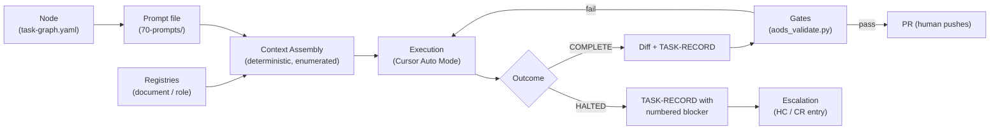
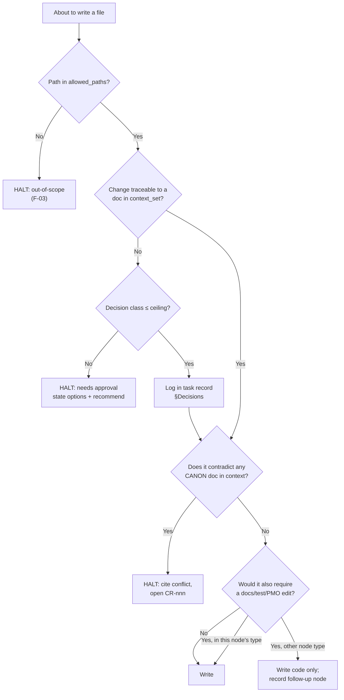

# AI Execution Model

**Document ID:** `AODS-EXEC`
**Status:** Proposed
**Version:** 0.1.0
**Date:** 2026-07-29
**Companions:** [`CURSOR-AUTO-MODE-STRATEGY.md`](CURSOR-AUTO-MODE-STRATEGY.md) · [`CONTEXT-MANAGEMENT.md`](CONTEXT-MANAGEMENT.md) · [`MODEL-CAPABILITY-STRATEGY.md`](MODEL-CAPABILITY-STRATEGY.md)

---

## 1. The execution unit

The atom of AI work in AODS is the **Task Execution**: exactly one prompt file, executed once, against one base
commit, producing one diff and one task record.



**There is no third outcome.** `PARTIAL` is forbidden (charter S-09). A task that cannot finish must halt with a
blocker, because a partial diff with a confident summary is the single most expensive failure mode in Auto Mode: it
looks like progress, merges, and is discovered weeks later.

### 1.1 Execution contract (every task, no exceptions)

| Field | Meaning | Source |
|-------|---------|--------|
| `node_id` | Which graph node this executes | `registry/task-graph.yaml` |
| `role` | Which bounded identity is acting | `registry/role-registry.yaml` |
| `base_commit` | Pinned SHA the work assumes | Recorded at start, not at end |
| `context_set` | Enumerated file paths, in load order | Prompt § Inputs |
| `forbidden_context` | Paths that must not be read | Prompt § Forbidden + registry `forbidden_context: true` |
| `allowed_paths` | Glob allow-list for writes | Node contract |
| `decision_ceiling` | Highest decision class permitted (`D0`–`D5`) | Role |
| `acceptance_criteria` | Objective, pre-declared | Node contract |
| `stop_conditions` | Enumerated halt triggers | Prompt § Stop |
| `output_contract` | Exact shape of the response | Prompt § Output |
| `reasoning_depth` | Budgeted thinking effort (§4) | Prompt header |
| `capability_class` | Model capability required (§ MODEL doc) | Prompt header |

Anything not in this contract is **not an input**. If the agent needs something absent from `context_set`, that is a
stop condition — not an invitation to search the repository. This is the difference between deterministic and
plausible.

---

## 2. Decision ceilings — what an agent may decide alone

An agent's authority is not "be careful"; it is a numbered ceiling. Full definitions live in
[`../30-roles/ROLE-ARCHITECTURE.md`](../30-roles/ROLE-ARCHITECTURE.md); the operational summary:

| Level | Decision class | Example | Who may |
|-------|----------------|---------|---------|
| `D0` | Mechanical, no judgement | Fix a broken relative link | Any AI role |
| `D1` | Local implementation choice inside a written spec | Loop vs comprehension; which existing helper to call | AI implementer |
| `D2` | Structural choice within one module, spec silent but not contradicted | Add a private helper function; choose a cache key shape | AI implementer, must log in task record |
| `D3` | Cross-module or contract-visible choice | New response field; new index; new dependency | **Human review required before merge** |
| `D4` | Changes a governing document's meaning | New ADR; new ID prefix; change coverage gate | **Architecture Board only** |
| `D5` | Irreversible or externally visible | Production data write; DNS; deploy; force-push | **Human hands on keyboard** (`HC-*`) |

**The ceiling rule.** When the required decision exceeds the role's ceiling, the agent halts and writes the decision
as a numbered question with options and a recommendation. It does **not** implement the recommendation. This is the
mechanical form of charter principle 7 ("AI proposes, human approves") — without it, "human-governed" degrades into
the human reading a summary of choices already merged.

### 2.1 Decision tree an agent runs before every write



---

## 3. Per-task specification — the twelve fields the user's brief requires

Every prompt file carries these. Below is the *semantics* of each field, with the failure it prevents. The literal
template is in [`../70-prompts/PROMPT-TEMPLATE.md`](../70-prompts/PROMPT-TEMPLATE.md).

### 3.1 Goal
One sentence, one responsibility, in the imperative, with a measurable end state.

- Good: *"Add `GET /api/v1/brands/{slug}` returning the brand-hub payload defined in `brand-hub-page-contract.md` §3."*
- Bad: *"Improve the brands API."* — unmeasurable; the agent will define "improved" for you.

**Prevents:** scope drift, unnecessary refactoring.

### 3.2 Context required
An **enumerated list of paths**, in load order, each with a reason and a read depth (`FULL` / `SECTION x` / `SKIM`).
Never "the relevant docs".

**Prevents:** context loss, incomplete understanding, and — critically — *non-determinism*, because an agent that
chooses its own context chooses differently on each run.

### 3.3 Context forbidden
Explicit deny-list. Always includes every registry entry with `forbidden_context: true` (today: `frontend/AI_CONTEXT.md`,
`frontend/BACKEND_NON_COMPLIANCE.md`, `frontend/BACKEND_HANDOFF.md`), plus per-task additions such as sibling
modules the task must not learn to imitate.

**Prevents:** hallucinated assumptions sourced from documents that are wrong but authoritative-sounding (`CR-015`).

### 3.4 Expected reasoning depth
One of the four budgets in §4. Declared, not inferred.

**Prevents:** both over-thinking mechanical tasks (cost, drift, "while I was here" refactors) and under-thinking
architectural ones.

### 3.5 Expected output
The exact artifact list and the exact response format. For code tasks: the diff plus the task record; for audit
tasks: a findings table with an evidence column and no recommendations section unless requested.

**Prevents:** unusable output that requires a follow-up conversation Auto Mode cannot have.

### 3.6 Validation
The runnable commands, verbatim, that the agent must execute before declaring completion, plus the expected exit
state. If the agent cannot run them, it says so in the task record rather than asserting they pass.

**Prevents:** skipped validation, and the "should pass" claim.

### 3.7 Escalation conditions
Numbered triggers with the destination for each (`HC-nn`, `CR-nnn`, or Board). See §5.

**Prevents:** guessing; silent scope expansion.

### 3.8 Recovery strategy
What to do after a failed attempt, and the **two-attempt rule**: attempt 1, then one alternative strategy, then halt
with both attempts documented. A third strategy is forbidden.

**Rationale:** attempt 3+ in a stateless agent is where "let me try a different architecture" is born. The cost of
halting is one human read; the cost of an unsupervised third strategy is an unreviewable diff.

### 3.9 Context size recommendations
Token budget per tier, from [`CONTEXT-MANAGEMENT.md`](CONTEXT-MANAGEMENT.md) §3.

**Prevents:** token overflow, and the silent mid-task truncation that causes an agent to forget the spec it read first.

### 3.10 Memory strategy
There is no memory. Continuity is achieved only by artifacts: the task record, the registries, and the repo. Any
prompt that says "as we discussed" is invalid by construction.

**Prevents:** repeated work and lost decisions across runs.

### 3.11 Prompt strategy
Which archetype (`AUD`/`SPEC`/`IMPL`/`TEST`/`KNOW`/`DOC`/`GOV`/`REL`), and the mandatory phase order:
`READ → RESTATE → PLAN → ACT → VERIFY → RECORD`.

**Prevents:** implementation before understanding (charter principle 9). The `RESTATE` block is the proof-of-reading
device: the agent must restate the governing constraint *in its own words with a citation* before it may edit.

### 3.12 Auto Mode considerations
Task-specific hazards, listed in [`CURSOR-AUTO-MODE-STRATEGY.md`](CURSOR-AUTO-MODE-STRATEGY.md) §2 and referenced
per prompt.

---

## 4. Reasoning-depth budgets

Depth is a declared resource. Mismatched depth is a real defect: shallow reasoning on an architecture task produces
plausible drift, and deep reasoning on a mechanical task produces unrequested "improvements".

| Budget | Use for | Instruction to agent | Ceiling |
|--------|---------|----------------------|---------|
| `R1 — Mechanical` | Link fixes, renames within allow-list, formatting, registry row additions | "Do not evaluate alternatives. Apply the stated change exactly." | `D0`–`D1` |
| `R2 — Bounded` | Implement a written spec; add tests for stated criteria | "Consider alternatives only where the spec is silent; log each in §Decisions." | `D1`–`D2` |
| `R3 — Analytical` | Audits, gap analysis, conflict detection, doc reconciliation | "Enumerate evidence before concluding. Every finding cites `path:line`. Distinguish observed from inferred." | `D2`, proposals only |
| `R4 — Architectural` | Specification authoring, ADR/RFC drafting, migration design | "Produce ≥2 options with trade-offs and a recommendation. Do not implement." | Proposal only; `D3`+ needs human |

**Hard rule:** `R4` tasks **never** produce code. Design and implementation in one execution destroys the review
point where a wrong design is cheapest to catch, and it is how architecture-first (principle 8) is lost in practice.

---

## 5. Escalation model

### 5.1 The five triggers

| # | Trigger | Action | Destination |
|---|---------|--------|-------------|
| E1 | Required context missing or unreadable | HALT before any write | Prompt author; possibly `CR-nnn` |
| E2 | Two authoritative documents conflict | HALT; write conflict entry with both citations | [`CONFLICT-REGISTER.md`](../10-repository-intelligence/CONFLICT-REGISTER.md) |
| E3 | Decision exceeds role ceiling | HALT; state options + recommendation | `HC-nn` or Board |
| E4 | Work needs a file outside `allowed_paths` | Complete what is in scope; record follow-up node | Task record § Discovered |
| E5 | Two attempts failed | HALT; document both attempts and the observed errors | Prompt author |

### 5.2 The halt format (mandatory, verbatim shape)

```
STATUS: HALTED
NODE: <node-id>
TRIGGER: <E1|E2|E3|E4|E5>
BLOCKER:
  1. <precise statement of what is unknown or conflicting>
     EVIDENCE: <path>:<line> says X; <path>:<line> says Y
     OPTIONS:
       A) <option> — consequence
       B) <option> — consequence
     RECOMMENDATION: <A|B> because <reason grounded in a cited authority>
     DECISION REQUIRED FROM: <role / HC-nn>
WORK COMPLETED BEFORE HALT: <files touched, or "none">
STATE OF REPOSITORY: <clean | uncommitted changes listed>
RESUME INSTRUCTIONS: <what a future stateless agent needs to continue>
```

`RESUME INSTRUCTIONS` is the field that makes halting cheap. Without it, every halt costs a fresh re-audit, and the
system's incentive quietly shifts toward guessing.

### 5.3 What escalation is *not*

It is not asking a question in prose and continuing anyway. If a prompt's output contains both a question and a diff
whose correctness depends on that question's answer, the execution is **non-compliant** and the reviewer rejects it
regardless of code quality. Enforcement: `--gate citation` plus reviewer checklist item in
[`../80-validation/VALIDATION-FRAMEWORK.md`](../80-validation/VALIDATION-FRAMEWORK.md).

---

## 6. Determinism protocol

Determinism cannot be achieved by asking the model to be consistent. It is achieved by removing degrees of freedom.

| Freedom removed | How | Residual non-determinism |
|-----------------|-----|--------------------------|
| Which files to read | `context_set` enumerated by path | Agent may still skim differently → mitigated by `RESTATE` |
| Which files to write | `allowed_paths` glob + `--gate allowlist` | None (mechanically checked) |
| What "done" means | Pre-declared acceptance criteria + gates | None for gated criteria; human-verified criteria remain judgement |
| What the base is | Pinned `base_commit` in the task record | None |
| Output shape | Output contract with named sections | Prose wording varies; structure does not |
| Model choice | Capability class, not model name | Different models satisfy the class differently → §MODEL doc §5 |
| Prompt wording | Prompt is a versioned file | None, if edits bump the version |

**Honest limit.** LLM sampling makes token-identical output unattainable. AODS targets **equivalence**, defined as:
same files touched, same acceptance criteria met, same gates green, same decisions logged. The quarterly determinism
spot-check (charter S-10) re-runs one archived task against its pinned base commit and diffs the *outcomes*, not the
text. Claiming byte-determinism here would be dishonest and would make the criterion untestable.

---

## 7. Idempotence and re-execution

Every task must be safe to re-run. Re-execution happens constantly — a halted task resumes, a gate fails and the
agent retries, a reviewer requests changes.

| Archetype | Idempotence requirement | Mechanism |
|-----------|------------------------|-----------|
| `AUD` | Trivially idempotent (read-only) | No writes permitted at all |
| `SPEC` / `DOC` | Re-running updates in place, never appends duplicates | Anchor by heading ID; check for existing section first |
| `IMPL` | Re-running on an already-applied change is a no-op | Check current state before editing; never blind-append |
| `TEST` | Test names are stable and deterministic | No random data; fixed seeds |
| `KNOW` | Ingestion is keyed by source checksum | Skip if checksum already recorded (`ADR-012`) |
| `GOV` | Registry mutations keyed by ID | Update the row, never add a second row for the same ID |
| `REL` | Never idempotent — deploys are `D5` | Human-executed only, never agent |

The `KNOW` requirement matters most: a non-idempotent catalog import that silently double-writes products is a data
defect that survives review, since the code looks correct.

---

## 8. Worked example — one node, fully specified

Node `IMPL-brand-hub-endpoint-001` from [`../registry/task-graph.yaml`](../registry/task-graph.yaml):

| Field | Value |
|-------|-------|
| Goal | Add `GET /api/v1/brands/{slug}` returning the payload in `brand-hub-page-contract.md` §3 |
| Role | `ROLE-BE-IMPL` (ceiling `D2`) |
| Capability class | `CODE-GEN` |
| Reasoning depth | `R2 — Bounded` |
| Context required | 1. `docs/architecture/rfc/RFC-005-brand-hub-launch.md` FULL · 2. `docs/architecture/adr/ADR-010-seo-url-contract.md` §3 · 3. `docs/ARCHITECTURE.md` §"Transaction ownership (BE-01)" · 4. `app/api/endpoints/brand.py` FULL · 5. `app/services/brand_service.py` FULL · 6. `docs/API_CONTRACT.md` §Brands |
| Context forbidden | `frontend/**` (this is a backend node); `frontend/AI_CONTEXT.md` (registry-forbidden); `docs/GO_LIVE_EXECUTION_PLAN.md` (`HISTORICAL`) |
| Allowed paths | `app/api/endpoints/brand.py`, `app/services/brand_service.py`, `app/schemas/brand.py` |
| Forbidden paths | `alembic/**`, `docs/**`, `frontend/**`, `scripts/**`, `.github/**` |
| Acceptance criteria | Endpoint returns 200 with the §3 field set; 404 for unknown slug; response validates against the schema; `commit`/`rollback` stays in the endpoint per BE-01; `openapi/v1.json` regenerated by the paired `DOC` node, not this one |
| Gates | `ruff`, `mypy`, `pytest -m "not slow"`, `--gate allowlist`, `--gate citation` |
| Stop conditions | RFC-005 not `Accepted` in Canon Lock on the merge base → HALT `CR-001`; §3 payload underspecified → HALT `E1`; requires a DB migration → HALT `E4` (that is a separate `IMPL` node) |
| Blocked by | `CR-001` (RFC-005 is not on `main`) |

**This node cannot legally execute today.** RFC-005 lives only on the unmerged Canon Lock branch, so the citation
gate would fail on the merge base. That is the system working: the blocker was found before a developer wrote code
against a specification that no reviewer could open. The unblock path is `HC-02` → merge PR #125 → `CR-001` closed.

---

## 9. Anti-pattern catalogue

Each is an observed Auto Mode failure with its mechanical countermeasure. Prose warnings do not work; only the
right-hand column does.

| Anti-pattern | Countermeasure |
|--------------|----------------|
| "While I was there I also fixed…" | `allowed_paths` + `--gate allowlist` blocks the merge |
| Inventing a requirement to fill a spec gap | `RESTATE` phase must cite `path:line` for each requirement; uncited requirement = rejection |
| Rewriting working code to a preferred style | `R1`/`R2` depth instruction forbids unrequested alternatives; PR line budget (≤400) makes it visible |
| Declaring success without running gates | Task record § Gate results must contain real command output; empty = rejection |
| Reading a stale doc and trusting it | `forbidden_context` list + authority class in every registry row |
| Losing the spec after a long file read | Load order puts governing docs **last** before action (recency), and `RESTATE` re-anchors them |
| Fabricating a citation | `--gate citation` resolves every cited path on the merge base |
| Producing 3,000-line PRs | Node atomicity + line budget → split into nodes |
| Silently changing a public contract | `D3` ceiling; `--gate openapi` detects snapshot drift |
| Re-doing completed work | Task records are searchable by node ID; `DONE.md` is authoritative for completion |

---

## 10. Open issues

| ID | Issue | Needs |
|----|-------|-------|
| `OI-X1` | Cursor Auto Mode selects the model; the capability class is advisory, not enforceable from inside a prompt. | Board decision on whether critical `R4` work must be run in a pinned-model mode instead of Auto. Recorded in [`MODEL-CAPABILITY-STRATEGY.md`](MODEL-CAPABILITY-STRATEGY.md) §5. |
| `OI-X2` | `--gate allowlist` compares the diff to the node's declared paths, but nothing forces a node record to exist for ad-hoc human commits. | Decide whether AODS applies to human-authored commits or only agent-executed ones. Recommendation: agent-executed only at adoption, widened after Wave A2. |
| `OI-X3` | The two-attempt rule is unenforceable mechanically (attempts are not observable post hoc). | Accept as an honesty-dependent control; reviewers spot-check task records for an `Attempts` section. |
