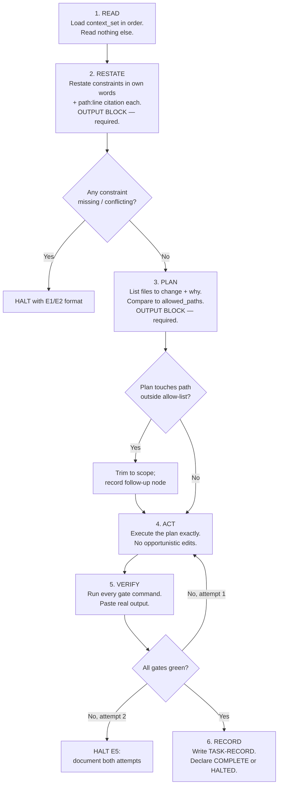

# Cursor Auto Mode Strategy

**Document ID:** `AODS-AUTOMODE`
**Status:** **Accepted**
**Version:** 1.0.0
**Date:** 2026-07-29
**Governing constraint:** All development on this repository is executed in Cursor Auto Mode.

---

## 1. The operating assumption

Auto Mode is treated as a **fire-and-forget worker with amnesia**, not an assistant. Design consequences:

| Assumption | Design consequence |
|------------|-------------------|
| No conversation memory | Every prompt is a complete brief. No prompt may reference a previous prompt's output except by **file path**. |
| No interactive correction | There is no "no, not that file". Wrong scope must be impossible, not discouraged. |
| No supervision during execution | Damage prevention must be pre-declared (allow-lists), not reactive. |
| Model may change between runs | Never depend on a specific model's behaviour; depend on capability classes and explicit instructions. |
| Context window is finite and silently truncates | Context is budgeted and ordered; the most load-bearing content is placed where truncation cannot reach it. |
| The agent will read files not in the brief if it can | Forbidden-context lists must name the hazards explicitly, because "don't read irrelevant files" is not actionable. |
| The agent optimises for appearing complete | Completion must be defined by external gates, never by self-assessment. |

The last row is the most important. An Auto Mode agent's reward surface is *producing a confident, finished-looking
response*. Every control below exists to make "finished-looking" and "actually finished" the same thing.

---

## 2. Weakness → countermeasure matrix

The user's brief names sixteen Auto Mode weaknesses. Each maps to at least one **mechanical** control. A control is
mechanical if a command or a diff can prove it was honoured; anything else is marked *Behavioural* and treated as
weaker.

| # | Weakness | Primary countermeasure | Kind | Enforced by |
|---|----------|------------------------|------|-------------|
| W1 | **Context loss** | Enumerated `context_set` with load order; governing docs loaded last; `RESTATE` block re-anchors before action | Behavioural + reviewable | Prompt template; reviewer checks `RESTATE` citations |
| W2 | **Accidental file modifications** | `allowed_paths` allow-list per node; diff compared to it | **Mechanical** | `--gate allowlist` |
| W3 | **Hallucinated assumptions** | Every requirement in `RESTATE` must carry `path:line`; uncited requirement = rejection; `Assumptions` section in task record expected to be empty | **Mechanical** (citation resolution) | `--gate citation` |
| W4 | **Unnecessary refactoring** | Reasoning-depth budget `R1`/`R2` forbids unrequested alternatives; PR budget ≤400 lines / ≤15 files | Mechanical (budget) | Reviewer + PR size check |
| W5 | **Uncontrolled code generation** | One node = one concern; `IMPL` may not create new modules without a spec citation | Mechanical (allow-list) | `--gate allowlist` |
| W6 | **Editing unrelated files** | Same as W2, plus node-type path defaults (`IMPL` cannot touch `docs/**`) | **Mechanical** | `--gate allowlist` |
| W7 | **Dependency drift** | New dependency is a `D3` decision → halt for human; lockfiles in allow-list only for dedicated nodes | Mechanical (path + ceiling) | `--gate allowlist`; reviewer |
| W8 | **Architecture drift** | `ARCH-GATE`: no `IMPL` node executes unless its governing ADR/RFC is `Accepted` **and resolves on the merge base** | **Mechanical** | `--gate citation`; registry `on_main` field |
| W9 | **Repeated work** | Task records are indexed by node ID; `DONE.md` is authoritative; audit nodes must check for a prior record first | Behavioural + searchable | Task record index |
| W10 | **Hidden side effects** | Task record § "Files actually changed" with conformance verdict; § "Discovered but NOT fixed" | **Mechanical** (diff-derived) | `--gate allowlist` |
| W11 | **Token limitations** | Tiered context budgets; summary artifacts substitute for large docs; hard rule against loading >2 large documents in one task | Behavioural + budgeted | [`CONTEXT-MANAGEMENT.md`](CONTEXT-MANAGEMENT.md) |
| W12 | **Incomplete understanding** | Mandatory `READ → RESTATE` phases before any write; halt trigger `E1` on missing context | Behavioural, reviewable | Reviewer checklist |
| W13 | **Skipped validation** | Gate commands are printed verbatim in the prompt; task record must contain real output; "should pass" is a rejection phrase | **Mechanical** | Reviewer + CI re-runs gates |
| W14 | **Skipped testing** | `TEST` is a separate node with its own acceptance criteria; coverage gate in CI | **Mechanical** | `pytest --cov` threshold |
| W15 | **Skipped documentation** | `DOC` is a separate node; `openapi` snapshot gate catches undocumented API change | **Mechanical** | `--gate openapi` |
| W16 | **Repository corruption** | No agent pushes, merges, or deploys (charter invariant #6); `D5` actions are human-only | **Mechanical** (platform + policy) | `git-development-workflow.md` §6 |

**Design principle behind the matrix:** prefer a control that fails the build over a control that asks the agent to
be careful. Ten of sixteen weaknesses have a mechanical control; the remaining six are honestly labelled behavioural,
and reviewers are told exactly what to look for rather than being told to "review carefully".

---

## 3. The six-phase execution protocol

Every prompt enforces this order. The phases exist because Auto Mode's natural behaviour is to jump straight to
editing, and because each phase produces an artifact a reviewer can check *without re-doing the work*.



### 3.1 Why `RESTATE` is non-negotiable

`RESTATE` is the cheapest available detector of the two most expensive failures: reading the wrong document, and
inventing a requirement. It costs the agent ~150 tokens and gives the reviewer a 20-second check.

Required shape:

```
## RESTATE
Governing authority for this task:
  - RFC-005 (docs/architecture/rfc/RFC-005-brand-hub-launch.md:30) — Brand Hub pages at
    /brands/{slug} with SEO meta exposure via API and internal linking from PDP/category;
    no Facts, dual-write, or Knowledge Graph tables. Unbranded products (288) stay valid
    without a fake "Generic" brand.        [resolves on merge base: YES/NO]
  - ADR-010 §Decision, rules 1 and 4 (docs/architecture/adr/ADR-010-seo-url-contract.md:64,
    :67) — canonical product path is singular /product/{slug}; brand hubs MUST use
    /brands/{slug}.
Constraints I must not violate:
  - BE-01 (docs/ARCHITECTURE.md:57) — HTTP endpoint handlers own commit/rollback; services
    and CRUD flush only, unless a documented exception applies.
What is NOT specified and I will therefore NOT invent:
  - Sort order of the category list. (Halting? No — spec silent, D2 choice, logged.)
```

> **These are real citations, checked against the documents on `docs/wave1-canon-lock-promote`.** An earlier draft
> of this example carried plausible-looking line numbers that pointed at a "Cons:" bullet and a blank line. That is
> the exact defect `RESTATE` exists to catch, and shipping it inside the template would have taught every future
> agent that approximate citations are acceptable. Line numbers in examples get checked like any other claim.

The `[resolves on merge base: NO]` case is a **hard stop**. That single field is the control whose absence produced
`CR-001`: PR #127 merged citing `CANON-LOCK.md`, which existed only on an unmerged branch. No human noticed, because
nothing asked the question.

### 3.2 Why `PLAN` is a separate output block

The plan is compared to the allow-list *before* any write. It converts W2/W6 from a post-hoc diff review into a
pre-flight check, and it gives the reviewer intent to compare against outcome — a diff alone cannot reveal that the
agent originally intended something different and got lost.

---

## 4. The prompt preamble (verbatim, every prompt)

This block is prepended by [`../70-prompts/PROMPT-TEMPLATE.md`](../70-prompts/PROMPT-TEMPLATE.md). It is written in
the imperative with explicit prohibitions, because Auto Mode reliably honours enumerated prohibitions and reliably
ignores tonal hints like "please be careful".

```markdown
## AUTO MODE PROTOCOL — READ FIRST, OBEY EXACTLY

You are executing a single AODS node in Cursor Auto Mode. You have no memory of prior
sessions and there will be no follow-up conversation. This file is your entire brief.

HARD PROHIBITIONS (violating any one makes your output non-compliant and it will be discarded):
1. Do NOT modify, create, or delete any file outside ALLOWED PATHS below.
2. Do NOT read any file listed under FORBIDDEN CONTEXT.
3. Do NOT refactor, reformat, rename, or "clean up" anything not required by the GOAL.
4. Do NOT add, remove, or upgrade any dependency. That is a D3 decision — HALT instead.
5. Do NOT run git push, git merge, git rebase, git reset --hard, or any deploy command.
6. Do NOT invent a requirement. Every requirement you implement must be citable as path:line.
7. Do NOT claim a command passed without pasting its actual output.
8. Do NOT continue past a STOP CONDITION. Halting is a successful outcome.
9. Do NOT change a public contract (API response, DB schema, URL) unless the GOAL says so.
10. Do NOT attempt a third strategy. Two attempts, then HALT.

REQUIRED PHASE ORDER: READ → RESTATE → PLAN → ACT → VERIFY → RECORD.
You MUST emit the RESTATE and PLAN blocks before your first edit.

IF ANYTHING IS UNCLEAR: halt using the HALT FORMAT. Do not guess. Do not pick the most
likely interpretation. An unclear specification is a defect in the specification, and
reporting it is the highest-value thing you can do in this run.
```

### 4.1 Rationale for each prohibition

| # | Targets | Why phrased this way |
|---|---------|----------------------|
| 1 | W2, W6 | Names a data structure (`ALLOWED PATHS`) the agent can mechanically check, not a judgement call |
| 2 | W3 | Reading `AI_CONTEXT.md` is the single highest-probability hallucination source in this repo (`CR-015`) |
| 3 | W4 | Lists the four specific verbs; "don't refactor" alone is read as permitting "reorganise" |
| 4 | W7 | Dependency changes are invisible in review and break CI on a different machine |
| 5 | W16 | Enumerates the destructive commands; a general "be careful with git" is not actionable |
| 6 | W3 | Ties requirements to a verifiable artifact, so hallucination becomes detectable |
| 7 | W13 | Removes the "should pass" escape hatch |
| 8 | Fail-safe | States explicitly that halting is success — otherwise the agent treats halting as failure and pushes on |
| 9 | W8 | Public contracts are where drift is expensive and slow to detect |
| 10 | W4, W5 | Bounds the blast radius of confusion |

---

## 5. Context-truncation defence

Auto Mode truncates silently. Two properties follow:

1. **Order matters more than volume.** Content near the end of the assembled context survives and dominates.
2. **The agent will not tell you it lost something.** So the prompt must make loss *detectable*.

Defences:

| Defence | Mechanism |
|---------|-----------|
| Governing docs load **last** | Specification text sits closest to the action, defeating recency bias against it |
| `RESTATE` before action | If the spec was truncated, the restatement is visibly wrong or empty → reviewer catches it |
| Section-scoped reads | `docs/ARCHITECTURE.md §"Transaction ownership (BE-01)"` instead of the whole file |
| Summary artifacts | Large docs get a committed `*-SUMMARY.md` used in place of the original for context (see [`CONTEXT-MANAGEMENT.md`](CONTEXT-MANAGEMENT.md) §5) |
| Two-large-document ceiling | Never load more than two >1,000-line documents in one task; split the node instead |
| Constraint repetition | The 3–5 constraints that must not be violated are repeated in the prompt body *and* required in `RESTATE` |

Constraint repetition is deliberate redundancy. It costs tokens and buys the property that a truncation event has to
destroy two separated copies before the constraint is lost.

---

## 6. Cursor rules as the always-on layer

Prompts cover tasks. Cursor **rules** cover everything else — including the case where the operator types an ad-hoc
request instead of using a prompt file, which will happen. AODS ships two rules:

| Rule file | Trigger | Purpose |
|-----------|---------|---------|
| `.cursor/rules/aods-auto-mode.mdc` | `alwaysApply: true` | Minimal always-on safety floor: forbidden-context list, no-push rule, halt-instead-of-guess, authority precedence pointer |
| `.cursor/rules/aods-node-execution.mdc` | Glob-scoped to `aods/**` | Rules for editing AODS itself (registry sync, status honesty, append-only conflict register) |

**Design constraint: the always-on rule must be short.** It is prepended to every request in the repository; a
2,000-line rule would consume the budget it is trying to protect. It therefore contains only prohibitions that are
(a) cheap to state and (b) catastrophic to violate — and it *points* to the full documents rather than restating them.

The existing `pmo-living-system.mdc` rule stays untouched. It is currently the repository's only always-on control,
and modifying it is a `D4` decision belonging to the PMO owner — plus it is entangled with the unresolved `CR-007`
question of which PMO path is canonical.

---

## 7. Failure-injection tests for the protocol

The controls must themselves be tested; a gate nobody has seen fail is a gate nobody knows works. Each is a cheap,
repeatable exercise run once per wave.

| Test | Method | Expected result |
|------|--------|-----------------|
| `FI-1` Out-of-scope edit | Run an `IMPL` prompt whose spec tempts an edit to `docs/` | `--gate allowlist` fails; PR blocked |
| `FI-2` Fabricated citation | Hand-edit a task record to cite `docs/architecture/adr/ADR-011-*.md` (does not exist) | `--gate citation` fails |
| `FI-3` Forbidden context | Prompt that names `frontend/AI_CONTEXT.md` in context | `--gate prompts` fails on the prompt file |
| `FI-4` Unmerged authority | Cite a document present only on a feature branch | `--gate citation` fails on merge base — the `CR-001` regression test |
| `FI-5` Broken link | Add a link to a moved doc | `--gate links` fails |
| `FI-6` PMO divergence | Set a task to `done` in `tasks.json` only | `--gate pmo` fails |
| `FI-7` OpenAPI drift | Add a route without regenerating the snapshot | `--gate openapi` fails |

`FI-4` is the acceptance test for the whole design: it is the exact failure that already happened in this repository
and went undetected through a merge.

---

## 8. What Auto Mode is *not* allowed to be used for

| Activity | Why not | Who does it |
|----------|---------|-------------|
| Accepting a document / setting `Accepted` | Board authority; self-acceptance is non-compliant per `documentation-citation-rules.md` | Architecture Board minute |
| Production data writes or imports | `D5`, irreversible; `ADR-012` bans production defaults | Human, `HC-09` |
| Deployment or DNS changes | `D5` | Human, `HC-11` |
| `git push` / merge / rebase | `git-development-workflow.md` §6 | Human, `HC-06` |
| Re-scoring an audit | Self-certification is not evidence (`CR-006`) | Independent audit generation |
| Resolving a conflict register entry | Conflicts require a human decision by construction | Named owner, `HC-03` |
| Choosing between two authoritative docs | The whole point of the conflict register | Board |
| Deleting any document | Supersession only, never deletion | Human, with registry row |

---

## 9. Open issues

| ID | Issue | Needs |
|----|-------|-------|
| `OI-A1` | Cursor may not expose which model served a given Auto Mode run, so capability-class compliance cannot be audited from the repository. | Decide whether high-risk `R4` nodes must be run with an explicitly pinned model outside Auto Mode. |
| `OI-A2` | Nothing prevents an operator from pasting an ad-hoc request rather than executing a prompt file. The always-on rule is the only control, and it is advisory. | Accept as residual risk `R-014`; mitigate by making prompt files genuinely easier to use than ad-hoc typing. |
| `OI-A3` | `--gate allowlist` needs the node ID to know the allow-list; if the operator omits it, the gate silently passes. | Make node ID a required PR-body field so the citation gate fails when it is absent. Pending `CR-018` (PR template does not exist yet). |
