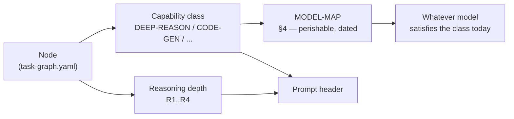
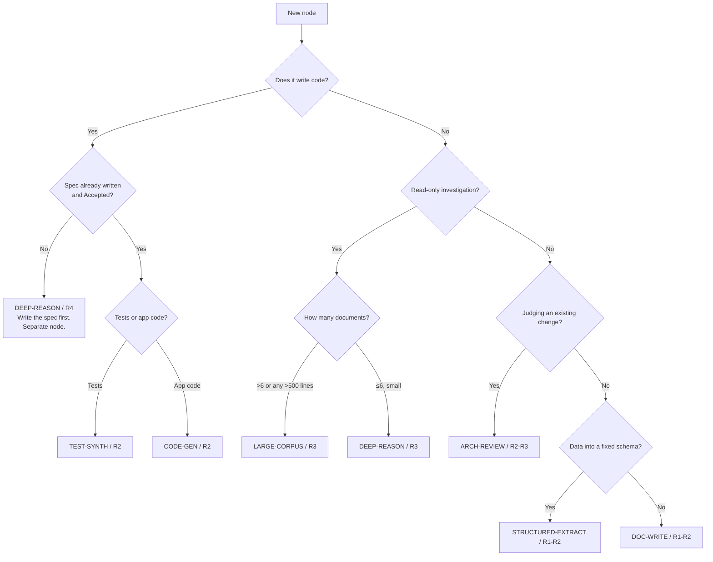

# AI Model Capability Strategy

**Document ID:** `AODS-MODELS`
**Status:** **Accepted**
**Version:** 1.0.0
**Date:** 2026-07-29
**Design rule:** The system binds to **capability classes**, never to model names. Model names appear only in one
table (§4), which is explicitly labelled perishable.

---

## 1. Why capability classes instead of model names

A model name hardcoded into a workflow is a dependency on a vendor's release calendar. Within a year, the named model
is deprecated, renamed, or superseded, and every prompt referencing it is subtly wrong — while still executing, which
is worse than failing.

AODS therefore defines **what a task needs from a model**, and keeps the mapping to actual models in a single,
dated, replaceable table. Replacing a model is then a one-row edit with no redesign.

---

## 2. The capability classes

Seven classes cover all AODS work. Each states the demand it places on a model, and — importantly — what it does
**not** need, because over-provisioning is a real cost and a real risk (a deep-reasoning model on a mechanical task
invents improvements).

| Class | Demand | Does not need | Used by |
|-------|--------|---------------|---------|
| `DEEP-REASON` | Multi-constraint reasoning; holding contradictory sources; trade-off analysis; producing options with consequences | Speed; large context | `SPEC`, ADR/RFC drafting, `R4` nodes, conflict analysis |
| `LARGE-CORPUS` | Very large context; recall across many documents; cross-document contradiction detection | Deep novel reasoning | `AUD` nodes, doc reconciliation, repository audits |
| `ARCH-REVIEW` | Judging a change against stated architecture; detecting drift; adversarial reading of a diff | Code authoring | Review nodes, `ARCH-GATE` assistance |
| `CODE-GEN` | Idiomatic code in Python/FastAPI/SQLAlchemy and TypeScript/React/Next.js; following an existing codebase's conventions | Long-horizon planning | `IMPL` nodes |
| `STRUCTURED-EXTRACT` | Reliable extraction into a fixed schema; high precision; low invention; deterministic formatting | Creativity | `KNOW` nodes (catalog/spec extraction), OpenAPI/registry work |
| `TEST-SYNTH` | Deriving edge cases from a specification; producing runnable tests; reasoning about failure modes | Prose quality | `TEST` nodes |
| `DOC-WRITE` | Clear technical prose; consistent terminology; bilingual (Persian/English) handling | Deep reasoning | `DOC` nodes, changelogs, summaries |

### 2.1 Class → reasoning-depth compatibility

| Class | `R1` | `R2` | `R3` | `R4` |
|-------|:----:|:----:|:----:|:----:|
| `DEEP-REASON` | ✗ over-provisioned | ✗ | ✓ | ✓ |
| `LARGE-CORPUS` | ✗ | ✓ | ✓ | ✓ |
| `ARCH-REVIEW` | ✗ | ✓ | ✓ | ✓ |
| `CODE-GEN` | ✓ | ✓ | ✗ under-provisioned | ✗ forbidden (design ≠ code) |
| `STRUCTURED-EXTRACT` | ✓ | ✓ | ✗ | ✗ |
| `TEST-SYNTH` | ✓ | ✓ | ✓ | ✗ |
| `DOC-WRITE` | ✓ | ✓ | ✗ | ✗ |

The `CODE-GEN × R4 = forbidden` cell restates a hard rule from
[`AI-EXECUTION-MODEL.md`](AI-EXECUTION-MODEL.md) §4: architectural reasoning and code production never occur in one
execution, regardless of how capable the model is. Capability is not the constraint there; **reviewability** is.

---

## 3. Class selection decision tree

---

## 4. Current model map — **PERISHABLE, dated 2026-07-29**

> **This is the only table in AODS containing model names.** It is expected to be wrong within months. Editing it is
> a `D1` decision requiring no Board approval, precisely so that keeping it current is frictionless. Nothing else in
> AODS may reference a model name; if you find one elsewhere, that is a defect.

| Class | Preferred | Acceptable alternative | Selection reason |
|-------|-----------|------------------------|------------------|
| `DEEP-REASON` | Claude Opus 5 (extended thinking) | GPT-5.5 (high reasoning); Gemini 3 Pro | Sustained multi-constraint reasoning and willingness to state trade-offs rather than resolve them prematurely |
| `LARGE-CORPUS` | Gemini 3 Pro (largest context) | Claude Opus 5; GPT-5.5 | Whole-corpus recall across ~149 markdown files without chunking |
| `ARCH-REVIEW` | Claude Opus 5 | GPT-5.5 | Adversarial diff reading; catches "plausible but drifting" |
| `CODE-GEN` | Claude Sonnet 4.6 / Composer-class | GPT-5.5; Claude Opus 5 | Convention-following and speed matter more than novel reasoning; cost efficiency at `R2` |
| `STRUCTURED-EXTRACT` | GPT-5.5 (structured outputs) | Claude Sonnet 4.6 | Schema adherence and low invention rate |
| `TEST-SYNTH` | Claude Opus 5 | GPT-5.5 | Edge-case derivation from specification text |
| `DOC-WRITE` | Claude Sonnet 4.6 | GPT-5.5; Gemini 3 Pro | Consistent terminology; adequate Persian/English handling |

### 4.1 Non-negotiable caveat about Auto Mode

**In Cursor Auto Mode, the operator does not choose the model — Cursor does.** Therefore:

- The capability class in a prompt header is **advisory**: it documents what the task needs, so that a mismatch can
  be reasoned about after the fact and so the prompt is portable to non-Auto execution.
- AODS compensates for an unknown model by making prompts **model-independent**: explicit prohibitions, enumerated
  context, pre-declared acceptance criteria, and mechanical gates. A weaker-than-ideal model then produces a *gate
  failure*, not a silent quality regression. This is the whole reason the gates exist rather than trusting capability.
- For the small number of nodes where a capability shortfall would be **expensive and hard to detect** — `R4`
  specification authoring, migration design, security-relevant review — the recommendation is to execute **outside
  Auto Mode with a pinned model**. This is `OI-M1`, a Board decision, because it contradicts the project's
  "everything in Auto Mode" constraint and only the owner can make that trade.

---

## 5. Model-independence requirements

A prompt is model-independent if it satisfies all of these. `--gate prompts` checks the mechanical subset.

| # | Requirement | Checkable |
|---|-------------|-----------|
| M-01 | No model name appears in the prompt body | Yes — regex |
| M-02 | No reliance on a specific model's tool-calling style or output quirks | No — review |
| M-03 | Output contract is explicit enough that any competent model produces the same structure | Partially — section presence |
| M-04 | Acceptance criteria are external commands, not "the model should understand" | Yes — commands present |
| M-05 | Context is enumerated, so a model with a smaller window fails loudly (truncation → wrong `RESTATE`) rather than quietly | Yes — context set present |
| M-06 | Reasoning depth is stated, so a model that reasons less produces a visibly thinner `PLAN` | Yes — header field |
| M-07 | No dependence on a specific context-window size | Yes — budgets are shares, not tokens |

---

## 6. Substituting a model

The procedure exists so that a model swap is a routine maintenance act, not a project event.

1. Identify the class(es) the outgoing model served (§4).
2. For each class, run the **capability probe** (§6.1) with the candidate model.
3. Record results in `aods/reports/model-probes/<YYYY-MM-DD>-<candidate>.md`.
4. Update the §4 row, with the date and a one-line reason.
5. Do **not** modify any prompt. If a prompt needs modification to work with the new model, the prompt violates
   §5 and the prompt is the defect.

### 6.1 Capability probes

Each probe is a real task from this repository with a known-correct answer, so the probe measures fitness rather than
vibes.

| Class | Probe | Pass condition |
|-------|-------|----------------|
| `DEEP-REASON` | Given `docs/API_CHANGELOG.md`, `docs/TESTING.md`, `README.md`, `pyproject.toml`, and `.github/workflows/backend-ci.yml`, report the coverage-gate value | Reports **all differing values** (62% / 67% / 67%–70% / 68% / 68%), names 68% as the *enforced* one, and flags the conflict rather than picking one (`CR-003`) |
| `LARGE-CORPUS` | Given the full `docs/` tree, list every document that claims to be a source of truth | Finds ≥5, including the mutually exclusive claims |
| `ARCH-REVIEW` | Given a diff where a service calls `db.commit()`, judge against `docs/ARCHITECTURE.md` §BE-01 | Flags the violation and cites line 57 |
| `CODE-GEN` | Add a trivial read-only endpoint following existing `app/api/endpoints/` conventions | `ruff` + `mypy` clean; no new dependency; allow-list respected |
| `STRUCTURED-EXTRACT` | Extract 10 product specs from a vendor page into the catalog schema | 100% schema-valid; zero invented fields |
| `TEST-SYNTH` | Given a specification section, produce tests for stated criteria | Covers every stated criterion; no test asserts unspecified behaviour |
| `DOC-WRITE` | Write an `API_CHANGELOG.md` entry for a known past change | Matches the file's existing entry format exactly |

The `DEEP-REASON` probe is deliberately a **conflict-detection** test rather than a reasoning-puzzle test. The most
valuable model behaviour in this repository is refusing to resolve an ambiguity silently; a model that picks 67% and
moves on fails, no matter how elegantly it writes code.

---

## 7. Cost and escalation policy

| Node class | Default provisioning | Escalate to a stronger class when |
|------------|---------------------|-----------------------------------|
| `R1` mechanical | Cheapest adequate | Never — escalation *causes* drift here |
| `R2` bounded implementation | Mid-tier | Two attempts failed for reasons of comprehension, not environment |
| `R3` analytical | Strong | Findings contradict each other, or evidence citations do not resolve |
| `R4` architectural | Strongest available | Always start strongest; this is where a mistake is most expensive |

**Escalation is not a retry.** A retry with a stronger model still counts against the two-attempt rule; the third
strategy remains forbidden. Otherwise "escalate" becomes an unbounded loop with a budget attached.

---

## 8. Open issues

| ID | Issue | Needs |
|----|-------|-------|
| `OI-M1` | Auto Mode prevents deliberate model selection, so capability classes cannot be enforced. High-risk `R4` nodes may warrant pinned-model execution outside Auto Mode. | **Board decision.** Trade-off: pinning contradicts the stated project constraint; not pinning accepts undetectable capability shortfall on the highest-consequence nodes. |
| `OI-M2` | The §4 map is judgement-based; no probe results exist yet for this repository. | Run §6.1 probes once, record under `aods/reports/model-probes/`. Until then, treat §4 as a starting hypothesis, not evidence. |
| `OI-M3` | Persian-language quality across models is unmeasured, yet the storefront is Persian-first and SEO work depends on it. | Add a Persian `DOC-WRITE` probe with a native-speaker rubric. Requires the owner, who is the only Persian reviewer. |
| `OI-M4` | Cursor may not report which model served a run, so post-hoc mismatch analysis may be impossible. | Investigate whether the platform exposes this; if not, record as accepted residual risk. |
