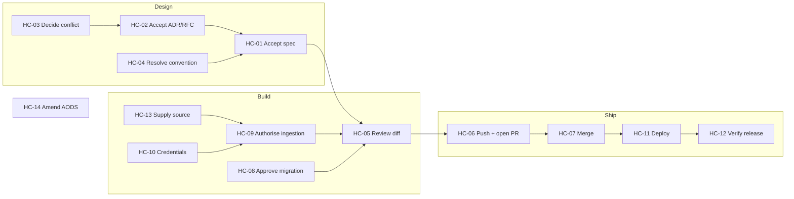

# Human Intervention Model

**Document ID:** `AODS-HUMAN`
**Status:** **Accepted**
**Version:** 1.0.0
**Date:** 2026-07-29
**Rule of this document:** the phrase *"human reviews"* is banned. Every checkpoint lists the literal actions,
commands, and pass/fail conditions. If a step cannot be written as an observable action, it is not a checkpoint.

---

## 1. Why this document is written this way

"Human reviews the architecture" is not a control — it is a hope. It cannot be audited, cannot be delegated, cannot
be performed consistently, and its completion cannot be distinguished from its omission. That distinction matters
here: charter failure criterion **F-08** ("checkpoint recorded as done without the operator performing the listed
steps") is classified *Critical*, because a checkpoint that is ticked without being performed is worse than no
checkpoint — it manufactures false assurance.

So each checkpoint below specifies:

| Element | Purpose |
|---------|---------|
| **Trigger** | The exact event that opens the checkpoint |
| **Who** | The human role (in this project, almost always the owner) |
| **Preconditions** | What must already be true; if not, the checkpoint is not yet open |
| **Steps** | Numbered, literal actions — commands to type, values to compare, files to open |
| **Pass condition** | Objectively checkable |
| **Fail action** | What to do instead of approving |
| **Evidence** | What gets recorded, and where |
| **Time cost** | Honest estimate, so the checkpoint is not skipped for being of unknown length |

### 1.1 The single-operator reality

This project has **one human** (Mohammad Shebahati) who is simultaneously owner, Architecture Board, reviewer, and
release manager. Pretending otherwise would make the model fiction. AODS compensates with three devices rather than
with imaginary reviewers:

1. **Temporal separation** — the implementer (AI) and the approver (human) are different actors by construction, so
   "don't review your own code" is satisfied even with one person.
2. **Mechanical pre-checks** — gates run before the human looks, so human attention is spent on judgement, not on
   catching mechanical faults a script catches better.
3. **Evidence-before-opinion** — every checkpoint starts by *reading generated output*, not by forming an impression.

---

## 2. Checkpoint register

| ID | Name | Lifecycle stage | Blocking? | Typical cost |
|----|------|-----------------|-----------|--------------|
| `HC-01` | Accept a specification | L5 | **Blocking** | 15–30 min |
| `HC-02` | Accept a governing document (ADR/RFC/Canon row) | L4 | **Blocking** | 20–40 min |
| `HC-03` | Decide a conflict-register entry | Any | **Blocking** for dependents | 10–30 min |
| `HC-04` | Resolve a convention conflict | L2 | Blocking for affected nodes | 10 min |
| `HC-05` | Review an AI-produced diff | L12 | **Blocking** | 10–25 min |
| `HC-06` | Push a branch and open a PR | L12 | **Blocking** (agents cannot push) | 3 min |
| `HC-07` | Merge a PR | L14 | **Blocking** | 5 min |
| `HC-08` | Approve and apply a database migration | L11 | **Blocking** | 20–45 min |
| `HC-09` | Authorise a data ingestion run | L6 | **Blocking** | 10–20 min |
| `HC-10` | Provide credentials or secrets | Any | Blocking when required | 5–15 min |
| `HC-11` | Trigger a production deployment | L15 | **Blocking** | 10 min + verification |
| `HC-12` | Verify a release after deployment | L16 | **Blocking** | 15 min |
| `HC-13` | Supply an external source document (PDF/catalog) | L6 | Blocking for `KNOW` nodes | 5–20 min |
| `HC-14` | Accept or reject an AODS amendment | Governance | **Blocking** | 20 min |



---

## 3. The checkpoints

### `HC-01` — Accept a specification

**Trigger:** An `R4` `SPEC` node produced a specification and declared `STATUS: COMPLETE`.
**Who:** Owner, acting as Architecture Board.
**Preconditions:** `python3 aods/tools/aods_validate.py --gate links --gate registry` passes; the spec's governing
ADR/RFC is already `Accepted` (otherwise do `HC-02` first).

**Steps:**

1. Open the spec file in the editor. Read the **Acceptance Criteria** section first, before the prose.
2. For each acceptance criterion, ask out loud: *"Could a test fail this?"* If a criterion cannot fail a test, write
   `AMBIGUOUS` next to it in a PR comment. Any `AMBIGUOUS` mark = reject.
3. Open every document the spec cites. For each, confirm the cited section actually says what the spec claims. Type:

   ```bash
   git grep -n "<the phrase the spec attributes to the cited doc>" -- docs/
   ```

   If a citation cannot be located, the spec is rejected (fabricated citation).
4. Check the spec declares what it does **not** cover. A spec with no explicit non-goals is rejected — undefined
   scope is where implementation drift originates.
5. Confirm the "Open questions" section is either empty or every entry has an owner and a decision.
6. Decide: type one of these into the PR comment, verbatim:
   - `ACCEPTED as <SPEC-ID> v<version> — <YYYY-MM-DD>`
   - `REJECTED — <numbered reasons>`
7. If accepted, set the spec's front-matter `status: Accepted` **yourself** (an agent setting this is non-compliant
   per `docs/development/standards/documentation-citation-rules.md`), and add the row to
   `docs/architecture/CANON-LOCK.md` if it is binding.

**Pass condition:** Every acceptance criterion is test-falsifiable; every citation resolves; non-goals are stated.
**Fail action:** Comment `REJECTED` with numbered reasons; the `SPEC` node re-executes with those reasons as input.
**Evidence:** PR comment + front-matter change + Canon Lock row.

---

### `HC-02` — Accept a governing document (ADR / RFC / Canon Lock row)

**Trigger:** An ADR or RFC is drafted, or a document is proposed for `CANON` status.
**Who:** Owner, as Architecture Board. **No delegation, no AI.**
**Preconditions:** The document exists on a branch; the branch is pushed.

**Steps:**

1. Confirm the document is `Proposed`, not `Accepted`:

   ```bash
   git grep -n "^status:" -- <path-to-document>
   ```

   If it already says `Accepted` and you did not do it, that is a **compliance violation** — reject and record it.
2. Read the **Decision** section. Read the **Consequences** section. If "Consequences" is empty or generic, reject.
3. Read the **Alternatives considered** section. If fewer than two real alternatives with trade-offs, reject — a
   decision without alternatives is a preference.
4. Verify every referenced document exists on the target branch:

   ```bash
   python3 aods/tools/aods_validate.py --gate links
   ```

   Canon Lock currently references ≥7 documents that do not exist (`CR-010`); this step is what prevents adding more.
5. Check for contradiction with existing `CANON` documents. List them:

   ```bash
   python3 -c "import sys;sys.path.insert(0,'aods/tools');import aods_validate as v;[print(d['id'],d['path']) for d in v.load_registry()['documents'] if d.get('class')=='CANON']"
   ```

   Open each and confirm no clash. If one clashes, **stop** and open a conflict entry instead (`HC-03`).
6. Write the Board minute. Append to `docs/architecture/CANON-LOCK.md`:
   `| <ID> | <title> | Accepted | <YYYY-MM-DD> | <one-line rationale> |`
7. Set `status: Accepted` and `accepted_on: <YYYY-MM-DD>` in the document's front-matter.
8. Update the corresponding row in `aods/registry/document-registry.yaml`: `class: CANON`, `status: Accepted`,
   and — critically — `on_main: true` **only after the merge**, not before.

**Pass condition:** Decision + consequences + ≥2 alternatives present; all links resolve; no `CANON` contradiction.
**Fail action:** Comment with numbered reasons; document stays `Proposed`.
**Evidence:** Canon Lock row (this *is* the minute), front-matter, registry row.

> **Currently open instance.** `HC-02` for the Wave-1 Canon Lock pack (PR #125) is the highest-priority pending human
> action in the repository. Until it is done, PR #127 remains merged while citing a document absent from `main`
> (`CR-001`), and every `IMPL` node governed by ADR-010/RFC-004/RFC-005 is legitimately blocked.

---

### `HC-03` — Decide a conflict-register entry

**Trigger:** A `CR-nnn` entry has status `OPEN` and blocks a node.
**Who:** The named owner in the entry; for `BLOCKER` severity, the owner **and** the Board.

**Steps:**

1. Open `aods/10-repository-intelligence/CONFLICT-REGISTER.md` and find the entry.
2. Read the **Evidence** rows for both sides. Verify each independently — do not trust the register. For each cited
   path:line, run:

   ```bash
   sed -n '<line>p' <path>
   ```

   (Reading the file in the editor is equally valid; the point is to look at the actual line.)
3. Read the **Options** list. If none of the options is acceptable, write a new option `D)` yourself.
4. Read the **AI recommendation** — it is advisory only. You may ignore it without explanation.
5. Choose exactly one option. Write into the entry, verbatim:

   ```
   **DECISION (YYYY-MM-DD, <your name>):** Option <X>. <One sentence of rationale.>
   **Status:** RESOLVED
   **Follow-up node:** <NODE-ID or "none">
   ```
6. Do **not** delete the entry or edit the evidence. The register is append-only; history is the point.
7. If the decision changes a governing document's meaning, it is also a `D4` decision → also perform `HC-02`.
8. Update the entry's row in the summary table at the top of the register.

**Pass condition:** Exactly one option chosen, dated, signed, with a follow-up node or an explicit "none".
**Fail action:** `DEFERRED until <condition>` is a legitimate outcome — but then any node blocked by this conflict
stays blocked, and that consequence must be stated in the deferral.
**Evidence:** The register entry itself.

---

### `HC-04` — Resolve a convention conflict

**Trigger:** Two standards documents prescribe different conventions (today: branch naming, `CR-002`; PMO canonical
path, `CR-007`; coverage number, `CR-003`).
**Who:** Owner.

**Steps:**

1. Run the inventory command for the specific conflict. For branch naming:

   ```bash
   git branch -r --format='%(refname:short)' | sed 's|origin/||' | cut -d/ -f1 | sort | uniq -c | sort -rn
   ```

   For the coverage number:

   ```bash
   git grep -n -E "cov-fail-under|fail_under|coverage.*6[0-9]%|6[0-9]% coverage" -- pyproject.toml .github docs README.md
   ```
2. Look at the counts. Pick the convention with the most existing usage **unless** a `CANON` document says otherwise —
   in which case `CANON` wins and the existing usage is the defect.
3. Write the decision into the conflict entry (see `HC-03` step 5).
4. Update the losing document with a pointer to the winner. **Do not** mass-rename existing branches or files;
   a rename breaks inbound citations, and the benefit does not justify it.
5. If the convention is machine-checkable, add or enable the pattern in
   `aods/40-artifacts/NAMING-CONVENTIONS.md` §8, then run:

   ```bash
   python3 aods/tools/aods_validate.py --gate naming
   ```
6. If the gate now fails on pre-existing files, add them to the baseline rather than fixing them in this checkpoint:

   ```bash
   python3 aods/tools/aods_validate.py --gate naming --write-baseline
   ```

   Baselining is honest debt (it is dated and listed); silently disabling the gate is not.

**Pass condition:** One convention documented as canonical; the other document points to it; gate passes or is baselined.
**Fail action:** Defer, and mark the affected nodes blocked.
**Evidence:** Conflict entry + updated docs + baseline file if used.

---

### `HC-05` — Review an AI-produced diff

**Trigger:** An `IMPL`/`TEST`/`DOC` node reports `STATUS: COMPLETE`.
**Who:** Owner. **Never the agent that produced the diff.**
**Preconditions:** All automated gates green. If any gate is red, the checkpoint is not open — send it back.

**Steps:**

1. Read the task record **before** the diff:

   ```bash
   cat aods/reports/tasks/<NODE-ID>.md
   ```
2. Check the `Assumptions` section. **Expected content: none.** Every entry is a place where the agent invented
   something; each needs a citation or the diff is rejected.
3. Check `Files actually changed` against `Declared allow-list`. Verify mechanically rather than by eye:

   ```bash
   python3 aods/tools/aods_validate.py --gate allowlist --node <NODE-ID> --base <BASE-SHA>
   ```
4. Check `Gate results` contains **real command output**, not a claim. If you see "should pass", "presumably", or
   "tests would pass" — reject without reading further.
5. Now read the diff:

   ```bash
   git diff --stat <BASE-SHA>..HEAD
   git diff <BASE-SHA>..HEAD
   ```
6. Count: is the change ≤400 lines and ≤15 files? If not, and the task record does not justify it, reject as
   non-atomic.
7. For each changed hunk ask: *"Which line of which cited document requires this?"* If a hunk answers nothing,
   it is scope creep — reject that hunk.
8. Backend diffs only — verify the BE-01 transaction rule:

   ```bash
   git diff <BASE-SHA>..HEAD -- app/services app/crud | grep -n "commit()"
   ```

   Any `commit()` added in a service or CRUD layer violates `docs/ARCHITECTURE.md:57` → reject unless the diff cites
   a documented money-path exception.
9. API diffs only — verify the snapshot was regenerated:

   ```bash
   python3 aods/tools/aods_validate.py --gate openapi
   ```
10. Read the `Discovered but NOT fixed` section. For each item, confirm it has a follow-up node or a `CR-nnn`.
    Findings recorded here and then dropped are how the same problem gets rediscovered three times (`W9`).
11. Decide: approve, or comment with numbered required changes.

**Pass condition:** Steps 2, 3, 4, 6, 7 all clean; `Assumptions` empty or fully cited.
**Fail action:** Numbered comments; a new execution follows (not a continuation — see
[`../50-ai-execution/CONTEXT-MANAGEMENT.md`](../50-ai-execution/CONTEXT-MANAGEMENT.md) §8).
**Time cost:** 10–25 min. If it routinely takes longer, the nodes are too large — fix the graph, not the review.

---

### `HC-06` — Push a branch and open a PR

**Trigger:** `HC-05` passed.
**Who:** Owner. Agents **must not** push (`docs/development/git-development-workflow.md` §6).

**Steps:**

1. Confirm you are on the intended branch and nothing unexpected is staged:

   ```bash
   git status
   git branch --show-current
   ```
2. Confirm you are **not** on `main`:

   ```bash
   test "$(git branch --show-current)" != "main" && echo SAFE || echo "STOP — on main"
   ```
3. Review the commit list one final time:

   ```bash
   git log --oneline origin/main..HEAD
   ```
4. Push:

   ```bash
   git push -u origin "$(git branch --show-current)"
   ```
5. Open the PR. Body must contain, per `docs/development/standards/pr-checklist.md`:
   - `Node: <NODE-ID>`
   - `Task: <PMO-ID>` (or `Task: none — <reason>`)
   - `Authority:` with each governing document path
   - Gate output or a link to the run
6. Validate the PR body before submitting:

   ```bash
   python3 aods/tools/aods_validate.py --gate citation --pr-body /tmp/pr-body.md
   ```

   This is the gate that resolves each cited path **on the merge base** — the check whose absence caused `CR-001`.
7. Confirm CI started. If `lint`/`test` do not appear within 2 minutes, investigate before proceeding.

**Pass condition:** Branch pushed, PR open, citation gate green, CI running.
**Fail action:** If the citation gate fails, do not open the PR — fix the citation or open `HC-02` for the missing document.

---

### `HC-07` — Merge a PR

**Trigger:** CI green, `HC-05` passed, PR open.
**Who:** Owner only.

> **DANGER — read before every merge.** `deploy-staging.yml` triggers on **push to `main`** for paths `app/**`,
> `alembic/**` and others, and staging runs on the **same VPS as production** (`deploy-production.yml` header
> comment). **Merging to `main` deploys to the live public site.** There is no separate staging environment.
> This is `CR-011`, severity BLOCKER, and it is unresolved.

**Steps:**

1. Confirm all required checks are green in the PR UI. Do not merge with a pending check.
2. Ask explicitly: **does this diff touch `app/**`, `alembic/**`, `frontend/**`, or `requirements*.txt`?**

   ```bash
   git diff --name-only origin/main...HEAD | cut -d/ -f1 | sort -u
   ```
3. If **yes**, this merge will deploy to the live site. Then:
   a. Confirm a database backup exists from within the last 24 h (`scripts/backup_db.sh`).
   b. Confirm you can revert: note the current `main` SHA — `git rev-parse origin/main` — and save it.
   c. Confirm the time of day is acceptable for a live change.
   d. Only then continue.
4. If the diff includes an Alembic migration, **stop** and do `HC-08` first.
5. Merge using **squash** unless the PR is a multi-node stack that must retain history.
6. Immediately record the merge SHA:

   ```bash
   git fetch origin main && git rev-parse origin/main
   ```
7. Watch the deploy workflow to completion:

   ```bash
   gh run list --workflow=deploy-staging.yml --limit 3
   ```
8. Proceed to `HC-12` (verify release). A merge is not finished until verification passes.

**Pass condition:** Merged, deploy workflow succeeded, `HC-12` green.
**Fail action:** If deploy fails, revert immediately using the saved SHA; do not attempt a forward fix on the live site.

---

### `HC-08` — Approve and apply a database migration

**Trigger:** A diff contains a new file in `alembic/versions/`.
**Who:** Owner. This is `D5` — irreversible in practice.

**Steps:**

1. Read the migration file completely. Confirm both `upgrade()` **and** `downgrade()` are implemented. An empty or
   `pass` downgrade = reject.
2. Confirm exactly one head:

   ```bash
   alembic heads
   ```

   More than one head = reject (merge conflict in migration history).
3. Test on a local database, never first on the server. Apply and reverse:

   ```bash
   alembic upgrade head
   alembic downgrade -1
   alembic upgrade head
   ```

   All three must succeed. If `downgrade` fails, the migration is not approvable.
4. Confirm the migration is non-destructive, or that destruction is intended and documented. Look for `drop_column`,
   `drop_table`, `alter_column` with a type narrowing:

   ```bash
   grep -nE "drop_column|drop_table|drop_constraint|alter_column" alembic/versions/<file>.py
   ```

   Any hit requires an explicit sentence in the PR body stating what data is lost and why that is acceptable.
5. Take a fresh production backup **before** the migration reaches the server:

   ```bash
   bash scripts/backup_db.sh
   ```

   Confirm the backup file exists and is non-zero:

   ```bash
   ls -lh backups/ | tail -5
   ```
6. Record the pre-migration Alembic head so a rollback target exists:

   ```bash
   alembic current
   ```
7. Write into the PR body: pre-migration head, backup filename, backup size, and the rollback command.
8. Approve only when steps 1–7 are all done. Then proceed to `HC-07`.

**Pass condition:** Reversible, single head, tested up/down/up locally, backup taken and verified, rollback documented.
**Fail action:** Reject. Migrations are the least recoverable class of change in this system.

---

### `HC-09` — Authorise a data ingestion run

**Trigger:** A `KNOW` node is ready to import catalog or specification data.
**Who:** Owner.
**Governing rule:** `docs/architecture/data-ingestion-policy.md` and `ADR-012` — routine work must **not** default
to the live API.

> **Known violation.** 18 scripts in `scripts/` default `KARZAR_API_BASE` to `https://api.karzartools.com/api/v1`
> (`CR-004`, BLOCKER). Until that is fixed, step 2 is the only thing standing between a routine import and a
> production write.

**Steps:**

1. Identify the target explicitly. Print what the script will actually use:

   ```bash
   grep -n "KARZAR_API_BASE" scripts/<script>.py
   echo "KARZAR_API_BASE=${KARZAR_API_BASE:-<unset — script default applies>}"
   ```
2. If the resolved base contains `api.karzartools.com`, **stop**. Either export a local base or do not run:

   ```bash
   export KARZAR_API_BASE=http://127.0.0.1:8000/api/v1
   ```
3. Confirm a local API is actually running at that base:

   ```bash
   curl -sS -o /dev/null -w '%{http_code}\n' "$KARZAR_API_BASE/products?limit=1"
   ```

   Expect `200`. Anything else: fix the environment before importing, or the script may fall back.
4. Run in dry-run mode first. Most scripts accept `--dry-run`; confirm:

   ```bash
   python3 scripts/<script>.py --help | grep -i "dry"
   ```
5. Execute the dry run and read the summary counts. Compare against your expectation. A count that is 10× your
   expectation means the selector is wrong — stop.
6. Record the pre-run product count so the effect is measurable:

   ```bash
   curl -sS "$KARZAR_API_BASE/products?limit=1" | python3 -c "import sys,json;print(json.load(sys.stdin).get('total'))"
   ```
7. Run for real. Then re-run step 6 and confirm the delta matches the dry-run prediction.
8. Record source provenance in the task record: source URL or filename, retrieval date, and checksum:

   ```bash
   sha256sum <source-file>
   ```
9. If the data is destined for production, that is a **separate, explicit** decision — production writes go through
   an export/import path reviewed as its own change, never by pointing an enrichment script at the live API.

**Pass condition:** Target is local; dry run matches expectation; delta matches prediction; provenance recorded.
**Fail action:** Abort. A wrong catalog write is visible to customers and hard to reverse selectively.

---

### `HC-10` — Provide credentials or secrets

**Trigger:** A task needs an API key, DB password, or deploy secret.
**Who:** Owner only.

**Steps:**

1. **Never** paste a secret into a chat, a prompt file, a task record, or a commit.
2. Determine where the secret belongs:

   | Consumer | Location |
   |----------|----------|
   | Local development | `.env` (git-ignored — verify with `git check-ignore -v .env`) |
   | GitHub Actions | Repository → Settings → Secrets and variables → Actions |
   | Server runtime | `/opt/karzar/.deploy-secrets` or `/opt/karzar/Karzar/.env` on the VPS |
   | Cloud agent | Cursor Dashboard → Cloud Agents → Secrets |
3. Confirm the file is ignored before writing anything into it:

   ```bash
   git check-ignore -v .env && echo "IGNORED — safe" || echo "STOP — .env is tracked"
   ```
4. Add the variable **name** (never the value) to the documented environment table in `README.md`, so the next
   operator knows it is required.
5. Verify the secret works before handing the task back:

   ```bash
   python3 -c "from app.core.config import settings; print('loaded')"
   ```
6. If a secret was ever exposed in a commit, treat it as compromised: rotate it, then note the rotation date. Removing
   it from history does not un-expose it.

**Pass condition:** Secret is in the right store, name documented, value absent from git, load verified.
**Fail action:** Do not proceed with the dependent task.

---

### `HC-11` — Trigger a production deployment

**Trigger:** A release is ready and `HC-12`'s prerequisites are in place.
**Who:** Owner only. `D5`.

**Steps:**

1. Confirm the intended commit is on `main`:

   ```bash
   git fetch origin main && git log --oneline -3 origin/main
   ```
2. Take a fresh database backup and verify it:

   ```bash
   bash scripts/backup_db.sh && ls -lh backups/ | tail -3
   ```
3. Note the rollback target:

   ```bash
   git rev-parse origin/main~1
   ```
4. Open GitHub → Actions → **Deploy Production** → *Run workflow*.
5. In the `confirm` input, type exactly: `deploy-production`

   Any other value causes the job's `if:` condition to skip silently — you would see a green run that deployed
   nothing. Verify the run actually executed jobs.
6. The `production` GitHub Environment requires a reviewer approval and a wait timer. Approve it when prompted.
7. Watch the run to completion. The final step is a hard smoke gate
   (`deploy/staging/scripts/smoke-staging.sh`); it must pass, and it is intentionally not soft-failing.
8. Proceed immediately to `HC-12`.

**Pass condition:** Workflow succeeded including the smoke gate.
**Fail action:** Do not re-run hopefully. Read the failing step, then either fix forward with a new PR or roll back
to the noted SHA.

> **Note on the environment split.** Because staging and production are the same VPS, `HC-11` is in practice a
> *re-deploy of the same host* rather than a promotion between environments. Do not read the two workflows as
> evidence of environment isolation — there is none (`CR-011`).

---

### `HC-12` — Verify a release after deployment

**Trigger:** Any deployment completed (including an auto-deploy caused by a merge to `main`).
**Who:** Owner.

**Steps:**

1. Check the API is alive and reports the expected version:

   ```bash
   curl -sS -o /dev/null -w '%{http_code}\n' https://api.karzartools.com/api/v1/products?limit=1
   ```

   Expect `200`.
2. Confirm the product count did not change unexpectedly:

   ```bash
   curl -sS "https://api.karzartools.com/api/v1/products?limit=1" | python3 -c "import sys,json;print(json.load(sys.stdin).get('total'))"
   ```

   Compare against the value recorded in the release record. A drop is an incident.
3. Open the storefront in a browser. Load: home page, one product detail page, one category page. Confirm each
   renders content, not an error boundary.
4. Open the admin panel and confirm login succeeds.
5. Confirm the Alembic head on the server matches the migration you expected.
6. Check for new errors in the logs from the deploy window.
7. Write the release record to `aods/reports/releases/<TAG>.md`: deployed SHA, timestamp, Alembic head, product
   count, smoke results, and anything anomalous.
8. If any step fails, roll back **now** rather than investigating on a live site.

**Pass condition:** Steps 1–5 all pass; product count matches; release record written.
**Fail action:** Roll back to the previous SHA and re-deploy; then investigate on a local copy.

---

### `HC-13` — Supply an external source document

**Trigger:** A `KNOW` node needs a vendor catalog, PDF, or price list not in the repository.
**Who:** Owner.

**Steps:**

1. Download the file from the vendor's official source. Note the exact URL and the date.
2. Verify it is what you expect: open it and confirm the brand, the year, and that it is not a preview/sample.
3. Compute and record the checksum:

   ```bash
   sha256sum <file>
   ```
4. Place it at the documented path, using the naming convention `<brand>-<doctype>-<YYYY>.<ext>`, e.g.
   `data/imports/mitutoyo/mitutoyo-catalog-2026.pdf`.
5. Confirm large binaries are handled per the repository's ignore policy — do not commit a 200 MB PDF without
   checking:

   ```bash
   du -h <file> && git check-ignore -v <file>
   ```
6. Record in the task record: source URL, retrieval date, checksum, file size, page/row count.
7. Confirm licensing permits use. If uncertain, that is a stop, not a judgement call for an agent.

**Pass condition:** File in place, checksum recorded, provenance documented, licensing considered.
**Fail action:** The `KNOW` node stays blocked. An import from an unverified source is unauditable data.

---

### `HC-14` — Accept or reject an AODS amendment

**Trigger:** A PR changes anything under `aods/`.
**Who:** Owner.

**Steps:**

1. Confirm the change does not grant AODS authority it does not have. Check that no AODS document sets itself to
   `Accepted`:

   ```bash
   git grep -n "^status: Accepted" -- aods/
   ```

   Any hit without a corresponding Canon Lock row violates charter invariant #1 → reject.
2. Confirm registries stayed in sync with their prose twins:

   ```bash
   python3 aods/tools/aods_validate.py --gate registry --gate graph --gate links
   ```
3. If a gate was added: confirm it has a **runnable command**. A documented gate with no command is failure
   criterion `F-04` → reject.
4. If a gate was removed, weakened, or baselined: confirm there is a dated entry with an owner and a reason
   (`F-05`) → otherwise reject.
5. If the conflict register was edited: confirm it was **appended to**, and no evidence was altered:

   ```bash
   git diff origin/main...HEAD -- aods/10-repository-intelligence/CONFLICT-REGISTER.md
   ```

   Deletions in that file require an explicit justification.
6. Confirm the four invariants still hold: no second PMO, no second architecture bible, no agent push, conflicts
   reported not resolved.
7. Approve or reject with numbered reasons.

**Pass condition:** Registries in sync, no self-granted authority, every new gate runnable, register append-only.
**Fail action:** Numbered reasons; amendment re-executes.

---

## 4. What a human must never delegate to an agent

| Action | Why |
|--------|-----|
| Setting any document to `Accepted` | Board authority; self-acceptance is explicitly non-compliant |
| Deciding a conflict-register entry | Conflicts exist because judgement is required |
| `git push`, merge, rebase, force-push | `git-development-workflow.md` §6 |
| Triggering a deployment | `D5`, live customer impact |
| Applying a migration to a server | `D5`, least recoverable change class |
| Writing to the production API or database | `ADR-012`; visible to customers |
| Providing or rotating secrets | Exposure is irreversible |
| Lowering a coverage gate or baselining a validator without a record | Removes the control silently |
| Deleting a document | Breaks inbound citations; supersede instead |
| Declaring an audit score | Self-certification is not evidence (`CR-006`) |

## 5. What a human should *not* be doing (delegate instead)

Equally important — a checkpoint that wastes human attention gets skipped, and then the ones that matter get skipped
by habit.

| Do not hand-check | Use instead |
|-------------------|-------------|
| Whether links resolve | `--gate links` |
| Whether every doc is classified | `--gate registry` |
| Whether PMO mirrors agree | `--gate pmo` |
| Whether the OpenAPI snapshot is current | `--gate openapi` |
| Whether a diff stayed in scope | `--gate allowlist` |
| Whether a citation resolves on the merge base | `--gate citation` |
| Whether formatting/lint/type checks pass | `ruff`, `mypy`, `tsc`, `eslint` in CI |
| Whether tests pass | CI |

---

## 6. Checkpoint evidence ledger

Every performed checkpoint leaves a record. Without one, `F-08` (governance theatre) is undetectable.

| Checkpoint | Evidence location | Format |
|------------|-------------------|--------|
| `HC-01` | PR comment + spec front-matter | `ACCEPTED as <ID> v<ver> — <date>` |
| `HC-02` | `docs/architecture/CANON-LOCK.md` row | Table row = the Board minute |
| `HC-03`, `HC-04` | Conflict register entry | `**DECISION (date, name):** Option X` |
| `HC-05` | PR review + task record | Approval or numbered rejections |
| `HC-06`, `HC-07` | Git history + PR | Merge commit |
| `HC-08` | PR body | Pre-head, backup filename+size, rollback command |
| `HC-09` | Task record | Target base, counts before/after, source checksum |
| `HC-10` | `README.md` env table | Variable **name** only |
| `HC-11`, `HC-12` | `aods/reports/releases/<TAG>.md` | Release record |
| `HC-13` | Task record | URL, date, checksum, size |
| `HC-14` | PR review | Approval + gate output |

---

## 7. Open issues

| ID | Issue | Needs |
|----|-------|-------|
| `OI-H1` | One person holds every human role, so separation of duties is temporal, not organisational. A genuinely independent review is unavailable. | Accept as a structural limit and state it honestly in audits. Mitigation: mechanical gates carry the load that a second reviewer would. Revisit if a second engineer joins. |
| `OI-H2` | `HC-07` is currently dangerous by construction: merging to `main` deploys to the live site. | Resolve `CR-011` — remove the push trigger from `deploy-staging.yml`, or split the hosts. Until then the warning box in `HC-07` is the only control. |
| `OI-H3` | Checkpoint completion is self-reported; nothing proves the operator ran the commands. | Partial mitigation: several steps produce artifacts (backup files, release records, gate output) that are hard to fabricate accidentally. Full proof is not achievable with one operator. |
| `OI-H4` | The 14 checkpoints total roughly 2.5–5 hours of human attention per full-cycle change, which will feel heavy on small changes. | Define a **fast path** for `R1`/`D0`–`D1` docs-only changes: `HC-05` (abbreviated) + `HC-06` + `HC-07` only. Proposed in [`../90-governance/GOVERNANCE.md`](../90-governance/GOVERNANCE.md) §5; needs owner sign-off. |
