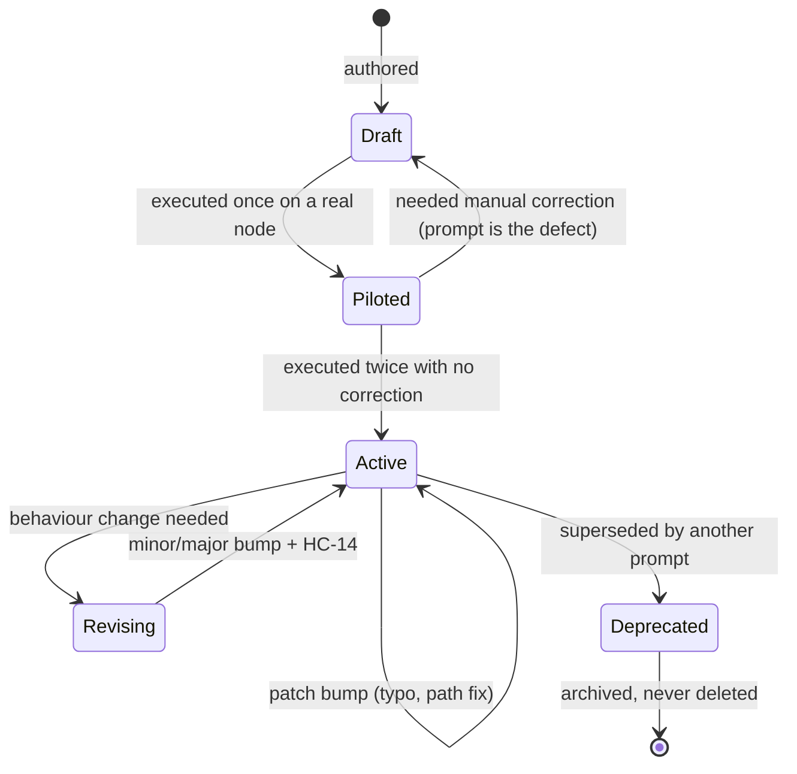
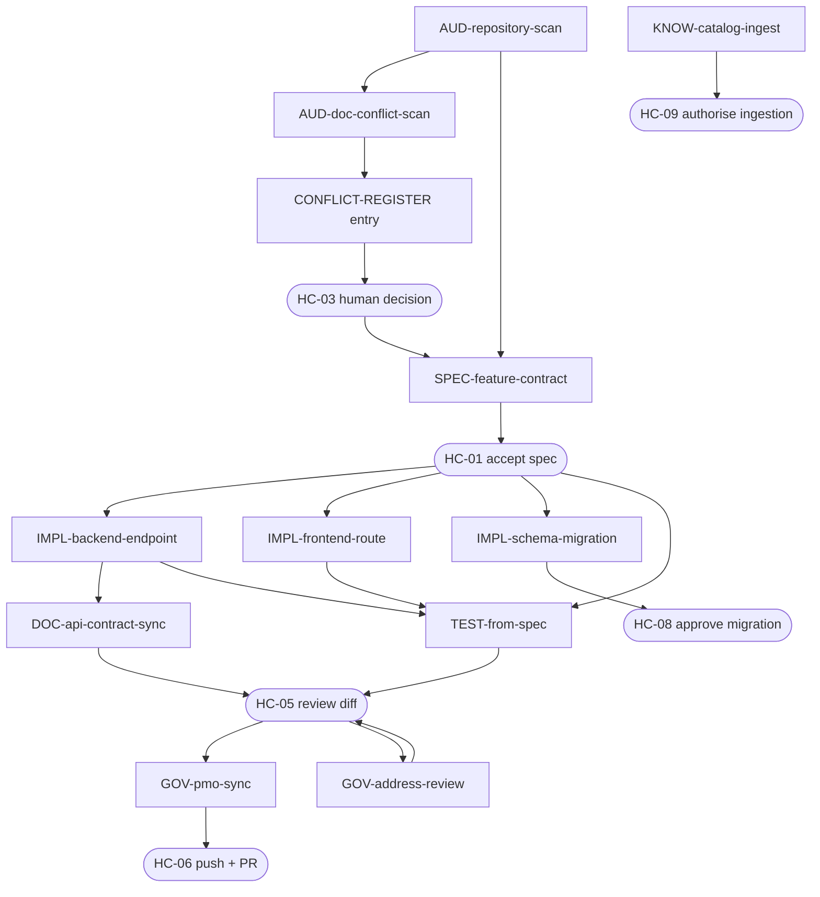

# Prompt Library Architecture

**Document ID:** `AODS-PROMPTS`
**Status:** **Accepted**
**Version:** 1.0.0
**Date:** 2026-07-29
**Template:** [`PROMPT-TEMPLATE.md`](PROMPT-TEMPLATE.md) — every prompt in the library instantiates it without omission.

---

## 1. Principle: a prompt is source code

A prompt is not a message. It is a **versioned, reviewed, testable artifact** that determines the behaviour of an
unsupervised worker. It therefore gets the same treatment as code: a file path, a version, a review, a change log,
and a linter.

| Consequence | Mechanism |
|-------------|-----------|
| Prompts live in the repo | `aods/70-prompts/<archetype>/<NAME>.prompt.md` |
| Prompts are versioned | `version:` in front-matter; bumped on every behavioural change |
| Prompts are reviewed | Changes go through `HC-14` |
| Prompts are linted | `python3 aods/tools/aods_validate.py --gate prompts` |
| Prompts are testable | Each declares acceptance criteria that an execution either meets or does not |
| Prompts are not improvised | Typing an ad-hoc request is permitted but produces no task record and no gate coverage |

The rule that makes all of this worthwhile: **if a prompt needed manual correction during execution, the prompt is
the defect** — not the model. Fix the file, bump the version, and the fix applies to every future run. Correcting the
model in chat fixes one run and teaches nothing, and in Auto Mode there is no chat to correct in anyway.

---

## 2. Directory layout

```
aods/70-prompts/
├── PROMPT-LIBRARY-ARCHITECTURE.md   ← this document
├── PROMPT-TEMPLATE.md               ← the single mandatory template
├── audit/
│   ├── AUD-repository-scan.prompt.md
│   └── AUD-doc-conflict-scan.prompt.md
├── spec/
│   └── SPEC-feature-contract.prompt.md
├── impl/
│   ├── IMPL-backend-endpoint.prompt.md
│   ├── IMPL-frontend-route.prompt.md
│   └── IMPL-schema-migration.prompt.md
├── test/
│   └── TEST-from-spec.prompt.md
├── know/
│   └── KNOW-catalog-ingest.prompt.md
├── doc/
│   └── DOC-api-contract-sync.prompt.md
└── gov/
    ├── GOV-pmo-sync.prompt.md
    └── GOV-address-review.prompt.md
```

One directory per node archetype, matching the eight types in
[`../registry/task-graph.yaml`](../registry/task-graph.yaml). A prompt's directory **is** its archetype, which means
the default allow-list and forbidden-path rules for that archetype apply without restating them — and a misfiled
prompt is caught by `--gate prompts`.

---

## 3. Naming convention

```
<ARCHETYPE>-<concern-in-kebab-case>.prompt.md
```

| Rule | Reason |
|------|--------|
| Archetype prefix uppercase | Matches node IDs, so the mapping is visually obvious |
| Concern is kebab-case, ≤4 words | Filename is the retrieval key for a stateless agent |
| `.prompt.md` double extension | Distinguishes prompts from documentation in globs and lint rules |
| No version in the filename | Version is front-matter; a `v2` file would fork the library (see `NAMING-CONVENTIONS.md` N-06) |
| No task ID in the filename | Prompts are reusable templates; task specifics arrive as parameters (§5) |

---

## 4. Front-matter contract

Every prompt begins with this block. `--gate prompts` fails on a missing or malformed field.

```yaml
---
id: IMPL-backend-endpoint
version: 1.0.0
archetype: IMPL
role: ROLE-BE-IMPL
capability_class: CODE-GEN
reasoning_depth: R2
decision_ceiling: D2
parameters:
  - NODE_ID
  - SPEC_PATH
  - ENDPOINT_PATH
  - ALLOWED_PATHS
context_tiers:
  T1: [<governing spec paths>]
  T2: [docs/ARCHITECTURE.md#transaction-ownership-be-01, <code paths>]
  T3: [docs/API_CONTRACT.md]
forbidden_context:
  - frontend/AI_CONTEXT.md
  - frontend/BACKEND_NON_COMPLIANCE.md
  - frontend/BACKEND_HANDOFF.md
gates: [lint, types, test, allowlist, citation]
produces: [CODE-DIFF, TASK-RECORD]
supersedes: null
---
```

| Field | Why it is mandatory |
|-------|---------------------|
| `id`, `version` | Traceability: a task record cites `prompt: IMPL-backend-endpoint@1.0.0` |
| `archetype` | Determines default path permissions |
| `role`, `decision_ceiling` | Bounds what may be decided without escalation |
| `capability_class`, `reasoning_depth` | Documents the model demand (advisory in Auto Mode — see `OI-M1`) |
| `parameters` | Makes the prompt reusable; an unfilled parameter is a hard stop |
| `context_tiers` | Enumerated context, in tier order (`CONTEXT-MANAGEMENT.md` §2) |
| `forbidden_context` | Deny-list; validated against the document registry |
| `gates` | The commands that define "done" |
| `produces` | Which artifacts must exist afterwards |

---

## 5. Parameterisation

Prompts are templates; a node supplies the values. Placeholders use `{{UPPER_SNAKE}}`.

```markdown
GOAL: Implement `{{ENDPOINT_PATH}}` exactly as specified in `{{SPEC_PATH}}` §{{SPEC_SECTION}}.
ALLOWED PATHS:
{{ALLOWED_PATHS}}
```

**Binding rule:** an unsubstituted `{{...}}` in an executing prompt is a **hard stop**, not a best-effort guess. An
agent that receives `{{SPEC_PATH}}` literally must halt with trigger `E1`. Without this rule the agent invents a
plausible spec path, reads the wrong document, and produces confident wrong work — the exact failure chain the
system exists to break.

`--gate prompts` checks that every `{{PLACEHOLDER}}` in the body is declared in `parameters:`, and vice versa. An
undeclared placeholder can never be filled; a declared-but-unused parameter is dead weight that misleads the operator.

---

## 6. The mandatory section set

Every prompt body contains these sections, in this order. Missing any one fails the lint gate.

| # | Section | Content | Failure it prevents |
|---|---------|---------|---------------------|
| 1 | `AUTO MODE PROTOCOL` | The verbatim preamble (`CURSOR-AUTO-MODE-STRATEGY.md` §4) | All Auto Mode weaknesses; the safety floor |
| 2 | `PURPOSE` | One sentence, one responsibility | Scope drift |
| 3 | `ALLOWED SCOPE` | Explicit glob allow-list for writes | W2, W6 |
| 4 | `FORBIDDEN SCOPE` | Paths that must not be touched, with reasons | W6 |
| 5 | `FORBIDDEN CONTEXT` | Paths that must not be read | W3 |
| 6 | `INPUTS` | Tiered, ordered, each with reason and read depth | W1, W11, W12 |
| 7 | `ARCHITECTURE RULES` | The 3–5 constraints that must not be violated, with citations | W8 |
| 8 | `FILE MODIFICATION RULES` | Create/modify/never-touch rules; no-delete rule | W2, W10 |
| 9 | `TASK` | The `{{...}}`-parameterised goal | Ambiguity |
| 10 | `EXPECTED OUTPUTS` | Artifact list + response structure | Unusable output |
| 11 | `VALIDATION CHECKLIST` | Verbatim runnable commands + expected results | W13, W14 |
| 12 | `STOPPING CONDITIONS` | Numbered halt triggers | Guessing |
| 13 | `FAILURE HANDLING` | Two-attempt rule + halt format | W4, W5 |
| 14 | `OUTPUT FORMAT` | The exact response skeleton | Inconsistent records |

Sections 3–5 and 7–8 are the **containment set**: they are what makes an unsupervised agent safe to run. Sections
11–13 are the **honesty set**: they are what makes its claims checkable.

---

## 7. Prompt lifecycle



| State | Meaning | May be used for real work? |
|-------|---------|---------------------------|
| `Draft` | Written, never executed | Pilot only, with close inspection |
| `Piloted` | Executed once successfully | Yes, with `HC-05` at full depth |
| `Active` | Two clean executions | Yes |
| `Revising` | Being changed | No — use the previous version |
| `Deprecated` | Superseded | No; retained for audit of past executions |

Every prompt in this initial library is `Draft`. Claiming otherwise would be a self-granted status upgrade of exactly
the kind the charter forbids, and none of them has been executed yet.

### 7.1 Versioning rules

| Change | Bump | Requires `HC-14`? |
|--------|------|-------------------|
| Typo, clarified wording, no behaviour change | patch | No |
| Path correction after a file moved | patch | No |
| Added a stop condition or a gate | minor | Yes |
| Added or removed a parameter | minor | Yes |
| Changed the allow-list | minor | Yes |
| Changed archetype, role, or decision ceiling | major | Yes |
| Changed the goal's meaning | major | Yes |

Task records cite `prompt_version`, so a behaviour change without a bump makes past executions unexplainable — which
is why "added a stop condition" is a minor bump rather than a patch even though it only adds text.

---

## 8. Prompt dependency graph

Prompts depend on each other through **artifacts**, never through conversation. An arrow means "the target consumes
an artifact the source produces".



Two properties are load-bearing:

1. **Human checkpoints are nodes in the graph, not annotations.** `SPEC → IMPL` is not an edge; `SPEC → HC-01 → IMPL`
   is. Architecture-first (charter principle 8) is expressed structurally rather than by exhortation.
2. **`GOV-address-review` loops back to `HC-05`.** A review comment starts a *new* execution with a new record; it is
   never a continuation of the original, because there is no session to continue.

---

## 9. Anti-patterns in prompt authoring

| Anti-pattern | Why it fails in Auto Mode | Correct form |
|--------------|---------------------------|--------------|
| "Read the relevant documentation" | The agent picks; non-deterministic | Enumerate paths with sections |
| "Follow best practices" | Unbounded; invites refactoring | Cite the standards document and section |
| "Be careful not to break anything" | Unactionable | Name the gate commands |
| "Refactor if needed" | Grants unlimited scope | Never. Refactoring is its own node |
| "Update the docs too" | Cross-archetype; violates atomicity | Separate `DOC` node |
| "Use your judgement" | Exceeds the decision ceiling silently | State the ceiling; list what to escalate |
| "Continue from where we left off" | There is no memory | Reference the task record path |
| "Fix all the failing tests" | Unbounded blast radius | Name the tests; one node per cause |
| "Make it production-ready" | Undefined | List the acceptance criteria |
| Embedding a secret or a live URL | Leaks; may cause a production write | Parameterise; default to local |
| Omitting `FORBIDDEN CONTEXT` | The agent may read `AI_CONTEXT.md` and hallucinate | Always include the registry deny-list |
| Prompt >400 lines | Consumes the context budget it should protect | Split the node |

---

## 10. Lint rules enforced by `--gate prompts`

| Rule | Check |
|------|-------|
| `P-01` | Front-matter present and parseable |
| `P-02` | All required front-matter fields present |
| `P-03` | All 14 mandatory sections present, in order |
| `P-04` | Every `{{PLACEHOLDER}}` is declared in `parameters:` |
| `P-05` | Every declared parameter appears in the body |
| `P-06` | No path in `context_tiers` is `forbidden_context: true` in the document registry |
| `P-07` | `forbidden_context` includes every registry-forbidden path |
| `P-08` | No model name appears anywhere (`M-01`) |
| `P-09` | `gates` entries are all known gate names |
| `P-10` | `archetype` matches the containing directory |
| `P-11` | Every `VALIDATION CHECKLIST` item contains a runnable command |
| `P-12` | File is ≤400 lines |
| `P-13` | `version` is valid SemVer |
| `P-14` | No secret-shaped literal (long hex/base64, `sk-`, `ghp_`) |
| `P-15` | The `AUTO MODE PROTOCOL` block matches `PROMPT-TEMPLATE.md` byte-for-byte |

---

## 11. Using a prompt (operator procedure)

1. Find the node in `aods/registry/task-graph.yaml`; note its `prompt` field.
2. Open that prompt file.
3. Copy the entire body into Cursor.
4. Replace every `{{PLACEHOLDER}}` with the node's values. **Verify none remain:**

   ```bash
   grep -n "{{" /tmp/filled-prompt.md && echo "STOP — unfilled placeholders" || echo "OK"
   ```
5. Execute in Auto Mode.
6. Confirm the response contains `RESTATE` and `PLAN` blocks before the diff. If not, the run is non-compliant —
   discard it rather than reviewing it; a run that skipped the phases also skipped their checks.
7. Confirm the task record was written to `aods/reports/tasks/<NODE-ID>.md`.
8. Run the gates yourself; do not rely on the agent's claim:

   ```bash
   python3 aods/tools/aods_validate.py --gate all
   ```
9. Proceed to `HC-05`.

Step 6 is the cheap compliance check. It takes five seconds and catches the most consequential failure mode:
an agent that went straight to editing.

---

## 12. Open issues

| ID | Issue | Needs |
|----|-------|-------|
| `OI-P1` | Manual placeholder substitution is error-prone; a mis-filled `SPEC_PATH` sends the agent to the wrong document. | A small `aods/tools/aods_prompt.py --node <ID>` renderer that fills placeholders from the task graph. Deliberately deferred — the validators come first, since a renderer without gates is convenience without safety. |
| `OI-P2` | All prompts are `Draft`; none has been executed. Their real-world failure modes are unknown. | Pilot each once during Wave A2 and record outcomes. Expect corrections. |
| `OI-P3` | Nothing forces an operator to use a prompt file instead of typing a request. | Mitigated only by the always-on Cursor rule. Residual risk `R-014`. |
| `OI-P4` | Prompt bodies duplicate the Auto Mode preamble, so a preamble change requires editing every prompt. | Either accept the duplication (self-contained files, which Auto Mode favours) or add an include mechanism. Recommendation: accept duplication and let `--gate prompts` verify the preamble matches the canonical text byte-for-byte. |
