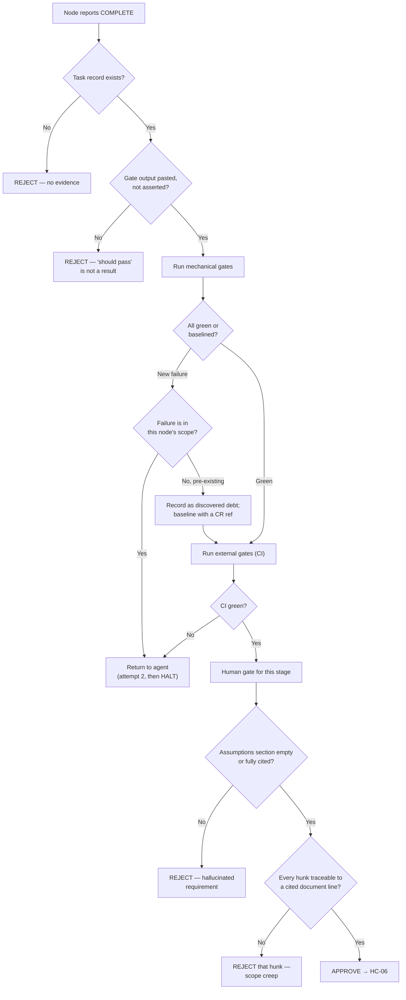

# Validation Framework

**Document ID:** `AODS-VALIDATION`
**Status:** **Accepted**
**Version:** 1.0.0
**Date:** 2026-07-29
**Implementation:** [`../tools/aods_validate.py`](../tools/aods_validate.py) (stdlib only)

---

## 1. The rule that shapes this document

> **Every gate has a runnable command. A documented gate with no command is failure criterion `F-04`.**

This repository's central weakness is not missing rules — it has three governance systems and ~140 markdown
documents. It is that almost nothing enforces them. Before AODS, the only always-on control was one Cursor rule,
and the audit found documented rules violated in code (`CR-021`), in scripts (`CR-004`), and in the documents
themselves (`CR-003`). The framework below therefore contains **no aspirational gates**. Each entry is either:

- **Mechanical** — a command exists, it runs today, it exits non-zero on failure; or
- **External** — enforced by tooling the project already runs (`ruff`, `mypy`, `pytest`, `tsc`, `eslint`, `vitest`); or
- **Human** — honestly labelled as judgement, with the literal steps in
  [`../60-human/HUMAN-INTERVENTION-MODEL.md`](../60-human/HUMAN-INTERVENTION-MODEL.md).

There is no fourth category. "Should be reviewed for quality" is not a gate.

---

## 2. Gate register

### 2.1 Mechanical gates (implemented in `aods_validate.py`)

| ID | Gate | What it proves | Command |
|----|------|----------------|---------|
| `G-01` | `registry` | Every tracked markdown is classified; every classified path exists; `on_main` claims match git | `--gate registry` |
| `G-02` | `links` | Relative markdown links resolve; unmerged-but-registered targets are reported as `CR-001`, not as typos | `--gate links` |
| `G-03` | `pmo` | `tasks.json` is valid, IDs unique, status/progress consistent, no orphan task IDs cited in markdown, no divergent duplicate ledgers | `--gate pmo` |
| `G-04` | `prompts` | The 15 prompt lint rules (`PROMPT-LIBRARY-ARCHITECTURE.md` §10) | `--gate prompts` |
| `G-05` | `graph` | The task graph is a DAG; node IDs well-formed; roles and gates resolvable; no cycles | `--gate graph` |
| `G-06` | `naming` | No reserved word in a tracked filename | `--gate naming` |
| `G-07` | `citation` | **Every path cited in a PR body resolves on the merge base** | `--gate citation --pr-body <file>` |
| `G-08` | `allowlist` | The diff stays inside the node's declared `allowed_paths` | `--gate allowlist --node <ID>` |
| `G-09` | `openapi` | The committed snapshot matches the running app | `--gate openapi` |
| `G-10` | `ingestion-boundary` | No script defaults an API or asset base to production, in any of three spellings (env default, `argparse` default, bare assignment) | `--gate ingestion-boundary` |

`G-07` is the keystone. It is the check whose absence allowed PR #127 to merge citing
`docs/architecture/CANON-LOCK.md`, a file that exists only on unmerged branch `docs/wave1-canon-lock-promote`
(`CR-001`). It resolves each cited path with `git cat-file -e <base>:<path>` rather than checking the working tree,
because the working tree is exactly where the illusion lives.

`G-08` is the enforcement behind every scope promise in the prompt library. Without it, `ALLOWED SCOPE` is a polite
request to a stateless agent.

### 2.2 External gates (existing project tooling)

| ID | Gate | Command | Where enforced |
|----|------|---------|----------------|
| `G-11` | `lint` (backend) | `ruff check app tests` | `.github/workflows/backend-ci.yml` |
| `G-12` | `types` (backend) | `mypy app` | `backend-ci.yml` |
| `G-13` | `test` + `coverage` | `pytest --cov=app --cov-fail-under=68` | `backend-ci.yml` (Postgres 15 + Redis 7) |
| `G-14` | `typecheck` (frontend) | `npx tsc --noEmit` | `.github/workflows/frontend-ci.yml` |
| `G-15` | `lint` (frontend) | `npm run lint` | `frontend-ci.yml` |
| `G-16` | `test` (frontend) | `npx vitest run` | `frontend-ci.yml` — **no coverage threshold** |
| `G-17` | `e2e` | Playwright | `frontend-ci.yml`, Storefront only |
| `G-18` | `migration-updown` | `alembic upgrade head && alembic downgrade -1 && alembic upgrade head` | **Not in CI** — `HC-08` only |
| `G-19` | `smoke` | `deploy/staging/scripts/smoke-staging.sh` | `deploy-production.yml` final step, hard-fail |

The coverage number is **68**, from `pyproject.toml` `fail_under` and `--cov-fail-under=68` in CI. `README.md`
(67%), `docs/TESTING.md` (67% min / 70% target) and `docs/API_CHANGELOG.md` (62%) all state something else; those
are stale prose (`CR-003`). This document cites the enforced value and links to the enforcement, rather than adding
a fifth copy of the number.

### 2.3 Human gates (judgement, not command)

| ID | Gate | Checkpoint | Why it cannot be mechanised |
|----|------|-----------|----------------------------|
| `G-20` | Specification is implementable | `HC-01` | Requires judging whether a criterion is falsifiable |
| `G-21` | Architectural decision is sound | `HC-02` | The decision itself is the judgement |
| `G-22` | Conflict resolution | `HC-03`, `HC-04` | Conflicts exist because authority is ambiguous |
| `G-23` | Diff is correct and in scope *in intent* | `HC-05` | `G-08` proves paths; only a human judges purpose |
| `G-24` | Migration is safe to apply | `HC-08` | Data-loss acceptability is a business decision |
| `G-25` | Ingestion target and volume are right | `HC-09` | `G-10` proves the default; only a human confirms this run |
| `G-26` | Release is fit to deploy | `HC-11` | Timing and risk appetite |
| `G-27` | Post-deploy behaviour is correct | `HC-12` | Visual and content correctness, in Persian |
| `G-28` | AODS amendment is legitimate | `HC-14` | Governance self-restraint |

Nine of 28 gates are human. That ratio is deliberate and honest: the mechanical gates handle the checks a script
does better than a person, which is exactly what makes the nine human gates affordable enough to actually perform.

---

## 3. Gate-to-stage matrix

Which gates must pass to exit each lifecycle stage (`L` ids from
[`../20-lifecycle/PROJECT-LIFECYCLE.md`](../20-lifecycle/PROJECT-LIFECYCLE.md)).

| Stage | Mechanical | External | Human | Blocking? |
|-------|-----------|----------|-------|-----------|
| L0 Audit | `G-01` `G-02` | — | — | No (read-only) |
| L2 Conventions | `G-06` | — | `G-22` | Yes |
| L4 Architecture | `G-02` `G-07` | — | `G-21` | **Yes** |
| L5 Specification | `G-01` `G-02` `G-07` | — | `G-20` | **Yes** |
| L6 Knowledge ingest | `G-10` | — | `G-25` | **Yes** |
| L11 Implementation | `G-08` | `G-11` `G-12` `G-14` `G-15` | — | **Yes** |
| L11a Migration | `G-08` | `G-18` | `G-24` | **Yes** |
| L13 Test | — | `G-13` `G-16` `G-17` | — | **Yes** |
| L14 Documentation | `G-02` `G-09` | — | — | **Yes** |
| L14b PMO sync | `G-03` | — | — | Yes |
| L12 Review | `G-07` `G-08` | all CI | `G-23` | **Yes** |
| L15 Release | `G-07` | `G-19` | `G-26` | **Yes** |
| L16 Post-deploy | — | `G-19` | `G-27` | **Yes** |
| Any AODS change | `G-01` `G-02` `G-04` `G-05` | — | `G-28` | **Yes** |

---

## 4. Validation decision tree



---

## 5. Blocking vs advisory, and the baseline mechanism

### 5.1 Why a baseline exists

The gates **fail on this repository today** — 31 findings at the time of writing. That is the correct result: they
are independently reporting `CR-001`, `CR-004`, `CR-007`, `CR-012`, and `CR-023`. But a gate that has never been
green cannot be wired into CI as blocking, and a gate not wired into CI decays into documentation.

The baseline resolves this without dishonesty:

```bash
python3 aods/tools/aods_validate.py --gate all --write-baseline   # record known failures
python3 aods/tools/aods_validate.py --gate all                    # fails only on NEW findings
python3 aods/tools/aods_validate.py --gate all --no-baseline      # the unvarnished truth
```

`aods/registry/validation-baseline.json` lists every known failure with its gate, path, message, `owner_role`,
`conflict_id`, and `recorded_at` date. The writer prints a warning for any finding it cannot attribute to a
`CR-nnn`, so an unregistered suppression cannot enter the file quietly — that warning is what produced `CR-023`.

### 5.2 The rules that keep a baseline from becoming a suppression list

| # | Rule |
|---|------|
| B-01 | A baseline entry is **visible debt**, committed and reviewable — not a disabled check |
| B-02 | Every entry should map to a `CR-nnn` in the conflict register, or be a one-line fix nobody has made |
| B-03 | The baseline may only **shrink** without approval. Growing it requires `HC-14` with a stated reason |
| B-04 | `--no-baseline` output is what goes into any audit or status report. Reporting baselined counts as "passing" is `F-05` |
| B-05 | Removing an entry that still fails will fail CI, so the file cannot be cleaned up cosmetically |
| B-06 | A gate is never deleted to make the baseline shrink |

### 5.3 Current baseline composition

Measured, not estimated — `python3 aods/tools/aods_validate.py --all` at the commit that introduced this pack:

| Findings | Gate | Cause | Closes when |
|----------|------|-------|-------------|
| 4 | `links` | AODS documents cite Canon Lock paths that exist only on the PR #125 branch | `CR-001` — PR #125 merges |
| 2 | `links` | `docs/BACKEND_CHANGES.md` has two root-relative paths that should be file-relative | `CR-023` — a one-line `DOC` node |
| 6 | `pmo` | Six `*_PROGRESS.md` pairs diverge across two paths | `CR-007` — `HC-04` picks a canonical path |
| 1 | `openapi` | `/api/v1/products/slug/{slug}` is live but absent from the snapshot | `CR-012` — regenerate, then keep the gate |
| 18 | `ingestion-boundary` | Scripts default an API or asset base to production | `CR-004` — defaults flipped to local |
| **31** | | | |

> **On the 15-vs-18 discrepancy, and how it was closed.** The first version of `G-10` matched only
> `getenv("KARZAR_API_BASE", …)` and therefore reported **15** offenders where the audit had found **18** —
> a gate quietly weaker than the audit it was meant to enforce. The three it missed were
> `materialize_product_images.py` and `mirror_product_images.py` (a different variable, `PUBLIC_ASSET_BASE`)
> and `remove_omumi_padding_leaves.py` (an `argparse` default). The gate now checks all three shapes and
> reports 18, matching the audit exactly.
>
> This is recorded rather than silently fixed because it is the more interesting failure mode: a gate that
> under-reports produces *false confidence*, which is worse than no gate. Had the 15 been published as the
> total, it would have been the self-certification error of `CR-006` committed by a script instead of a human.

> **On the OpenAPI finding.** `G-09` was originally written to skip when `app.main` could not be imported,
> and it skipped on every run — the import was failing on missing configuration, not missing dependencies,
> and the skip message asserted the wrong cause. The gate now supplies non-functional placeholder settings
> (schema generation opens no socket and touches no database), distinguishes a genuinely missing dependency
> from any other import failure, and **fails** rather than skips in the latter case. On the first run that
> actually executed, it found live contract drift that had passed through two merged EPIC-1 pull requests
> undetected. A gate that skips silently is indistinguishable from a gate that passes.

---

## 6. Artifacts without a mechanical gate

Listed explicitly, because an unlisted ungated artifact is an invisible gap.

| Artifact | Verified by | Gap |
|----------|------------|-----|
| `SPECIFICATION` content quality | `HC-01` | No machine check that a criterion is falsifiable |
| `ADR` / `RFC` soundness | `HC-02` | Judgement, by definition |
| `AUDIT-FINDINGS` accuracy | Re-running the audit's own commands | Depends on the audit citing its commands (`AUD` prompts require it) |
| `KNOWLEDGE-EXTRACT` field correctness | Schema validation + `HC-09` | Schema validity ≠ factual correctness; a wrong-but-valid dimension passes |
| `TASK-RECORD` truthfulness | `HC-05` spot-check | Self-reported; §7 covers the residual risk |
| Persian content quality | `HC-12` | Single reviewer, no automation |
| Core Web Vitals | Field data, `PERF-001` | No CI budget yet |
| Frontend coverage | — | `frontend-ci.yml` has **no** threshold, unlike the backend |
| Human checkpoint completion | Artifacts it leaves behind | Cannot be fully proven (`OI-H3`) |

---

## 7. Validating the validators

A gate nobody has watched fail is a gate nobody knows works. The failure-injection suite from
[`../50-ai-execution/CURSOR-AUTO-MODE-STRATEGY.md`](../50-ai-execution/CURSOR-AUTO-MODE-STRATEGY.md) §7 is run once
per wave. Two results from building this framework are worth recording, because both were real:

| Observation | Consequence |
|-------------|-------------|
| `G-06` initially flagged `scripts/backup_db.sh`, `backup_uploads.sh`, `backup_offsite_sync.sh`, and `install-backup-cron.sh` | The reserved-word list banned `backup`, which legitimately *names the purpose* of those scripts. Four false positives on a brand-new gate is how a gate loses credibility on day one; `backup` was removed and the reasoning recorded in `NAMING-CONVENTIONS.md` §2.1 |
| `G-01` initially failed every AODS document with "row says on_main: false but the file exists" | The check compared the registry claim against the **working tree**, but `on_main` is a claim about the **branch**. It now asks `git cat-file -e origin/main:<path>`. A validator that mis-defines its own field produces confident nonsense |
| `G-10` reported 15 production-defaulting scripts where the audit had found 18 | The pattern recognised one env-var shape. **Under-reporting is the most dangerous gate defect** — it manufactures false confidence and would have let three offenders through a gate specifically built to catch them. Now checks env defaults, `argparse` defaults, and bare assignments; reports 18 |
| `G-09` skipped on every single run, printing "dependencies not installed" while the dependencies were installed | The import was failing on missing **configuration**. The gate diagnosed the wrong cause and then skipped, and a skip reads like a pass at a glance. It now supplies placeholder settings, and fails rather than skips on any import error that is not a missing module. On its first real execution it found contract drift that two merged EPIC-1 PRs had carried undetected |
| The baseline writer produced entries with no owner and no conflict ID | The framework's own rule (`B-02`) requires both, so the writer was violating a rule this document states. It now derives `conflict_id` from the finding text, assigns `owner_role` by gate, and warns loudly on anything unattributed — which is how `CR-023` was found |

These are recorded rather than quietly fixed, because "the gate was wrong" is a class of failure the framework
must be able to admit. A gate the team cannot criticise is a gate the team will start ignoring.

Note the pattern across all five: **three of the four gate defects made the gate weaker, not noisier.** Only
`G-06` produced false positives. Reviewers naturally notice a gate that complains too much and naturally
trust a gate that complains too little, so the review effort for new gates should be spent asking "what would
this miss?" rather than "is this too strict?"

---

## 8. Evidence produced by each gate

| Gate | Evidence | Where it lives |
|------|----------|----------------|
| Any mechanical gate | JSON report (`--json`) | `aods/reports/validation/<NODE-ID>.json` |
| `citation` | The resolved/unresolved path list | PR review record |
| `allowlist` | Changed-vs-allowed comparison | Task record § "Files actually changed" |
| External CI | Workflow run | GitHub Actions (log-retention bound) |
| `migration-updown` | Up/down/up output | PR body, per `HC-08` |
| Human gates | Checkpoint evidence ledger | `HUMAN-INTERVENTION-MODEL.md` §6 |

Mechanical-gate reports are **committed**, not left in CI logs. A report that expires with log retention cannot be
cited by a later audit, and cannot be diffed to show when a regression entered.

---

## 9. CI integration (proposed, not yet wired)

```yaml
# Proposed addition to .github/workflows/backend-ci.yml — requires HC-14 before it lands.
  aods-gates:
    name: AODS gates
    runs-on: ubuntu-latest
    steps:
      - uses: actions/checkout@v4
        with:
          fetch-depth: 0          # the citation gate needs the merge base
      - name: Run AODS validators
        run: python3 aods/tools/aods_validate.py --gate all --json
```

Deliberately **not** included in this change:

| Not doing | Why |
|-----------|-----|
| Making the job required for merge | The gates must be green-with-baseline in practice first; a required job that always fails gets bypassed, and a bypassed gate teaches the team that gates are optional |
| Adding the citation gate to the PR workflow | Needs the PR template (`CR-018`) so `Node:` and `Authority:` lines exist to check |
| Wiring `G-09 openapi` as blocking | The drift has now been measured: `/api/v1/products/slug/{slug}` is missing from the snapshot (`CR-012`). Regenerate the snapshot first, then make the gate blocking — turning it on before the fix would simply add a permanently red required check |
| Touching `deploy-staging.yml` | That file's push trigger is `CR-011`, a BLOCKER; changing it is its own node with its own review |

No dependency is added: the validators are stdlib-only and run on `python3` alone. This is why
[`../tools/aods_yaml.py`](../tools/aods_yaml.py) exists instead of a PyYAML import — PyYAML is absent from both
`requirements.txt` and `requirements-dev.txt`, so importing it would make the gate fail on a clean checkout, which
is `F-04` again.

---

## 10. Runbook

```bash
# Everything runnable without arguments
python3 aods/tools/aods_validate.py --gate all

# The honest picture, ignoring known debt
python3 aods/tools/aods_validate.py --gate all --no-baseline

# One gate
python3 aods/tools/aods_validate.py --gate prompts

# Before opening a PR
python3 aods/tools/aods_validate.py --gate citation --pr-body /tmp/pr-body.md --base origin/main

# After an agent finishes a node
python3 aods/tools/aods_validate.py --gate allowlist --node IMPL-brand-hub-endpoint-001

# Machine-readable, for a report artifact
python3 aods/tools/aods_validate.py --gate all --json > aods/reports/validation/<NODE-ID>.json

# List gates
python3 aods/tools/aods_validate.py --list-gates
```

Exit codes: `0` all selected gates passed (or only baselined findings) · `1` at least one new finding ·
`2` usage error. A crashing gate reports a finding rather than exiting 0 — a gate that fails open is worse than
no gate, because it produces a green tick.

---

## 11. Open issues

| ID | Issue | Needs |
|----|-------|-------|
| ~~`OI-V1`~~ | **Closed 2026-07-29.** `G-10` found 15 of 18; its pattern missed `PUBLIC_ASSET_BASE` and `argparse` defaults. | Pattern broadened to three shapes; the gate now reports 18, matching the audit. See §5.3. |
| `OI-V2` | `G-08` needs a node ID it cannot infer, so an operator who omits `--node` gets a silent skip rather than a failure. | Make `Node:` a required PR-body field once `CR-018` (PR template) is resolved, then fail the citation gate when it is absent. |
| `OI-V3` | `G-09` skipped on every run because `app.main` needs configuration, and the skip message wrongly blamed missing dependencies. | **Partly closed 2026-07-29:** the gate now injects non-functional placeholder settings, runs, and fails rather than skips on any import error other than a missing module. Remaining need: a CI job must still treat a genuine `openapi` skip as a failure in an environment where the gate should have run. |
| `OI-V4` | The frontend has no test-coverage threshold while the backend gate is 68%. | Board decision on a frontend threshold. Not set here: inventing a number would create a fifth coverage figure, which is the `CR-003` disease. |
| `OI-V5` | No gate detects that a summary artifact is stale relative to its source SHA. | Deferred `--gate summaries`. Kept out of the first set to keep every shipped gate real. |
| `OI-V6` | Nothing verifies that a task record's pasted gate output was actually produced by that command. | Structurally unsolvable by inspection; mitigated because reviewers re-run the gates themselves (`HC-05` step 3). |
