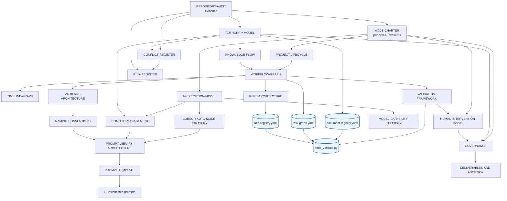
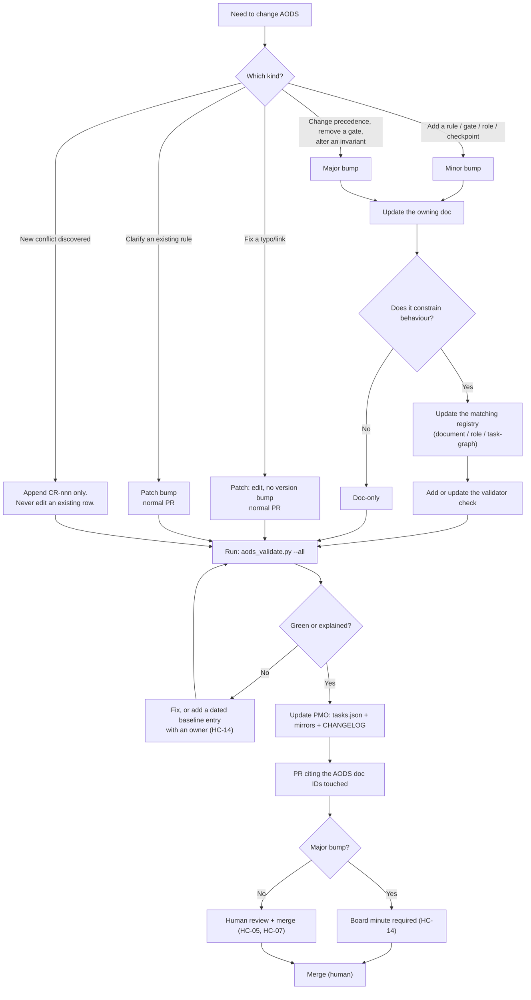
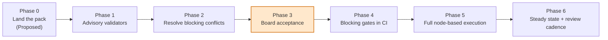

# Deliverables and Adoption

**Document ID:** `AODS-DELIVERABLES`
**Status:** **Proposed** (inherits [`AODS-CHARTER.md`](../AODS-CHARTER.md) status)
**Version:** 0.1.0
**Date:** 2026-07-29
**Satisfies:** required section 19 (Deliverables)

---

## 1. What was delivered

This pack is the AODS itself: the documentation, the machine-readable registries, the runnable validators,
and the prompt library. It is process-only — **no application code, schema, or configuration was changed**.

| Deliverable | Location | Kind | Runnable |
|---|---|---|---|
| Charter (system overview, principles, invariants) | [`AODS-CHARTER.md`](../AODS-CHARTER.md) | Doc | — |
| Repository audit | [`10-repository-intelligence/REPOSITORY-AUDIT.md`](../10-repository-intelligence/REPOSITORY-AUDIT.md) | Doc (`EVIDENCE`) | — |
| Authority model + precedence ladder | [`10-repository-intelligence/AUTHORITY-MODEL.md`](../10-repository-intelligence/AUTHORITY-MODEL.md) | Doc | Enforced by `--gate registry` |
| Conflict register (23 rows, `CR-001`…`CR-023`) | [`10-repository-intelligence/CONFLICT-REGISTER.md`](../10-repository-intelligence/CONFLICT-REGISTER.md) | Doc (append-only) | Partially: `CR-004`, `CR-007`, `CR-012` confirmed by validators; `CR-023` discovered by one |
| Project lifecycle (two loops, 19 stages `L0`…`L18`) | [`20-lifecycle/PROJECT-LIFECYCLE.md`](../20-lifecycle/PROJECT-LIFECYCLE.md) | Doc | — |
| Workflow DAG (node specs) | [`20-lifecycle/WORKFLOW-GRAPH.md`](../20-lifecycle/WORKFLOW-GRAPH.md) | Doc | `--gate graph` |
| Timeline / critical path | [`20-lifecycle/TIMELINE-GRAPH.md`](../20-lifecycle/TIMELINE-GRAPH.md) | Doc | — |
| Role architecture (23 roles) | [`30-roles/ROLE-ARCHITECTURE.md`](../30-roles/ROLE-ARCHITECTURE.md) | Doc | `--gate graph` (role IDs resolve) |
| Artifact architecture | [`40-artifacts/ARTIFACT-ARCHITECTURE.md`](../40-artifacts/ARTIFACT-ARCHITECTURE.md) | Doc | — |
| Naming conventions | [`40-artifacts/NAMING-CONVENTIONS.md`](../40-artifacts/NAMING-CONVENTIONS.md) | Doc | `--gate naming` |
| AI execution model | [`50-ai-execution/AI-EXECUTION-MODEL.md`](../50-ai-execution/AI-EXECUTION-MODEL.md) | Doc | — |
| Cursor Auto Mode strategy | [`50-ai-execution/CURSOR-AUTO-MODE-STRATEGY.md`](../50-ai-execution/CURSOR-AUTO-MODE-STRATEGY.md) | Doc | Partly via `.cursor/rules/` |
| Context management | [`50-ai-execution/CONTEXT-MANAGEMENT.md`](../50-ai-execution/CONTEXT-MANAGEMENT.md) | Doc | `--gate prompts`, `--gate registry` |
| Model capability strategy | [`50-ai-execution/MODEL-CAPABILITY-STRATEGY.md`](../50-ai-execution/MODEL-CAPABILITY-STRATEGY.md) | Doc | — |
| Human intervention model (14 checkpoints) | [`60-human/HUMAN-INTERVENTION-MODEL.md`](../60-human/HUMAN-INTERVENTION-MODEL.md) | Doc | — |
| Prompt library architecture | [`70-prompts/PROMPT-LIBRARY-ARCHITECTURE.md`](../70-prompts/PROMPT-LIBRARY-ARCHITECTURE.md) | Doc | `--gate prompts` |
| Prompt template | [`70-prompts/PROMPT-TEMPLATE.md`](../70-prompts/PROMPT-TEMPLATE.md) | Template | `--gate prompts` |
| 11 instantiated prompts | [`70-prompts/*/`](../70-prompts/) | Prompts | `--gate prompts` |
| Validation framework | [`80-validation/VALIDATION-FRAMEWORK.md`](../80-validation/VALIDATION-FRAMEWORK.md) | Doc | Describes the gates below |
| Risk register (18 risks) | [`RISK-REGISTER.md`](RISK-REGISTER.md) | Doc | — |
| Knowledge flow (17 transformations) | [`KNOWLEDGE-FLOW.md`](KNOWLEDGE-FLOW.md) | Doc | `--gate ingestion` |
| Governance | [`GOVERNANCE.md`](GOVERNANCE.md) | Doc | — |
| Deliverables & adoption (this) | `DELIVERABLES-AND-ADOPTION.md` | Doc | — |
| Document registry | [`registry/document-registry.yaml`](../registry/document-registry.yaml) | Machine-readable | `--gate registry` |
| Role registry | [`registry/role-registry.yaml`](../registry/role-registry.yaml) | Machine-readable | `--gate graph` |
| Task graph | [`registry/task-graph.yaml`](../registry/task-graph.yaml) | Machine-readable | `--gate graph` |
| Validation orchestrator | [`tools/aods_validate.py`](../tools/aods_validate.py) | **Executable, stdlib-only** | `python3 aods/tools/aods_validate.py` |
| YAML subset parser | [`tools/aods_yaml.py`](../tools/aods_yaml.py) | **Executable, stdlib-only** | Imported by the above |
| Cursor rule — always-on safety floor | [`.cursor/rules/aods-auto-mode.mdc`](../../.cursor/rules/aods-auto-mode.mdc) | Rule | Applied by Cursor on every request |
| Cursor rule — editing AODS itself | [`.cursor/rules/aods-node-execution.mdc`](../../.cursor/rules/aods-node-execution.mdc) | Rule | Glob-scoped to `aods/**` |

**Why the validators use only the standard library.** A gate that cannot run is not a gate (charter Φ7).
`PyYAML` is not in `requirements.txt`, and adding a dependency to make the governance tooling work would
make the governance tooling the first thing to break in a fresh checkout. `aods_yaml.py` is a deliberately
minimal YAML-subset parser: it handles exactly the constructs the registries use and raises on anything else,
which is the correct failure mode for a config parser in a governance tool.

---

## 2. Recommended directory tree

The delivered tree, with the rationale for each choice. This is the recommendation, and it is what exists.

```
aods/
├── README.md                          # Entry point: 60-second orientation + runbook
├── AODS-CHARTER.md                    # §1 System overview. Read first.
│
├── 10-repository-intelligence/        # "What is true in this repo?"
│   ├── REPOSITORY-AUDIT.md
│   ├── AUTHORITY-MODEL.md
│   └── CONFLICT-REGISTER.md
│
├── 20-lifecycle/                      # "In what order does work happen?"
│   ├── PROJECT-LIFECYCLE.md
│   ├── WORKFLOW-GRAPH.md
│   └── TIMELINE-GRAPH.md
│
├── 30-roles/                          # "Who does it?"
│   └── ROLE-ARCHITECTURE.md
│
├── 40-artifacts/                      # "What is produced, and what is it called?"
│   ├── ARTIFACT-ARCHITECTURE.md
│   └── NAMING-CONVENTIONS.md
│
├── 50-ai-execution/                   # "How does the model execute?"
│   ├── AI-EXECUTION-MODEL.md
│   ├── CURSOR-AUTO-MODE-STRATEGY.md
│   ├── CONTEXT-MANAGEMENT.md
│   └── MODEL-CAPABILITY-STRATEGY.md
│
├── 60-human/                          # "What must the human physically do?"
│   └── HUMAN-INTERVENTION-MODEL.md
│
├── 70-prompts/                        # The executable instruction set
│   ├── PROMPT-LIBRARY-ARCHITECTURE.md
│   ├── PROMPT-TEMPLATE.md             # Mandatory shape for every prompt
│   ├── audit/   AUD-*.prompt.md
│   ├── spec/    SPEC-*.prompt.md
│   ├── impl/    IMPL-*.prompt.md
│   ├── test/    TEST-*.prompt.md
│   ├── know/    KNOW-*.prompt.md
│   ├── doc/     DOC-*.prompt.md
│   └── gov/     GOV-*.prompt.md
│
├── 80-validation/                     # "How do we know it is correct?"
│   └── VALIDATION-FRAMEWORK.md
│
├── 90-governance/                     # "Who decides, and how does the system evolve?"
│   ├── RISK-REGISTER.md
│   ├── KNOWLEDGE-FLOW.md
│   ├── GOVERNANCE.md
│   └── DELIVERABLES-AND-ADOPTION.md
│
├── registry/                          # Machine-readable source of truth for tooling
│   ├── document-registry.yaml
│   ├── role-registry.yaml
│   ├── task-graph.yaml
│   └── validation-baseline.json       # Dated, owned known-debt entries
│
├── tools/                             # Runnable, stdlib-only
│   ├── aods_validate.py
│   └── aods_yaml.py
│
└── reports/                           # Execution evidence, version-controlled
    ├── tasks/<NODE-ID>.md             # One TASK-RECORD per executed node
    ├── audits/<NODE-ID>.md
    ├── tests/<NODE-ID>.md
    ├── validation/<NODE-ID>.json
    └── releases/<TAG>.md
```

Two rules live outside this tree because Cursor requires them there:

```
.cursor/rules/
├── pmo-living-system.mdc              # Pre-existing. Untouched by AODS.
├── aods-auto-mode.mdc                 # alwaysApply — the safety floor
└── aods-node-execution.mdc            # globs: aods/** — rules for editing AODS itself
```

### 2.1 Design decisions and rationale

| Decision | Rationale | Alternative rejected because |
|---|---|---|
| Live at `aods/` (repo root), not `docs/aods/` | AODS is a meta-system about process; `docs/` is the product's knowledge tree and is governed *by* AODS. Also, PR #125 owns large parts of `docs/` — nesting there would have created immediate merge conflicts with the very governance pack AODS defers to. | `docs/aods/` would imply AODS is a peer of the architecture docs, which would confuse the authority model |
| Numeric directory prefixes (`10-`, `20-`, …) | Reading order is part of the design: repository intelligence must be read before lifecycle, which must be read before roles. Filesystem sort teaches the order for free, and gaps (`15-`) allow insertion without renumbering. | Alphabetical ordering scatters the reading sequence; a separate `INDEX.md` would drift |
| One concern per file, `SCREAMING-KEBAB.md` | Files are cited by path in prompts and PR bodies; stable, guessable, greppable names matter more than aesthetics. Uppercase distinguishes AODS docs from product docs at a glance in search results. | Lowercase files blend into `docs/` |
| Registries in YAML, not JSON | They are human-edited and need comments — YAML has them, JSON does not, and every registry row needs a `notes` field explaining its authority | JSON: no comments; TOML: poor nested-list ergonomics |
| Task records as markdown under `aods/tasks/` | Committed and diffable, so the audit trail survives in Git rather than in a chat transcript | A database or external tracker would be unversioned, which is exactly `CR-009`'s failure |
| Baseline in `registry/`, not `reports/` | The baseline is *input* to the validator, not output from it. Putting it beside the other registries keeps everything a tool reads in one directory. | In `reports/` it would look like regenerable noise and get cleaned up |
| Prompts split by archetype subdirectory | The archetype determines the default `allowed_paths`; the directory makes the archetype impossible to mistake | A flat directory makes archetype a naming convention only, which decays |

### 2.2 Document relationship graph



**How to read this.** An edge means *"changing the tail may invalidate the head"*. The four blue nodes are
machine-readable and are the only artifacts a tool reads, which is why every prose document that constrains
behaviour terminates in one of them. A rule that reaches no blue node is documentation, not governance.

---

## 3. Update workflow

Changing AODS is a `C5 — Governance-affecting` change under [`GOVERNANCE.md`](GOVERNANCE.md) §3.1.



### 3.1 The four rules that keep this pack honest

1. **A prose rule that no registry or validator references is a proposal, not a rule.** If you add a rule and
   cannot point at the gate that checks it, say so in the text and open an `OI-` issue.
2. **The conflict register is append-only.** Rows are closed with a dated decision line; they are never
   rewritten or deleted, because the value of the register is the history of what was disputed.
3. **Statuses are never self-upgraded.** No PR may change an AODS document from `Proposed` to `Accepted`
   without a Board minute — that rule is Canon
   (`docs/development/standards/documentation-citation-rules.md`), not an AODS invention.
4. **Every AODS change touches the PMO.** Required by `.cursor/rules/pmo-living-system.mdc`; tracked as
   `AODS-001`.

---

## 4. Adoption plan

Adoption is sequenced by **dependency, not by calendar**. Each phase has an entry condition, a mechanical
exit condition, and a named blocker if it cannot proceed. Phases 1 and 2 are already usable — the validators
run today against the current tree.



| Phase | Entry condition | Work | Mechanical exit condition | Blocked by |
|---|---|---|---|---|
| **0 — Land** | — | Merge this pack as `Proposed`. Changes no behaviour. | Pack on `main`; `aods_validate.py --list-gates` runs | — |
| **1 — Advisory** | Phase 0 | Run `--all` locally before each PR. Record the baseline. Fix only what is free to fix. | `registry/validation-baseline.json` exists with an owner per entry | — |
| **2 — Deconflict** | Phase 1 | Board decides `CR-001` (merge PR #125), `CR-002` (branch naming), `CR-003` (coverage number), `CR-007` (PMO canonical path) | Those four rows closed with dates | Requires `HC-07` on PR #125, then `HC-03` / `HC-04` |
| **3 — Accept** | Phase 2 | Board reviews the pack; minute; Canon Lock row; statuses → `Accepted`; versions → `1.0.0` | `document-registry.yaml` shows `accepted` for the AODS pack | **Board decision — the one irreducible human gate** |
| **4 — Enforce** | Phase 3 | Wire gates into `backend-ci.yml` as required checks; enable branch protection | A PR violating a gate cannot merge | `OI-GOV-02`, `OI-GOV-05`, `HC-14` |
| **5 — Execute** | Phase 4 | Run one real epic entirely through the node model: `SPEC → IMPL → TEST → AUD(review) → DOC → GOV` | One wave completed with a full task-record trail and zero `PARTIAL` nodes | Requires a frozen spec (`HC-01`) |
| **6 — Steady state** | Phase 5 | Monthly governance review; quarterly independent audit; baseline shrinks | Governance health metrics (`GOVERNANCE.md` §7.3) trending correctly | — |

### 4.1 Recommended first real target

**RFC-005 Brand Hub** is the right first candidate for Phase 5, for four reasons that make it a genuine test
rather than a demonstration:

1. It is the next EPIC-1 item and its endpoint is **not yet implemented** on `main`, so nothing is
   retrofitted.
2. It has a governing RFC, so the `ARCH-GATE` dependency is real and will actually be exercised.
3. Its IA readiness checklist is currently unchecked, so `HC-01` (accept and freeze the spec) has real work to do rather
   than rubber-stamping an already-settled design.
4. It spans backend, frontend, and SEO surfaces, so it exercises `IMPL-backend-endpoint`,
   `IMPL-frontend-route`, `TEST-from-spec`, and `DOC-api-contract-sync` — four of the eleven prompts — in
   one wave.

It also has **no PMO task ID** (`CR-008`), which means adopting it forces the planning/criteria
reconciliation that the audit flagged, instead of leaving it theoretical.

### 4.2 Failure conditions for adoption itself

Adoption should be **stopped and reconsidered**, not pushed through, if any of these appear:

| Signal | Interpretation | Action |
|---|---|---|
| A gate is baselined rather than fixed three times in a row | The gate is wrong, or the debt is structural | Redesign the gate or escalate the debt as a tracked task |
| Operators skip `HC` steps and record them as done | Checkpoints cost more than they return | Cut the checkpoint count; keep only those with a real artifact |
| Prompts are edited ad hoc in the chat instead of in files | The library is not usable | Fix the prompt ergonomics before enforcing anything |
| Board acceptance stalls | AODS has no authority and is drifting toward stale documentation (`R-015`) | Keep Phase 1 advisory use only; do not pretend Phase 3 happened |
| Node overhead exceeds the value on small changes | Granularity is wrong for a single-operator repo | Allow `C0`/`C1` fast path: one node, gates only, no separate `REV` node |

The last row matters most. A process that is heavier than the work it governs gets bypassed, and a bypassed
process is worse than no process because it produces false assurance. The `C0`/`C1` fast path is the
designed escape valve.

---

## 5. Versioning strategy

| Object | Scheme | Where recorded | Bump authority |
|---|---|---|---|
| AODS document | SemVer, per document (`0.1.0`) | Document header | Per `GOVERNANCE.md` §5.3 |
| Prompt | `vN` integer in front-matter | Prompt front-matter + library changelog | Author; human approves |
| Registry | No version; the git SHA is the version | — | — |
| Task record | Immutable once the node closes | `aods/tasks/<NODE-ID>.md` | Append a new record; never edit a closed one |
| Baseline | Dated entries, no version | `aods/registry/validation-baseline.json` | `HC-14` |
| Conflict register | Append-only, no version | Row `id` is the identity | Register anyone; close Board only |
| Pack as a whole | Git commit SHA | — | — |

**Why prompts use integers, not SemVer.** A prompt has exactly two states relative to determinism:
compatible with prior task records, or not. Bumping `v1 → v2` is a declaration that prior runs of `v1` are
not reproducible with `v2`, which is exactly one bit of information. SemVer's three components would invite
false precision about a text file whose only contract is "the same input produces an equivalent diff".

---

## 6. Immediate next actions for the human operator

Ordered, and each one references the checkpoint that defines its literal steps in
[`HUMAN-INTERVENTION-MODEL.md`](../60-human/HUMAN-INTERVENTION-MODEL.md).

| # | Action | Checkpoint | Why first |
|---|---|---|---|
| 1 | Review and merge PR #125 (Canon Lock promotion) | `HC-07` | Closes `CR-001`. Until it merges, every governance citation in the repository — including this pack's — fails to resolve on `main`. Nothing else in adoption is worth doing first. |
| 2 | Run `python3 aods/tools/aods_validate.py --all` and read the output | — | See the real state. The validators independently confirm `CR-004`, `CR-007`, and `CR-012`, and one of them discovered `CR-023`. |
| 3 | Regenerate `openapi/v1.json` | `HC-05` | `CR-012`, and the cheapest real fix on this list. `/api/v1/products/slug/{slug}` has been live since PR #126 while the snapshot dates from PR #111, so the declared machine contract is currently wrong. One command, then `--gate openapi` can become blocking. |
| 4 | Decide `CR-007`: which PMO progress path is canonical | `HC-03` | Six divergent duplicate files; every PMO write is currently ambiguous. |
| 5 | Decide `CR-003`: the one true coverage number | `HC-03` | Four documents state four values; CI enforces one. |
| 6 | Decide `CR-002`: branch naming | `HC-04` | Two authoritative documents disagree. |
| 7 | Decide `CR-015`: delete or quarantine `frontend/AI_CONTEXT.md` | `HC-03` | ~1,000 lines of confirmed-false architecture claims that agents can still load. |
| 8 | Hold a Board session on this pack; accept or reject | `HC-14` | Phase 3. Nothing here is binding until this happens. |
| 9 | Decide whether AODS gates become required CI checks | `HC-14` | Phase 4. |

---

## 7. Open issues

| ID | Issue | Decision needed from | Blocks |
|---|---|---|---|
| `OI-DEL-01` | Whether `aods/` stays at the root or moves under `docs/` after PR #125 merges and the `docs/` namespace stabilises | Board | Nothing; a later move is a pure rename plus registry update |
| `OI-DEL-02` | Whether `aods/tasks/` records are committed for every node or only for `C2`+ changes | Owner | Repository size vs audit completeness trade-off |
| `OI-DEL-03` | Whether the Knowledge Platform Phase 1–3 documents are in scope for the next wave (`OI-KF-04`) | Owner | Which epic follows RFC-005 |
| `OI-DEL-04` | No Board-minute storage location exists in the repo (`OI-GOV-07`) | Board | Verifiable acceptance of this pack at Phase 3 |
| `OI-DEL-05` | Whether a `C0`/`C1` fast path (single node, gates only, no separate review node) is acceptable | Owner | Whether Phase 5 is affordable for small changes |
