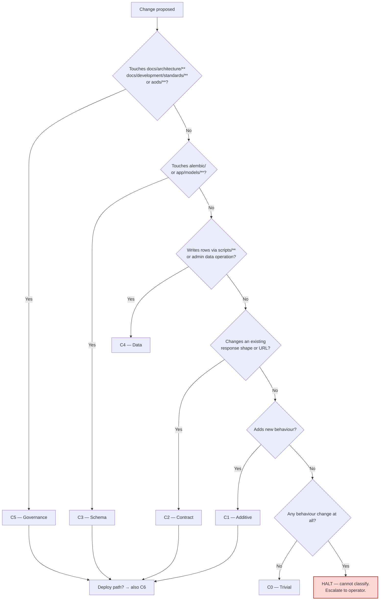
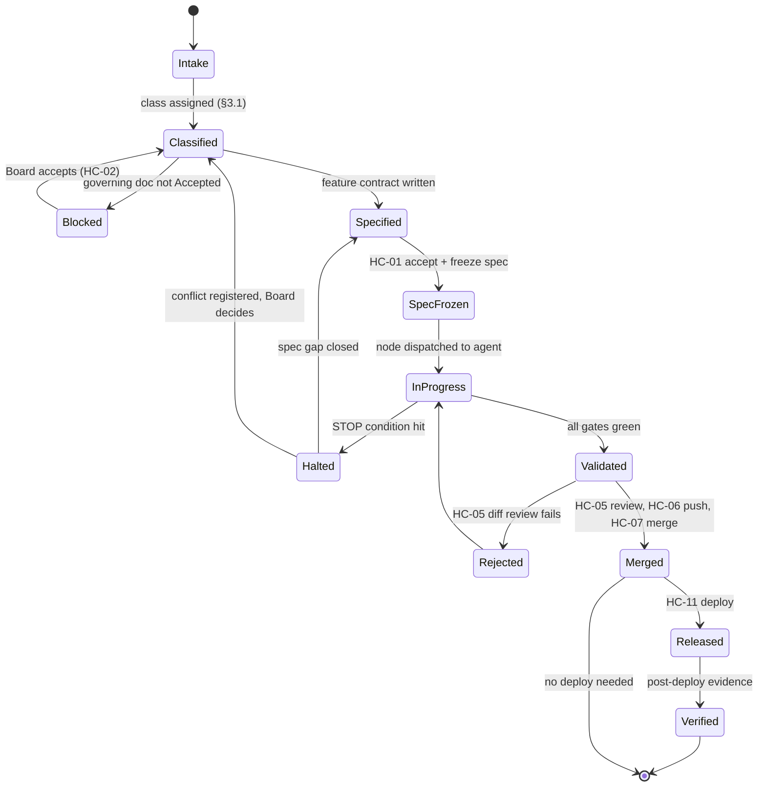

# Governance

**Document ID:** `AODS-GOVERNANCE`
**Status:** **Proposed** (inherits [`AODS-CHARTER.md`](../AODS-CHARTER.md) status)
**Version:** 0.1.0
**Date:** 2026-07-29
**Satisfies:** required section 18 (Governance)

---

## 1. What governance means here, and what it does not

Governance in AODS is the answer to one question: **who is allowed to change what, and what evidence must
exist before the change lands?**

It is deliberately *not* a new authority. Karzar already declared two governing bodies — the Architecture
Board (which owns criteria, via Canon Lock and ADR/RFC) and the PMO (which owns sequencing, via
`project-management/`). AODS adds a third thing that neither of them has: **enforcement**. The Board says
what "Accepted" means; the PMO says what is next; AODS makes both mechanically checkable and defines the
procedure that connects them.

This document therefore describes procedure, not policy. Where a Canon Lock document already states a rule,
this document cites it and adds the command that verifies it. Where no rule exists, this document proposes
one and marks it as such.

> **Single-operator reality.** This repository has one human (Mohammad Shebahati), who is simultaneously
> owner, Architecture Board, reviewer, and operator. Every separation-of-duties rule below is therefore a
> **separation in time and artifact**, not in person: the same human acts in a different role, at a
> different moment, producing a different artifact. That is weaker than two people, and §8 states plainly
> what it cannot protect against.

---

## 2. Governance bodies and their jurisdictions

| Body | Jurisdiction | Cannot do | Evidence of a decision |
|---|---|---|---|
| **Architecture Board** (human, `R-BOARD`) | Accept/reject ADRs, RFCs, standards; set Canon Lock; declare architecture and specification freezes; resolve conflict-register rows | Change task schedules; write code | Board minute + Canon Lock row + document status change |
| **PMO** (`project-management/`, operated by human) | Task IDs, sprint contents, status, priority, checkpoint dates | Declare a design correct; override a `CANON` document | `tasks.json` entry + mirrored markdown + `CHANGELOG.md` line |
| **AODS process authority** (this pack, once accepted) | Define how a change is executed, validated, and recorded; define gates, prompts, roles, context rules | Accept any architectural decision; change product scope; grant itself authority | Validator exit code + task record + gate report |
| **Audit function** (`docs/audits/`, `EVIDENCE` class) | Measure and report quality | Authorise a change; certify its own remediation | Dated audit report with file:line findings |
| **Operator** (human at the keyboard) | Run commands, approve PRs, push, merge, deploy, perform every `HC-nn` | Skip a checkpoint and record it as done | Signed checkpoint line in the task record |

**Why the audit function cannot certify its own remediation.** `docs/audits/v2/SCORECARD-AFTER-REMEDIATION.md`
raises the score from 5.7/10 to 9.0/10 with no independent re-audit (`CR-006`). Under this model that
document remains valid `EVIDENCE` of *what was done*, but is not evidence of *the new score*. The rule
generalises: the role that performs remediation may not be the role that scores it, even when both are the
same human, because the artifact must be produced in a separate, dated pass.

---

## 3. Change management

### 3.1 Change classes

Every change is classified before work starts. The class determines the required path, and classification
is part of the task record, not an afterthought — an agent that cannot classify its own change must halt.

| Class | Definition | Requires | Gates | Human checkpoints |
|---|---|---|---|---|
| `C0 — Trivial` | Typo, comment, formatting; zero behaviour change | Nothing beyond CI | lint | `HC-05`, `HC-06`, `HC-07` |
| `C1 — Additive` | New endpoint/route/component; no existing contract changes | Feature contract; `Accepted` governing doc | lint, types, test, coverage, openapi, citation | `HC-01`, `HC-05`, `HC-06`, `HC-07` |
| `C2 — Contract-affecting` | Changes an existing API shape, URL, or response | ADR or RFC `Accepted`; `docs/API_CHANGELOG.md` entry; OpenAPI diff reviewed | all of C1 + api-change rules | `HC-02`, `HC-01`, `HC-05`, `HC-07` |
| `C3 — Schema-affecting` | Alembic migration, model change | ADR; up/down tested; backup verified | all of C2 + `migration-updown` | `HC-08` (apply migration) + all of C2 |
| `C4 — Data-affecting` | Writes catalog/content rows | Dry-run report reviewed; non-prod target proven | `ingestion` | `HC-13` (source), `HC-09` (authorise run), `HC-05` |
| `C5 — Governance-affecting` | Changes ADR/RFC/standards/Canon Lock | Board minute | `registry`, `links`, `citation` | `HC-02` (Board accept); `HC-14` when AODS itself changes |
| `C6 — Release` | Deploy to staging or production | Green gates; release note | `smoke`, `post-deploy` | `HC-11` (deploy), `HC-12` (verify) |

**Classification decision tree.**



The terminal `HALT` is intentional. A change that is neither trivial nor classifiable is exactly the change
an Auto Mode agent should not be executing, and the fail-safe principle (charter principle 12) requires that
the ambiguity surface as a stop rather than as a guess.

### 3.2 Change request lifecycle



**The `Blocked` state is doing real work.** It encodes charter principle 8 (architecture-first): a `C1`–`C3`
change whose governing ADR is still `Proposed` cannot enter `Specified`. Today this state would catch the
live situation described in `CR-001` — EPIC-1 implementation PRs merged while their governing Canon Lock is
unmerged — which is precisely the kind of ordering violation that is invisible without a state machine.

### 3.3 What an agent may never do

Restating from [`AODS-CHARTER.md`](../AODS-CHARTER.md) §3 because it belongs in the governance document too,
and because `docs/development/git-development-workflow.md` §6 already states it as canon:

1. Push to a remote.
2. Merge any branch.
3. Deploy anything.
4. Change a document's status to `Accepted`.
5. Write to a production database or call a production write endpoint.
6. Edit outside its declared `allowed_paths`.
7. Close a conflict-register row.

---

## 4. Approval workflow

### 4.1 Approval authority matrix

| Artifact / action | Proposer | Reviewer | Approver | Recorded in |
|---|---|---|---|---|
| ADR / RFC status → `Accepted` | Agent or human | Board | **Board only** (`HC-02`) | Board minute + Canon Lock row |
| Feature contract (spec) | Agent | Human | Human (`HC-01`) | Spec doc status line |
| Code PR, `C0`–`C1` | Agent | Human + gates (`HC-05`) | Human (`HC-07`) | PR approval |
| Code PR, `C2`–`C3` | Agent | Human + gates + contract diff (`HC-05`) | Human (`HC-07`) | PR approval + `API_CHANGELOG.md` |
| Data load (`C4`) | Agent (dry-run) | Human reads dry-run | Human (`HC-09`) | Run summary + task record |
| Migration apply | Agent (script) | Human verifies up/down | Human (`HC-08`) | Migration note + backup evidence |
| Production deploy | Agent (never) | Human | Human (`HC-11`), verified at `HC-12` | Release record |
| Baseline addition to a validator | Agent may propose | Human | Human (`HC-14`) | `aods/registry/validation-baseline.json` + dated entry |
| Conflict-register closure | Agent may propose text | Board | **Board only** (`HC-03`) | Dated close line + ADR if applicable |
| Convention conflict resolution (e.g. `CR-002`) | Agent reports both sides | Human | Human (`HC-04`) | Dated decision in the register + the losing doc corrected |
| AODS document change | Agent | Human | Board (`HC-14`) for rule changes, human for `Proposed` edits | Version bump + changelog |

### 4.2 The four-eyes substitute

Genuine four-eyes review is unavailable with one human. AODS substitutes **three independent checks that do
not share a failure mode**, on the reasoning that the value of a second reviewer is independence, and
independence can be partially manufactured:

| Check | Independence source | What it catches that the others miss |
|---|---|---|
| Mechanical gates (`aods_validate.py` + CI) | Code, not judgement; cannot be persuaded | Registry drift, broken links, contract drift, PMO desync, scope violations |
| Adversarial review pass (role `R-AI-REVIEWER` on a separate `AUD` node, separate prompt, fresh context) | Different context set; does not see the implementer's reasoning | Logic errors, spec misreadings, unnecessary refactors |
| Human checkpoint (`HC-05`, literal steps) | Different time; operator reads output, not process | Wrong intent, wrong priority, "correct but not what I wanted" |

**Why the review pass gets a fresh context.** A reviewer that inherits the implementer's context inherits the
implementer's misunderstanding — the single most common way AI self-review produces false confidence. The
review node therefore loads the specification and the diff, and is explicitly forbidden from loading the
implementer's task record or reasoning.

### 4.3 Approval evidence — required shape

An approval that leaves no artifact did not happen. Every `HC-nn` completion appends this block to the task
record:

```markdown
### HC-05 — Review an AI-produced diff
- Performed by: Mohammad Shebahati
- UTC: 2026-07-29T18:22:00Z
- Steps executed: 1,2,3,4,5,6 (all)  # per HUMAN-INTERVENTION-MODEL.md HC-05
- Gate report: aods/reports/validation/IMPL-brand-hub-endpoint-001.json (all green)
- Diff reviewed: 7 files, 213 lines, all within allowed_paths
- Decision: APPROVED
- Notes: —
```

Charter failure criterion `F-08` covers the case where this block is written without the steps being
performed. That is unfalsifiable from inside the repository and is listed honestly in §8 as a residual risk
rather than pretended away.

---

## 5. Version control governance

### 5.1 Branches

`docs/development/git-development-workflow.md` (`CANON`, unmerged — `CR-001`) is the authority. AODS adds
nothing to it except a validator and one recorded conflict.

| Rule | Source | Enforcement |
|---|---|---|
| Work happens on a branch, never on `main` | git workflow doc | Branch protection (proposed; `OI-GOV-02`) |
| Branch names follow the declared taxonomy | git workflow doc vs `docs/CONTRIBUTING.md` — **these disagree** (`CR-002`) | Blocked pending `HC-04` decision |
| No agent pushes | git workflow doc §6 | Procedural; agents have no credentials |
| One node = one PR where practical | AODS (proposed) | Advisory, PR-size budget |
| PR ≤ ~400 changed lines / ≤ 15 files, else split | AODS (proposed) | Advisory warning in `--gate` output |

`CR-002` is unresolved: two `CANON`/`POLICY` documents state different branch-naming schemes, and the 20
observed branches follow neither consistently. AODS reports this rather than picking one, per charter
invariant 7.

### 5.2 Commits

| Rule | Status | Rationale |
|---|---|---|
| Conventional-commit prefix (`feat:`, `fix:`, `docs:`, `chore:`) | Observed and consistent in history | Already the de facto standard; keep it |
| Reference the task ID when one exists | Mandated by the PMO daily checklist; **~11% actual compliance** | Mandate retained but made advisory — see below |
| One logical change per commit | AODS | Reviewability |

**On task-ID compliance.** The PMO mandates a task ID in every commit; reality is ~11%. AODS does not
pretend the mandate is working. The honest resolution is to enforce it *where it is checkable and matters*
— the PR body, which `--gate citation` reads — and to leave commit-message task IDs advisory. A rule with
11% compliance and no enforcement is documentation debt; converting it into a gate on the wrong artifact
would just produce a bypassed gate.

### 5.3 AODS document versioning

| Change | Version bump | Requires |
|---|---|---|
| Typo, formatting, link fix | none | Normal PR |
| Clarification that does not change a rule | patch (`0.1.0` → `0.1.1`) | Normal PR |
| New rule, new gate, new role, new checkpoint | minor (`0.1.0` → `0.2.0`) | Human approval |
| Changed precedence, removed gate, changed invariant | major (`0.x` → `1.0`) | **Board minute** |
| First acceptance by the Board | `1.0.0` + status `Accepted` | Board minute + Canon Lock row |

Versions are per-document, and every document carries its version in its header. The pack as a whole is
identified by the git commit — there is no separate pack version to drift out of sync with the files.

---

## 6. Freezes

A freeze is a **temporal authority boundary**: after the freeze, changes to the frozen artifact require a
higher approval than before it. Freezes are the mechanism that makes charter principles 8 and 10
(architecture-first, specification-driven) enforceable rather than aspirational.

### 6.1 Specification freeze

| Property | Value |
|---|---|
| **What freezes** | The feature contract for one wave/epic: endpoints, URL shapes, response fields, acceptance criteria |
| **When** | Before the first `IMPL` node of that wave is dispatched |
| **Declared by** | Human at `HC-01` |
| **Effect** | Spec status → `Frozen`; agents may cite it but not edit it |
| **To change after freeze** | Written change request appended to the spec, human re-approval, affected `IMPL` nodes reset to `Specified` |
| **Evidence** | Spec header: `Status: Frozen (wave A1) — 2026-07-29`, and the frozen commit SHA |
| **Enforcement** | `--gate citation` requires the frozen SHA; `--gate registry` rejects edits to a `Frozen` doc outside a `C5` change |

**Why the SHA matters.** Freezing a *document* is meaningless if the document can be edited: the agent that
read it yesterday and the agent reading it today would be working from different specifications while both
believe they are working from the frozen one. Pinning the commit makes the freeze verifiable.

### 6.2 Architecture freeze

| Property | Value |
|---|---|
| **What freezes** | Module boundaries, transaction ownership, layering rules, dependency direction, technology choices |
| **When** | At Canon Lock acceptance for a wave |
| **Declared by** | Architecture Board at `HC-02` |
| **Effect** | Structural changes require a new ADR; `IMPL` nodes may not restructure |
| **To change after freeze** | New ADR superseding the old; the old ADR gets `superseded_by` |
| **Evidence** | Canon Lock row with `Accepted` + minute date |
| **Enforcement** | `ARCH-GATE`: an `IMPL` node whose governing ADR is not `Accepted` cannot start; `--gate registry` checks status coherence |

This is the direct control for architecture drift (`R-006`) and the reason the workflow graph has an
`ARCH-GATE` node type at all. An unfrozen architecture plus an Auto Mode agent equals a new architecture
every task, which is not hypothetical — it is what produced the divergence between `docs/ARCHITECTURE.md`
(transaction ownership at the router) and the 26 direct `commit()` calls in the service layer.

### 6.3 Release freeze

| Property | Value |
|---|---|
| **What freezes** | The deployable tree for a release |
| **When** | On release-candidate tag |
| **Declared by** | Human |
| **Effect** | Only `C0` fixes and release-blocking `C1` fixes merge; everything else queues |
| **To change** | Explicit human decision, recorded in the release record |
| **Enforcement** | Procedural. `deploy-production.yml` is `workflow_dispatch`-only, so the freeze is naturally enforced by the deploy being manual |

### 6.4 Freeze state visibility

**Open issue `OI-GOV-01`.** There is currently no single place that answers "what is frozen right now?" A
proposed `aods/registry/freeze-state.yaml` would carry `{artifact, kind, frozen_at, frozen_sha, declared_by,
thaw_condition}` and be read by `ARCH-GATE`. Not created in this pass because declaring a freeze is a Board
act, and inventing the current freeze state would be exactly the fabrication AODS exists to prevent.

---

## 7. Review cycles and audit process

### 7.1 Cadence

| Cycle | Trigger | Scope | Output | Owner |
|---|---|---|---|---|
| **Per-node review** | Every `IMPL`/`DOC`/`KNOW` node completes | The diff, against the spec | `REVIEW-REPORT` | `REV` role + human |
| **Per-PR review** | Every PR | Diff, gates, citations, scope | PR approval or rejection | Human (`HC-05`) |
| **Per-wave retrospective** | Wave/epic closes | Halted nodes, prompt failures, new conflicts | Prompt version bumps, doc updates, register entries | Human |
| **Governance review** | Monthly, or on any `F-0x` failure signal | AODS pack itself: are gates green, is the baseline shrinking, are conflicts moving? | `GOVERNANCE-REVIEW` note | Human |
| **Independent audit** | Quarterly, or before a major release | Engineering quality, scored | Dated audit report in `docs/audits/vN/` | Audit role, separate pass |
| **Registry reconciliation** | On any batch of new documents | Every markdown classified | Updated `document-registry.yaml` | Agent + human |

### 7.2 Audit process

The audit function exists already (`docs/audits/v1/`, `v2/`) and has a playbook
(`docs/BACKEND_COMPREHENSIVE_AUDIT_PLAYBOOK.md`). AODS adds three procedural constraints, each derived from
an observed failure in the existing audit trail:

1. **Findings must cite `file:line`.** An audit finding without a location is not actionable and cannot be
   verified as fixed. (The v2 audits mostly do this; the scorecard does not.)
2. **The remediator may not score the remediation.** A separate, dated pass, ideally by a different model
   class, produces the new score. Fixes `CR-006`.
3. **A score is `EVIDENCE`, not a licence.** A high score does not authorise skipping gates; a low score
   does not block merges by itself. Scores inform prioritisation, which is PMO jurisdiction.

**Audit sequence.**

```mermaid
sequenceDiagram
    participant H as Human
    participant A as Audit role (fresh context)
    participant V as Validators
    participant B as Board
    H->>A: Dispatch AUD node with scope + prior audit as EVIDENCE
    A->>V: Run all gates, collect reports
    V-->>A: Gate JSON
    A->>A: Inspect code; every finding gets file:line
    A-->>H: Audit report (Proposed), findings + severity, no score change
    H->>H: HC-05 — verify 5 findings by opening the cited lines
    H->>B: Present report
    B->>B: Accept report; assign findings to PMO tasks
    B-->>H: Minute recorded; score updated only in this pass
```

### 7.3 Governance health metrics

Governance that is not measured decays into ceremony. Six numbers, all obtainable by command:

| Metric | Target | Command / source |
|---|---|---|
| Open conflict-register rows with `owner: UNASSIGNED` | 0 | grep the register |
| Baseline entries in `aods/registry/validation-baseline.json` | Monotonically decreasing | `--gate` output diff |
| PRs merged without a resolvable citation | 0 | `--gate citation` over merged PRs |
| Documents unclassified in the registry | 0 | `--gate registry` |
| Nodes ending `PARTIAL` (neither complete nor cleanly halted) | 0 | Task records |
| Median gates-green-to-merge latency | Decreasing | PR timestamps |

---

## 8. What this governance model cannot do

Stating limits is part of being auditable. A governance document that claims total coverage is the first
document to be disbelieved.

| Limit | Consequence | Partial mitigation |
|---|---|---|
| One human holds every role | Separation of duties is temporal, not personal. A determined operator can approve their own work in every capacity. | Mechanical gates cannot be persuaded; checkpoint steps are literal and few enough to actually run |
| Checkpoint completion is self-reported | `F-08` (governance theatre) is undetectable from inside the repo | Keep checkpoints short; require an artifact (a pasted command output) rather than a claim |
| Canon Lock is unmerged (`CR-001`) | Every citation to it currently fails to resolve on `main`; the governance base is not in the governed tree | `--gate links` reports it explicitly rather than silently passing; the unblocking action is `HC-07` on PR #125 |
| Authority tree lives partly outside Git (`Website/docs/`, `CR-009`) | Some authoritative text is unversioned and unreviewable | Escalated; no mitigation available inside this repo |
| Staging and production share infrastructure | A "staging deploy" is not an independent rehearsal | Recorded as a risk; deployment remains manual |
| No branch protection configured | The "never commit to `main`" rule is honour-based (`OI-GOV-02`) | Proposed; requires repo-admin action |
| AODS is `Proposed` | Nothing in this document is binding yet | Adoption path in [`DELIVERABLES-AND-ADOPTION.md`](DELIVERABLES-AND-ADOPTION.md) |

---

## 9. Open issues

| ID | Issue | Decision needed from | Blocks |
|---|---|---|---|
| `OI-GOV-01` | No freeze-state registry; "what is frozen" is unanswerable | Board | Mechanical `ARCH-GATE` |
| `OI-GOV-02` | No branch protection on `main`; direct-commit prohibition is unenforced | Repo admin | Version-control governance §5.1 |
| `OI-GOV-03` | `CR-002` branch-naming conflict between two authoritative docs | Owner (`HC-04`) | Branch-name validation |
| `OI-GOV-04` | Whether the PMO checkpoint calendar or the Board's EPIC-1 wave sets priority when they disagree (`CR-008`) | Owner | Node prioritisation |
| `OI-GOV-05` | Whether AODS gates become required status checks in CI, and on which branches | Owner | CI wiring (`HC-14`) |
| `OI-GOV-06` | No PR template exists although the accepted PR checklist mandates citations | Owner | `--gate citation` in practice |
| `OI-GOV-07` | Board minutes have no storage location in the repo; acceptances are currently unrecorded artifacts | Board | Verifiability of every `Accepted` status |
