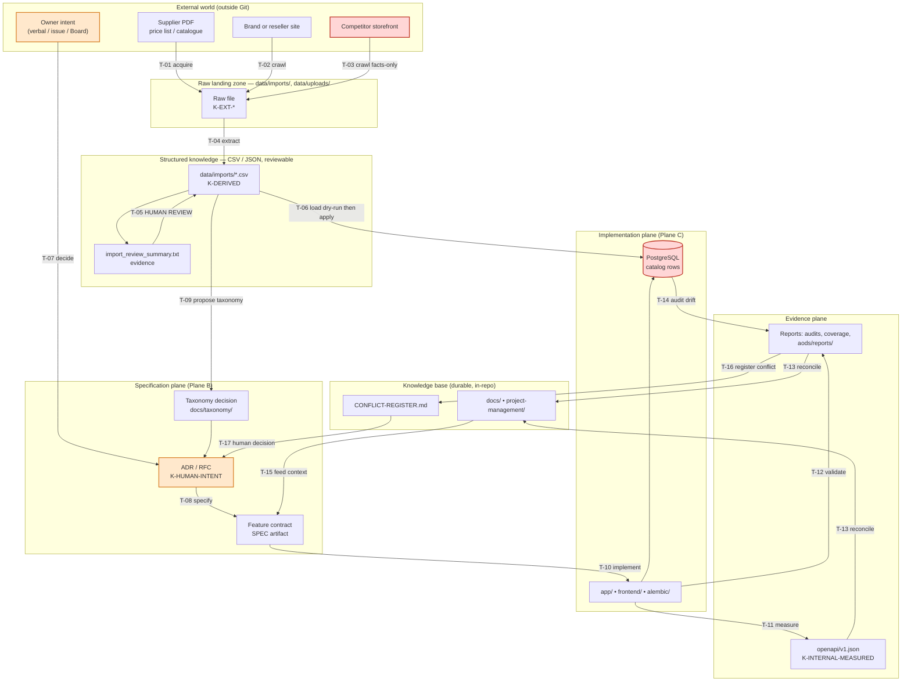
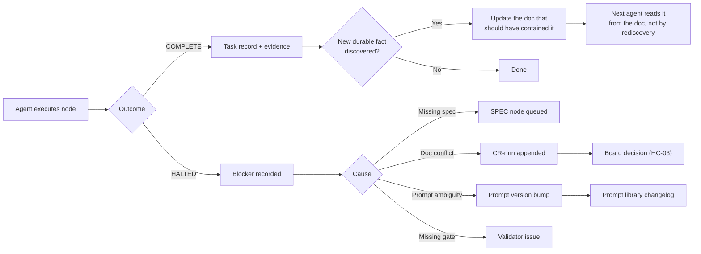

# Knowledge Flow

**Document ID:** `AODS-KNOWLEDGE-FLOW`
**Status:** **Proposed** (inherits [`AODS-CHARTER.md`](../AODS-CHARTER.md) status)
**Version:** 0.1.0
**Date:** 2026-07-29
**Satisfies:** required section 14 (Knowledge Flow)

---

## 1. What this document governs

Knowledge enters this repository from outside it — supplier price-list PDFs, brand catalogues, competitor
product pages, keyword research, audit findings, and the owner's own intent — and it must arrive at one of
exactly three destinations: **a specification**, **a row in the database**, or **an explicit rejection**.

Anything that arrives anywhere else is how architecture drift and hallucinated requirements begin. When an
Auto Mode agent "knows" that a product's accuracy is ±0.02 mm, that knowledge came from somewhere. If the
provenance is not recorded, the claim is indistinguishable from a hallucination, and the repository has no
way to re-derive it. This document defines every legal transformation, its validator, and its provenance
record, so every fact in Karzar can be traced back to the artifact it came from.

**Scope note.** This document covers *knowledge* (facts and intent). It does not cover *code* (see
[`WORKFLOW-GRAPH.md`](../20-lifecycle/WORKFLOW-GRAPH.md)) or *authority* (see
[`AUTHORITY-MODEL.md`](../10-repository-intelligence/AUTHORITY-MODEL.md)).

---

## 2. Knowledge classes

Knowledge is classified by **provenance**, because provenance — not format — determines how much trust it
earns and which validator it must pass.

| Class | Meaning | Trust | Examples in this repo |
|---|---|---|---|
| `K-EXT-PRIMARY` | Published by the manufacturer or a first-party source | High for facts, zero for pricing currency | Dasqua 2025 catalogue PDF, INSIZE price list, mitutoyo.com leaflets |
| `K-EXT-SECONDARY` | Third-party reseller or aggregator | Medium — must be corroborated | `shopmill` INSIZE data (`enrich_insize_from_shopmill.py`), `tosag` images |
| `K-EXT-COMPETITOR` | Competitor storefront | **Facts only. Never text, never images.** | `azarsanat_crawl.py` output |
| `K-DERIVED` | Produced by transforming other knowledge | Inherits the *lowest* trust of its inputs | `data/imports/all_products.csv`, generated SEO descriptions |
| `K-HUMAN-INTENT` | The owner's decisions and priorities | Authoritative by definition | Board minutes, ADR decisions, PMO priorities |
| `K-INTERNAL-MEASURED` | Measured from the running system | Authoritative for "as-built" | `openapi/v1.json`, coverage reports, audit findings |
| `K-AGENT-CLAIM` | Asserted by an AI agent | **Zero until validated.** Never persisted as fact. | Anything in an agent's prose output |

**The load-bearing rule.** `K-AGENT-CLAIM` has no path to the database or to a specification without passing
through a human checkpoint or a mechanical validator. An agent may *propose* that a product belongs in
category 42; it may not *write* that. This single rule is what separates AODS from "let the model fill in
the gaps", and it is the reason [`RISK-REGISTER.md`](RISK-REGISTER.md) `R-002` is controlled rather than open.

### 2.1 Legal-provenance matrix

Not all knowledge may be used for all purposes. This matrix is binding and derives from
[`ADR-012-ingestion-boundary-local-vs-production.md`](../../docs/architecture/adr/ADR-012-ingestion-boundary-local-vs-production.md)
plus the two remediation PRs that had to scrub external-domain wording from descriptions (#122, #124).

| Class | May set specs/numbers | May set descriptions | May set images | May set price | May set taxonomy |
|---|---|---|---|---|---|
| `K-EXT-PRIMARY` | Yes | Yes, rewritten | Yes, if licensed | Yes | Proposal only |
| `K-EXT-SECONDARY` | Yes, if corroborated | Rewritten only | Yes, if licensed | No | Proposal only |
| `K-EXT-COMPETITOR` | Yes, if corroborated | **Never** | **Never** | **Never** | No |
| `K-DERIVED` | Inherits | Inherits | Inherits | Inherits | Proposal only |
| `K-AGENT-CLAIM` | No | Proposal only | No | No | No |

> **Why "descriptions: never" for competitors.** PRs #122 and #124 exist solely because competitor-derived
> wording leaked into product descriptions and had to be force-rewritten twice. That is a repeat incident,
> which makes it a control, not a preference.

---

## 3. The transformation pipeline

Every arrow below is a **named transformation** with an owner, a command, and a validator. Unnamed arrows do
not exist: if a fact appears in the database and you cannot name the transformation that put it there, that
is a `CR`-class finding.



### 3.1 Transformation register

| ID | Transformation | Input → Output | Executed by | Command / mechanism | Validator | Human checkpoint |
|---|---|---|---|---|---|---|
| `T-01` | Acquire supplier PDF | Vendor site → `data/imports/<brand>/*.pdf` | Human | Manual download | Checksum recorded in task record | **`HC-13`** (supply source document) |
| `T-02` | Crawl brand/reseller site | URL → raw HTML/JSON in `data/imports/` | Agent | `mitutoyo_crawl.py`, `shopmill_insize_crawl.py` | Rate-limit + robots respected; SSRF guard | None if read-only |
| `T-03` | Crawl competitor (facts only) | URL → fact rows | Agent | `azarsanat_crawl.py` | **Text/image fields must be empty in output** | `HC-05` (review diff) |
| `T-04` | Extract structured knowledge | PDF/HTML → CSV + summary | Agent | `parse_price_list_pdfs.py` | Row count, non-null SKU, price parses to int | None (output is inert) |
| `T-05` | Review extraction | CSV + summary → approved CSV | Human | Read `import_review_summary.txt`, spot-check 10 rows | Sampling record in task record | **`HC-05`** |
| `T-06` | Load into database | CSV → DB rows | Agent proposes, human applies | `seed_products_from_csv.py --dry-run` then apply | `--gate ingestion`; env must not be prod | **`HC-09`** (authorise run) |
| `T-07` | Decide | Intent → ADR/RFC in `Proposed` | Human (Board) | Write ADR, hold minute | ADR template compliance | **`HC-02`** (accept) |
| `T-08` | Specify | ADR → feature contract | Agent | `SPEC-feature-contract.prompt.md` | `--gate citation`, `--gate links` | **`HC-01`** (accept + freeze spec) |
| `T-09` | Propose taxonomy change | CSV/category data → proposal report | Agent | `promote_measurement_to_l1.py --dry-run`, `remediate_standard_leaves.py` | Dry-run report only; zero writes | **`HC-02`** (taxonomy is an architectural decision) |
| `T-10` | Implement | Spec → code | Agent | `IMPL-*.prompt.md` | External gates: lint, types, test, coverage | **`HC-05`** then **`HC-07`** |
| `T-11` | Measure the contract | Running app → `openapi/v1.json` | Agent/CI | `--gate openapi` | Byte-diff vs committed snapshot | None if identical |
| `T-12` | Validate | Code → reports | CI | `aods_validate.py`, pytest, vitest | Exit code | None |
| `T-13` | Reconcile docs to evidence | Reports/OAS → `docs/` updates | Agent | `DOC-api-contract-sync.prompt.md` | `--gate links`, `--gate registry` | **`HC-05`** |
| `T-14` | Audit for drift | DB/code → findings | Agent | `catalog_remediation.py --dry-run`, audit prompts | Findings must cite file:line | **`HC-05`** |
| `T-15` | Feed context | Docs → prompt context set | Agent | [`CONTEXT-MANAGEMENT.md`](../50-ai-execution/CONTEXT-MANAGEMENT.md) tiers | `--gate prompts` (context declared) | None |
| `T-16` | Register a conflict | Finding → `CR-nnn` row | Agent | Append to conflict register | Append-only; owner field non-empty | None (registration is safe) |
| `T-17` | Resolve a conflict | `CR-nnn` → decision | Human (Board) | Board minute + ADR + dated close | Register row closed with date | **`HC-03`** |

### 3.2 Reading the register

Three properties of this table are deliberate and worth stating, because they are the difference between a
diagram and a control system.

**Every write to the database sits behind a human checkpoint.** `T-06` is the only transformation that
mutates catalog rows, and it requires `HC-09`. There is no agent-only path from an external PDF to a live
product page. This is the structural answer to `R-005` (catalog data written to production by a routine
script) and to `CR-004` (18 scripts defaulting to the production API base).

**Extraction is separated from loading.** `T-04` produces an inert CSV; `T-06` consumes it. An agent that
gets extraction wrong produces a bad file, not a bad database. That separation is what makes `HC-05` cheap
enough that the operator will actually perform it — reviewing a CSV summary is a two-minute task, whereas
reviewing a database mutation after the fact is forensics.

**Taxonomy is proposal-only for every non-human class.** `T-09` emits a report; only `T-07` changes the
taxonomy. Category structure is the highest-leverage, hardest-to-reverse decision in a catalog
(`docs/taxonomy/remove_omumi_padding_dry_run_REPORT.md` exists because a taxonomy change needed a dry-run
report before anyone would touch it), so it is treated as an architectural decision, not a data operation.

---

## 4. The specification-first knowledge path

The user-supplied canonical flow (PDF → extraction → structured knowledge → specifications → architecture →
implementation → validation → documentation → knowledge base) maps onto this repository as follows. The
mapping is not one-to-one, and the divergence is the interesting part.

| Canonical stage | Karzar realisation | Divergence and why |
|---|---|---|
| PDF | `data/imports/<brand>/*.pdf`, acquired by `T-01` | PDFs are **not committed** — they are large, licensed, and vendor-owned. Only the checksum and filename enter Git. |
| Knowledge extraction | `T-04` via `parse_price_list_pdfs.py` | Already exists and is deterministic (pure text parsing, no model call). Deterministic extraction is preferred over model extraction wherever a parser is feasible. |
| Structured knowledge | `data/imports/*.csv` + `import_review_summary.txt` | Committed, reviewable, diffable. This is the durable knowledge record. |
| Specifications | ADR/RFC + feature contract | Catalog facts do **not** become specifications. They become *data*. Only intent becomes specification. |
| Architecture | Canon Lock (`docs/architecture/`) | Unmerged (`CR-001`) — the single largest structural risk to this flow. |
| Implementation | `app/`, `frontend/`, `alembic/` | — |
| Validation | `aods/tools/aods_validate.py` + existing CI | — |
| Documentation | `docs/`, `openapi/v1.json` | `T-13` runs *from evidence toward docs*, never the reverse, so docs cannot invent facts. |
| Knowledge base | `docs/` + `project-management/` + conflict register | The repo *is* the knowledge base. There is no external wiki, deliberately: an external store would immediately drift, and `frontend/AI_CONTEXT.md` already demonstrates what a stale knowledge store does to an agent. |

**The correction this makes to the canonical flow.** In the canonical version, all knowledge flows into
specifications. In Karzar, two streams must be kept apart:

- **Fact knowledge** (a caliper's measuring range) flows into the **database** and is validated against the
  supplier document. It never becomes a specification, because it changes when the supplier changes and a
  specification that changes with every price list is not a specification.
- **Intent knowledge** (we will build brand hub pages) flows into **specifications** and is validated
  against a Board decision.

Conflating the two is precisely how `frontend/AI_CONTEXT.md` came to contain a thousand lines of
architecture claims that no one ratified: observed facts were written down as though they were decisions.
Fact and intent get different pipelines, different validators, and different destinations.

---

## 5. Provenance record — the required shape

Every transformation that produces a durable artifact must emit a provenance block. Without it, `T-14`
(drift audit) cannot distinguish a supplier change from a corruption.

```yaml
# Emitted into the task record; for data loads, also into the run summary.
provenance:
  transformation: T-04
  knowledge_class: K-EXT-PRIMARY
  source:
    kind: pdf
    filename: dasqua_catalog_2025.pdf
    sha256: <64 hex>          # recorded by the human at HC-13
    acquired_utc: 2026-07-29T10:14:00Z
    acquired_by: human
  tool:
    path: scripts/parse_price_list_pdfs.py
    git_sha: <commit that ran>
  output:
    - data/imports/dasqua_products.csv
    - data/imports/import_review_summary.txt
  row_counts:
    parsed: 412
    deduped: 388
    rejected: 24
  review:
    checkpoint: HC-05
    sampled_rows: 10
    reviewer: <human>
    decision: approved
```

**Rationale for the checksum.** The PDF is not in Git, so the only way a future audit can verify that
`dasqua_products.csv` was derived from the document the operator thinks it was is a recorded hash. This is
the one place where AODS asks the human to do arithmetic-like work, and it is worth it: it converts an
uncheckable claim into a checkable one.

**Open issue `OI-KF-01`.** There is currently no automated provenance store — provenance lives in the task
record markdown. A machine-readable `data/imports/PROVENANCE.yaml` would let `--gate ingestion` verify
that every CSV in the tree has a recorded source. Deferred because it requires a decision about whether
historical CSVs (already committed without provenance) get backfilled or grandfathered.

---

## 6. Knowledge decay

Knowledge is not permanently true. A price list expires; an architecture claim goes stale; an audit score
describes a commit that no longer exists. AODS assigns each class a **decay policy**, because an agent
reading a stale document with confidence is the failure mode that produced `CR-015`.

| Class | Decay period | On expiry | Enforcement |
|---|---|---|---|
| Price data (`K-EXT-*`) | 90 days | Mark `stale`; block price-affecting changes until refreshed | `T-14` audit, advisory |
| Product specs (`K-EXT-PRIMARY`) | 365 days | Re-verify against current catalogue | `T-14` audit, advisory |
| `openapi/v1.json` | 0 days — must match `main` exactly | Fail the build | `--gate openapi`, blocking |
| Audit scorecards | Superseded by next audit | Previous score becomes historical evidence only | Authority model (`EVIDENCE` class) |
| Architecture claims in non-canon docs | Immediately on any conflicting ADR | Document becomes `DEPRECATED`; enters forbidden-context list | `--gate registry` |
| PMO status | 1 sprint | Must be re-stated or closed | `--gate pmo` |

**The `frontend/AI_CONTEXT.md` precedent.** That file carries an obsolete banner *and* a thousand lines of
false claims. A banner is not a decay policy: an agent that loads the file gets the false claims regardless
of the banner, because banners are prose and prose is not enforcement. The only effective control is
**removal from the context set**, which is why decay for architecture claims terminates in the forbidden-context
list in [`CONTEXT-MANAGEMENT.md`](../50-ai-execution/CONTEXT-MANAGEMENT.md) rather than in a warning.

---

## 7. Feedback loops (how the system learns)

An orchestration system that cannot learn will re-make the same mistake every task, which is Auto Mode's
"repeated work" weakness expressed at the system level. Three loops close.



| Loop | Trigger | Action | Where it lands | Why this loop exists |
|---|---|---|---|---|
| **L1 — Discovery loop** | An agent had to derive a fact that a document should have stated | Write the fact into the owning document in the same PR | `docs/**` | Prevents the same rediscovery cost on every future task (`R-017`) |
| **L2 — Conflict loop** | An agent found two authorities disagreeing | Append `CR-nnn`; halt the node | `CONFLICT-REGISTER.md` → Board | Conflicts must accumulate visibly, not be silently picked (`R-007`) |
| **L3 — Prompt loop** | An agent misunderstood a prompt, or two runs of the same prompt diverged | Bump the prompt's version, record why | `70-prompts/` + changelog | Determinism is maintained by fixing the prompt, not by re-explaining in chat |

**Loop L1 is the one that pays for AODS.** Every task an agent executes in this repository currently begins
by rediscovering the same context: which docs are authoritative, where transactions are committed, what the
coverage gate is. L1 converts that recurring cost into a one-time write. The measurable signal that L1 is
working is that the `RESTATE` block in successive task records gets shorter over time, because the agent is
quoting documents instead of reconstructing conclusions.

---

## 8. Anti-patterns (observed in this repository)

Each of these has already happened here. They are listed because a knowledge-flow design that does not name
the specific ways this repository leaks knowledge is generic advice, not a control.

| Anti-pattern | Observed instance | Control that now blocks it |
|---|---|---|
| Observed behaviour written down as decided architecture | `frontend/AI_CONTEXT.md` (~1,000 lines) | Fact/intent separation (§4); forbidden-context list |
| Competitor prose entering product descriptions | PRs #122 and #124 (two force-rewrites) | Legal-provenance matrix (§2.1) — competitor text: never |
| Numeric fact restated in four documents, diverging | Coverage gate as 62/67/67/68% | Single-source numeric facts; `T-13` reconciles from evidence |
| Script defaulting to production as its knowledge sink | 18 scripts, `KARZAR_API_BASE` default | `--gate ingestion`, blocking |
| Quality asserted rather than measured | `SCORECARD-AFTER-REMEDIATION.md` 9.0/10 self-certified | `K-AGENT-CLAIM` trust = zero; independent re-audit required |
| Authority document living outside version control | `Website/docs/` authoring tree | `CR-009`, escalated for human decision |
| Knowledge base with no decay policy | Same `AI_CONTEXT.md`, stale banner only | §6 decay table |

---

## 9. Open issues

| ID | Issue | Why it needs a human | Blocks |
|---|---|---|---|
| `OI-KF-01` | No machine-readable provenance store for `data/imports/**` | Requires a backfill-vs-grandfather decision on already-committed CSVs | Full `--gate ingestion` provenance checking |
| `OI-KF-02` | Licensing status of supplier catalogue images is undocumented | Legal question; affects whether `T-02` image imports are permissible at all | Image import resumption (already paused per Phase 1 doc) |
| `OI-KF-03` | Decay periods in §6 (90/365 days) are proposed, not derived from supplier release cadence | Owner knows the real cadence | Enforcement of price staleness |
| `OI-KF-04` | Whether `docs/KNOWLEDGE_PLATFORM_PHASE*.md` (three docs, "awaiting approval") are `Accepted` intent or lapsed proposals | Their status line says "awaiting approval to start"; no minute recorded | Whether the Knowledge Graph work is in scope for the current wave |
| `OI-KF-05` | No recorded checksums for PDFs already used to generate committed CSVs | Historical provenance cannot be reconstructed without the original files | Retroactive verification of `data/imports/*.csv` |
