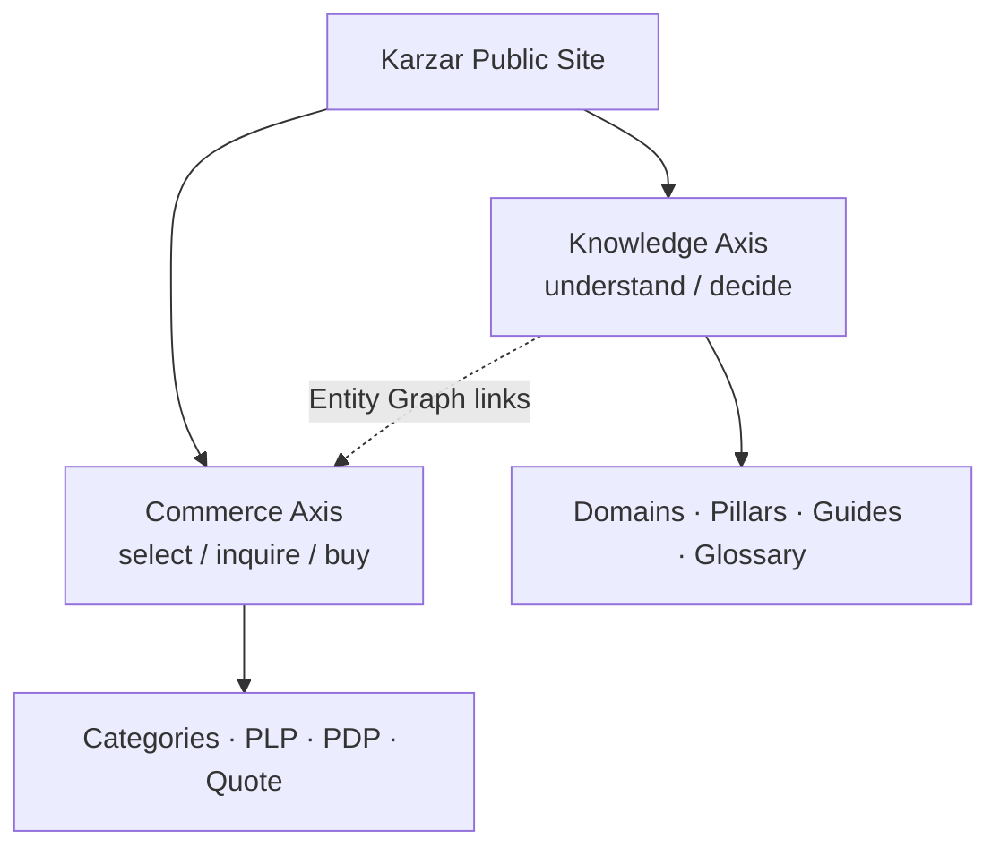
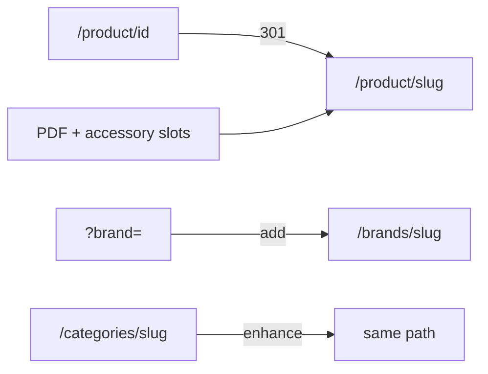

# Karzar Information Architecture

**Status:** **Accepted** (Wave-1 · EPIC 1 scope)  
**Date:** 2026-07-29  
**Owners:** SEO owner · Frontend lead · Platform Architect (acceptance via Board)  
**Parents:** Master Architecture Bible · ADR-010 / ADR-002 / ADR-006 · Domain Model  
**Companions (in repo):** [`url-map.md`](./url-map.md) · [`epic1-ia-readiness.md`](./epic1-ia-readiness.md)  
**Companions (not in repo — do not invent):** `layer-model.md` · `page-type-catalog.md` · `navigation-system.md` · `internal-linking-rules.md`  
**Legacy input:** `docs/constitution/information-architecture-constitution.md` (Category “no paths” claim is **stale** — Canon C4)  
**Baseline:** 5901 active products · Tag `KARZAR-BASELINE-20260728`

### Board Acceptance (Wave 1)

| Field | Value |
|-------|-------|
| **Accepted on** | ۱۴۰۵/۰۵/۰۷ (2026-07-29) |
| **Board** | Architecture Board |
| **Signed** | محمد شباهتی / Mohammad Shebahati |
| **Minute** | موج ۱ قفل EPIC 1 — تصمیم **الف** |
| **Scope** | Binding IA for EPIC 1 surfaces; Fact/KG hubs not required for this wave. |

---

## 0. Document Control

| Field | Value |
|-------|-------|
| Document type | Implementable Information Architecture SoT (**Accepted** Wave-1 · EPIC 1 scope) |
| Non-overlap | Domain owns meaning; ADR-010 owns URL decision; this pack owns page/nav/indexation architecture |
| Change policy | Align ADR-010; Board for axis-level changes |

---

## 1. Purpose, Scope, Non-Goals

### Purpose

Define how humans and crawlers navigate Karzar as a **Persian industrial knowledge + commerce** site: dual axes, eight layers, URL classes, page types, navigation, linking, and an EPIC 1 slice that does **not** wait for Facts/KG.

### Scope

Public Storefront IA (routes, hubs, crumbs, indexation, schema alignment, link equity).  

### Non-goals

Next.js implementation in this prompt · keyword essays · schema DDL · search rankers (Prompt 14) · graph edge storage (Prompt 5) · inventing that Brand hubs or slug PDPs already ship.

---

## 2. IA Principles (MUST/SHOULD)

1. **MUST** separate Knowledge Axis from Commerce Axis without splitting UX into disconnected silos.  
2. **MUST** treat entity hubs (`/categories/{slug}`, `/brands/{slug}`, `/product/{slug}`) as authority URLs — not query filters.  
3. **MUST** follow ADR-010: canonical PDP = **`/product/{slug}`**; id URLs **301**.  
4. **MUST NOT** require Facts/KG tables for EPIC 1 IA.  
5. **MUST** prefer Storefront code over stale constitution text for CURRENT state (Category hubs exist).  
6. **SHOULD** make Metrology the flagship knowledge domain without erasing other catalog domains.  
7. **MUST** surface Document and Accessory slots even when empty (honest IA).  
8. **MUST NOT** index unbounded facet combinations as fake hubs.  
9. **SHOULD** migrate `/blog` gravity toward Learning/Guides without instant hard cut.  
10. **MUST** align JSON-LD `@id` and breadcrumbs to canonical URLs after cutover.

---

## 3. Dual-Axis Model (Knowledge Axis vs Commerce Axis)



| Axis | User job | Primary surfaces |
|------|----------|------------------|
| Knowledge | Understand tools, brands, standards | Guides, Brand hubs (knowledge face), future Tool Class / glossary |
| Commerce | Find SKU, inquire/buy | Category hubs, `/catalog`, PDP, quote/cart |

Shared identity: Product/Brand/Category entities (Domain). Neither axis replaces the other.

### 3.1 Dual-axis anti-patterns

| Anti-pattern | Why it fails |
|--------------|--------------|
| Knowledge only in `/blog` forever | Authority cannot compound on generic publishing silo |
| Commerce only via filters | No entity homes for Brand; weak E-E-A-T |
| One URL doing both poorly | e.g. forcing Tool Class into Category slug |
| Hiding commerce CTAs on knowledge pages | Industrial users still need inquire/buy paths |

### 3.2 Shared objects

Product PDP is primarily Commerce Axis but MUST accept Knowledge Axis modules (guides, document slot). Brand Hub is intentionally hybrid. Category Hub is Commerce-led with optional educational intro.

---

## 4. Layer Model Summary

Eight layers — Knowledge, Navigation, Entity, SEO, Content, Relation, Schema, Search — (detail historically in `layer-model.md`, **not in this repository**). **Database tables are not an IA layer.**

---

## 5. CURRENT IA (as-built map)

```mermaid
flowchart LR
  Home[/] --> Catalog[/catalog filters]
  Home --> Blog[/blog]
  Catalog --> PDP["/product/id"]
  CatHub["/categories/slug EXISTS"] --> PDP
  Blog --> Art[/blog/slug]
  BrandFilter["?brand= only"] -.-> Catalog
```

| Surface | State |
|---------|-------|
| PDP | `/product/{id}`; slug in DB unused |
| Category Hub | **`/categories/{slug}` EXISTS** |
| Brand Hub | **Absent** |
| Catalog PLP | `/catalog` facets |
| Blog | `/blog`, `/blog/{slug}` |
| Sitemap | Historically weak on products |
| JSON-LD | Stronger on blog/PDP than brand |
| Constitution drift | Claims “no category paths” — **obsolete** |

### 5.1 Strengths to preserve

1. Category Hub path already compounds topical signals for leaves.  
2. Megamenu + depth-3 discipline keeps commerce nav operable.  
3. Blog proves dual purpose (teach + sell) is culturally accepted.  
4. PDP JSON-LD Product/Offer exists as a base to realign to slug `@id`.

### 5.2 Weaknesses that block Knowledge Platform IA

1. Id-based PDP wastes slug identity (ADR-002/010).  
2. Brands trapped in filters cannot earn hub authority.  
3. Knowledge Axis lacks a first-class namespace (blog gravity only).  
4. Relation Layer honesty gaps (PDF/accessories hidden or empty without slots).  
5. Facet URLs risk being mistaken for entity architecture.

### 5.3 Stale-document handling

When `information-architecture-constitution.md` conflicts with Storefront routes on Category hubs, **this IA pack + code win for CURRENT**. Constitutions remain historical input (Canon C2/C4), not silently deleted.

---

## 6. TARGET IA (knowledge platform map)

```mermaid
flowchart TB
  subgraph Knowledge
    Guides[Guides / Learning]
    Gloss[Glossary]
    TC[Tool Class Hubs]
    BH[Brand Hubs knowledge face]
  end
  subgraph Commerce
    CH[Category Hubs]
    PLP[/catalog]
    PDP["/product/slug"]
    Quote[Quote / Cart]
  end
  BH --> PDP
  CH --> PDP
  Guides --> TC
  Guides --> PDP
  TC --> PDP
```

Brand Hub is hybrid (knowledge story + commerce PLP). Tool Class Hub is knowledge-first and **not** EPIC 1 critical path.

---

## 7. Transition IA (EPIC 1 without full KG)



Ship: slug PDP + redirects + Brand hubs (priority list) + JSON-LD/crumb alignment + honest document/accessory slots + keep Category hubs.  
Defer: Tool Class hubs, glossary, standards library, typed graph UI, vector search SERP.

Details: [`epic1-ia-readiness.md`](./epic1-ia-readiness.md).

### 7.1 EPIC 1 “thin but real” bar

A Brand Hub that ships meta + brand-locked product grid is **valid IA** for EPIC 1. It is better than `?brand=` forever. Deep OEM narrative, series trees, and Evidence rails can deepen later without moving the URL.

### 7.2 Dependency freeze for EPIC 1 IA

| Allowed dependency | Forbidden dependency |
|--------------------|----------------------|
| Product.slug, Brand.slug, Category.slug | Facts dual-write |
| Existing images/PDF fields (even empty) | Graph DB |
| Storefront routing + sitemap | Vector index |
| ADR-010 Accepted or implemented under Proposed with Board risk acceptance | Waiting for EPIC 3 dictionary MVP |

---

## 8. Public Domain Map (knowledge domains; Metrology flagship)

Working knowledge domains (labels FA in UI later):

| Domain | Role |
|--------|------|
| **دانش اندازه‌گیری (Metrology)** | Flagship authority |
| Cutting tools | Commercial + educational adjacency |
| Toolholding | Holders / workholding |
| Industrial equipment | Machines / ASTPOWER-class |
| Standards & reference | TARGET library |
| Applications & industries | TARGET |
| Problems & maintenance | TARGET |
| Brands | Hybrid hubs (EPIC 1) |
| Guides & learning | Evolves `/blog` |
| Glossary | TARGET with Property dictionary |

**Rule:** Metrology quality bar leads; other domains expand when they meet the same structural standard—not by thin page spam.

Mapping to Category roots is many-to-many (Domain Model): Category ≠ Tool Class.

---

## 9. Commerce Placement Rules (depth ≤ 3; leaf products)

- Category adjacency depth ≤ **3** remains commerce law (ADR-006).  
- Products attach to selectable leaves only.  
- Megamenu flags (`megamenu_hidden`, `megamenu_as_leaf`, `megamenu_bold`) are Navigation Layer controls—not ontology edits.  
- Knowledge pages MAY discuss Tool Classes that span multiple leaves.

---

## 10. Page Type System (summary)

Sixteen minimum types (catalog historically in `page-type-catalog.md`, **not in this repository**): Home, Catalog PLP, Category Hub, Brand Hub, PDP, Article/Guide, Blog index, Learning index, Glossary, Tool Class Hub, Comparison, Standard, Application, Search results, Utilities (noindex), Static legal/marketing.

---

## 11. URL Architecture (summary)

Canonical decisions live in [`url-map.md`](./url-map.md) and **ADR-010**:

- PDP: `/product/{slug}` + 301 from `/product/{id}`  
- Plural `/products/{slug}` superseded unless Board exception  
- Category: keep `/categories/{slug}`  
- Brand: add `/brands/{slug}`  
- Filters ≠ hubs  

---

## 12. Navigation Architecture (summary)

Navigation (detail historically in `navigation-system.md`, **not in this repository**): megamenu = Category tree; crumbs link hubs; Brand launch order by EPIC 0 counts (ASTPOWER → INSIZE → Dasqua → Chumpower → Mitutoyo → SAN OU).

---

## 13. Internal Linking & Equity Rules

Internal linking (detail historically in `internal-linking-rules.md`, **not in this repository**). Core: PDP↔Category↔Brand; no orphan hubs; honest empty Document/Accessory slots; no facet-hub spam.

---

## 14. Indexation Policy by URL class

| Class | Index |
|-------|-------|
| Home, static legal, Category Hub (non-empty), Brand Hub (launched), PDP (active), Articles | **Yes** |
| Empty category hubs | Follow existing crawl hygiene (often noindex) |
| Facet combinations on `/catalog` | **Avoid** as bulk index targets |
| Cart/quote/checkout/account/login | **noindex** |
| Search results | Usually noindex / limited |
| Future Tool Class / glossary | Yes when launched with substance |

### 14.1 Why facet URLs are not hubs

Facet combinations are infinite, unstable, and often zero-result. Indexing them competes with Category/Brand hubs and creates crawl budget waste. IA policy: **hubs accumulate authority; filters refine sessions**.

### 14.2 Sitemap expectations (EPIC 1)

Sitemap SHOULD include: static pages, articles, active product slug URLs, launched brand hubs, category hubs (non-empty). SHOULD NOT need Facts tables to list products—slugs already exist in DB.

---

## 15. Schema Architecture by page type

| Page | Schema focus |
|------|--------------|
| PDP | Product, Offer, BreadcrumbList; `@id` = canonical slug URL |
| Category Hub | CollectionPage, ItemList, BreadcrumbList |
| Brand Hub | Brand/Organization + CollectionPage + ItemList |
| Article | Article + BreadcrumbList |
| Home | Organization, WebSite |

Schema Layer follows SEO canonical URLs—not the reverse. Full property laundry lists without page binding are out of scope.

---

## 16. Brand Hub Program (priority brands)

EPIC 1 launches `/brands/{slug}` starting with: **ASTPOWER, INSIZE, Dasqua, Chumpower, Mitutoyo, SAN OU** (counts from EPIC 0 brand intelligence).  

Minimum viable hub: meta/title/description, logo if any, embedded brand-locked PLP, links to representative categories. Deep OEM storytelling can lag URL launch (RFC-005).

### 16.1 Launch waves (recommendation)

| Wave | Brands | Goal |
|------|--------|------|
| Wave A | INSIZE, Mitutoyo, Dasqua | Spec-richer / authority brands first for quality demos |
| Wave B | ASTPOWER, Chumpower, SAN OU | High-volume OEM coverage |

IA does not block Wave B behind perfect Wave A content—URL + PLP embed is the EPIC 1 bar. Sequencing inside engineering sprints MAY prefer Wave A for stakeholder demos while Wave B URLs still ship in the same epic.

### 16.2 Unbranded SKUs

Unbranded Products (~288) remain on Category Hub + PDP paths only. Do **not** create a fake “Generic” Brand hub to force linkage (Domain R11).

---

## 17. Category Hub vs Filter PLP policy

| Need | Use |
|------|-----|
| Category authority + intro + children | **Category Hub** `/categories/{slug}` |
| Ad-hoc multi-filter browse | **Catalog PLP** `/catalog?...` |
| Brand authority | **Brand Hub** (not `?brand=` alone) |

`?category=` / `?brand=` remain useful UX filters; they MUST NOT be positioned as long-term entity SoT URLs in crumbs/schema.

---

## 18. Blog → Guides/Learning migration stance

- **CURRENT:** `/blog` is valid Expression index.  
- **TARGET:** Learning/Guides index as Knowledge Axis entry; articles declare primary entity.  
- **TRANSITION:** Do not hard-delete `/blog` in EPIC 1. Add entity requirements progressively; introduce `/guides` (or chosen path) when content ops ready; 301 individual slugs only with a planned matrix.

---

## 19. Accessibility of IA (principles only)

- Landmark regions: header nav, main, complementary related modules, footer.  
- Crumb links must be real links (not text-only) on PDP/Category/Brand after EPIC 1.  
- Empty Document/Accessory slots need accessible names (“کاتالوگ PDF در دسترس نیست” pattern—copy later).  
- Megamenu keyboard operability remains a Storefront engineering concern; IA requires the structure to be hierarchical and labeled—not a flat icon dump.

---

## 20. Mapping to ADRs / Domain / Epics / Prompts 5–15

| IA concern | ADR / Domain | Epic / Prompt |
|------------|--------------|---------------|
| Slug URL | ADR-010, ADR-002 | EPIC 1 · RFC-004 |
| Brand hubs | ADR-010 | EPIC 1 · RFC-005 |
| Category ≠ Tool Class | ADR-006, Domain | Prompt 5 Tool Class hubs later |
| Document slots | ADR-008 | EPIC 1 UI · EPIC 2 corpus |
| Search SERP depth | ADR-007 | Prompt 14 |
| Typed relations UI | Domain Relation | Prompt 5 / EPIC 4 |
| AI entry points | ADR-009 | Prompt 13 — gated |

---

## 21. Open Questions

1. Primary nav inclusion of Brands vs footer-only at EPIC 1.  
2. Final Learning index path (`/guides` vs `/learn`).  
3. Provisional Tool Class URL namespace.  
4. How aggressively to noindex facet PLPs (ops + SEO joint).  
5. Brand hub content depth MVP vs URL-first launch.

---

## 22. Acceptance Self-Check

| # | Criterion | Result |
|---|-----------|--------|
| Q1 | Required IA files exist | **PASS** |
| Q2 | Eight layers depth cards | **PASS** |
| Q3 | CURRENT vs TARGET vs EPIC1 distinct | **PASS** |
| Q4 | URL map: `/product/{slug}` + 301 + brand hubs; Category EXISTS | **PASS** |
| Q5 | Page type catalog ≥16 types; Category Hub CURRENT-existing | **PASS** |
| Q6 | No code/schema/data/git mutations | **PASS** |
| Q7 | ADR-010 + Category≠Tool Class + plural drift reconciled | **PASS** |
| Q8 | Metrology flagship without erasing other domains | **PASS** |
| Q9 | epic1-ia-readiness actionable | **PASS** |
| Q10 | Next = Prompt 5 Knowledge Graph | **PASS** |

---

## References

- `docs/architecture/adr/ADR-010-seo-url-contract.md`  
- `docs/architecture/domain/karzar-domain-model.md`  
- `docs/architecture/karzar-knowledge-platform-master-architecture.md`  
- `docs/constitution/information-architecture-constitution.md`  
- `docs/constitution/seo-architecture-constitution.md`  
- `docs/audits/EPIC0-executive-summary.md`  
- `docs/audits/brand-intelligence-baseline.md`  
- `docs/roadmap/knowledge-platform-execution-backlog.md`  
- `backend/frontend/Storefront/src/app/categories/[slug]/page.tsx`
