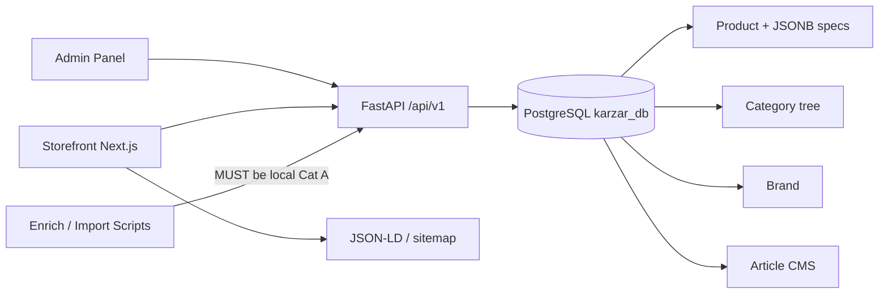
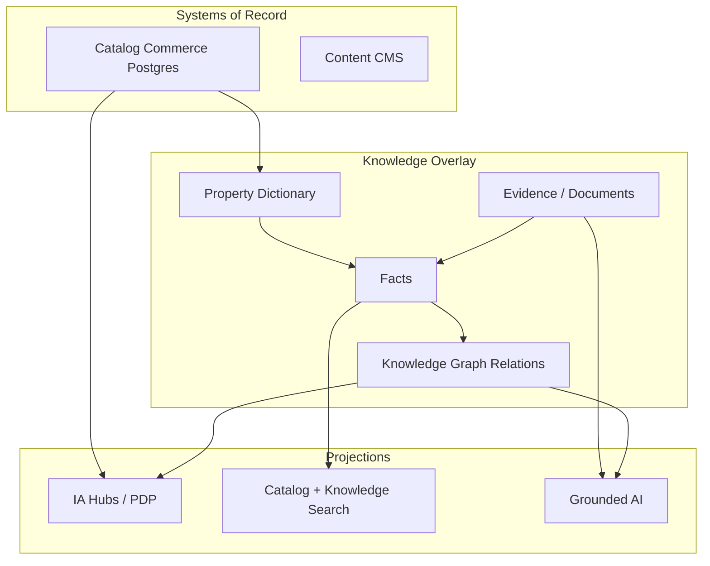
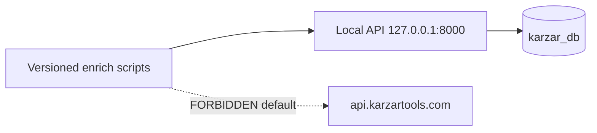

# Karzar Knowledge Platform — Master Architecture

> **Canonical promoted copy** in repo `Shebahati/Karzar` (`backend/docs/architecture/`). Authoring mirror: `Website/docs/architecture/karzar-knowledge-platform-master-architecture.md`.

**Also known as:** KarzarTools Canonical Architecture  
**Path equivalence:** This document **is** the Canonical Architecture formerly reserved as `docs/architecture/KarzarTools-Canonical-Architecture.md` in `DOCUMENT_GOVERNANCE.md`. A second competing Canonical file MUST NOT be created.

---

## 0. Document Control

| Field | Value |
|-------|-------|
| **Status** | **Accepted** (Wave-1 EPIC-1 Canon Lock) |
| **Document type** | Master Architecture Bible — parent hub for Prompts 2–15 |
| **Owners** | Platform Architect (author) · Architecture Board (acceptance) · Backend lead (Plane A ingestion alignment) |
| **Last updated** | 2026-07-29 (Accepted ۱۴۰۵/۰۵/۰۷) |
| **Baseline tag** | `KARZAR-BASELINE-20260728` → `6e56431` |
| **Alembic** | `c4d5e6f7a8b9` |
| **Database** | `karzar_db` |
| **Active products** | **5901** (EPIC 0 freeze) |
| **Repo** | `/home/moahmmad/Projects/Karzar/Website/backend` → `https://github.com/Shebahati/Karzar.git` |
| **Docs authoring tree** | `/home/moahmmad/Projects/Karzar/Website/docs/` (Plane B) |
| **Companion prompt pack** | `docs/prompts/karzar-enterprise-architecture-prompts.md` (Consistency Canon C0–C10 binding) |
| **Canon Lock Index** | [`CANON-LOCK.md`](./CANON-LOCK.md) — binding criteria list (Wave-1 Accepted) |

**SoT status rule:** This Bible is the **architecture documentation hub (Plane B)** — still distinct from Catalog/Data SoR (Plane A) and runtime stores (Plane C). It MUST NOT override KEEP operational documents (`data-ingestion-policy.md`, production↔development synchronization strategy audit).

### Board Acceptance (Wave 1)

| Field | Value |
|-------|-------|
| **Status** | Accepted |
| **Accepted on** | ۱۴۰۵/۰۵/۰۷ (2026-07-29) |
| **Board** | Architecture Board |
| **Signed** | محمد شباهتی / Mohammad Shebahati |
| **Minute** | موج ۱ قفل EPIC 1 — تصمیم **الف** |
| **Scope** | Canonical architecture hub; criteria for all subsequent architecture-aligned work. Does not by itself Accept non–Wave-1 packs. |

### SoT Planes (A · B · C)

| Plane | Governs | Authoritative references |
|-------|---------|--------------------------|
| **A. Catalog / product data** | SKU commerce truth; future knowledge-fact provenance | Existing ADR-001 narrative in `data-ingestion-policy.md` + `DOCUMENT_GOVERNANCE.md`: production snapshot = temporary baseline; long-term = **versioned data pipeline + Git**. Markdown under `Website/docs/` is **not** product-data SoR. |
| **B. Architecture documentation** | Normative architecture drafts humans edit | `Website/docs/` → promote KEEP set into `backend/docs/` via PR |
| **C. Runtime stores** | Live serving | PostgreSQL `karzar_db` + FastAPI — deployment *result*, not architecture-doc SoT |

**Document-type law (normative):** Reports ≠ ADRs ≠ RFCs ≠ Domain Model. Audits measure; ADRs decide; RFCs propose change plans; Domain Model defines meaning; this Bible orients and indexes.

### Related future docs (Prompts 2–15)

| Prompt | Pack / deliverable |
|--------|-------------------|
| 2 | `docs/architecture/adr/` |
| 3 | `docs/architecture/domain/` |
| 4 | `docs/architecture/information-architecture/` |
| 5 | `docs/architecture/knowledge-graph/` |
| 6 | `docs/architecture/pim/` |
| 7 | `docs/architecture/property-governance/` |
| 8 | `docs/architecture/governance/` |
| 9 | `docs/architecture/data-quality/` |
| 10 | `docs/architecture/rfc/` |
| 11 | `docs/development/standards/` |
| 12 | `docs/governance/repository/` |
| 13 | `docs/architecture/ai/` |
| 14 | `docs/architecture/search/` |
| 15 | `docs/roadmap/enterprise/` |

### Change policy

1. Material changes to this Bible REQUIRE an RFC (or Architecture Board minute) after Status=`Accepted`.  
2. While `Proposed`, Platform Architect MAY revise for consistency with Canon / EPIC 0 evidence without claiming Accepted authority.  
3. Child packs (ADR/Domain/IA/…) MUST cite this Bible; they MUST NOT silently redefine SoT planes or EPIC 0 metrics.  
4. Legacy files are classified — **not deleted** — by prompts (Canon C2).

---

## 1. Vision

### 1.1 Business vision

Karzar serves Iranian/Persian industrial buyers and engineers who need trustworthy measuring tools, cutting tools, and adjacent industrial equipment — with honest inquiry/priced commerce lanes — and who increasingly expect reference-grade product knowledge (specs, brands, documents), not only a SKU grid.

### 1.2 Platform vision

Evolve from a **strong industrial commerce catalog** into an **Industrial Knowledge Platform**: governed properties and facts, evidence-backed claims, crawlable brand/category/product identity, search that separates catalog findability from knowledge retrieval, and AI that cites Evidence — without breaking the **5901**-SKU commerce baseline.

### 1.3 Non-goals (explicit)

- Replacing Postgres commerce SoR with a graph database as the cart/order system of record.  
- Launching user-facing generative RAG while Evidence/PDF coverage ≈ 0.  
- Dual-writing JSONB → Facts before FA/EN property mapping is governed.  
- Using production APIs as the developer enrichment sandbox.  
- Treating architecture markdown as the product database.  
- Re-opening Repository Governance lock (**PASS**) as if it failed.

---

## 2. Principles

### P1 — Measurement before mutation

**Statement:** Catalog and platform changes that reshape meaning or mass data MUST be preceded by measurement (EPIC 0 pattern).  
**Rationale:** Unmeasured “cleanup” destroys auditability and recreates FA/EN chaos.  
**Consequences:** Scorecards and audits are gates, not optional reports.  
**Anti-pattern:** Enriching production blindly to “improve completeness.”

### P2 — Local enrichment only

**Statement:** Routine catalog writes (Category A) MUST target local API only (`KARZAR_API_BASE=http://127.0.0.1:8000/api/v1`). Production write enrichment is forbidden by default (`data-ingestion-policy.md`).  
**Rationale:** Production is not a sandbox; scripts historically defaulted to live API.  
**Consequences:** PRs that point enrichers at `api.karzartools.com` for routine work are non-compliant.  
**Anti-pattern:** “Just this once” laptop → production PUT storms.

### P3 — Identity before intelligence

**Statement:** SKU uniqueness and stable public slug identity MUST precede RAG, compare-at-scale, and knowledge graph claims.  
**Rationale:** EPIC 0 shows identity is strong (duplicate SKU/slug among active ≈ 0); intelligence layers are not.  
**Consequences:** EPIC 1 URL contract is first implementation work.  
**Anti-pattern:** Embedding thin PDPs while `/product/{id}` remains the only public identity.

### P4 — Evidence before generation

**Statement:** User-facing generative answers MUST be gated while Evidence corpus is empty (PDF fill **0** today). Citations are mandatory when generative answers are enabled.  
**Rationale:** Empty Evidence + LLM = hallucination risk on industrial claims.  
**Consequences:** EPIC 5 blocked until ADR-009 gates; offline eval MAY proceed.  
**Anti-pattern:** Shipping “AI consultant” on JSONB residue (`top:*` operational keys) as if it were Evidence.

### P5 — FA/EN mapping before Facts dual-write

**Statement:** FA and EN JSON keys that mean the same concept (e.g. `accuracy` / `دقت`, `range` / `بازه اندازه‌گیری`) MUST map to one Property before dual-write.  
**Rationale:** Dual-write without mapping duplicates the dictionary forever.  
**Consequences:** EPIC 3 builds mapping; dual-write stays gated (Canon C8).  
**Anti-pattern:** “Normalize in place in production JSONB” without a dictionary.

### P6 — JSONB remains operational until approved migration

**Statement:** `products.specifications` JSONB remains the operational spec store until ADR-003/004 + RFC-001/003 are Accepted and implemented.  
**Rationale:** Commerce and PLP already depend on JSONB + GIN.  
**Consequences:** No big-bang drop of JSONB.  
**Anti-pattern:** Schema churn before Property governance exists.

### P7 — Bounded contexts over god-models

**Statement:** Commerce, PIM/specs, taxonomy, knowledge, search, SEO, AI, and ingestion are separate contexts with explicit interfaces.  
**Rationale:** God-tables and god-docs recreate coupling.  
**Consequences:** Category ≠ Tool Class; Article ≠ Evidence; price ≠ ontological essence.  
**Anti-pattern:** One “Product JSON” that mixes list-price residue, SEO, and metrology facts without owners.

### P8 — SEO/URL stability is a product contract

**Statement:** Canonical PDP MUST move to `/product/{slug}` with 301 from `/product/{id}`; JSON-LD `@id` and breadcrumbs MUST follow canonical URLs.  
**Rationale:** Slugs exist in DB; routes do not use them; plural `/products/{slug}` in SEO constitution is drift (Canon C3).  
**Consequences:** ADR-010 / RFC-004 own the contract; EPIC 1 implements.  
**Anti-pattern:** Shipping brand hubs on disposable `?brand=` filters as long-term authority URLs.

### P9 — Repository governance ≠ Project governance

**Statement:** Git lock (**PASS**) is necessary but not sufficient; boards, milestones, RACI, and release trains are a separate plane (Prompt 12).  
**Rationale:** Clean git with no program governance still stalls delivery.  
**Consequences:** Do not re-litigate Phase 11 lock inside feature work.  
**Anti-pattern:** “Governance done” because `.gitignore` hardened.

### P10 — Documents are code-adjacent; audits are evidence

**Statement:** Normative architecture lives in promoted docs; audits measure reality and MUST NOT silently become policy.  
**Rationale:** EPIC 0 numbers freeze constraints; they are not aspirations to rewrite upward.  
**Consequences:** Cite audits; change policy via ADR/RFC.  
**Anti-pattern:** Editing an audit to make the catalog look healthier.

---

## 3. Domain Overview

> **Full entity dictionary is owned by Prompt 3** — pack path `docs/architecture/domain/` is **not in this repository** until promoted. Definitions below remain orientation-only.

| Concept | One-paragraph meaning (orientation) |
|---------|-------------------------------------|
| **Product** | Commercial SKU offer: required category, optional brand, prices/availability, SEO scalars, JSONB specs, images; identity via `id` / `sku` / `slug`. |
| **Brand** | Manufacturer/label entity (`ASTPOWER`, `INSIZE`, `Dasqua`, `Chumpower`, `Mitutoyo`, `SAN OU`, …); commerce facet today; knowledge hub target. |
| **Category** | Merchandising taxonomy node (depth ≤ 3); not Tool Class. |
| **Series / Family** | Manufacturer structuring concepts — largely **missing** as first-class SoR today. |
| **Tool Class** | Ontological class of tool (e.g. Digital Caliper) — distinct from Category path. |
| **Accessory** | Related product/component relation; `optional_accessories` JSON section exists but fill ≈ 0. |
| **Document** | Datasheet/catalog PDF etc.; `pdf_catalog_url` exists; fill **0**. |
| **Property** | Governed attribute definition (not a raw JSON key). |
| **Fact** | Valued assertion of a Property on an entity (unit/qualifiers/status) — meaning in Prompt 3; reification in Prompt 5. |
| **Evidence** | Support for Facts (documents/sources); empty today ⇒ AI gated. |
| **Source** | Provenance origin of Evidence/claims. |
| **Knowledge Article** | Editorial Expression (`articles` CMS); soft `related_product_ids`; not automatically Evidence. |
| **Relation** | Typed knowledge edge; soft int arrays are transitional debt. |
| **Ontology** | Class/meaning system; not the megamenu. |

---

## 4. Bounded Contexts

| Context | Purpose | Core entities (logical) | Upstream / Downstream | Ownership | Integration |
|---------|---------|-------------------------|-----------------------|-----------|-------------|
| **Catalog Commerce** | Sell/inquire SKUs | Product, price, availability, cart/order bridges | ← PIM/Taxonomy; → Storefront/Hesabfa | Catalog ops | Modular monolith API |
| **PIM / Product Spec** | Spec meaning & quality | Product specs, Property/Fact (target) | ← Enrichment; → Compare/Search/AI | PIM / Property steward | JSONB now; Facts later |
| **Taxonomy** | Merchandising tree | Category, megamenu flags | → Catalog placement | Taxonomy owner | Adjacency tree depth ≤ 3 |
| **Media & Document** | Images, PDFs | ProductImage, Document | → PDP/Evidence | Media steward | Uploads + URLs |
| **Knowledge Content** | Guides/articles/hubs | Article, Brand hub content | → SEO/Search | Content owner | CMS blocks JSONB |
| **Search** | Find products & knowledge | Index docs | ← Catalog/Knowledge | Search owner | Lexical near-term; hybrid later |
| **SEO / Navigation** | Crawlable identity & wayfinding | Slug URLs, hubs, JSON-LD | ← IA | SEO owner | Next.js Storefront |
| **AI / Retrieval** | Grounded answers | Chunks, citations | ← Evidence/Graph | AI owner | **Gated** |
| **Ingestion & Enrichment** | Controlled catalog writes | Scripts, jobs | → Local API only (Cat A) | Backend lead | Policy-bound pipelines |
| **Identity & Admin** | AuthZ, admin mutations | Users, roles, admin panel | Cross-cutting | Security/Admin | MUST NOT bypass knowledge Approver for Published Facts |

---

## 5. Architecture Views

### 5.1 Current-state architecture (as-built)



**CURRENT realities (code + EPIC 0):**
- PDP: `/product/{id}`; slug unused in routing.  
- Category hub: `/categories/{slug}` **exists**.  
- Brand hub: **absent**.  
- Specs: single JSONB (`technical_specs` / `features` / `dimensions` / `optional_accessories`).  
- Evidence/PDF ≈ **0**; avg quality **~58.3/100**; empty technical_specs **~70.34%**; without image **~79.78%**; unbranded **288**.

### 5.2 Target-state architecture (Knowledge Platform)



### 5.3 Transition architecture (strangler)

| Phase | Rule |
|-------|------|
| Now → EPIC 1 | URL/slug + brand hubs + JSON-LD; **no** Facts tables required |
| EPIC 2–3 | PIM readiness + Property dictionary/mapping; JSONB still readable SoT for specs |
| Dual-write | Only after ADR-004 mapping + RFC-001/003 Accepted |
| EPIC 4 | Logical graph overlay; sparse-safe; ≠ AI launch |
| EPIC 5 | Generative features only after Evidence + citation gates |



---

## 6. Repository & Engineering Topology

| Concern | Location |
|---------|----------|
| Canonical code | `Website/backend` (GitHub `Shebahati/Karzar`) |
| Storefront / Admin | `backend/frontend/Storefront`, `backend/frontend/admin-panel` |
| Architecture authoring (Plane B) | `Website/docs/` |
| Promoted Git docs target | `backend/docs/` (via approved promotion) |
| Analytical reports | `Website/reports/` (e.g. catalog-baseline) — evidence, not policy |
| Models | `app/db/models/` |

**Worktree KEEP set** (reference only; do not re-decide): `backend`, `backend-pmo`, `backend-stat-fix`, `backend-insize-shopmill` — see `docs/audits/worktree-final-decision-matrix.md`. Cleanup is human-approved, not autonomous.

**Branch / tag:** Baseline tag `KARZAR-BASELINE-20260728` immutable for migration marker; repository governance lock **PASS**. Primary may use Phase-9 stand-in branch until `main` unlock via `backend-stat-fix` (documented; not executed here).

---

## 7. Deployment & Environments

| Environment | Role |
|-------------|------|
| **Local baseline** | Develop/test against `karzar_db` replica; Category A enrichment |
| **Production** | Runtime serving; not enrichment sandbox; Category B only with ticket/backup controls per ingestion policy |

**Write boundary:** `data-ingestion-policy.md` is **binding** for importers and wins over conceptual `data-governance.md` on importer conflicts.

**Backup / restore:** Follow existing operations runbooks (`docs/operations/*`, `backend/docs/OPERATIONS.md`). This Bible does not invent new runbooks.

---

## 8. Data Architecture Summary

### CURRENT

- **Identity:** `id` (DB), `sku` (commerce unique among non-deleted), `slug` (unique; unused in routes).  
- **Classification:** required `category_id`; optional `brand_id` (unbranded allowed).  
- **Specs:** JSONB sections + GIN index; `spec_template_key` underused.  
- **Media:** `product_images`; multi-image rare.  
- **Documents:** `pdf_catalog_url` unused at scale (fill **0**).  
- **Not governed:** Property dictionary, Units, FA/EN aliases, Series/Family, Evidence grades, MPN as first-class (may be TARGET).

### TARGET (summary)

Property dictionary + Facts + Evidence overlay; JSONB strangler until cutover criteria met. FA/EN aliases collapse to one Property identity.

### TRANSITION

Measure → map → dual-write (gated) → read preference shift → deprecate JSONB as spec SoT only when RFC exit criteria pass.

**PIM pack (Prompt 6):** `docs/architecture/pim/` — **not in this repository** until promoted; field groups, tiers, JSONB→Facts strangler (historical intent).

**Property Governance (Prompt 7):** `docs/architecture/property-governance/` — **not in this repository** until promoted; dual-write remains gated.

---

## 9. Knowledge Architecture Summary

| Layer | CURRENT | TARGET | TRANSITION |
|-------|---------|--------|------------|
| Catalog | Strong SKU commerce | Remains SoR for price/stock | Unchanged ownership |
| Knowledge | Thin (blog/articles; soft product links) | Hubs, Tool Class, Facts, Evidence | Brand hubs in EPIC 1; Facts later |
| Evidence | ≈ empty | Documents + graded support | PDF ingestion local-first |

**Gate:** No user-facing RAG launch while Evidence≈0 without explicit high-risk acceptance via ADR-009 path.

**KG pack (Prompt 5):** `docs/architecture/knowledge-graph/` — **not in this repository** until promoted; logical overlay, Style A Fact nodes (historical intent).

---

## 10. AI Architecture Summary (index level)

Capabilities (future): embedding pipeline, chunking, citation, retriever, ranking/re-ranking, hybrid search, vector store.  

**Pack (Prompt 13):** `docs/architecture/ai/` — **not in this repository** until promoted. Generative remains **BLOCKED** until Evidence/gates exist (ADR-009 reserved, not promoted).  

Offline evaluation MAY proceed; production generative answers MUST NOT before gates. AI never Approves/Publishes (Data Gov).

---

## 11. Search Architecture Summary

| Mode | Role | Timing |
|------|------|--------|
| **Catalog lexical / facets** | Find SKUs | Near-term improvements (no vector dependency) |
| **Knowledge search** | Articles/hubs/docs | Grows with Evidence |
| **Hybrid** | Fuse lexical + semantic + graph-bias | After embedding readiness; Prompt 14 depth |

**Pack (Prompt 14):** `docs/architecture/search/` — **not in this repository** until promoted; Catalog ≠ Knowledge; lexical-first (historical intent).

Catalog search ≠ knowledge search responsibilities (ADR-007).

---

## 12. SEO & Information Architecture Summary

### URL contract (Canon C3)

| Class | CURRENT | TARGET |
|-------|---------|--------|
| PDP | `/product/{id}` | `/product/{slug}` + 301 from id |
| Category hub | `/categories/{slug}` exists | Enhance in place |
| Brand hub | Absent | `/brands/{slug}` |
| PLP | `/catalog` filters | Coexists; not a substitute for entity hubs |

Stale SEO constitution plural `/products/{slug}` MUST be reconciled in ADR-010 (default = singular).

**IA pack (Prompt 4):** [`docs/architecture/information-architecture/`](./information-architecture/README.md) — layers, url-map, page types, EPIC 1 readiness.

### IA layers (one-sentence ownership; Prompt 4 owns depth)

| Layer | Owns |
|-------|------|
| Knowledge | Industrial meaning domains & pillars |
| Navigation | Menus, megamenu, breadcrumbs |
| Entity | Crawlable homes for Brand/Product/Tool Class |
| SEO | Canonicalization, indexation, authority compounding |
| Content | Expressions/guides as IA objects |
| Relation | How pages expose typed links |
| Schema | JSON-LD per page type |
| Search | Entry points & zero-result IA (ranking → Prompt 14) |

Database tables are **not** an IA layer.

---

## 13. Governance Model

### 13.1 Repository Governance (Git)

Status: **PASS** — `docs/audits/repository-governance-final-lock.md`. Prompt 12 evolves Project Governance; MUST NOT reopen lock as FAIL.

### 13.2 Project Governance (minimum roles)

| Role | Responsibility |
|------|----------------|
| **Architecture Board** | Accept Bible/ADRs; resolve plane conflicts |
| **Decision Board** | Epic exit / release go-no-go |
| **Domain Owners** | Brand, Taxonomy, Properties, Content, Search, AI |

### 13.3 Data Governance

**Pack (Prompt 8):** `docs/architecture/governance/` — **not in this repository** until promoted; RACI/stewardship (historical intent).  

Binding interim + permanent importer rule: **`data-ingestion-policy.md` wins** for importers; this pack MUST NOT weaken local-only Category A enrichment. Property approval remains steward-scoped (Prompt 7); enterprise RACI lives in the governance pack. Legacy `data-governance.md` → MERGE after Accepted (Canon C2).

---

### 13.4 Definition of Done (architecture changes)

- Problem measured or cited  
- ADR/RFC referenced when required  
- CURRENT/TARGET/TRANSITION stated  
- Ingestion & AI gates respected  
- No silent production enrichment  
- Docs classified in relationship map if overlapping legacy

### 13.5 Risk Register (initial)

| ID | Risk | Mitigation |
|----|------|------------|
| R1 | FA/EN dual Properties | ADR-004 + Prompt 7 mapping before dual-write |
| R2 | RAG hallucination | Evidence gate ADR-009 |
| R3 | Prod API enrichment relapse | ADR-012 + PR checks Prompt 11 |
| R4 | URL plural/singular drift | ADR-010 Canon C3 |
| R5 | Category confused with Tool Class | Domain Prompt 3 + ADR-006 |
| R6 | Worktree sprawl | KEEP matrix; human cleanup only |
| R7 | Docs SoT collapsed into product SoR | Planes A/B/C in ADR-001 |

### 13.6 Dependency Matrix (summary)

| Epic | Needs architecture | Systems |
|------|--------------------|---------|
| 0 | Done (audits) | Analytics read-only |
| 1 | ADR-010, IA pack, RFC-004/005 | Storefront routes, Brand API meta |
| 2 | PIM pack, RFC-003 path | Schema later |
| 3 | ADR-004/011, Property pack | Dictionary (no forced dual-write) |
| 4 | ADR-005, KG pack | Overlay |
| 5 | ADR-009, AI pack, Evidence | Retrieval |

---

## 14. Development Workflow

```text
Idea → RFC (Prompt 10) → ADR if durable decision (Prompt 2) → Implementation PR → Audit/measurement
```

- **Doc promotion:** `Website/docs/` (Plane B) → `backend/docs/` via PR when approved (`documentation-index.md`).  
- **Enrichment:** local API only for Category A; Plane A writes ≠ docs authoring.  
- **Catalog/Data SoR:** versioned pipeline + Git per existing ADR-001 narrative — this Bible is not the product database.

---

## 15. Roadmap Alignment

**Pack (Prompt 15):** `docs/roadmap/enterprise/` — **not in this repository** until promoted; EPIC1-first program plan (historical intent).

| Epic | Status / intent | Unblocked by prompts |
|------|-----------------|----------------------|
| **0** | Measurement **complete** | — (remonitor via Prompt 9) |
| **1** | Next implementation: slug PDP + 301, brand hubs, JSON-LD, PDF CTA honesty | 2 (ADR-010), 4 (IA), 10 (RFC-004/005), 11, **15** |
| **2** | PIM schema / document coverage movement | 3, 6, 10 (RFC-003) |
| **3** | Property dictionary + FA/EN mapping (dual-write still gated) | 7, 2 (ADR-004/011), 10 (RFC-007) |
| **4** | Knowledge graph overlay | 5, 2 (ADR-005) |
| **5** | AI/RAG after gates | 13, 14, 2 (ADR-009), Evidence progress |

**EPIC 1 priorities** (must match EPIC0 executive summary unless Board supersedes): slug routing + id→slug 301; brand hubs + meta API; JSON-LD/`@id`/breadcrumb alignment; surface PDF CTA + stop stripping accessories.

---

## 16. ADR Index (IDs + titles ONLY)

**ADR pack location (Prompt 2):** [`docs/architecture/adr/`](./adr/README.md) — bodies authored; status remains **Proposed** pending Architecture Board.

| ID | Title | Status | Owner role | Depends on | Prompt that will author it |
|----|-------|--------|------------|------------|------------------------------|
| ADR-001 | Source of Truth Planes (Catalog/Data vs Docs vs Runtime) | Proposed | Platform Architect | Ingestion ADR-001 narrative | **Prompt 2** |
| ADR-002 | Product Identity | Proposed | PIM / Catalog | ADR-001 | **Prompt 2** |
| ADR-003 | Product Specifications Storage | Proposed | PIM Architect | ADR-002 | **Prompt 2** |
| ADR-004 | JSONB Strategy & FA/EN Mapping | Proposed | Property Steward | ADR-003, EPIC0 JSONB | **Prompt 2** |
| ADR-005 | Knowledge Graph | Proposed | Knowledge Architect | ADR-001, Domain | **Prompt 2** |
| ADR-006 | Category Taxonomy | Proposed | Taxonomy Owner | ADR-002 | **Prompt 2** |
| ADR-007 | Search Strategy | Proposed | Search Owner | ADR-002 | **Prompt 2** |
| ADR-008 | Evidence & Documents | Proposed | Media/Knowledge | ADR-003 | **Prompt 2** |
| ADR-009 | AI Retrieval Gates | Proposed | AI Owner | ADR-008, ADR-004 | **Prompt 2** |
| ADR-010 | SEO URL Contract | Proposed | SEO Owner | ADR-002, Canon C3 | **Prompt 2** |
| ADR-011 | Property Dictionary Governance | Proposed | Property Steward | ADR-004 | **Prompt 2** |
| ADR-012 | Ingestion Boundary (Local vs Production) | Proposed | Backend Lead | Ingestion policy | **Prompt 2** |

Bodies: Prompt 2 only (Canon C6).

---

## 17. RFC Index (IDs + titles ONLY)

Process SoT: [`docs/architecture/rfc/README.md`](./rfc/README.md) · Full index: [`rfc/rfc-index.md`](./rfc/rfc-index.md)

| ID | Title | Status | Owner role | Depends on | Prompt that will author it |
|----|-------|--------|------------|------------|------------------------------|
| RFC-001 | Move JSONB Specs toward Facts | Draft | PIM Architect | ADR-003/004 | **Prompt 10** (authored) |
| RFC-002 | Knowledge Graph Introduction | Draft | Knowledge Architect | ADR-005 | **Prompt 10** (authored) |
| RFC-003 | PIM Dual-write / Migration | Draft | PIM Architect | RFC-001, ADR-011 | **Prompt 10** (authored) |
| RFC-004 | Slug Migration & Redirects | Draft | SEO / Frontend | ADR-010 | **Prompt 10** (authored) |
| RFC-005 | Brand Hub Launch | Draft | SEO / Content | ADR-010, EPIC0 brands | **Prompt 10** (authored) |
| RFC-006 | Vector Search Introduction | Draft | Search / AI | ADR-007/009 | **Prompt 10** (authored) |
| RFC-007 | Property Governance Rollout | Draft | Property Steward | ADR-011 | **Prompt 10** (authored) |

---

## 18. Standards Index

| Standard | Prompt | Path |
|----------|--------|------|
| PIM Specification | 6 | `docs/architecture/pim/` |
| Property Governance | 7 | `docs/architecture/property-governance/` |
| Data Governance | 8 | `docs/architecture/governance/` |
| Data Quality Framework | 9 | `docs/architecture/data-quality/` |
| RFC System | 10 | `docs/architecture/rfc/` |
| Developer Standards | 11 | `docs/development/standards/` (**Proposed** — Prompt 11) |
| Repository Governance v2 | 12 | `docs/governance/repository/` (**Proposed** — Prompt 12) |
| Enterprise AI | 13 | `docs/architecture/ai/` (**not in repo** — Prompt 13; generative blocked) |
| Enterprise Search | 14 | `docs/architecture/search/` (**not in repo** — Prompt 14) |
| Enterprise Roadmap | 15 | `docs/roadmap/enterprise/` (**not in repo** — Prompt 15) |

Binding today without waiting: [`data-ingestion-policy.md`](./data-ingestion-policy.md), [`git-development-workflow.md`](../development/git-development-workflow.md). (`development-lifecycle-standard.md` is **not in this repository**.)

---

## 19. Metrics & KPI Framework (index level)

**Baseline evidence (frozen):** avg quality **~58.3/100** (exact **58.33** in score baseline); empty technical_specs **~70.34%**; without image **~79.78%**; PDF **0**; accessories **0**; unbranded **288**; active **5901** — cite `docs/audits/EPIC0-executive-summary.md`.

**DQ pack (Prompt 9):** `docs/architecture/data-quality/` (incl. `baselines-epic0.md`) — **not in this repository** until promoted. Cite existing EPIC0 audits under `docs/audits/` when present.

| Epic | Metric families (names / intent) | Targets |
|------|----------------------------------|---------|
| 1 | URL coverage (slug canonical), crawl success, index rate, organic CTR | TBD formulas → Prompt 9/15 |
| 2 | PDF coverage, brand hub coverage, MPN/identity enrichment coverage | TBD |
| 3 | Property mapping coverage, alias resolution rate | Dual-write enablement is **separate** gate |
| 4 | Approved edge/fact coverage | Not RAG launch |
| 5 | Citation rate, grounded answer rate, refusal rate | After Gates A–D |

---

## 20. Appendix

### Glossary (short)

| Term | Meaning |
|------|---------|
| Plane A/B/C | Catalog data SoR / architecture docs / runtime |
| EPIC 0 | Measurement baseline (complete) |
| JSONB specs | `products.specifications` operational store |
| Dual-write | Parallel JSONB + Facts writes (gated) |
| Evidence | Support artifacts for claims |
| KEEP worktree | Must retain until human disposition |

### Document Relationship Map

| Document | Class |
|----------|-------|
| This Bible | **FUTURE→Proposed hub** (Canonical Architecture) |
| `data-ingestion-policy.md` | **KEEP** (binding importers) |
| `audits/production-to-development-synchronization-strategy.md` | **KEEP** (sync SoT) |
| `audits/repository-governance-final-lock.md` | **AUDIT/EVIDENCE** + lock declaration |
| `audits/EPIC0-*` + `reports/catalog-baseline/*` | **AUDIT/EVIDENCE** |
| `karzar-knowledge-platform-blueprint.md` | **MERGE / SUPERSEDED-OVERVIEW** by this Bible for orientation |
| `product-information-management.md` | **MERGE** → Prompt 6 `pim/` after Accepted |
| `conceptual-data-model.md` + entity/ontology constitutions | **MERGE/KEEP-input** → Prompt 3 `domain/` |
| `information-architecture-constitution.md` | **MERGE-input** (stale on category hubs) → Prompt 4 |
| `knowledge-graph-constitution.md` + relationship constitution | **MERGE-input** → Prompt 5 |
| `data-governance.md` | **MERGE** → Prompt 8; ingestion policy still wins for importers |
| `search-architecture.md` / semantic / quality | **MERGE** → Prompt 14 |
| `rag-system-architecture.md` / `ai-retrieval-*` | **ARCHIVE/MERGE** → Prompt 13 |
| `roadmap/knowledge-platform-execution-backlog.md` | **KEEP** work-item inventory; program sequencing owned by Prompt 15 `roadmap/enterprise/` |
| `DOCUMENT_GOVERNANCE.md` | **KEEP** registry rules; Canonical path fulfilled by this file |
| ADR/RFC/Domain/IA/… packs | **FUTURE** (Prompts 2–15) |

### Known Document Conflicts & Resolutions

| Conflict | Option A | Option B | Chosen | Why | Deferred |
|----------|----------|----------|--------|-----|----------|
| Canonical filename | `KarzarTools-Canonical-Architecture.md` | This Master Bible path | **Bible path = Canonical** | Canon C1; avoid dual files | Board acceptance |
| Docs vs product SoR | Website/docs is product SoR | Pipeline+Git is product SoR | **Planes A/B/C** | Ingestion ADR-001 | ADR-001 body (Prompt 2) |
| PDP plural vs singular | `/products/{slug}` (SEO constitution) | `/product/{slug}` (backlog/blueprint) | **Singular default** | Canon C3; less churn from `/product/{id}` | ADR-010 / RFC-004 |
| Category hubs exist? | IA constitution: no paths | Storefront code: `/categories/[slug]` | **Code wins for CURRENT** | Canon C4 | Prompt 4 notes stale IA |
| Brand hubs | Filters only | First-class `/brands/{slug}` | **TARGET hubs; CURRENT absent** | EPIC0/blueprint | RFC-005 |
| When EPIC 3 starts | Block all EPIC 3 | Allow mapping; block dual-write | **Mapping yes; dual-write gated** | Canon C8 / backlog | ADR-004, RFC-001/003 |
| Accessories in API | Strip for storefront | Surface even if empty | **Surface honest empty** (EPIC0 ROI) | Trust + IA | EPIC 1 impl |

### Open Questions

1. Exact Brand hub MVP content modules (story vs series vs locked PLP) — SEO vs Content owners.  
2. MPN vs SKU field introduction timing relative to EPIC 2 schema.  
3. Numeric Evidence coverage threshold for Gate C (ADR-009) — TBD in Prompt 9/13.  
4. Whether `backend-stat-fix` unlock of `main` happens before or after EPIC 1 PRs.  
5. Physical graph store class (PROVISIONAL) — Prompt 5/RFC-002.  
6. Promotion batch of this Bible into `backend/docs/` — human approval via documentation index.

### References

- `docs/prompts/karzar-enterprise-architecture-prompts.md`  
- `docs/architecture/karzar-knowledge-platform-blueprint.md`  
- `docs/architecture/data-ingestion-policy.md`  
- `docs/architecture/DOCUMENT_GOVERNANCE.md`  
- `docs/architecture/product-information-management.md`  
- `docs/architecture/specification-data-flow.md`  
- `docs/architecture/conceptual-data-model.md`  
- `docs/audits/EPIC0-executive-summary.md`  
- `docs/audits/catalog-baseline-completeness-report.md`  
- `docs/audits/jsonb-specification-analysis.md`  
- `docs/audits/repository-governance-final-lock.md`  
- `docs/audits/worktree-final-decision-matrix.md`  
- `docs/roadmap/knowledge-platform-execution-backlog.md`  
- `docs/development/documentation-index.md`  
- `docs/development/git-development-workflow.md`  
- `docs/constitution/information-architecture-constitution.md`  
- `docs/constitution/seo-architecture-constitution.md`  
- `backend/app/db/models/product.py`

---

## Acceptance Self-Check

| # | Criterion | Result |
|---|-----------|--------|
| Q1 | Senior engineer can orient ≤30 min via Bible + links | **PASS** |
| Q2 | Major subsystems have CURRENT / TARGET / TRANSITION | **PASS** |
| Q3 | No pure aspiration without gate/owner/deferred prompt | **PASS** |
| Q4 | Mermaid diagrams present and aligned | **PASS** |
| Q5 | ADR/RFC indexes match prompt plan; ADR author = Prompt 2 | **PASS** |
| Q6 | EPIC 0 metrics cited without inflation | **PASS** |
| Q7 | Reports ≠ ADRs ≠ RFCs ≠ Domain Model stated | **PASS** |
| Q8 | Length within enterprise target (clarity over padding) | **PASS** |
| Q9 | No contradiction with ingestion production-write ban | **PASS** |
| Q10 | This self-check present | **PASS** |

**Parent hub declaration:** This document is the parent architecture hub for Prompts 2–15. Child packs MUST reconcile to Planes A/B/C, Canon C0–C10, and this ADR/RFC index.
