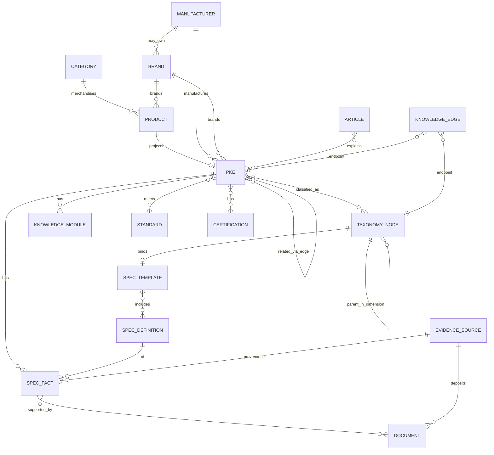

# SPEC — Domain Model

**Status:** **Accepted** (Architecture Board · ۱۴۰۵/۰۵/۱۰ · Mohammad Shebahati · Day-2 minute)  
**Purpose:** Complete logical entity architecture for KarzarTools commerce + knowledge layers  
**Non-goals:** DDL · ORM changes · inventing missing historical ADRs · second commerce Category tree

---

## 1. Principles

1. **Additive overlay:** New knowledge entities link to existing SoR; they do not replace `products` / `orders`.  
2. **Bounded ownership:** Each entity has one owning context (Master Architecture §4).  
3. **Identity before intelligence:** Stable IDs before graph claims (Bible P3).  
4. **Category ≠ Tool Class:** Commerce `Category` ≠ knowledge `TaxonomyNode` (family/type).  
5. **Provisional link:** Until UD-02, PKE MAY be 1:1 projected from `products.id`.

---

## 2. Context ownership

| Context | Owns | Must not own |
|---------|------|--------------|
| Catalog Commerce | Product (offer), price, availability, cart/order bridges | Facts, Standards, Applications |
| Taxonomy (commerce) | Category tree, megamenu presentation | Ontological Tool Class |
| PIM / Spec | Specification Definition, Template, Fact | Prices |
| Knowledge Graph | Knowledge Edge, projections | Payment |
| Knowledge Content | Knowledge Module, Article (CMS Expression) | Evidence grades for metrology Facts |
| Media / Evidence | Document, Evidence Source | Cart |
| Identity orgs | Brand (existing), Manufacturer (new) | — |

---

## 3. Entity catalog

### 3.1 Commerce entities (as-built SoR — preserve)

#### Product (Commerce Product)

| Aspect | Definition |
|--------|------------|
| **Meaning** | Sellable/inquireable SKU offer |
| **Identity** | `products.id`; business key active `sku`; public `slug` |
| **Lifecycle** | `is_active`, `deleted_at`; availability `is_available` |
| **Ownership** | Catalog Commerce |
| **Cardinality** | N:1 Category (required); N:1 Brand (optional) |
| **As-built** | `app/db/models/product.py:130-204` |

#### Category

| Aspect | Definition |
|--------|------------|
| **Meaning** | Merchandising taxonomy node (depth ≤ 3) |
| **Identity** | `categories.id`, unique `slug` |
| **Lifecycle** | Structural; delete reassigns products |
| **Ownership** | Taxonomy commerce |
| **Cardinality** | Tree via `parent_id`; 1:N Products |
| **As-built** | `product.py:72-112` |

#### Brand

| Aspect | Definition |
|--------|------------|
| **Meaning** | Marketed brand label (hub-eligible) |
| **Identity** | `brands.id`, unique `slug`/`name` |
| **Lifecycle** | Admin-stewarded |
| **Ownership** | Catalog / Brand steward |
| **Cardinality** | 1:N Products |
| **As-built** | `product.py:115-127` — **today also stands in for Manufacturer** |

---

### 3.2 Knowledge entities (target logical)

#### Product Knowledge Entity (PKE)

| Aspect | Definition |
|--------|------------|
| **Meaning** | Industrial meaning of a product (identity, class, education hooks) |
| **Identity** | `knowledge_entity_id` (UD-02); provisional = `product_id` |
| **Lifecycle** | draft → active → superseded → discontinued → unknown |
| **Ownership** | PIM / Knowledge |
| **Cardinality** | 1:1 Commerce Product (default); 1:N only if Board allows |
| **Parent SPEC** | `SPEC-product-knowledge-entity-model.md` |

Attributes (logical): manufacturer_id, brand_id, model_number, mpn, family, series, product_type_node_id, variant_label, lifecycle_status.

#### Manufacturer

| Aspect | Definition |
|--------|------------|
| **Meaning** | Legal/producing organization |
| **Identity** | `manufacturer_id`; normalized legal name (+ country) |
| **Lifecycle** | stewarded |
| **Ownership** | PIM |
| **Cardinality** | 1:N Brand (via ownership); 1:N PKE |
| **Gap** | No table today — UD-01 |

#### Taxonomy Node

| Aspect | Definition |
|--------|------------|
| **Meaning** | Node in Domain / Family / Application / Industry / Technical dimensions |
| **Identity** | `node_id`; unique (`dimension`,`slug`) |
| **Lifecycle** | draft → active → deprecated |
| **Ownership** | Knowledge Taxonomy steward |
| **Cardinality** | Single parent within dimension; N:M assignment to PKE |
| **Parent SPEC** | `SPEC-industrial-taxonomy-model.md` + master seed |

#### Specification Definition (Property)

| Aspect | Definition |
|--------|------------|
| **Meaning** | Governed attribute definition (not a JSON key) |
| **Identity** | `definition_id` / canonical `key` (e.g. `accuracy`) |
| **Lifecycle** | versioned; deprecate don’t delete |
| **Ownership** | Property Steward |
| **Cardinality** | 1:N Facts; M:N Templates |

#### Specification Template

| Aspect | Definition |
|--------|------------|
| **Meaning** | Ordered applicable Definitions for a family/type |
| **Identity** | `template_id` / key (strangles `spec_template_key`) |
| **Lifecycle** | versioned |
| **Ownership** | Property Steward |
| **Cardinality** | M:N Definitions; binds to TaxonomyNode (family/type) |

#### Specification Fact

| Aspect | Definition |
|--------|------------|
| **Meaning** | Asserted value of a Definition on a PKE |
| **Identity** | `fact_id` |
| **Lifecycle** | asserted → published → disputed → deprecated |
| **Ownership** | PIM |
| **Cardinality** | N:1 PKE; N:1 Definition; N:M Evidence |

Payload: value, unit, qualifier, status, provenance, confidence.

#### Knowledge Module

| Aspect | Definition |
|--------|------------|
| **Meaning** | Entity-scoped educational content (overview, how-to, FAQ, …) |
| **Identity** | `module_id` |
| **Lifecycle** | draft → review → published |
| **Ownership** | Knowledge Content |
| **Cardinality** | N:1 PKE or TaxonomyNode or Brand |

#### Document

| Aspect | Definition |
|--------|------------|
| **Meaning** | Datasheet, catalog PDF, leaflet, certificate scan |
| **Identity** | `document_id`; content checksum |
| **Lifecycle** | deposited → indexed → superseded |
| **Ownership** | Media / Evidence |
| **As-built seed** | `products.pdf_catalog_url` |

#### Evidence Source

| Aspect | Definition |
|--------|------------|
| **Meaning** | Provenance origin (deposit, URL, page, steward assertion) |
| **Identity** | `source_id` |
| **Lifecycle** | immutable once cited |
| **Ownership** | Data Engineering / PIM |
| **AODS** | SOURCE-DEPOSIT / KNOWLEDGE-EXTRACT artifacts |

#### Standard

| Aspect | Definition |
|--------|------------|
| **Meaning** | Normative industrial standard (ISO/DIN/ASME/JIS/…) |
| **Identity** | issuing body + code (+ year/version policy — KG-Q4) |
| **Ownership** | Domain steward |
| **Publish rule** | Requires Evidence on product claim edges |

#### Certification

| Aspect | Definition |
|--------|------------|
| **Meaning** | Formal certification mark/claim |
| **Identity** | `certification_id` |
| **Ownership** | Domain steward |
| **Publish rule** | Requires Evidence |

#### Knowledge Edge

| Aspect | Definition |
|--------|------------|
| **Meaning** | Typed, directed, provenanced relationship |
| **Identity** | `edge_id` |
| **Lifecycle** | asserted → published → rejected → deprecated |
| **Ownership** | Knowledge Graph |
| **Registry** | `SPEC-knowledge-graph-registry.md` |

#### Article (CMS Expression — existing)

| Aspect | Definition |
|--------|------------|
| **Meaning** | Site editorial content |
| **As-built** | `articles` table |
| **Knowledge role** | MAY explain products via edges; not automatically Evidence |

---

## 4. Mermaid ER (logical)

---

## 5. Core relationship summary

| From | To | Nature |
|------|----|--------|
| Product | Category | Required FK (commerce) |
| Product | Brand | Optional FK (commerce) |
| Product | PKE | Projection / link |
| PKE | Manufacturer | Knowledge edge / FK |
| PKE | TaxonomyNode | N:M classifications |
| PKE | Spec Fact | 1:N |
| Fact | Definition | N:1 |
| Fact | Document/Source | Evidence |
| PKE | PKE | Compatible / similar / alternative / successor |
| Article | PKE | Explains |
| Template | Definition | M:N ordered |

Full edge vocabulary: registry SPEC.

---

## 6. Lifecycle matrix

| Entity | Draft | Active/Published | Terminal |
|--------|-------|------------------|----------|
| Product | admin create | `is_active` | soft delete |
| PKE | draft | active | superseded / discontinued |
| Fact | asserted | published | disputed / deprecated |
| Edge | asserted | published | rejected / deprecated |
| Module | draft | published | archived |
| TaxonomyNode | draft | active | deprecated |
| Document | deposited | linked | superseded |

Commerce flags **MUST NOT** be overloaded as knowledge lifecycle.

---

## 7. Identity rules (normative)

| Entity | Unique business key |
|--------|---------------------|
| Product | active SKU |
| Brand | slug |
| Manufacturer | normalized legal name + country |
| TaxonomyNode | dimension + slug |
| Spec Definition | canonical key (global) |
| Spec Template | template key |
| Standard | body + code (+ version policy) |
| Document | checksum |
| Article | slug |

Aliases/synonyms are attributes — **not** duplicate nodes.

---

## 8. Strangler map (as-built → domain)

| As-built | Domain target |
|----------|---------------|
| `products` row | Commerce Product + provisional PKE |
| `brands` | Brand; Manufacturer TBD (UD-01) |
| `categories` | Category only |
| `spec_template_key` | Specification Template key |
| JSONB specs | Spec Facts (after dictionary) |
| `description` / `short_description` | Knowledge Modules + SEO scalars |
| `pdf_catalog_url` | Document candidate |
| `related_product_ids` | `ARTICLE_EXPLAINS_PRODUCT` edges |
| `optional_accessories` | `PRODUCT_COMPATIBLE_WITH` |
| `MegamenuNavGroup` | Presentation (unchanged) |

---

## 9. Requirements

| ID | Criterion |
|----|-----------|
| **DOM-R1** | Commerce and knowledge entities separately listed |
| **DOM-R2** | Manufacturer distinct from Brand |
| **DOM-R3** | ER diagram present |
| **DOM-R4** | Ownership per entity |
| **DOM-R5** | No second commerce Category entity |
| **DOM-R6** | Strangler map to as-built columns |

---

## 10. Open questions

UD-01, UD-02, UD-05 from pack README; plus:

| ID | Question |
|----|----------|
| **DOM-Q1** | Persist PKE as separate table vs columns on `products` for v1? |
| **DOM-Q2** | Guide/FAQ as Module types vs Article subtypes? |
